# 在 Power BI 中处理历史记录

> 原文：<https://towardsdatascience.com/handling-historisations-in-power-bi-30dc43e9e6f>

## 在报道中，历史化就是一切。但是除了通常的时间序列数据之外，我们需要查看维度表的历史化。我们可以这样做。


[Towfiqu barbhuiya](https://unsplash.com/@towfiqu999999?utm_source=medium&utm_medium=referral) 在 [Unsplash](https://unsplash.com?utm_source=medium&utm_medium=referral) 上的照片

# 介绍

最常见的报告轴是时间。以天、月或年为粒度。

至关重要的是，我们能够不带任何扭曲地看待过去。

本主题中的一个因素是值随时间变化的“通常”时间序列。

但是报告解决方案的另一部分是维度。

当某个东西发生变化，会改变过去数据的结果，会发生什么？这种变化会带来灾难性的后果。

在本文中，我将讨论以下主题:

*   为什么我们需要维度表的数据历史化？
*   我们如何在 Power BI 中实现这样的解决方案，我们需要考虑什么？
*   行级安全性的安全性设置会发生什么变化？

我不会讨论如何生成历史数据。

您可以在下面的参考资料部分找到一些关于这个主题的资源。

如果你想让我写一篇关于如何建立历史维度数据的文章，请发表评论。

但是请注意，构建历史化数据的机制会根据您的数据平台和用于加载数据的工具而变化。

# 为什么我们要历史化我们的维度？

考虑以下虚构的组织 MyCorp.com:

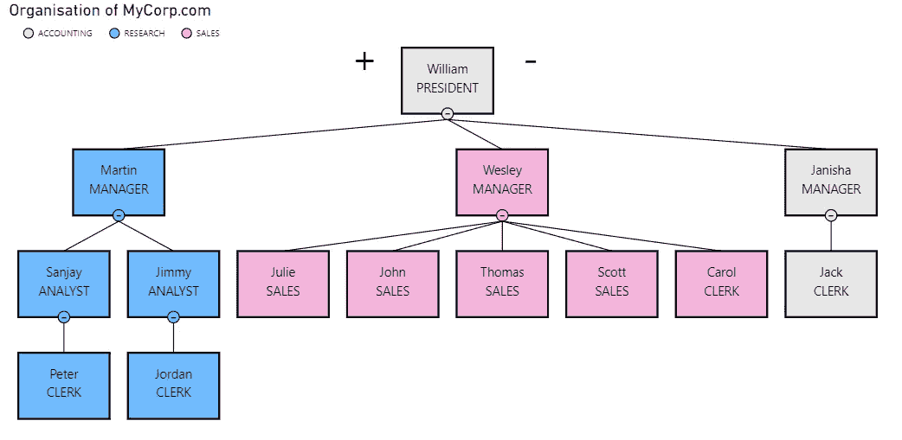

图 1—MyCorp.com 的组织结构图(作者提供的图)

2022 年 9 月 1 日，组织中的一些人将被提升或改变职位。

现在，新的组织结构图如下图所示:

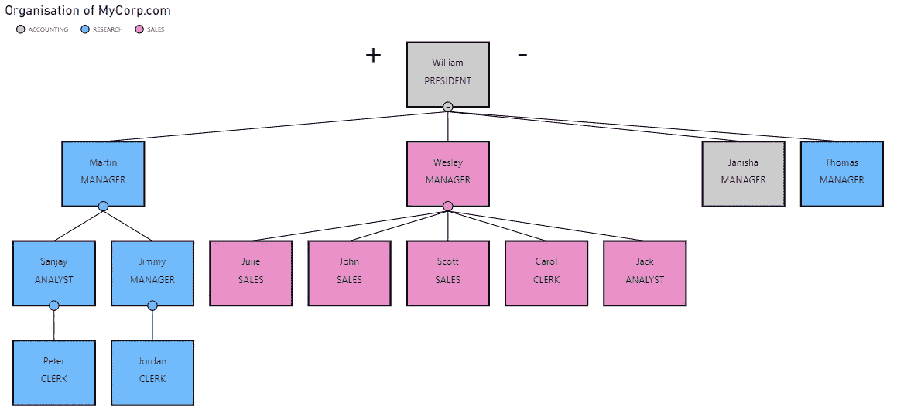

图 2-晋升后的组织结构图(作者提供的图)

该组织的所有成员都完成了销售。因此，我们可以开始创建销售报告。

让我们看看修改前的报告:

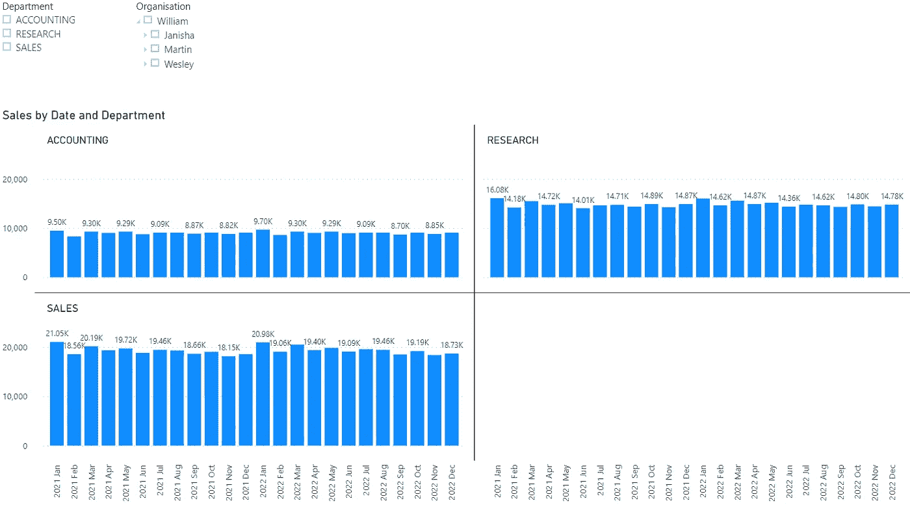

图 3 —变更前的销售报告(作者提供的图)

在实现了数据的更改后，我们将得到以下报告:


图 4 —变更后的销售报告(作者提供的图)

如你所见，所有的数据都变了。这是因为有些人换了部门，关于过去的数据被移到了新的部门。

通常，这不是我想要的。

由于更改发生在 9 月 1 日，我希望在此日期之前的数据不会更改，并且销售额将分配给更改后的新部门。

# 更改数据

在基本窗体中，雇员表如下图所示:

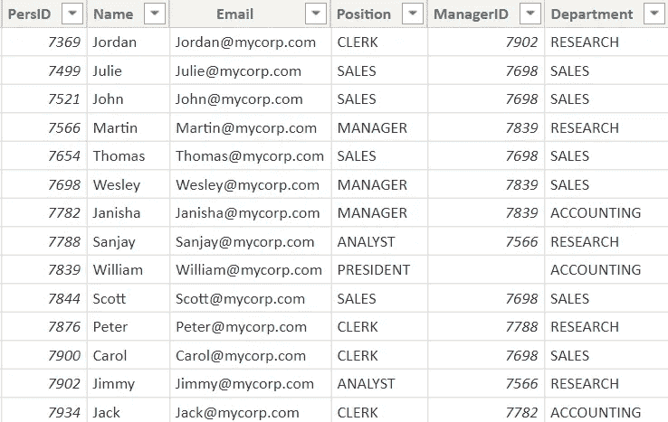

图 5 —基本雇员表(由作者提供)

该表与带有 PersID 列的 sales 表有关系，以构建下图所示的基本数据模型:

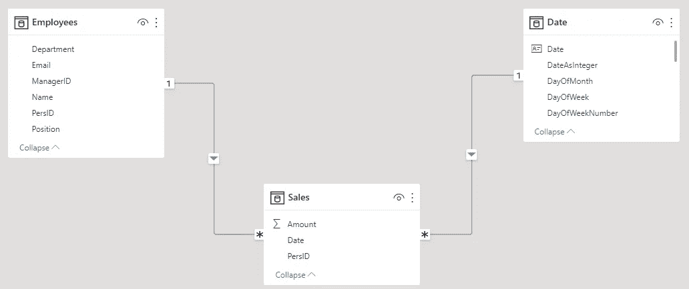

图 6 —数据模型(由作者提供)

当我们希望确保背面不被更改时，当维度表中的数据发生更改时，例如，通过部门的更改，我们必须更改雇员表:

1.  每个雇员可以有多个具有相同 PersID 的行，因此我们需要一个技术键列作为代理键(SurrID)。每一行都有自己的代理键，而 PersID 是业务键
2.  我们必须将经理的 PersID 映射到代理键
3.  我们必须记录数据的有效性。为此，我们必须添加两个新列:
    a. ValidFrom:每一行有效的开始日期
    b. ValidTo:每一行有效的结束日期
    通常，ValidTo 列包含一个遥远未来的虚拟日期，例如 31.12.2199

9 月 1 日，我们的组织发生了上述变化。

我要做的是:

1.  关闭行:将 ValidTo 列设置为 31.08.2022
2.  添加生效日期为 01.09.2022 的新行
3.  将添加的行的 ValidTo 列设置为 31.12，2199

最后一步是将管理器映射到代理键。

在我的 Azure SQL 数据库上，我使用以下 SQL 查询完成了这项工作:

```
SELECT [E].[SurrID]
        ,[E].[PersID]
        ,[E].[Name]
        ,[E].[Email]
        ,[E].[Position]
        ,[E].[ManagerID]
        ,[M].[SurrID] AS [Mgr_SurrID]
        ,[E].[Department]
        ,[E].[ValidFrom]
        ,[E].[ValidTo]
   FROM [dbo].[EMP_Hist_2] AS [E] → 18 Rows
    LEFT OUTER JOIN [dbo].[EMP_Hist_2] AS [M]
      ON [M].[PersID] = [E].[ManagerID]
      AND [E].[ValidFrom] BETWEEN [M].[ValidFrom] AND [M].[ValidTo];
```

您可以看到，我必须考虑每一行的有效性，以获得正确的映射。

经过这些更改后，雇员表如下所示:

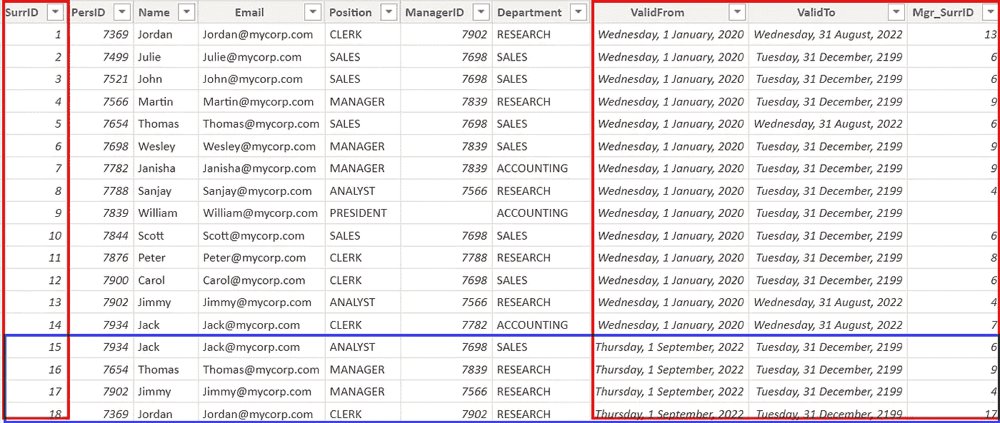

图 7 —修改后的雇员表(由作者提供)

这种方法称为渐变维度类型 2 (SCD2)。

SCD Type 1 覆盖了所有属性，这就是我在更改维度表之前向您展示的内容。

当数据发生变化时，SCD 类型 2 生成一个新行。每一行都有描述有效性的列(ValidFrom 和 ValidTo)。

通常，您会将第一种和第二种类型结合起来:

*   对于可以被覆盖的所有列(属性),使用类型 1，例如，邮件地址、电话号码和包含信息的所有属性，对于这些信息，旧值在更改后是无用的
*   您对所有属性使用 Type 2，这可能会改变结果，如上所示

您可以在下面参考资料部分的第二个和第三个资源中找到关于这个主题的资源。

让我们看看我是如何在 Power BI 中实现这些变化的，以及结果如何。

# 在 Power BI 中实现

基本的数据模型没有改变。

但是现在，Sales 表通过 SurrID 列与 Employees 表建立了关系。

为了得到这个结果，我在我的 Azure SQL 数据库上使用了以下查询，根据 Sales 表中的日期匹配 Employees 表中的正确行:

```
SELECT [E].[SurrID]
        ,[S].PersID
        ,[S].[Date]
        ,[S].[Amount]
   FROM [dbo].[Sales] AS [S]
      INNER JOIN [EMP_Hist_2] AS [E]
         ON [E].[PersID] = [S].[PersID]
   WHERE [S].[Date] BETWEEN [E].[ValidFrom] AND [E].[ValidTo];
```

结果看起来像这样:

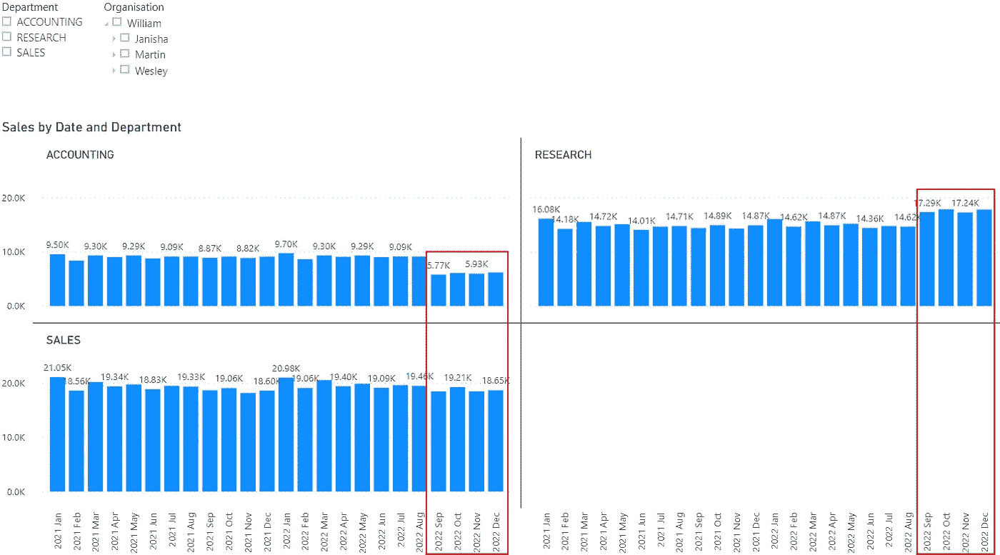

图 8 —历史化员工表的结果(由作者提供)

将此图中的值与上面图 3 中的值进行比较可以看出，2022 年 9 月之前的值没有变化。但是从 2022 年 9 月开始，新的分配是活动的，销售被分配到新的部门。


拉兹万·苏驰在 [Unsplash](https://unsplash.com?utm_source=medium&utm_medium=referral) 上的照片

但是在处理历史化(SCD2)数据时，还有一个我们必须考虑的话题:历史化维度表的行级安全性。

# 使用 SCD 的行级安全性

我们希望根据组织中每个成员的职位，根据他在组织结构中的位置，来限制对数据的访问。

例如:

*   威廉会看到一切
*   马丁只能看到研究部门下属的数据
*   Jimmy 只能看到他和他的职员 Jordan 的数据
*   乔丹只看到他的数据

实现这一点；我们需要将父子结构分成单独的列。

当您查看下图时，您将看到从列路径开始的结果:


图 9 —具有扁平层次结构的表格(由作者绘制)

我使用了下面“在 DAX 中扁平化父子层次结构”中引用的文章中描述的技术。
那里的描述非常详尽，非常有帮助。

我们将实现一个行级安全(RLS-)规则来实现访问控制。

首先，我们必须打开 RLS 对话:


图 10 —设置 RLS —打开对话(图由作者提供)

接下来，在对话中，我们必须添加一条新规则:


图 11——设置 RLS——创建一个新规则(由作者提供)

单击 Create 按钮，输入新规则的名称。接下来，单击要创建新规则的表，并在表名右侧的区域中输入新的表达式。

我们想要创建一个规则来检查当前用户的电子邮件地址，并将其与 Path 列中的 id 列表进行比较。
我们可以通过这种方法满足上述要求。

所需的 DAX 表达式如下:

```
PATHCONTAINS(
    Employees[Path],
      LOOKUPVALUE(‘Employees’[PersID]
              ,’Employees’[Email]
              ,USERPRINCIPALNAME()
              )
      )
```

让我们从里到外分析一下这个表达式:

1.  函数的作用是:获取当前用户的用户名(电子邮件地址)
2.  [LOOKUPVALUE()](https://dax.guide/lookupvalue/) 函数获取这个电子邮件地址的用户的 PersID
3.  [PATHCONTAINS()](https://dax.guide/pathcontains/) 函数在 Employee 表中搜索路径列中包含当前用户 PersID 的所有行

单击保存按钮保存该表达式。

现在，我们可以测试这条规则:

1.  我点击建模功能区中的查看按钮
2.  我选择要测试的规则，并勾选“*其他用户”*复选框
3.  我输入了马丁的邮件地址:[martin@mycorp.com](mailto:martin@mycorp.com)

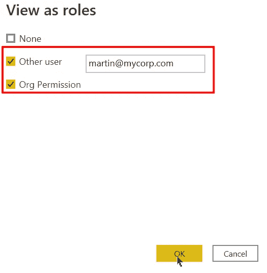

图 12——设置 RLS——测试规则(图由作者提供)

现在，我们只看到马丁的数据:

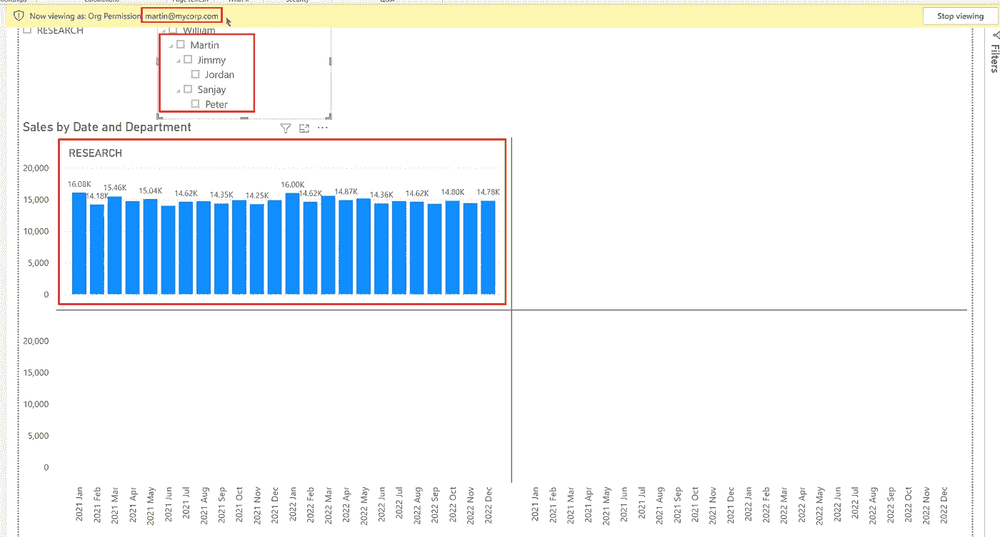

图 13 —设置 RLS —查看结果(图由作者提供)

直到我们在历史化的雇员表中引入变化，这才完美地工作。

当我们用历史化的表尝试(由于表名的变化而稍作修改)DAX 表达式时，我们得到一个错误:

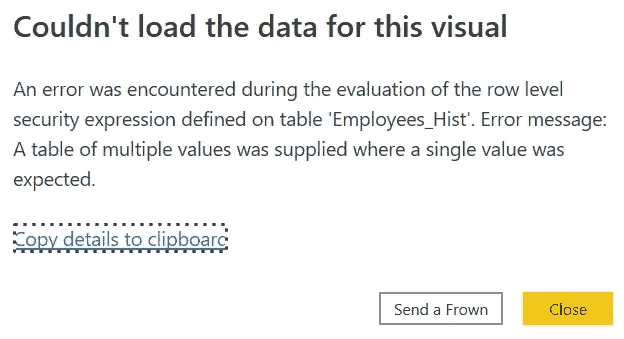

图 14 —历史数据的 RLS 误差(作者提供的图)

这个错误只出现在用一个用户测试我们的 RLS 规则时，这个规则会随着时间而改变，比如 Thomas。

为了纠正这一点，我们必须创建一个全新的 RLS 表达式。

在向您展示新的 DAX 表达式之前，我必须讨论解决问题需要什么。

当计算结果时，我们可以想象使用当前的过滤器上下文对结果中的每个数字评估 RLS 规则。

请看托马斯的下图:

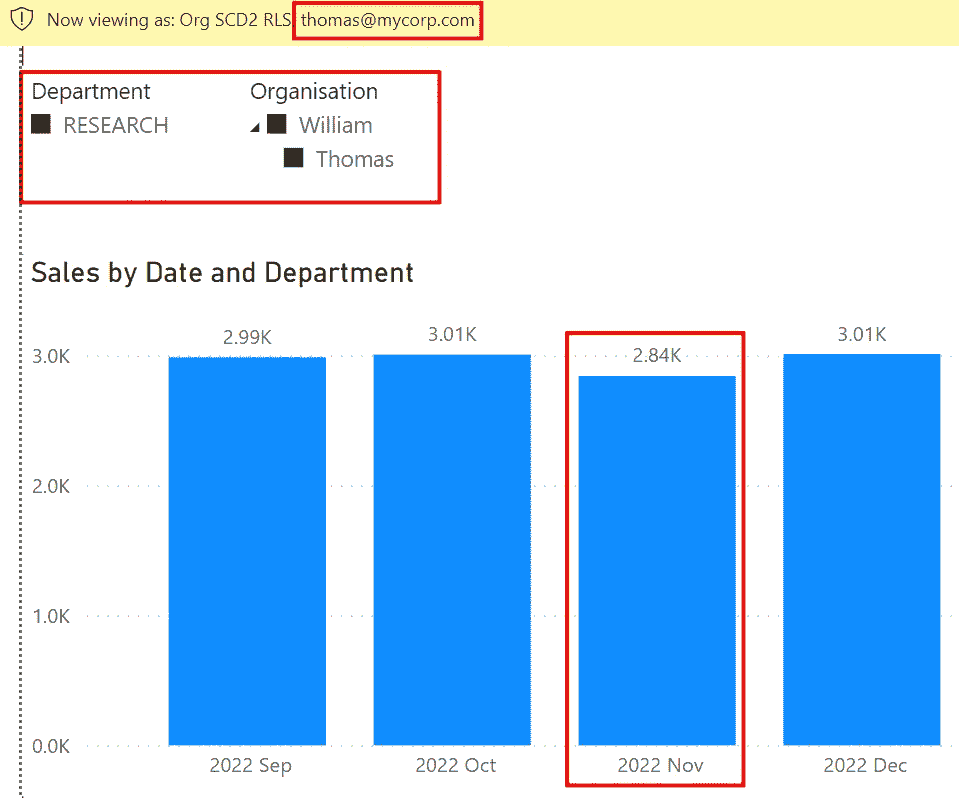

图 15—Thomas 使用正确 RLS 规则的结果(由作者提供)

当我们查看 2022 年 11 月的结果时，我们可以想象引擎执行以下步骤:

1.  评估过滤器上下文:2022 年 11 月
2.  考虑筛选器上下文，添加 RLS 规则中的表达式
3.  仅对托马斯计算 2022 年 11 月的结果

因为我们知道结果将在哪个日期计算(30。2022 年 11 月)，考虑到 ValidTo 和 ValidFrom 列，我们必须获得 Thomas 的正确行。

使用这种方法，我们将只收到每个日期的一行。

为此，我们需要一个如下所示的 DAX 表达式:

```
VAR ActDate = MAX(‘Date’[Date])RETURN
  PATHCONTAINS(
    ‘Employees_Hist’[Path],
      CONCATENATEX(
        FILTER(
          SUMMARIZE(ALL(‘Employees_Hist’)
                      ,’Employees_Hist’[SurrID]
                      ,’Employees_Hist’[ValidFrom]
                      ,’Employees_Hist’[ValidTo]
                      ,’Employees_Hist’[Email]
                     )
            ,[ValidFrom] <= ActDate &&
                [ValidTo] >= ActDate &&
                [Email] = USERPRINCIPALNAME()
           )
           ,’Employees_Hist’[SurrID]
      )
)
```

以下是 DAX 表达式的解释:

1.  我用当前过滤器上下文中的最新日期(ActDate)创建了一个变量
2.  我使用[summary()](https://dax.guide/summarize/)来获得所有雇员的列表，列有 SurrID、ValidFrom、ValidTo 和 Email
    我使用 ALL(Employee_Hist)来删除这个表上的实际过滤器
3.  这个函数包含在一个 [FILTER()](https://dax.guide/filter/) 函数中，用来限制行，只获取活动的行([valid from]<= act date&&【valid to】>= act date)和那些带有当前用户电子邮件地址的行([Email]=[USERPRINCIPALNAME()](https://dax.guide/userprincipalname/))
4.  [CONCATENATEX()](https://dax.guide/concatenatex/) 使用 FILTER()的结果作为输入来获得正确的 SurrID
5.  CONCATENATEX)的结果被传递给 [PATHCONTAINS()](https://dax.guide/pathcontains/) 函数，以检查 Employee_Hist 表中在 Path 列中具有匹配 SurrID 的行

但是为什么我需要使用这个 CONCATENATEX(…)的东西呢？

我需要它，因为 PATHCONTAINS()请求一个值作为第二个参数。而且，因为 FILTER()返回一个表，所以我必须聚合结果。

为此，我使用 CONCATENATEX()。

我也可以使用 SUMX、MAXX 或 MINXX。

因为过滤函数总是返回单个值，所以这无关紧要。

但是当我创建一个计算列来验证结果时，CONCATENATEX()在表达式的开发过程中非常有用。
我可以在使用 FILTER()找到正确的解决方案之前检查结果。


由[马库斯·斯皮斯克](https://unsplash.com/@markusspiske?utm_source=medium&utm_medium=referral)在 [Unsplash](https://unsplash.com?utm_source=medium&utm_medium=referral) 上拍摄的照片

# 结论

历史化的表格给我们的数据模型带来了新的复杂性。

但是，只要在数据源中相应地准备好数据，Power BI 中的数据模型仍然很简单。

但是，在使用 RLS 时，您需要考虑历史化表中行的有效性，以获得正确的结果。

可能还有其他需要增加更多复杂性的场景。例如，当其中一个员工发生了变化，但他的下属没有发生变化时，未变化的行将映射到哪个维度行？原版的还是新的？您是否也需要为下属创建一个新行？

您必须检查您的数据和可能的场景，以决定是否需要增加所需的复杂程度。

最初，我计划只写关于 RLS 主题的这篇文章。但是我意识到我需要先解释一下历史化的原理，以免混淆，以防你不知道我们为什么需要这个概念。

我希望您能在下面参考资料的帮助下，将我的示例转化为您的用例以及您的数据平台。

谢谢你陪我到最后。

# 参考

我用随机数据和虚构的名字创建了这里显示的数据集。

设计和构建数据仓库的最佳书籍是由 [Kimball Group |维度数据仓库专家](https://www.kimballgroup.com/)撰写的[数据仓库工具包，第三版— Kimball Group](https://www.kimballgroup.com/data-warehouse-business-intelligence-resources/books/data-warehouse-dw-toolkit/) 。

在 SQL Server 中使用时态表实现 SCD2: [在 Power BI-zart is 中使用时态表实现 SCD2】。](https://www.zartis.com/scd-implementation-with-temporal-tables-in-power-bi/)

深入探讨不同级别的 SCD: [在数据仓库中实施渐变维度(SCD)(sqlshack.com)](https://www.sqlshack.com/implementing-slowly-changing-dimensions-scds-in-data-warehouses/)

如何在关系数据库中实现 SCD2 的描述:【DWgeek.com】设计 SQL 中缓变维度类型 2

[用 Python 实现 SCD Type2 作者 Vivek chaud hary | Analytics vid hya | Medium](https://medium.com/analytics-vidhya/scd-type2-implementation-in-python-95bb08878ce2)

你可以通过互联网搜索找到更多关于 SCD 和你的数据平台的资源。

在 DAX 中展平父子层次结构:

*   [了解 DAX 中父子层次结构的函数— DAX | Microsoft Docs](https://docs.microsoft.com/en-us/dax/understanding-functions-for-parent-child-hierarchies-in-dax)
*   [路径项函数(DAX) — DAX |微软文档](https://docs.microsoft.com/en-us/dax/pathitem-function-dax)
*   [Power BI—DAX 中的父子层次结构—简单 BI 洞察](https://simplebiinsights.com/parent-child-hierarchies-in-dax/)
*   [父子层次结构— DAX 模式](https://www.daxpatterns.com/parent-child-hierarchies/)

用父子结构实现动态 RLS:[已解决:动态 RLS —微软 Power BI 社区](https://urldefense.proofpoint.com/v2/url?u=https-3A__community.powerbi.com_t5_Desktop_dynamic-2DRLS_m-2Dp_1219642&d=DwMFAg&c=eIGjsITfXP_y-DLLX0uEHXJvU8nOHrUK8IrwNKOtkVU&r=ZqPxQ-KsPgtWk7-5IsCGGjWC4rFt4Of6e_QaPwMyJ8uHsqW5Nl18C5H3JDxMLHOq&m=rjcYcKP8S9KjM6XA4tRZ80LUGRqesZZH6ALgLp3U96gzkoTiG5cnsiUqQ15QfGNF&s=rEisI1k6Us22xoY9_GdTZUbcB7lTjqckBXuWgfLeGtw&e=)。

[](https://medium.com/@salvatorecagliari/membership) [## 通过我的推荐链接加入 Medium-Salvatore Cagliari

### 阅读萨尔瓦托勒·卡利亚里的每一个故事(以及媒体上成千上万的其他作家)。您的会员费直接…

medium.com](https://medium.com/@salvatorecagliari/membership)