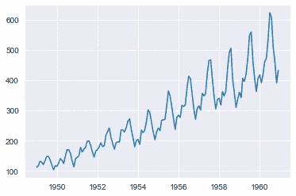
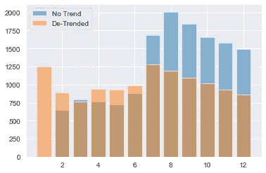
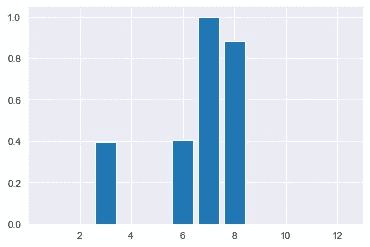
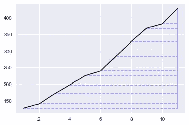

# 基于树的时间序列预测中的趋势处理

> 原文：<https://towardsdatascience.com/handling-trends-in-tree-based-time-series-forecasting-fea5e4c066fb>

## 事实是——没有趋势


安娜·昆潘在 [Unsplash](https://unsplash.com/s/photos/spoon?utm_source=unsplash&utm_medium=referral&utm_content=creditCopyText) 上的照片

# 介绍

通常，当您看到关于使用 Xgboost 或 LightGBM 等模型解决时间序列问题的文章或指南时，作者会提到树模型获取趋势和预测数据边界之外的能力。这被视为一个需要克服的问题。但是，这确实是一个特性，而不是一个缺陷。只有当我们认为我们的预测**需要**超出范围时，才应该关闭这个功能——而不是因为趋势存在于我们的数据中。

通过用一条线对数据进行去趋势化，考虑您所声明的内容:

> 在未来的某个时间点，数据将有一个新的最大值或最小值

这是一个相当强有力的声明，你可能应该非常了解你的数据**才能做出这样的声明。尤其是当对数据进行去趋势化时，还会从树中窃取信息——即使它不能显式地对其建模。**

所以…虽然接受趋势的存在，但是**并不**总是*有用的*去模拟它…

# 激励人心的例子

让我们来看看一个相当著名的时间序列:航空乘客数据集。这些数据随处可得，其中一个来源来自 [Kaggle](https://www.kaggle.com/rakannimer/air-passengers) ，它带有一个开放数据库许可证。

```
import numpy as np
import pandas as pd
from matplotlib import pyplot as plt
import seaborn as sns
sns.set_style("darkgrid")#Airlines Data, if your csv is in a different filepath adjust this
df = pd.read_csv(r'AirPassengers.csv')
df.index = pd.to_datetime(df['Month'])
y = df['#Passengers']
plt.plot(y)
plt.show()
```



作者图片

显然，有上升趋势。但是，一个新的“最大”值会出现多少次？


作者图片

大约有 20%的时间会发生这种情况，大多是在季节性高峰期。那剩下的 80%呢？“允许”模型出界有意义吗，特别是如果我们非常确定接下来的几个时期不是季节性高峰的话？更重要的是——如果我们不需要**预测新的最大值，去趋势化会损害我们的预测准确性吗？**

# 建模

对于这个例子，我们将使用我用 LightGBM 开发的用于时间序列预测的包: [LazyProphet](https://github.com/tblume1992/LazyProphet) 。只需快速进行 pip 安装:

```
pip install LazyProphet
```

如果你想了解更多关于这个包的信息，你应该看看我以前的文章:

[](/lazyprophet-time-series-forecasting-with-lightgbm-3745bafe5ce5) [## LazyProphet:用 LightGBM 进行时间序列预测

### 都是关于功能的

towardsdatascience.com](/lazyprophet-time-series-forecasting-with-lightgbm-3745bafe5ce5) 

在我们的实验中，我们将保留过去 12 个月的数据，然后使用 LazyProphet 对去趋势预测和标准预测进行扩展预测。然后，我们将查看测试集 MSE 进行比较。下面是实现这一目的的代码片段:

```
import numpy as np
import pandas as pd
from matplotlib import pyplot as plt
from sklearn.metrics import mean_squared_error
from LazyProphet import LazyProphet as lp
import seaborn as sns
sns.set_style("darkgrid")#Airlines Data, if your csv is in a different filepath adjust this
df = pd.read_csv(r'AirPassengers.csv')
df.index = pd.to_datetime(df['Month'])
y = df['#Passengers'][:-12]
results =[]
for i in range(1, 13):
    if (-12 + i) == 0:
        y_test = df['#Passengers'][-12:]
    else:
        y_test = df['#Passengers'][-12:-12 + i]
    lp_model = lp.LazyProphet(seasonal_period=12,
                              n_basis=10,
                              objective='regression',
                              fourier_order=5,
                              ar=list(range(1, 13)),
                              decay=.99,
                              linear_trend=False,
                              scale=True
                              )
    fitted = lp_model.fit(y)
    predicted = lp_model.predict(i)
    no_trend = mean_squared_error(y_test.values, predicted) lp_model = lp.LazyProphet(seasonal_period=12,
                              n_basis=10,
                              objective='regression',
                              fourier_order=5,
                              ar=list(range(1, 13)),
                              decay=.99,
                              linear_trend=True,
                              scale=True
                              )
    fitted = lp_model.fit(y)
    predicted = lp_model.predict(i)
    trend = mean_squared_error(y_test.values, predicted)
    results.append([no_trend, trend])
```

让我们来看看结果:

```
plt.bar(x=range(1, 13), height=[i[0] for i in results], alpha=.5, label='No Trend')
plt.bar(x=range(1, 13), height=[i[1] for i in results], alpha=.5, label='De-Trended')
plt.legend()
plt.show()
```



作者图片

第一个条形图似乎没有“无趋势”值，这看起来可能有点奇怪。该模型实际上准确地预测了它，所以 MSE 值相当小。即使忽略这一点，我们仍然看到，去趋势模型通常在预测范围内具有更高的错误率，直到 7 期范围。事实上,“无趋势”模型在前 6 个层位的误差平均少 30%。

**你能猜到 6 期之后会发生什么吗？**

我们的测试数据超出了界限，需要一个趋势来允许树到达那里。

这是我的观点。我们的训练数据(和测试数据)中显然存在一种趋势，但是一直对这种趋势*建模*会损害我们的准确性。这不仅仅是趋势的存在，而是我们是否相信预测范围内的数据突破了我们的上限。这是一个实际问题，而不是统计问题。

# 一些补救措施

**在我们了解一些“测试”之前，我只想强调，这些应该是用于指导您决策的指标。或者潜在地标记预测以供审查。趋势线可能很危险！*

最直接的解决方案是使用一种简单的方法来“预测”我们是否需要用线性趋势来扩展我们的界限。有很多方法可以做到这一点，但是我将使用 LazyProphet 来完成分类任务。我们将需要通过移除缩放和 ar 组件以及调整“目标”来稍微调整模型。

首先，让我们构建我们的新数据集，如果该值是最大值，它将简单地为 1，否则为 0。

```
y_class = []
max_val = 0
for i in y:
    if i > max_val:
        max_val = i
        y_class.append(1)
    else:
        y_class.append(0)
```

接下来我们将进行时间序列分类。`return_proba`参数表示我们是否想要返回概率而不是二进制分类:

```
lp_model = lp.LazyProphet(seasonal_period=12,
                          n_basis=10,
                          objective='classification',
                          fourier_order=5,
                           # ar=list(range(1, 13)),
                          decay=.99,
                          linear_trend=False,
                          scale=False,
                          return_proba=True
                          )
fitted = lp_model.fit(np.array(y_class))
predicted = lp_model.predict(12)
plt.bar(x=range(1,13), height=predicted.reshape(-1,))
```



作者图片

看起来不出所料！基于此，如果预测范围超过 6(当概率大于 0.5 时)，我们需要去趋势，这是 100%正确的。通过一些简单的逻辑来解释这个输出，我们可以为`linear_trend`传递一个`True`或`False`，这将产生‘最优’性能。

这是可行的，但是我们增加了一些计算，而且按顺序预测对我来说不是很好。

另一种方法是创建桶并检查这些桶的平均值。如果平均值一直在增加，那么我们就有一个趋势。这似乎不是什么新鲜事，但是我们将根据预测范围来选择存储桶的大小。让我们来写函数:

通过逻辑思考，如果您的预测范围为 1，则:

```
n_bins = int(len(y) / (forecast_horizon))
```

简化为系列的长度。因此，大部分值(大于给定的阈值百分比)必须增加/减少。随着我们增加预测范围，我们平滑了数据，最终得到 12 个周期范围的类似结果:



作者图片

其在数据的平滑视图中总是增加。

接下来，让我们实际运行这个测试:

```
trend = []
for i in range(1, 13):
    trend.append(tree_trend_test(y, i, threshold=.9))
```

这给了我们:

```
[False, False, False, False, False, True, True, False, True, True, True, True]
```

这确实在实际需要之前证明了这一点，但是这种方法不需要任何关于季节性的知识，这是有利也有弊的。

# 结论

去趋势化是一个重要的问题。这个问题需要我们的关注。我不提倡完全自动化去趋势化，尽管我意识到有时这是必需的。但是，你应该总是选择**而不是**减少树木的趋势。

在介绍中，我提到了使用树模型进行预测的指南，在某些时候，它们通常会对线性趋势进行可能的“测试”。然后继续用“但是没有什么能打败视力测试”来结束这一部分，我同意这一点。我们可以向整个数据科学界展示这些数据，他们都会说这是一种趋势，而且他们是正确的。

从传统的时间序列观点来看，趋势是存在的。

但是我们必须记住，我们是**而不是**使用传统的时间序列方法。这不是一个趋势存在与否的问题，而是…

我们**需要**一个趋势吗？

如果你觉得这很有趣，那么你可以看看我的其他文章:

[](/lazyprophet-time-series-forecasting-with-lightgbm-3745bafe5ce5) [## LazyProphet:用 LightGBM 进行时间序列预测

### 都是关于功能的

towardsdatascience.com](/lazyprophet-time-series-forecasting-with-lightgbm-3745bafe5ce5) [](/gradient-boosted-arima-for-time-series-forecasting-e093f80772f6) [## 时间序列预测的梯度增强 ARIMA

### 提升 PmdArima 的 Auto-Arima 性能

towardsdatascience.com](/gradient-boosted-arima-for-time-series-forecasting-e093f80772f6) [](/thymeboost-a0529353bf34) [## 用百里香增强进行时间序列预测

### 一种梯度增强的时间序列分解方法

towardsdatascience.com](/thymeboost-a0529353bf34)