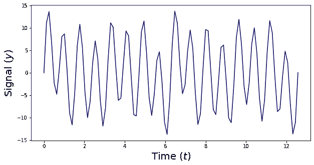
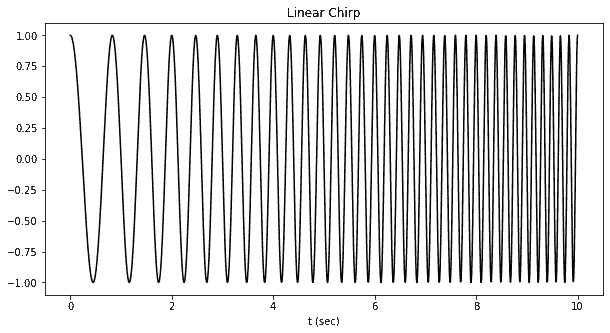

# 使用 Python 进行实际线性调频小波变换参数估计

> 原文：<https://towardsdatascience.com/hands-on-chirplet-transform-parameter-estimation-using-python-a5bd6b795d04>

## 这是如何使用 Python 来估计你的线性调频脉冲的参数

阿迪·戈尔茨坦在 [Unsplash](https://unsplash.com/s/photos/knobs?utm_source=unsplash&utm_medium=referral&utm_content=creditCopyText) 上的照片

信号处理最常见的操作之一就是对信号进行**变换。**我们这样做的原因是，对信号执行操作的最简单方法并不总是通过观察信号并在其自然域内进行分析*。

> *我将把**自然域**称为信号的原始空间。例如，如果信号是时间序列，自然域是 2D 域，其中 x 是时间，y 是信号值

在我的 [**最新媒体文章**](/signal-processing-beyond-the-fourier-transform-introduction-to-the-chirplet-transform-using-146a00478318) 中，我解释了**傅立叶**变换和 **Chirplet** 变换的区别。

这两种信号之间的关键区别在于傅立叶变换用于时间和频率之间不相关的信号(频率不依赖于时间)。下面是一个可以使用傅里叶变换进行分析和转换的信号示例:

作者图片

另一方面，一些信号具有不固定的频率(频率确实是与时间相关的)。这是这种信号的一个例子:

作者图片

我们可以使用**线性调频脉冲变换来分析该信号。** [**在我最新的文章**](/signal-processing-beyond-the-fourier-transform-introduction-to-the-chirplet-transform-using-146a00478318) **，**中，我解释了如何定义一个 chirplet 变换，如何在 Python 中实现它，以及如何绘制它。

我收到的问题中有一个特别有趣，是这样的:

作者图片

这正是我们将在本文中讨论的内容🙃

# 1.挑战

因此，我们知道**线性调频脉冲**是一个具有众所周知的解析公式的信号:

作者图片

我们已经看到，通过改变参数组(β、α1、α2、fc、τ和φ),我们可以描述不同种类的线调频脉冲。

现在，假设我们有一个新的 chirplet。这个线性调频脉冲由这 6 个值的集合完全定义。

> *通过**完全定义，我的意思是**信号由一组且仅一组参数表示，反之亦然。

假设我们要用线性调频脉冲表征的信号有以下参数:

作者图片

我们如何估计这 6 个参数？

# 2.暴力:一种不可行的方法

假设我完全迷路了，我不知道如何完成这个任务。一个非常简单的方法是所谓的**蛮力**。意思是:

> “尝试这 6 个参数的所有可能组合，看看哪一个效果更好”

这个方法在理论上肯定是可行的。当然，如果我们对这个 6 维空间进行足够的离散化，最终，我们会对真实的参数集有一个很好的估计。 ***有什么问题尽管提？***

嗯，这种方法的真正问题是，当我们考虑暴力方法时,**计算的复杂性。** 假设我们生成一个随机的线性调频脉冲。我们使用以下代码来实现这一点:

所以你只需要大约(10^-3)秒来产生一个随机的线性调频脉冲。但是我们需要多少个线调频小波来列举所有可能的线调频小波组合呢？

假设 k_{variable}是你的离散空间的值的个数。例如，如果您考虑的所有 alpha_1 值都是[0，2，5]，您将得到:

作者图片

现在，让我们做以下假设:

作者图片

这意味着我们必须考虑的线性调频脉冲数如下:

作者图片

计算时间为:

作者图片

现在，让我们改变这个 K，看看这个计算时间的值。如果我们画出这个图，我们会得到一个非常有趣的结果😅：

作者图片

我觉得当我们等待 9 年来计算 K=80 时，我们也可以同时找到一个更聪明的解决方案🙃

# 3.形式方法

让我们正式确定我们的目标。同样，我们想找到θ向量:

作者图片

这个θ矢量唯一地定义了下面的线性调频脉冲:

作者图片

现在当然没有这个函数的解析表达式，只有它的时间序列(或者数值表示)。

现在让我们定义一个所谓的**线性调频脉冲内核**。这个 chirplet 内核有以下表达式。

作者图片

其中:

作者图片

我想我已经够烦你了，所以我不会解释这些参数的所有细节( ***)但是如果你想知道它们，请在这里阅读*******！*** )。重要的是，正如你所看到的，线性调频小波核具有和我们定义的线性调频小波相同的表达式。现在，这个线性调频脉冲当然是**参量的，**它取决于这个 hat 伽马矢量。想法是这样的:*

*我们**将**我们的信号投射到由这个线性调频小波核识别的 N 维向量上。这个**投影**是**参数化**，它取决于**线性调频脉冲内核**的参数。然后我们通过**改变这个 gamma 向量**来改变这个向量，找到最优值，得到对应的 theta ( ***)再次阅读*** [***这里***](https://ieeexplore.ieee.org/stamp/stamp.jsp?tp=&arnumber=4037220&tag=1) ***了解更多信息！*** )*

**

*作者图片*

*如果我们想找到这个投影的最大值**我们计算它的梯度。这个梯度的 0 值当然会给我们最优的 hat 值。***

*给定我们问题的正式定义，我们现在可以开始寻找我们的最佳值。特别是:*

*   ***我们在 alpha1 上迭代**，找到最大的系数自变量*
*   ***我们在 alpha2 上迭代**，找到最大的系数自变量*
*   ***我们使用**希尔伯特变换**找到τ和β***
*   ***我们使用**傅立叶变换**找到频率(fc)和相位(φ)***

*我们来实现这个吧！*

# *4.动手实施*

*这种估计可以用下面的代码来完成:*

*来测试一下吧！
使用以下函数，我们估计参数并创建我们的估计线性调频脉冲。*

*当然，我们希望输入信号与重构信号相同。我们来看看是不是这样。*

*嗯，正如我们看到的重建是**而不是** **总是完美的。***

*尽管如此，我们看到我们正在一个**巨大的维度空间**中寻找一个解决方案(我说的巨大是指空间随着参数的数量呈指数增长)，并且这个问题是一个具有非唯一解决方案的 NP-hard 问题(在这里阅读更多)。*

*出于这些原因，我觉得这些结果相当不错。🤩*

# *5.结论*

*如果你喜欢这篇文章，你想知道更多关于机器学习的知识，或者你只是想问我一些你可以问的问题:*

*A.在 [**Linkedin**](https://www.linkedin.com/in/pieropaialunga/) 上关注我，在那里我发布我所有的故事
B .订阅我的 [**简讯**](https://piero-paialunga.medium.com/subscribe) 。这会让你了解新的故事，并给你机会发短信给我，让我收到你所有的更正或疑问。
C .成为 [**推荐会员**](https://piero-paialunga.medium.com/membership) ，这样你就不会有任何“本月最大数量的故事”，你可以阅读我(以及成千上万其他机器学习和数据科学顶级作家)写的任何关于最新可用技术的文章。*

> *本文参考的论文如下:[**线调频信号分解的逐次参数估计算法**](https://ieeexplore.ieee.org/stamp/stamp.jsp?tp=&arnumber=4037220) 。这个 [**GitHub 文件夹**](https://github.com/aluchies/chirplet/blob/master/chirplet/chirplet.py) 也被用作起点*