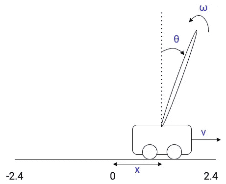
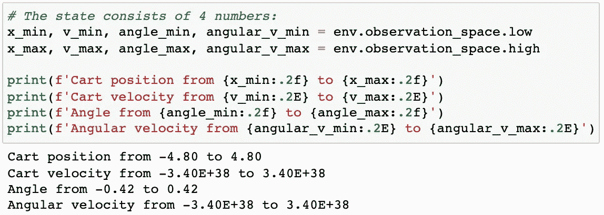

# 实践强化学习课程:第 4 部分

> 原文：<https://towardsdatascience.com/hands-on-reinforcement-learning-course-part-4-55da5eae851f>

# 实践强化学习课程:第 4 部分

## 线性 Q 学习

我们跳舞好吗？ [约根德拉·辛格](https://www.pexels.com/@yogendras31?utm_content=attributionCopyText&utm_medium=referral&utm_source=pexels) ❤️

# 欢迎来到我的强化学习课程❤️

这是强化学习实践课程的第 4 部分，带你从零到英雄🦸‍♂️.

[第一部分:强化学习简介](/hands-on-reinforcement-learning-course-part-1-269b50e39d08)
[第二部分:表格 Q-learning](/hands-on-reinforcement-learning-course-part-2-1b0828a1046b)
[第三部分:表格 SARSA](/hands-on-reinforcement-learning-course-part-3-5db40e7938d4)
👉🏻第四部分:线性 Q 学习(今天)

很抱歉让你等了这么久，我想和你分享整个学习过程，这样你就知道好的结果来之不易。但是一旦他们这么做了，他们就值 trouble️.奖了

今天，我们进入了新的领域…

强化学习遇到了现代机器学习中必不可少的优化技术的领域**。**解决大量不同问题和环境的杀手锏🚀。

我们要解决的问题是著名的**推车杆**平衡，目标是通过左右移动推车来平衡连接在推车上的杆。

这是我们将在本次冒险结束时实现的 Deep Q-Agent 的外观:

我们将在这一部分探讨的技术是过去 5 到 10 年中强化学习领域令人印象深刻的成就背后的支柱。

有很多东西需要消化，所以我们将工作负载分成 3 部分:

*   在第 4 部分(这个！)我们实现了一个线性 Q 代理来获得一个不错的解决方案。
*   在第 5 部分中，我们增加了深度并实现了一个 Deep Q 代理来获得一个好的解决方案。
*   在第 6 部分，我们将看到如何微调所有的超参数，以最大限度地提高性能。在这里，我们终于得到了你在上面看到的可怕的深 Q 代理！

在每一部分中，我们都会加入新的想法、技巧和你需要掌握的实现细节。更重要的是，我希望你在构建 RL 解决方案时习惯于**失败**。因为大多数时候都是这样。

高级 RL 技术，如我们将在这三部分中看到的技术，非常强大，但需要仔细实施和超参数调整。

调试 RL 算法不是一件容易的事情，而变得更好的唯一方法就是犯错。当我开始学习强化学习时，我最大的挫折之一是算法表面上的简单，以及试图复制已发表的结果时的极端困难。

强化学习本身就很难，所以我们尽量不要让它变得更加复杂。一步一步来！

这节课的所有代码都在 [**这个 Github repo**](https://github.com/Paulescu/hands-on-rl) **里。** Git 克隆它来跟进今天的问题

还有别忘了给它一个⭐！

# 第四部分

# 内容

1.  [大车杆子问题🕹️](#8a1d)
2.  环境、行动、状态、奖励
3.  随机代理基线🤖 🍸
4.  参数 Q 学习
5.  你好 PyTorch！👋
6.  线性 Q 代理🤖
7.  重述✨
8.  家庭作业📚
9.  下一步是什么？❤️

# 1.推车杆子问题🕹️

一根杆子用一个未启动的接头连接到一辆手推车上。你的目标是移动推车的位置，左右移动，防止杆子掉下来。

我们将使用`CartPole-v1`的实现，你可以在 [OpenAI Gym](https://github.com/openai/gym/blob/master/gym/envs/classic_control/cartpole.py) 中找到。

## 为什么会有这个问题？

到目前为止，我们已经在离散/表格环境中使用了经典的强化学习算法、Q-learning(第 2 部分)和 SARSA(第 3 部分)。

今天的问题稍微复杂一点，因为它的状态空间太大，无法离散化。相反，我们需要升级我们的游戏，并使用更强大的 RL 算法。

我们将使用参数 Q-learning，这是一种将我们在第 2 部分看到的经典 Q-learning 与参数近似相结合的技术，参数近似可以是线性的(在第 4 部分)，也可以是更复杂的，如神经网络(在第 5 部分)。

使用神经网络的参数 Q 学习(又名深度 Q 学习)是强化学习中许多最新突破的背后，如 DeepMind 的著名 [Atari 游戏播放器。](https://arxiv.org/pdf/1312.5602v1.pdf)

让我们熟悉一下这个环境的具体情况！

# 2.环境、行动、状态、奖励

[👉🏽notebooks/00 _ environment . ipynb](https://github.com/Paulescu/hands-on-rl/blob/main/03_cart_pole/notebooks/00_environment.ipynb)

状态由 4 个数字表示:

*   大车位置 ***x*** 从-2.4 到 2.5。
*   **大车速度*v***
*   相对于垂直线的极角 ***θ*** 从-12 到 12 度(从-0.21 到 0.21 弧度)
*   极点角速度 ***ω。*** 这是 **θ的变化率。**

大车极点状态向量(图片由作者提供)

当出现以下任一情况时，一集终止:

*   大车越限: ***x > 2.4*** 或 ***x < -2.4***
*   电杆离垂线太远: ***θ > 12 度*** 或 ***θ < -12 度。***
*   或者我们达到了最大集数 500 步。在这种情况下，代理人完美地解决了插曲。

起始状态是从每个状态的区间[-0.05，0.05]中随机抽样的。有时候，开始的位置如此接近平衡，以至于这一集很容易。其他时候，开始的位置是如此不平衡，以至于插曲很难解决，有时甚至是不可能的。

大车速度 ***v*** 和杆子角速度 ***ω呢。*** 这些值也有界吗？

首先，让我们加载`CartPole-v1`环境。

如果你看看 OpenAI 健身房的区间变量`env.observation_space.low`和`env.observation_space.high`，你会发现这两个数字似乎是任意大或小。

实际上，这是不正确的。无论是 ***v*** 还是 ***ω*** 都有更窄的间隔，但这是你无法直接从`env`对象中读出的东西。您只能在您的代理探索环境时观察它们的真实范围。

这一点很重要，因为我们今天和第 5 部分将使用的模型，与**标准化输入**配合使用效果最佳。在这种情况下，归一化状态。要归一化一个数，你首先需要知道它的最大值和最小值。 ***v*** 和 ***ω*** 这两个值不能从`env.observation_space`中读取。你需要通过一点探索来估计它们。

这张纸条的重点是:

> ⚠️不会盲目地把``env.observaton_space`中的数值作为每个状态的真实范围。

我们的代理可以执行的**操作**是什么？

*   `0`:向左推推车。
*   `1`:向右推推车。

每走一步**奖励**为+1。这意味着代理人保持杆子站立的时间越长，累积奖励越高。

# 3.随机代理基线

[👉🏽notebooks/01 _ random _ agent _ baseline . ipynb](https://github.com/Paulescu/hands-on-rl/blob/main/03_cart_pole/notebooks/01_random_agent_baseline.ipynb)

像往常一样，我们使用一个`RandomAgent`来建立一个基准性能。

我们用 1000 集来评估这个代理

计算平均回报及其标准差。

让我们看看参数 Q 学习如何帮助我们构建一个更智能的代理！🧠

# 4.参数 Q 学习

到目前为止，我们已经在离散/表格环境中工作过(在第 2 部分),或者将原始环境转换为离散环境(第 3 部分)。

然而，大多数有趣的环境不是离散的，而是连续的，并且太大而无法离散和求解。

幸运的是，有直接在连续状态空间上工作的 RL 算法。

今天我们将使用**参数 Q 学习。**该算法类似于我们在第 2 部分中看到的原始 Q 学习，但适用于连续设置。

`CartPole`的状态空间由 4 个连续数字组成

在哪里

*   ***x*** 是大车位置
*   ***v*** 是大车运行速度
*   ***θ*** 是磁极角度
*   ***ω*** 是极点角速度

在这样的连续状态空间中，最佳 Q 值函数

不能用表来表示(因为它会有无限多个维度)。

相反，我们用一个**参数形式**来表示它

在哪里

*   `Q*`是模型架构，像线性模型，或者非常深度的前馈神经网络。
*   这取决于我们将使用代理在训练期间收集的经验 *(s，a，r，s’)*来估计的一组参数。

为 Q*选择**模型架构对于学习好的策略和解决问题至关重要**。

模型的参数越多，就越灵活。它更有可能是这个问题的一个好模型。事实上，线性模型只是神经网络的特例，没有中间层。

为了简单起见，今天我们将使用线性模型，在下一讲中，我们将引入一个更深(即更多层)的神经网络模型来提高性能。

一旦您为 **Q*** 选择了模型架构，您就需要找到最佳参数 **P.**

*好的，但是如何学习参数* ***P*** *的向量呢？*

我们需要一种方法来迭代地找到这些参数 **P** 的更好估计，因为代理在训练期间收集了更多的经验，并且收敛到最优参数 **P***

现在，函数 **Q*(s，a，P)** 满足贝尔曼最优方程，这是强化学习中的一个关键方程

这告诉我们，最大未来报酬 **Q*(s，a，P)** 是代理人进入当前状态*所收到的报酬 ***r*** 加上下一个状态***s’的最大未来报酬。****

*最佳参数 **P*** 是那些使该等式的左侧尽可能接近右侧的参数。*

*这是一个优化问题，你可以用现代机器学习技术来解决。更准确地说，监督机器学习技术。*

*有监督的 ML 问题有 3 个组成部分:*

1.  *输入`features`和相应的`targets`*
2.  *我们需要确定一组`parameters`*
3.  *依赖于这些`parameters`并将`features`映射到`model outputs`的模型架构*

*目标是找到使`model outputs`与`target`值匹配的`parameters`*

**

*换句话说，我们要找到使距离最小化的参数 **P*** ，也就是 ML 行话**中的**损耗**。***

**

*机器学习界解决这个优化问题的一个经典算法是**随机梯度下降** **(SGD)** 方法。更准确地说，**小批量**随机梯度下降。*

*给定你当前的估计 **P⁰，**一个小批量的经验(s，a，r，s’)和一个合适的**学习率**，你可以用 **SGD** 更新公式来改进你的估计 **P⁰***

**

*SGD 更新公式*

*损失相对于参数的梯度，∇ L 是一个向量，其分量是损失相对于参数向量中每个分量的灵敏度。*

*实际上，你永远不需要自己计算梯度。PyTorch 或 TensorFlow 等 Python 库使用一种叫做**反向传播、**的算法为您完成了这项工作，这只是您可能多年前在高中就已经学习过的微积分中链式法则的一个花哨名称。*

*让我们回顾一下:*

*   *当我们的代理探索环境时，您收集成批的经验，并使用这些经验通过 SGD 更新公式来更新参数。*
*   *如果你重复这个足够长的时间，你会(希望🤞)得到最佳参数 **P*，**并因此得到最佳 **Q*** 值函数。*
*   *从最优 Q*函数中，你可以推导出最优策略*

**

*瞧啊。这就是参数 Q 学习的工作原理！*

*但是等一下…*

*为什么在**上面说*有希望收敛到最优*👆**？*

*与表格设置相反，在表格设置中，Q-learning 的工作有很强的保证，在参数化版本中，事情更加*脆弱*。*

*本质上，导致事情失败的是我们优化问题的目标值*

**

*随着我们更新参数估计而改变。目标在训练过程中会发生变化。他们移动🏃*

*这个看似微不足道的细节让问题变得更加难以解决。*

*希望研究人员发挥创意，介绍了一些提示和技巧✨来解决这个问题。*

## *技巧 1:目标✨更新较慢*

*如果移动目标是个问题，我们能不能尽量少移动它们？*

*答案是肯定的。我们可以通过使用两个不同的参数向量来实现:*

*   ***P:** 主模型的参数(左侧)。这些在每次 SGD 更新后进行调整。不出所料。*
*   ***Pᵀ:** 目标模型的参数(右侧)。这些参数在 SGD 更新期间保持固定，我们只在第 N 次*迭代中重置它们以匹配 P 中的参数。**

**

***Pᵀ** 的更新频率是我们需要调整的一个超参数。*

## *招数二:重放记忆✨*

*Q-learning 是一个**离线**算法。这意味着贝尔曼方程适用于任何代理体验 ***(s，a，r，s’)，无论代理遵循哪种策略。****

*因此，过去的经验可以成批分组，并用于通过 SGD 更新来更新参数。*

*创建像这样的批量数据**消除了经验之间的相关性**，这对于更快地训练神经网络模型特别有用。*

*这段记忆里要储存多少经历？*

*这个数字(也称为内存大小)是一个我们需要调整的超级参数。*

*今天，你需要相信我，我们将使用超参数，并等待第 6 部分，看看我们如何得到它们。*

> *调整超参数不是一门艺术，而是一门科学。我们将在第 6 部分中看到如何使用非常流行的 Python 库来实现*

*最后，如果你已经用 PyTorch 库建立了神经网络模型，你可以跳过下一节。否则，让我把你介绍给你的下一个好朋友🤓*

# *5.你好 PyTorch！👋*

*PyTorch 是一个 Python 库，允许您训练可区分的模型，包括线性模型和神经网络。*

*PyTorch 将会是**这个**库，我们将会在剩下的课程中使用它来解决我们在参数强化学习算法中需要解决的那种有监督的 ML 问题，比如参数 Q 学习。*

*PyTorch 有一个非常 Python 化的接口(与 Tensorflow 相反),我相信你会很快学会它。*

*PyTorch 背后的关键特性是它的**自动微分引擎**，它为我们计算更新模型参数所需的梯度。*

*PyTorch 中培训脚本的主要构件包括:*

*👉一批输入**数据**，包含特征和目标。*

*👉**模型定义**封装成 Python 对象`torch.nn.Module`你只需要实现正向传递，即从输入到输出的映射。举个例子，*

**

*👉一个**损失函数**，例如`torch.nn.functional.mse`(均方误差)，它计算给定模型输出和目标的损失。*

*👉一个**优化器**，像`torch.optim.Adam`(SGD 的一个复杂版本)，它调整模型参数以减少批量输入数据的损失函数。*

*这 4 个要素被组合成一个循环，也就是监督机器学习问题的训练循环。*

**

*在这个脚本的最后，如果您的`model`架构适合数据，您的`model`参数将会使`model_output`非常非常接近`target`值*

**

*这就是用 PyTorch 求解参数函数近似值的方法。*

*说够了。让我们来看看代码，实现一个线性 Q 代理！*

# *6.线性 Q 代理*

*我们使用以下模型将输入状态映射到 q 值函数(也称为我们的 q 函数):*

**

*self.q_net*

**

*参数的数量等于输入和输出像元之间的连接数(即 4 x 2 = 8)加上我们通常添加到这些线性层以增强其表现力的 2 个偏置项。这总共给出了 10 个参数。*

> *这不是一个非常灵活的模型，但是对于今天来说已经足够了。在接下来的讲座中，我们将使用更强大的神经网络模型。🤑*

*现在，让我们来看看超参数…*

*我创建了 2 个笔记本。一个具有**坏的**超参数，另一个具有**好的**超参数。*

> *在两节课中，我们将看到如何通过实验找到这些值。目前，相信我，它们是我能找到的最好的(也是最差的)🙂*

## *错误的超参数*

*[👉🏽notebooks/02 _ linear _ q _ agent _ bad _ hyperparameters . ipynb](https://github.com/Paulescu/hands-on-rl/blob/main/03_cart_pole/notebooks/02_linear_q_agent_bad_hyperparameters.ipynb)*

**

*我们固定所有随机种子，以确保可重复性*

**

*然后我们创建`QAgent`对象*

**

*我们训练它 2000 集:*

**

*我们在 1000 次随机运行中评估了它的性能*

**

*结果看起来…*

**

*相当糟糕！*

*它们比基线更差`RandomAgent`😵！*

**

*战胜*

*让我们看看当你使用好的超参数时会发生什么。*

## *良好的超参数*

*[👉🏽notebooks/03 _ linear _ q _ agent _ good _ hyperparameters . ipynb](https://github.com/Paulescu/hands-on-rl/blob/main/03_cart_pole/notebooks/03_linear_q_agent_good_hyperparameters.ipynb)*

**

*我们重复相同的步骤来训练代理，然后评估它的性能:*

**

*惊人的结果！*

*您可以绘制整个分布图，以查看代理始终得分高于 100！🎉🎉🎉*

**

*胜利！*

*哇！超参数对训练结果有多么巨大的影响。*

> ****超参数灵敏度****
> 
> **使用参数近似的强化学习代理对超参数非常敏感。通常，他们对你在训练中用来控制所有随机性来源的随机种子也很敏感。**
> 
> **除非提供所有超参数，否则很难复制发表在论文和期刊上的结果。**
> 
> **我强烈推荐你阅读一篇关于现代/深度强化学习中再现性的优秀论文**
> 
> *[*📝重要的深度强化学习*](https://arxiv.org/abs/1709.06560)*

*我们今天取得了足够的进展，建立了我们的第一个参数 Q 代理。*

*是时候停下来回顾一下了。*

**

*贝尔格莱德的凯(图片由作者提供)*

# *7.重述✨*

*这是 3 个关键要点:*

*   *参数 Q 学习是一种结合经典 RL (Q 学习)和函数逼近(监督 ML)的强大算法。*
*   *您使用的参数化是确保算法收敛到最优解的关键。今天我们使用了一个线性模型，但是在下一部分，我们将使用一个更灵活的模型:神经网络。*
*   *超参数是至关重要的，可以成为交易的破坏者。*

# *8.家庭作业📚*

*[👉🏽笔记本/04 _ 作业. ipynb](https://github.com/Paulescu/hands-on-rl/blob/main/03_cart_pole/notebooks/04_homework.ipynb)*

*这是我要你做的:*

1.  *[**Git 克隆**](https://github.com/Paulescu/hands-on-rl) 把回购到你的本地机器上。*
2.  *[**设置**](https://github.com/Paulescu/hands-on-rl/tree/main/02_mountain_car#quick-setup) 本课的环境`03_cart_pole`*
3.  *打开`[03_cart_pole/notebooks/04_homework.ipynb](http://02_mountain_car/notebooks/04_homework.ipynb)`，尝试完成两个挑战。*

*在第一个挑战中，我希望你尝试不同的`SEED`值，并使用我向你展示的良好超参数重新训练代理。还能得到好的表现吗？还是结果很大程度上取决于你用的`SEED`？*

*在第二个挑战中，我要求你用今天的方法和代码解决[第三部](/hands-on-reinforcement-learning-course-part-3-5db40e7938d4)中的`MountainCar-v0`环境。你能用线性 Q-learning 得到 99%的分数吗？*

# *9.下一步是什么？❤️*

*在下一课中，我们将加入我们的第一个深度神经网络，并创建我们的第一个**深度 Q 代理。***

*令人兴奋，不是吗？*

*让我们一起继续学习吧！*

**你想成为(甚至)更好的数据科学家，接触关于机器学习和数据科学的顶级课程吗？**

*👉🏽订阅 [***datamachines* 简讯**](https://datamachines.xyz/subscribe/) **。***

*👉🏽 [**跟着我**](https://pau-labarta-bajo.medium.com/) 上媒。*

*👉🏽给课程一个⭐[github 回购](https://github.com/Paulescu/hands-on-rl)*

*祝你愉快，🧡❤️💙*

*避寒胜地*