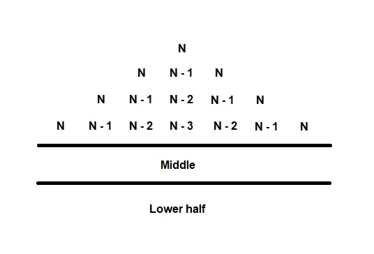
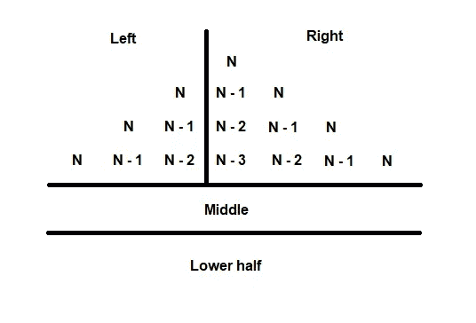

# 实践教程:如何提高程序员解决问题的技能

> 原文：<https://towardsdatascience.com/hands-on-tutorial-how-to-improve-your-problem-solving-skills-as-a-programmer-83f0a8d1082f>

## 技术部分是最容易的


奥拉夫·阿伦斯·罗特内在 [Unsplash](https://unsplash.com?utm_source=medium&utm_medium=referral) 上的照片

编程最终是解决问题。我们只应用编程语言来表达我们是如何思考问题的，以及我们解决问题的方法。

你能做的最糟糕的事情就是一旦问题出现就开始解决它。这是大多数新手程序员卡住并放弃的地方。回想一下你必须做书面评估的学生时代。通常，试卷(或监考老师)会告诉你有多少时间来计划，应该留出多少时间来写作。编程也是一样。

每个问题都是一系列必须解决的小问题的外衣。一旦你为如何解决问题设计了一个清晰的攻击计划，技术部分总是最容易的。

> **如果我只有一个小时去砍树，我会花前 45 分钟磨我的斧子。**
> 
> ——亚伯拉罕·林肯。

为了证明这一点，我们将一起解决一个编码问题。编码问题是培养你通过程序思考的能力的好方法。你接触不同类型的问题越多，你解决问题的能力就会显著提高。因此，重要的是你要不断地将自己置于解决新问题的情境中——即使每天只有 15-30 分钟。

# 问题陈述:字母兰戈利

***注*** *:本挑战取自*[*hacker rank*](https://www.hackerrank.com/challenges/alphabet-rangoli/problem?isFullScreen=true)*。*

给你一个整数 n，你的任务是打印一个 n 大小的字母 Rangoli(Rangoli 是一种基于创造图案的印度民间艺术形式。)

不同大小的字母 rangoli 如下所示:

```
#size 3

----c----
--c-b-c--
c-b-a-b-c
--c-b-c--
----c----

#size 5

--------e--------
------e-d-e------
----e-d-c-d-e----
--e-d-c-b-c-d-e--
e-d-c-b-a-b-c-d-e
--e-d-c-b-c-d-e--
----e-d-c-d-e----
------e-d-e------
--------e--------
```

兰戈利的中心有第一个字母表字母 a，边界有字母表字母(按字母顺序排列)。

该函数的输入是一个包含 ***大小*** 的单行，它是 rangoli 的大小。您的函数应该返回一个字符串，该字符串由 rangoli 的每一行组成，由换行符(\n)分隔。

# #第一步——花时间了解问题

解决任何问题的第一步是理解正在解决的问题。这意味着你能够用自己的话完整地阐述这个问题。

做不到也不要灰心，这是理解过程的一部分。当你遇到一些你不能清楚表达的事情时，这意味着你的理解有差距。如果你想解决这个问题，那么你需要填补空白。

这意味着你必须提问。

当你独自解决一个问题时，你必须问自己更多的问题来充实你不明白的地方——你也可以使用谷歌来更好地了解你对特定部分不明白的地方。如果你正在和一个团队一起工作或咨询某人，那么这是你向他们提问的机会，以填补你理解中的空白。

要点是你必须花时间去完全理解你的问题。从长远来看，这样做会让你受益，并大大简化解决问题的过程。

## 应用:

鉴于我们的字母兰戈利问题，我们要做的第一件事是理解我们试图解决的问题是什么。以下是我用自己的话表达的方式。

给定指定大小的输入，我们将创建一个返回字母 rangoli 的函数，这是一种来自印度民间的艺术形式，基于模式的创建。

请注意，我清楚地描述了我们期望进入函数的内容，以及期望输出的内容。这是因为，在很高的层面上，我喜欢把解决问题想象成获取某种输入并将其转化为某种输出。目前，映射函数是一个黑盒，但我们的下一步是解构黑盒中发生的事情。

在这一步，我喜欢做的另一件事是用一些自定义输入来绘制自己的示例，以便更好地理解会发生什么。例如，我们知道这是一个字母表 rangoli，字母表只有 26 个字母，但是如果传递的大小大于 26，会发生什么呢？幸运的是，这个问题在简报中得到了回答，但如果不是，我们就必须通过提问来弄清楚会发生什么。

***注意*** *:记住 Python 是切片的，不考虑尾数，所以传递 27 会取前 26 个字母。*

这是我画的一个例子:


**当 size=4 时的 rangoli 示例图；作者图片**

我会画一些来更好地加强我的理解。

# #第二步——分解问题

每个问题都是由许多小问题组成的。把一个大问题分解成小问题来解决，会让大问题变得不那么令人畏惧。

当较小的问题得到解决时，需要做的就是将它们连接在一起。如果你仔细考虑每一步的输入和输出，这将导致更大问题的解决。

本质上，我要说的是，在你试图用代码解决问题之前，你应该在纸上或白板上解决问题。一定要详细写下步骤，并清楚地了解发生了什么。

## 应用:

我首先在纸上解决了 rangoli 的问题，方法是研究我在上面的例子中设计的事实。当我弄清楚事实后，我将它们组织成如下步骤:

```
**# Description of facts for size=4**
- we need to get the first n letters of the alphabet so we need access to the full alphabet
- the center value for the first line is always the nth value and it's padded with "-"; **what's the length of the padding?** 
- the middle line always has the first letter of the alphabet as the middle value and the boundary is always the nth letter
   --> from L-R: the middle line starts at an and works its way back to a then from a it goes back to N.
   --> all the letters have a "-" instead of a space between them
   --> this means the length of all the lines is the length of the middle line; **We must know the length of the middle line before we can draw the other lines. 
-** split the rangoli into halves that is seperated by the middle line. 
- the top line of the upper starts with n in the middle. the next line has n - 1 in the middle and to the left of it is n and to the right of it is n. the next line has n-2 in the middle with the sequence going n-1 then n to the left, and n-1 then n to the right. The next line has n-3 in the middle with the sequence going n-2, n-1, then n to the left and n-2, n-1, then n to the right. Let's sketch this. 
```



**兰戈利上半部分的设计草图；作者图片**

```
- we can seperate the upper half into halves again by drawing a line down the center. This would mean we have a left and a right side
```



**将兰戈利上半部分的设计草图分成两半；作者图片**

```
- the left have is going from n to n-i in reverse order and the right side is going from n-i to n
- the lower half is literaly the same thing as the upper half but its flipped upside down. 
```

现在我已经有了事实，我可以设计步骤了。

```
**The steps
1\. store the letters in the alphabet
2\. get the first n letters of the alphabet
3\. draw the middle line
4\. get the length of the middle line
5\. draw the left side of the upper half and join it to the right side - join the values together by "-" and center n-i and make sure the line is length of middle with the other values made up with "-". 
6\. flip the upper half upside down to draw the bottom half
7\. put it all together**
```

我把这个问题分解成 7 个小问题，没有使用任何技术术语。下一步是弄清楚如何在技术上实现每一步。

这意味着仍然有可能更深入地解决这个问题，因为我没有讲太多细节。例如，我刚刚写了'*'画中间的线。'我如何画出中间的线？我没有深入研究这个解决方案，因为我以前解决过类似的问题，所以我对如何绘制中间线有一个清晰的想法(即，要绘制中间线，您必须用“-”符号将前 n 个字母的倒数连接到前 n 个字母(不包括 a)。*

如果当你像这样写出来的时候，你不确定如何做某些步骤，那么不要害怕花费额外的时间来进一步分解如何用伪代码实现每个步骤。

# #第 3 步——执行

现在你已经在纸上解决了这个问题。你所要做的就是实现你写在纸上的解决方案，但是把它翻译成代码。

这就是你的编程语言知识发挥作用的地方。根据您的环境，您可以使用 Google 方法来做某些事情，例如，如何反转字符串或如何获取字符串的前 n 个字母。

既然你已经有了解决问题的框架，你就不必从第 1-7 步开始解决问题。从最简单的步骤开始，获得一些快速的胜利。

当你获得胜利后，再回到你觉得更有挑战性的问题上来。一旦你解决了所有这些问题，然后把它们放在一起，你就有了你的解决方案。

## 应用:

以下是我如何解决问题的小部分:

```
def print_rangoli(n): 
 **# step 1 - store letters of the alphabet** alphabet = "abcdefghijklmnopqrstuvwxyz"

   **# step 2 - get the first n letters of the alphabet**
   first_n = alphabet[:n]

   **# step 3 - draw the middle line**
   middle = "-".join(first_n[::-1] + first_n[1:]) **# step 4 - get the length of the middle line**
   length_of_middle = len(middle)
```

我把它分解成一个更小的问题。我创建了一个程序，用我的名字得到了左边和右边。

```
name = "kurtis"
n = **len**(name)**for** i **in** range(1, n): 
    # left side
    **print**(name[n:n-i:-1])**print**("-"* 10)**for** i **in** range(1, n):
    # right side 
    **print**(name[n-i:n])"""
s
si
sit
sitr
----------
s
is
tis
rtis
urtis
"""
```

现在我要做的就是用“-”将这些值连接在一起，并将中间值(n-i)居中。确保该线与中间线的长度相同，其他值由“-”组成。

```
name = "kurtis"
n = **len**(name)middle = "-".join(name[::-1] + name[1:])**for** i **in** range(1, n): 
    # left side
    **print**("-".join((name[n:n-i:-1] + name[n-i:n]).center(**len**(middle), "-")))"""
----------s----------
--------s-i-s--------
------s-i-t-i-s------
----s-i-t-r-t-i-s----
--s-i-t-r-u-r-t-i-s--
"""
```

下一步是将这个解决方案转化为我们问题的代码:

```
def print_rangoli(n): 
 **# step 1 - store letters of the alphabet** alphabet = "abcdefghijklmnopqrstuvwxyz"

   **# step 2 - get the first n letters of the alphabet**
   first_n = alphabet[:n]

   **# step 3 - draw the middle line**
   middle = "-".join(first_n[::-1] + first_n[1:])

   **# step 4 - get the length of the middle line**
   length_of_middle = len(middle)

   **# step 5 - draw upper half**
   **for** i **in** range(1, n):    
       **print**("-".join((first_n[n:n-i:-1] + first_n[n-i:n]).center(length_of_middle, "-"))) **# step 6 - rotate the upper half**
   **for** i **in** range(n, 0, -1): # <-- rotation happens here
       **print**("-".join((first_n[n:n-i:-1] + first_n[n-i:n]).center(length_of_middle, "-")))
```

第 7 步是把它们放在一起，这意味着向它传递一个值。让我们给我们的函数传递一个大小为 4 的值，看看它是否与我们上面画的模式相匹配。

```
print_rangoli(n=4)"""
------d------
----d-c-d----
--d-c-b-c-d--
d-c-b-a-b-c-d
--d-c-b-c-d--
----d-c-d----
------d------
"""
```

问题解决了。

# #第 4 步——反思

解决一个问题有几种方法；没人说我目前对这个问题的解决方案是最好的解决方法。这意味着现在是一个很好的时间来反思我们如何着手解决这个问题，并思考如何使您的解决方案更有效。

我马上意识到的一件事是，我不必手动写出整个字母表。我可以简单地导入`string`模块并调用`ascii_lowercase`。

```
**import** string alphabet = string.ascii_lowercase
**print**(alphabet)"""
abcdefghijklmnopqrstuvwxyz **"**
```

我通常会花这些时间看看其他人的解决方案，看看他们是如何实现同样的事情的。

# 包裹

编程需要你思考。思考过程的一部分是将问题分解成更小的模块，使它们更容易解决。解决问题的四个步骤是:

1.  理解问题
2.  分解问题
3.  执行
4.  显示

*感谢阅读。*

**联系我:**
[LinkedIn](https://www.linkedin.com/in/kurtispykes/)
[Twitter](https://twitter.com/KurtisPykes)

如果你喜欢阅读这样的故事，并希望支持我的写作，可以考虑成为一名灵媒。每月支付 5 美元，你就可以无限制地阅读媒体上的故事。如果你使用[我的注册链接](https://kurtispykes.medium.com/membership)，我会收到一小笔佣金。

已经是会员了？[订阅](https://kurtispykes.medium.com/subscribe)在我发布时得到通知。

[](https://kurtispykes.medium.com/subscribe) [## 每当 Kurtis Pykes 发表文章时都收到一封电子邮件。

### 每当 Kurtis Pykes 发表文章时都收到一封电子邮件。通过注册，您将创建一个中型帐户，如果您还没有…

kurtispykes.medium.com](https://kurtispykes.medium.com/subscribe)