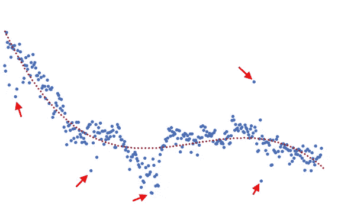
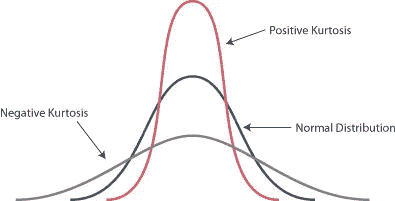

# 嘿，首席执行官:人工智能救不了你！

> 原文：<https://towardsdatascience.com/hey-c-suite-ai-wont-save-you-f160d38214e3>

## 数据是有故事可讲的。如果我们允许自己倾听就好了。

存放照片，boule 1301 商业使用的标准许可证

*本文是与* [*Infornautics*](http://infornautics.com/) 的负责人大卫·戈塞特(David Gossett)的合作，他*构建了没有指令集、需要从头发明的先行者技术。他认为，如果我们应用正确的机器模型，数据就能讲述一个故事。他的专长是非结构化数据。这篇文章旨在引起人们的兴趣，唤起人们对当今困扰我们的机器学习问题的好奇心。我们在搜寻异常点。*

三年前，我写了这篇文章，[人工智能需要重置](https://www.forbes.com/sites/cognitiveworld/2018/10/12/artificial-intelligence-needs-to-reset/?sh=55d842b7386e)。人工智能的大肆宣传被认为是所有事情都自动化了，但这还很遥远。从那时起，我们经历了一些问题，包括缺乏模型责任(黑盒)、偏见、训练集中缺乏数据表示等。一场人工智能伦理运动出现了，要求更负责任的技术，增加模型透明度和可验证的模型，这些模型在这个过程中做它们应该做的事情，而不会损害或伤害个人或群体。

我们的未来是人工智能。据推测，这个神奇的人工智能将成为我们的救世主。我们一直处于信息过载的状态。当我们一天中的每一秒钟都在产生 Pb 级和 Pb 级的数据时，我们没有人类的能力去理解这些海量的信息。我们已经越来越依赖机器来为我们做这些。这就是问题所在。它不起作用。不完全是。

已经成为我们日常生活基础的规则，随着时间的推移，已经成为既定的规范，或者随着我们的学习和发展而不断完善的实践。为了防止在交通繁忙的十字路口发生车祸和行人被车撞，街灯指示了人们被允许过马路和车辆可以行驶的准确时间。这是演绎推理的一个例子。可能会有一两个前提，最后是基于证据的结论。这个基于规则的系统非常以人为中心。x 发生了？那就做 y。

**前提 1** :交通流量大的路口车祸事件高发。

**前提二**:在人流量大的十字路口，人员伤亡事件高发。

**规则**:在交通繁忙的十字路口安装红绿灯。

大卫·戈塞特，信息技术

大数据的到来，让我们从演绎推理转向了现在的归纳推理。归纳推理来自大量的观察，其目标是寻找模式以做出总体概括。从数据中创建模型被称为模型归纳。这些一般规则是统计性的，因此并不是 100%的时间都适用。数据中的这些观察继续“直到我们越来越接近真相，我们可以接近*，但* ***不能完全确定*。**“将归纳推理应用于这两个场景将如下所示:

**数据:**在多伦多和纽约，交通事故发生率很高。

**假设:**大城市往往交通事故发生率高。

**规则:**在上午 9 点-下午 5 点之间的城市路口至少有 1000 辆车和 500 个以上行人的地方安装红绿灯。

大卫·戈塞特，信息技术

***今天的*，人类编写计算机程序。**客户告诉程序员需要什么功能，然后程序设计并构建应用程序。

大卫·戈塞特，信息技术

***明天*，随着 AI 成为常态**，计算机将为我们编写程序。客户将向计算机提供功能需求和数据，计算机将编写应用程序，无需任何人工干预。

大卫·戈塞特，信息技术

***未来的决策将由归纳模型*** 驱动，更多的是基于概率的观察，这些观察将最终影响新的规则和决策。正如我们将在后面看到的，这造成了一个难题。

大卫·戈塞特，信息技术

# 曲线拟合和 P-Hacking 的后果

当研究人员创建模型时，标准操作程序是创建最佳拟合线。这仅仅意味着给定一组观察值(或数据),我们需要确定数据之间的单一函数或数学关系。这种数学关系可用于根据输入与原始数据结果的关系来预测结果。例如，研究人员将使用各种非线性回归模型方法来拟合数据。一旦数据被输入到模型中，它就会生成一个分数，分数越高，模型就越适合。

在下面的例子中，生成的图表只显示了“OK”拟合。假设满分为 1000，最佳模型返回的分数为 744。给定用于曲线拟合数据的模型的数量，结果显示，倾向于“单独”或“在大多数观察结果倾向于聚集的地方之外”的观察结果是异常值。这些用红色箭头表示。这些都是异常现象。他们是这篇文章的主角。被忽视的。省略了。

大卫·戈塞特，信息技术

# 我们为什么要关心异常现象？

在大多数模型中都有异常值。这些异常值中的一些可以被认为是异常。异常是“不同的”或“不正常的”。因为它们没有遵循一个共同的趋势，许多研究人员倾向于把它们当作噪音而不予考虑。研究人员将尝试各种回归模型，直到他们得到一个很好的分数或可能的最佳拟合。

我和一位研究人员一起徒步旅行，当我告诉他，“你不应该做曲线拟合，你知道的！你只是把数据分成一条直线。徒步旅行的时候那家伙一个小时都没和我说话。他就是这么被冒犯的。他证明了曲线拟合将消除噪声。

这篇名为[P-hacking](https://journals.plos.org/plosbiology/article?id=10.1371/journal.pbio.1002106)的文章是这样定义的:

*“一种被称为‘p-hacking’的偏见发生在研究人员收集、选择数据或统计分析，直到不重要的结果变得重要的时候。”*

这篇论文的结论是，在科学界有很大的动力去发表有统计学意义的结果。雇主、资助者和评论者通过计算期刊的影响来评估研究人员的表现。

在一项为期 8 年的癌症研究中，人们试图重现从 53 篇顶级癌症研究论文中收集的 193 项实验的结果。他们的结论是不到 25%的实验是不可重复的。有人指出，⅓实验的作者没有回复提供更多信息的请求。其他人对想要复制他们作品的人表现出敌意。这篇文章验证了 P-hacking 论文中的类似结论:

*“复制也可能让人感到害怕，因为科学家的生计甚至身份往往深深植根于他们的发现中……”发表是进步的货币，是一种关键的奖励，可以转化为获得资金、工作和保住工作的机会……复制并不完全符合这种奖励体系。”*

在我们的另一个宇宙中，除了曲线拟合，我们还质疑为什么我们要限制自己？与其黑掉数据，为什么我们不分析异常点？

想想现在大多数的飞机都是由电脑程序员驾驶的。主题专家和工程师合作，为飞机可能遇到的每一种可能的情况编写代码。但是，有时候，并不是所有的情况都考虑到了。

虽然航空公司长期以来一直在安全地使用自动化来提高效率和减少飞行员的工作量，但最近的几起事故，包括 2013 年 7 月韩亚航空 214 航班的坠毁，表明通常使用自动化飞行的飞行员在遇到意外事件或过渡到手动飞行时可能会出错。 ~总监察长在给 FAA 的信中

2018 年，一架从巴西[飞往巴黎的法航飞机](https://apnews.com/article/paris-europe-trials-business-a180111f4c14d9633f8c1a402a5a1247)在自动驾驶仪故障和机组人员失误导致飞机失速后坠入大西洋。机上 228 人全部遇难。调查发现“*外部速度传感器被冻结并产生不规则读数，飞机陷入空气动力失速*”。

2014 年，一架[亚航飞机坠入爪哇海](https://www.bbc.com/news/world-asia-30632735)，原因是恶劣天气下自动驾驶仪启动，飞行员的错误决定导致飞机失速，导致 162 人死亡。

这些悲惨的航空事件有什么共同点？程序员没有为这些场景编写一行代码。此外，飞行员在驾驶舱里变得令人震惊地无知。当计算机代码丢失了一行，飞机的控制权必须交给飞行员时，飞行员就完全脱离了实践。

《黑天鹅》的作者纳西姆·尼古拉斯·塔勒布说过这样的话:

*“救了一条命就是一个统计；一个人受伤是一件趣闻。统计是看不见的；轶事是突出的。”*

美国人将记住 9/11 和 2977 起死亡事件，因为我们在全国电视上见证了这一天；然而，当我们将这一事件与二战后回家的战争英雄的数量相比较时，估计约有 75 毫米口径的坦克死亡——就不那么令人伤感了。正是这些突出的事件将推动巨大的变化，正如 9/11 后的地缘政治事件所证明的那样。

但是，如果这些异常现象得到足够的重视，这些事故本可以避免吗？

最近，一名没有飞行经验的乘客在飞行员晕倒时，成功地将飞机安全着陆。这位乘客展示了相当于一名学生完成首次单飞的技能。这件事真的那么罕见吗？是否应该对此进行分析，以确定如何让没有飞行经验的乘客在这种紧急情况下安全着陆？

# 为什么没人注意异常现象？

异常现象从一开始就存在。出乎意料，没有计划，但“巨大”的后果:震惊华尔街的[安然](https://www.investopedia.com/updates/enron-scandal-summary/)丑闻。60 亿美元的矿业欺诈。战争(一战、二战、越南)充满了“*未知的未知*”。我们意识到我们今天所做的决定的长期影响了吗？我们认识到政府授予的 Covid-relief 福利使数百万受到不利影响的人受益。但是，未来十年，当我们的孩子支付激增的高税收时，他们会开始感受到下游效应吗？

今天的不同之处在于，随着互联网的发明，我们现在被大量的信息淹没了。庞大的数据量使得人类越来越依赖算法来理解这一切。在这些数据中有更多的知识，更多的细微差别，更多的结果。但是，我们倾向于倾向于那些更有可能发生的，无关紧要的事件。《T8》《T9》《T10》《黑天鹅》《T11》《T12》《反脆弱》的作者纳西姆·尼古拉斯·塔勒布这样说:

> “我发现这是可耻的，尽管有经验记录，我们继续预测未来，好像我们很擅长，使用排除罕见事件的工具和方法。预测在我们的世界里已经被牢牢地制度化了。”

我们在科技网站上做了一个简单的搜索，比如 IBM、微软、思科、咨询公司和特定行业的公司，看看“*人工智能*”和“*异常*”或“*异常检测*”出现了多少次。

从方向上看，我们发现大多数网站都显示出*明显更高的机器学习和人工智能搜索结果*，而异常/检测相比之下则相形见绌。

然而，当我们比较“*异常检测*的关键词搜索结果时，突出的是科技公司(IBM、微软、思科、英特尔、甲骨文)明白异常确实很重要。咨询公司很少提到“异常”，在保险、金融和工业公司中几乎没有提到。鉴于上述亚航和法航坠机的例子，有理由认为“异常检测”应该在航空业得到更多的提及。

大卫·戈塞特，信息技术

# 涓滴效应

通常，驱动结果的是我们可以解释的事件——具有统计显著性并驱动高成功概率的事件。

最高管理层推动目标的实现。在一家大型出版平台工作时，我们的主要目标是影响力、收入和参与度。这些要求已经落实到员工身上，并根据这些目标进行了衡量。他们的工作，他们的奖金依赖于他们的个人表现。

我认识一个人，他在一家大型科技公司担任隐私主管，直接向首席执行官汇报。她的工作是确保他们的用户能够轻松有效地找到和浏览他们的隐私设置。她的工作表现是通过用户对隐私的满意度来衡量的。她确保与管理相关页面的工程师合作，以确保实现她的目标。然而，工程师受到激励，以确保用户参与到平台中。隐私主管指导的一些页面推荐会妨碍他充分实现目标的能力。由于高管层强加的要求(记住，参与是一个关键的要求)与工程师的目标更紧密地联系在一起，猜猜谁最终实现了他们的目标？

通常情况下，由首席执行官制定的目标会产生自我实现的结果。清楚的是，员工将只交付将产生预期结果的任务(由高管团队推动)。如果有异常，它们会被丢弃，并被描述为不太可能再次发生的事件，或者简单地称为噪音。他们不关注他们。

问题在于:使用人工智能的员工正在向高管们提供他们所要求的信息，他们的奖金取决于这些信息，结果也与总体目标一致。这些结果不会带来惊喜，因为数据会回归到平均值。

# 人工智能不属于高管层

高管们的这种涓滴效应也暴露了另一种效应——我们变得如此专注于自己的具体工作和任务，以至于看不到全局。人们已经习惯于做一个轮子上的齿轮，当他们被提升到舵手室时，他们不能充分地表现。

伊恩·麦克吉尔克里斯特写了《大师和他的使者》。他研究了我们两个大脑半球之间的[关系，将其作为“T2”在我们文化中的关键塑造因素他质疑了左*脑*的主导地位，后者专注于细节和具体问题，而右*脑*则看到更广阔的视野，查看许多数据点以了解正在发生的事情。虽然两者共存并可以相互依赖，但右侧的*能够领会“隐喻、笑话或未言明的含义”，其中的“*左侧”显然是*自闭的”。*](https://www.theguardian.com/books/2010/jan/02/1)

这里有一个有趣的类比:一只鸟在公园里寻找食物。它需要集中注意力，辨别种子和鹅卵石的区别。这种集中的左脑活动将让鸟儿找到下一顿美餐。然而，与此同时，这种鸟需要认识到任何可能在该地区的捕食者。它需要用右脑扫描环境才能生存。注意这两个事件:寻找食物和对潜在掠食者的意识都是生存的关键活动。McGilchrest 认为，人类长期以来依赖于我们的左脑，我们从未建立起用右脑有效做出决定的能力，尤其是当我们处于权力地位时。

因此，首席执行官们开始依赖数据，并要求员工向他们提供有效决策所需的信息。由于涓滴式激励结构加上这种排除了这些异常现象的左脑思维，决策者永远不会拥有让他们对形势有一个整体看法所需的所有信息。

由于只见树木不见森林，首席执行官们错过了更大的含义:异常现象可能指向可能导致破产的巨大风险，或者他们可以利用的巨大市场机会。

2021 年，美国安全监管机构开始调查[特斯拉在造成 1 人死亡、17 人受伤的 11 起撞车事故](https://www.nytimesn7cgmftshazwhfgzm37qxb44r64ytbb2dj3x62d2lljsciiyd.onion/2021/08/16/business/tesla-autopilot-nhtsa.html)后使用自动驾驶。马斯克坚称自动驾驶系统没有缺陷。报道表明，马斯克驳回了他们的驾驶辅助程序应该监控司机的想法，坚持认为任何人为干预都可能“[使这种系统不太安全](https://www.youtube.com/watch?v=dEv99vxKjVI)”。

具有讽刺意味的是:因为我们已经将可以预测的事情制度化，我们也已经将机器学习模型制度化，以忘记异常情况——这些最不可能发生的误报、漏报。我们已经背弃了这些东西，这就是为什么我们总是感到惊讶。我们对 2008 年的金融危机感到惊讶。我们对 911 感到惊讶。我们对入侵乌克兰感到惊讶。我们对新冠肺炎感到惊讶。当埃隆·马斯克想要收购 Twitter 时，我们很惊讶。

我们是否应该停下来想一想，如果高管层被告知这些异常情况，那么这些重大事件中的一些本来是可以避免的？事后看来，我们是否考虑过关注这些异常值，我们是否能有额外的洞察力来改变结果？

异常点不适合现有的系统。然而，他们指出了新的知识和深化和扩展现有理论的潜力——未开发的潜力，或已识别的风险。

> 丹尼尔·卡内曼:“我们容易高估自己对世界的了解，低估机遇在事件中的作用”

丹尼尔·卡内曼的《 [*思考快与慢*](https://en.wikipedia.org/wiki/Thinking,_Fast_and_Slow) 》介绍了他的[系统 1 和系统 2 思考](https://suebehaviouraldesign.com/kahneman-fast-slow-thinking/)定位人类如何做决定。这也许可以解释为什么我们会被正态分布吸引？这是一种“固化”的系统 1 方法，是本能的、无意识的，已经形成了思维定势和过程。这个[站点记录了](https://davidmlane.com/hyperstat/A25329.html)关于正态分布的默认值:**“*对于数学统计学家来说，使用它们很容易。几乎所有的统计检验都可以从正态分布中推导出来。***

让我们来看看模型和分布曲线的作用。曲线的形状揭示了更多数据所在的位置。

下面的中间图像(对称分布)数据分布与中心趋势成比例相等。例如，在杂货店 x，通过他们的数据，人们将持续每周来购买基本需求:面包、牛奶和鸡蛋。这种高度可预测的行为将倾向于位于曲线的最高点之下。在正态或对称分布下，这种行为的 65%位于中间左右 1 个标准差以内。对于数据科学家来说，这是一件好事。

但社会很少是这样运转的。数据科学不是这样工作的。

大卫·戈塞特，信息技术

当夏天来临时，人们会买更多的西瓜。这确实是唯一可用的时间段，因此这将产生一个正偏差。人们购买的西瓜越多，平均值就会向右移动。在一个完美的世界里，平均值应该在曲线的最高点。但是，随着我们将更多的西瓜购买量加载到模型中，这种极端的正偏度对于分布来说是不可取的。

我们没有意识到的是，有很多我们今天看到的正偏度例子:收入水平；房价；季节性购买；Etsy 的手工制作和复古商品；高级护发产品等等……我们的选择越多，积极的数据就越多。平均值现在将大于中值，甚至高于众数。

旁注:负偏度，即平均值小于中位数或众数，是非常罕见的。一个例子是:手指的数量。大多数人总共有 10 个，但在事故中可能会丢失一个或更多。

所以现在，我们不得不求助于数据转换工具来帮助使偏斜的数据更接近我们的正态分布曲线。所以一旦我们做到了这一点，我们现在就可以很容易地使我们的机器模型易于使用。

争论的关键在于:公司围绕平均值管理决策。按照卡尼曼的说法，“ ***我们低估了机遇在事件*** 中的作用”。特斯拉否认了他们的系统应该考虑人类监控的建议。这能避免 11 起异常事故吗？飞机安全标准和规则只在飞行员熟练/能够在理想条件下飞行时才会考虑。当飞行员丧失能力时，他们应该考虑异常情况吗？

当我们考虑异常情况时，我们注意到这些情况很少发生，但它们“与大多数数据明显不同”，从而引起了怀疑。正如所证明的那样，他们的结果可能是重大的。

# 峰度:自我实现的预言？

因此，当我们默认为正态或对称分布时，在人工智能时代，机器会因为做对了而获得奖励。他们被奖励不越轨。我们的概率倾向是尽可能接近平均值，因为这是最安全的回报赌注。因此，当我们试图影响数据走向均值时，它开始堆叠曲线，并变得更高——这种效应被称为正峰度。(见下图)。记住，在正态分布曲线中，65%的数据位于距中心 1 个标准差以内。但是我们越提高峰度，曲线变得越细，我们开始看到 75%，85%，90%的数据突然位于均值的 1 个标准差内。在这一点上，模型越来越好地猜测这个中间值。

我们越提高峰度，就越关注中间发生的事情。因此，当一只股票的收益率远低于预期时，我们会变得更加惊讶。

峰度之所以重要，是因为它所创造的东西:越来越厚的尾部在频率和影响上不断增加，即异常，虽然仍然是异常值，但与较薄的正态分布曲线相比，发生率要高得多。

大卫·戈塞特，信息技术

峰度可以用来衡量金融风险。大峰态与高风险水平相关，这表明极大和极小回报的概率较高。

因此，当我们将这一点应用于这些罕见的世界事件时:COVID 疫情导致了 Covid 疫苗和更多关于口罩和流动性的政府规则，并产生了这些**肥尾**副作用，这些副作用鼓励了反 vaxxers 和自由言论活动家。

> 当我们肥了尾巴，我们有更高的峰值，更小的肩膀，和更高的非常大的偏差的发生率。~纳西姆·塔勒布

大卫·戈塞特，信息技术

ML 和人工智能爱回归。在峰度的例子中，紫色的点代表奖励。曲线外的灰点不予奖励。在新冠肺炎之前，总有一些宗教或其他方面的边缘团体不同意政府强制接种疫苗。但是疫情加剧了这场运动，这场运动在规模和频率上都获得了更大的动力，并演变成了一场自由运动——否则这是无法预料的。

由于未能注意到这种异常现象，以前看不到的事件可能会在规模和范围上扩大，在全球范围内实现，并变得不可控制。

# 只有当我们考虑所有的数据时，人工智能才会为我们服务

如果我们继续默认正态分布，并被激励去做直接报告组织目标的任务，而忽略最不可能发生的价值，我们将会失败。

在这个过程中，我们对创新和竞争优势的潜在机会视而不见。我们忽视了潜伏在我们中间的危险，这些危险可能会对企业产生深远的影响。

随着我们越来越多地冒险进入机器学习以及我们如何分析信息，详细说明什么已经成为规范非常重要。在人工智能的年轻生命周期中，它仍在试图找到进入主流组织的道路，它成功地创造了一条从一开始就被认为是错误的道路。我们正在用错误的激励结构来试验、创造过程和政策，这种结构使这些偏见和重复出现的数据问题永久化。我们只见树木不见森林，因为我们变得自满，对我们确信不会再次发生的结果不屑一顾。

除非我们跳出行业公认的标准去思考，否则我们将继续走在一条通向最终失败的道路上。

在我们的下一篇文章中，我们将提供一种替代方法——一种共识方法，让我们更清醒，更少惊讶。

*关于大卫·戈塞特*

Infornautics 的负责人大卫·戈塞特(David Gossett)认为，人类和人工智能目前都忽略了异常现象。David 使用高级模型来识别异常值中的模式，他认为异常值代表了公司的所有风险和机会。他的专业是非结构化数据，以前教过计算机阅读简历，并决定每个职位应该面试哪些候选人。他在四大会计师事务所工作，建立了一个销售自动化系统，管理着 7.5 亿美元的新收入。他还花时间在安然公司建立交易台基本面和套利工具。

这篇文章最初出现在[福布斯](https://www.forbes.com/sites/hessiejones/2022/05/25/hey-c-suite-ai-wont-save-you/?sh=2839cf9e32a0)上。