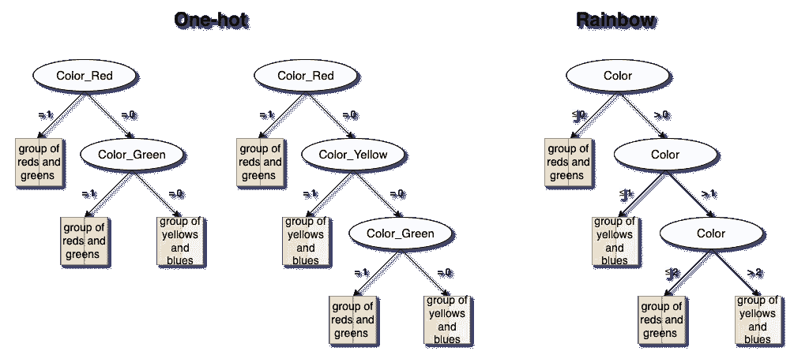
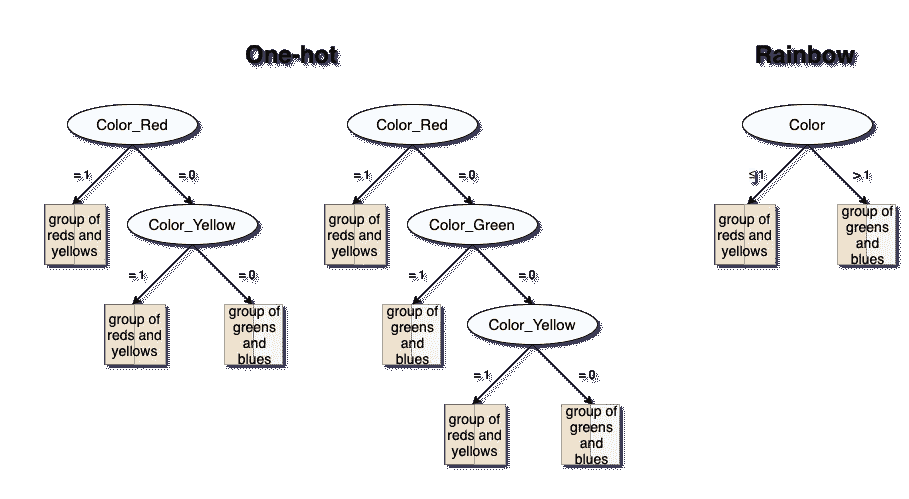

# 隐藏的数据科学宝石:标签编码的彩虹方法

> 原文：<https://towardsdatascience.com/hidden-data-science-gem-rainbow-method-for-label-encoding-dfd69f4711e1>

## 通过利用自然秩序制作更强大和更简单的模型

*与* [*迪米特拉·卡拉巴什*合著](https://medium.com/u/79cc5dc1f7e1)

照片由 [JD Rincs](https://unsplash.com/photos/9GkYmKYVoGY) 在 [Unsplash](https://unsplash.com/?utm_source=medium&utm_medium=referral) 上拍摄

## 介绍

假设您有 2，000 个特征，您需要建立最佳的预测模型(“在复杂性、解释、合规性以及最后但同样重要的性能方面是最佳的”)。任何曾经处理过大量分类变量并使用过流行的一键编码方法的人都很熟悉这种情况。通常，稀疏数据集不太适合高效的基于树的算法，如随机森林或梯度提升。

相反，我们建议找到一种顺序编码，即使类别中没有明显的顺序。我们介绍了 Rainbow 方法——一套识别好的顺序编码的技术——并展示了当与基于树的算法一起使用时，它比传统的 One-hot 有多种优势。

与 One-hot 相比，Rainbow 方法有以下优势:

1.  **资源效率**

*   节省大量建模时间
*   节省存储空间
*   显著降低计算复杂度
*   减少或消除对分布式处理等“大数据”工具的需求

**2。模型效率**

*   显著降低模型维度
*   保持数据粒度
*   防止过度拟合
*   模型通过更简单的超参数达到最高性能
*   自然地促进特征选择

## 背景

不同背景的数据科学家可能对分类变量编码有不同的偏好。然而，普遍的共识是:

1.  具有自然顺序的分类变量应该使用尊重该顺序的编码，例如序数编码；和
2.  没有自然排序的分类变量，即*名义*变量，应该使用某种名义编码，而 One-hot 是最常用的方法。

虽然一次性编码经常被反射性地使用，但它也可能导致多种问题。根据类别的数量，它可能会产生大量的维度增加、多重共线性、过度拟合和整体非常复杂的模型。这些暗示与奥卡姆剃刀原理相矛盾。

当建模者对没有内在顺序的分类变量应用顺序编码时，这既不经常也不被普遍接受。然而，一些建模者这样做纯粹是为了建模性能的原因。我们决定探索(从理论上和经验上)这种方法是否有任何优势，因为我们相信分类变量的编码值得更深入的研究。

事实上，大多数分类变量都有某种顺序。上面的两个例子——完美的自然排序和没有自然排序——只是极端情况。许多真正的分类变量介于两者之间。因此，将它们转换成一个数字变量既不完全公平也不完全是人为的。这可能是两者的混合。

我们的主要结论是，当与基于树的算法一起使用时，对于任何分类变量来说，顺序编码可能比一次性编码更好。此外，我们下面介绍的 Rainbow 方法有助于选择一种顺序编码，这种编码具有最佳的逻辑和经验意义。Rainbow 方法还渴望支持可解释性和遵从性，这是重要的次要考虑因素。

## 线性模型与基于树的模型

形式统计科学严格区分数量变量和分类变量。研究人员应用不同的方法来描述这些变量，并在线性模型中对它们进行不同的处理，如回归。即使某些分类变量有自然顺序，对它们应用任何定量方法都应该非常谨慎。

例如，如果任务是建立一个线性模型，其中一个独立变量是*教育水平*，那么标准方法是通过 One-hot 对其进行编码。或者，人们可以设计一个新的量化特征*教育年限*来代替原始变量——尽管在这种情况下，它不会是一个完全等价的替代。

与线性模型不同，基于树的模型依赖于可变等级而不是精确值。所以，对教育水平*使用序数编码*完全等同于一个热点。对具有清晰自然顺序的变量使用“一键热”实际上是多余的。

此外，只要保持正确的顺序，分配给类别的值甚至都无关紧要。以决策树、随机森林和梯度推进为例，如果变量*的子代数量*编码为

0 = "0 个孩子"
1 = "1 个孩子"
2 = "2 个孩子"
3 = "3 个孩子"
4 = "4 个或更多孩子"

或者作为

1 = "0 个孩子"
2 = "1 个孩子"
3 = "2 个孩子"
4 = "3 个孩子"
5 = "4 个或更多孩子"

或者甚至作为

-100 = "0 个孩子"
-85 = "1 个孩子"
0 = "2 个孩子"
10 = "3 个孩子"
44 = "4 个或更多孩子"

在这些算法中，这些值本身并不提供量化功能。重要的是变量的等级，基于树的算法将使用其魔力来进行最合适的分割，以引入新的树节点。

决策树不适用于大量的二进制变量。拆分过程效率不高，尤其是在拟合被严重规则化或约束的情况下。正因为如此，即使我们随机排序类别，并制作一个单一的标签编码功能，它仍然可能比一个热。

由于性能更好，随机森林和梯度提升经常在其他算法中被选中，所以我们的方法在许多情况下可以证明是方便的。将我们的方法应用于其他算法，如线性回归或逻辑回归，超出了本文的范围。我们预计这种特征工程的方法可能仍然是有益的，但这需要进一步的研究。

## 方法

想一个明确的名义分类变量。一个例子是颜色。比如说，标签有:“绿”、“红”、“蓝”、“紫”、“橙”、“黄”、“靛”。

我们希望在这些标签中找到一种秩序，而这样的秩序是存在的——彩虹。因此，您可以简单地创建带有编码的单个特征，而不是创建七个一次性特征:

0 =“红色”
1 =“橙色”
2 =“黄色”
3 =“绿色”
4 =“蓝色”
5 =“靛蓝”
6 =“紫罗兰”

因此，我们把在类别中寻找顺序的技术称为“彩虹法”。我们发现令人惊讶的是，存在一种自然现象，代表一个名义变量的标签编码！

概括这个逻辑，我们建议**为任何分类变量找到彩虹**。即使可能的排序不明显，或者似乎没有，我们也提供一些技术来找到它。通常，类别中存在某种顺序，但是建模者看不到。可以看出，如果数据生成过程确实假定*类别中有某种*顺序，那么在模型中利用它将比将类别分割成一个热点特征有效得多。因此我们的座右铭是:

> “当大自然给你一道彩虹，带走它…”

根据我们的发现，类别顺序定义得越清楚，使用顺序编码而不是一次性编码在模型性能方面的好处就越大。然而，即使在完全没有顺序的情况下，制作和使用随机彩虹也可能产生与 One-hot 相同的模型性能，同时节省大量的维度。这就是为什么寻找彩虹是一个值得的追求。

> 颜色是一个名义变量吗？
> 
> 有些读者可能会认为颜色显然是一个序数变量，所以我们发现一个序数编码也就不足为奇了。
> 
> 一方面，来自不同科学背景的建模者可能会以不同的方式看待相同的分类变量，并可能习惯于反射性地应用某些编码方法。举个例子，我(安娜)学的是经济学和计量经济学，我没有遇到任何可以把颜色当做定量的用例。同时，研究物理或数学的建模者可能在他们的建模经验中利用了波长，并且可能考虑了颜色序数。如果你代表后一种建模者，请花一分钟想一个不同的例子，一个明确的名义变量。
> 
> 另一方面，自然排序是否存在并不改变我们的信息。简而言之，如果订单存在—太好了！如果没有…好吧，我们希望你能找到它！我们将在下面提供更多的例子，希望它们能指导你如何为你自己的名义变量找到彩虹。

乍一看，大多数名义变量似乎不能转换成数量尺度。这就是我们建议寻找彩虹的地方。对于颜色，自然比例可能是*色调*，但这不是唯一的选择——还有*亮度*、*饱和度*、*温度*等。我们邀请你尝试几种不同的彩虹，它们可能捕捉到分类质量的不同细微差别。

根据类别 K 的数量和上下文，你实际上可以从一个类别变量中产生和使用两个或更多的彩虹。

我们不推荐使用超过 log₂(K)的彩虹，因为我们不想超过一个[二进制独热](https://www.sciencedirect.com/topics/computer-science/one-hot-encoding)的编码数量。

彩虹法非常简单，直观明了。在许多情况下，你选择哪种彩虹甚至都不那么重要(我们指的是颜色顺序)；这总比一发不可收拾要好。更自然的顺序可能比其他顺序表现得更好，也更容易解释。

## 寻找彩虹—示例

计量水平的统计概念在区分具有自然排序的变量和没有自然排序的变量方面起着重要作用。虽然**定量**变量有一个*比率*标度，即它们有一个有意义的 0、有序值以及值之间的等距离，但**分类**变量有*区间*、*序数*或*名义*标度。让我们为每一种类型的分类变量说明我们的方法。

**区间**变量有有序的值，值之间的距离相等，但值本身不一定有意义。例如，0 不表示缺少某种质量。区间变量的常见例子有李克特量表:

*此人购买智能手机的可能性有多大？*

1:“非常不可能”
2:“有点不可能”
3:“既不可能也不太可能”
4:“有点可能”
5:“非常可能”

毫无疑问，区间变量本质上给了我们最好最自然的彩虹。大多数建模者会用数字编码它们。

1 = "非常不可能"
2 = "有点不可能"
3 = "既不可能也不可能"
4 = "有点可能"
5 = "非常可能"

> 注释:我们使用“冒号”符号来表示原始类别名称，使用“等号”符号来表示类别的数值分配。

**序数**变量有有序无意义的值，值与值之间的距离既不相等也不可解释。

*该人完成的最高学历是什么？*

A:“学士学位”
B:“硕士学位”
C:“博士学位”
D:“副学士学位”
E:“高中”
F:“没有高中”

类似于区间变量，序数变量有一个固有的自然彩虹。有时，顺序变量的类别没有按照正确的顺序列出，这可能会让我们看不到眼前的彩虹。通过对变量的关注，我们可以对类别进行重新排序，然后使用这个更新的变量作为量化特征。

1 =“没有高中”
2 =“高中”
3 =“大专”
4 =“学士”
5 =“硕士”
6 =“博士”

到目前为止，大多数建模者会有机地使用最好的彩虹。更复杂的问题是如何看待名义变量。

**名义**变量在类别之间没有明显的顺序。复杂的是，对于机器学习建模目标，我们可以更加灵活地使用变量和工程特征，即使从统计角度来看它们没有什么意义。这样，利用彩虹法，我们就可以把一个名义变量变成一个数量变量。

寻找彩虹背后的主要想法是利用人类智能或自动化工具。对于您可以直接检查每个分类变量的相对较小的项目，我们建议将直接的人类智能放入这样的选择中。对于具有许多复杂数据集的大规模项目，我们提供一些自动化工具来生成可行的量化尺度。

## 手动彩虹选择

我们来看一些人工主观彩虹选择的例子。诀窍是通过使用一些具体的相关属性或者从一个可能的抽象概念构建一个量化的尺度。

在我们的经典例子中，对于一个名义变量*颜色*，色调属性建议一个可能的比例。所以，名义类别

a:“红色”
B:“蓝色”
C:“绿色”
D:“黄色”

可以被新设计的彩虹功能所取代:

1 = "蓝色"
2 = "绿色"
3 = "黄色"
4 = "红色"

对于下面的*车型*变量，

*车型*

C:“紧凑型车”
F:“全尺寸车”
L:“豪华车”
M:“中型车”
P:“皮卡”
S:“跑车”
U:“SUV”
V:“面包车”

我们可以想出几十个特征来组成彩虹——车辆尺寸、容量、价格类别、平均速度、燃油经济性、拥有成本、发动机特性等。挑哪一个(或几个)？选择取决于模型的上下文。想想这个特性如何帮助预测你的结果变量。你可以尝试几种可能的彩虹，然后从模型表现和诠释方面选择最好的。

考虑另一个变量:

*婚姻状况*

A:“已婚”
B:“单身”
C:“推断已婚”
D:“推断单身”

这是我们可以发挥创造力的地方。如果我们认为单身和已婚是光谱的两端，那么推断的单身可能在两端之间，更接近单身，而推断的已婚可能在两端之间，更接近已婚。这是有道理的，因为推断具有一定程度的不确定性。因此，以下顺序是合理的:

1 = "单身"
2 = "推断单身"
3 = "推断已婚"
4 = "已婚"

如果有任何缺失的值，一个新的类别，“未知”，正好适合单身和已婚之间的中间值，因为没有理由选择一端而不是另一端。因此，修改后的比例如下所示:

1 =“单身”
2 =“推断单身”
3 =“未知”
4 =“推断已婚”
5 =“已婚”

另一个例子:

*职业*

1:“专业/技术”
2:“行政/管理”
3:“销售/服务”
4:“文员/白领”
5:“工匠/蓝领”
6:“学生”
7:“家庭主妇”
8:“退休”
9:“农民”
A:“军人”
B:“宗教”
C:“个体户”
D:“农民

在这个例子中找到彩虹可能更难，但有几种方法可以做到:我们可以根据平均年薪、职业在感兴趣的地理区域的流行程度或其他数据集中的信息对职业进行排序。这可能涉及调用人口普查 API 或一些其他数据源，并且可能因为这些值不是静态的而变得复杂，但这些仍然是可行的解决方案。

## 自动彩虹选择

没有好的相关属性怎么办？在某些情况下，我们无法找到彩虹的逻辑顺序，因为变量本身是不可解释的。或者，如果我们有非常大的数据，但没有资源来手动检查每个变量，该怎么办？下一项技术对于这种情况很方便。

我们来看一个第三方做的黑箱专栏:

*家庭金融集群*

1:“市场观察者”
2:“保守财富”
3:“特定储蓄者”
4:“屡试不爽”
5:“新潮倾向”
6:“当下消费者”
7:“农村信托”
8:“城市聚光灯”
9:“职业意识”
10:“数字金融家”
11:“金融期货”
12:“稳定影响者”

在这个例子中，我们不清楚每个类别包含什么，因此也不知道如何对这些类别进行排序。在这种情况下该怎么办？我们建议通过查看每个类别与目标变量的关系来创建一个人造彩虹。

最简单的解决方案是按照与目标变量的相关性来排列类别。因此，与因变量相关值最高的类别将获得数字代码 1，而相关值最低的类别将获得数字代码 13。在这种情况下，那么，我们的彩虹将意味着金融集群和目标变量之间的关系。这种方法适用于分类和回归模型，因为它可以应用于离散和连续的目标变量。

或者，你可以仅仅利用分类变量和目标变量的某些统计特性来构建彩虹。

例如，在二元目标变量的情况下，我们可以查看给定每个类别的一的比例。假设在市场观察人士中，正面目标的比例为 0.67%，而保守财富的比例为 0.45%。在这种情况下，市场观察人士的排名将高于保守财富(或者更低，如果目标百分比是上升的)。换句话说，这个彩虹将反映每个类别中积极目标的普遍性。

对这些自动化方法的一个合理担忧是潜在的过度拟合。当我们使用将自变量与因变量相关联的相关性或目标百分比的后验知识时，这可能会导致数据泄漏。为了解决这个问题，我们建议在随机维持样本上学习彩虹顺序。

## 彩虹保留完整的数据信号

在这一节中，我们简要地展示了彩虹序数编码在用于决策树时完全等同于 One-hot。换句话说，保留了完整的数据信号。

我们还在下面展示了，如果选择的彩虹(类别的顺序)与“真实的”彩虹一致，即与数据生成过程一致，那么得到的模型将严格优于一键模型。为了测量模型质量，我们将查看树中的分裂数量。更少的分割意味着更简单、更有效和更少的过度拟合模型。

让我们放大一分钟，看看只有 4 个值的经典彩虹示例:

*颜色*
0 = "红色"
1 = "黄色"
2 = "绿色"
3 = "蓝色"

对于一个热点，我们将创建 4 个特征:

*Color _ Red*= 1 if*Color*= 0，否则为 0，
*Color _ Yellow*= 1 if*Color*= 1，否则为 0，
*Color _ Green*= 1 if*Color*= 2，否则为 0，
*Color _ Blue*= 1 if*Color*= 3，否则为 0。

在彩虹的例子中，我们只需要单独使用*颜色*。

让我们比较一下使用这两种方法可能得到的模型:4 个特征对 1 个特征。为了简单起见，让我们构建一个决策树。考虑数据生成过程的几个场景。

## 场景 1

假设所有的类别都有很大的不同，并且每一个都给模型带来了很大的收益。这意味着每个独热特征确实是关键的——模型应该在由独热创建的所有 4 个组之间分开。

在这种情况下，像 *XGBoost* 这样的算法将简单地在所有值之间进行拆分，这完全等同于 One-hot。两个模型中正好有三个分裂。因此，仅用一个特征而不是四个特征就可以获得相同的精确结果。

图 1(由 Anna Arakelyan 绘制)

人们可以清楚地看到，这个例子很容易推广到具有任意数量类别的 One-hot。此外，请注意彩虹中类别的顺序并不重要，因为所有的**类别都会被拆分。实际上，(K-1)分裂对于两种方法都足以在 K 个类别之间进行分离。**

图 2(由 Anna Arakelyan 绘制)

最主要的一点是，当从 One-hot 切换到 Rainbow 时，一点数据信号都不会丢失。此外，根据类别的数量，会发生显著的降维，从而节省时间和存储，并降低模型的复杂性。

有时，建模者试图通过将类别组合成一些逻辑组并将它们转换成二元变量来克服“一个热点”的维度问题。这种方法的缺点是损失了数据粒度。注意，通过使用 Rainbow 方法，我们不会丢失任何级别的粒度。

## 场景 2

让我们来看一个对 Rainbow 不太有利的场景，其中选择的顺序与“真正的”顺序不一致。假设数据生成过程在{红色、绿色}和{黄色、蓝色}组之间分离。

在这种情况下，该算法将进行所有必要的分割-彩虹分割三次，一个热点分割两次或三次，具体取决于树选取的一个热点要素的顺序。

图 3(由 Anna Arakelyan 绘制)

即使在这种最不利的情况下，当选择 Rainbow 方法时，也不会丢失数据信息，因为具有最大(K-1)个分裂的树将反映任何数据生成过程。

## 场景 3

最后，如果数据生成过程实际上符合彩虹顺序，那么彩虹方法将优于 One-hot。它不仅不会丢失任何数据信号，还会大大降低复杂性，减少维数，并有助于避免过拟合。

假设真实模型图案仅在{红色、黄色}和{绿色、蓝色}之间分开。Rainbow 在这种情况下有明显的优势，因为它利用了这些分组，而 One-hot 没有。一次性模型必须进行两次或三次分割，而彩虹模型只需要一次。

图 4(由 Anna Arakelyan 绘制)

在我们的[下一篇文章](/case-study-practical-label-encoding-with-rainbow-method-d167c386e78)中，我们将更进一步，展示 Rainbow 方法的实际应用，将其应用于现实世界的数据科学模型，并直接强调其巨大的潜力。

## 信用

我们衷心感谢 [MassMutual](https://careers.massmutual.com/explore-careers-data-science/) 的 Dan Garant、Paul Shearer、Xiangdong Gu、Haimao Zhan、Pasha Khromov、Sean D'Angelo、Gina Beardslee、Kaileen Copella、Alex Baldenko 和 Andy Reagan 提供了非常宝贵的反馈。

*原创创意由*[*Dmytro Karabash*](https://medium.com/u/79cc5dc1f7e1)