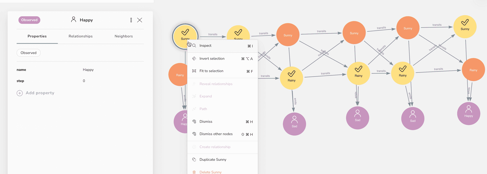
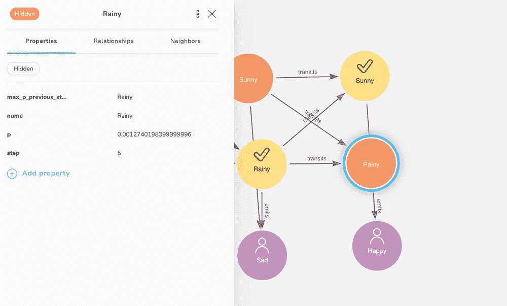
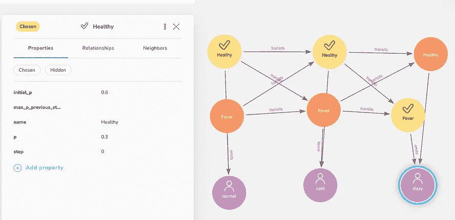

# Neo4j 隐马尔可夫模型

> 原文：<https://towardsdatascience.com/hidden-markov-model-with-neo4j-dde776f9047b>

## 用 Neo4j 演示维特比算法

> 在日常生活中，向前推理更有用……然而，很少有人，如果你告诉他们一个结果，能够从他们自己的内心意识中进化出导致那个结果的步骤是什么。当我谈到逆向推理或分析性推理时，我指的就是这种力量。
> 
> ——夏洛克·福尔摩斯在《血字的研究》中

在小组讨论[*让知识图谱发挥作用 4You*](https://go.neo4j.com/wbr-220222-putting-knowledge-graphs-to-work4you-apac-on-demand.html) 中，我从星展银行的 Anand Sundarraman 那里了解到，他们正在使用思维导图来储存知识。他们没有在脑海中或白板上勾画出这些关系，而是将它们放入 Neo4j 知识图表中。这张思维导图可能有助于他们为未来的事件做好准备，比如当前俄乌危机的后果。

过去我曾用 Neo4j 来表示物理实体及其关系，如[基因和基因组](https://medium.com/geekculture/analyzing-genomes-in-a-graph-database-27a45faa0ae8)、[药物和疾病](/neo4j-for-diseases-959dffb5b479)、[宝莱坞电影和演员](https://medium.com/p/5ceb371031f1)，以及最近的病人病历( [1](/doctor-ai-an-ai-powered-virtual-voice-assistant-for-health-care-8c09af65aabb) 、 [2](https://medium.com/p/cc21765fa8a6) 、 [3](https://medium.com/p/1396d1cd6fa5) 、 [4](https://medium.com/p/b63b10d67bf4) )。但 Anand 的演讲提出了一个想法，即我们可以使用 Neo4j 来模拟概率过程。当我们谈到概率模型和图形时，我们会想到隐马尔可夫模型(HMM)。

图一。交互式 Neo4j Bloom 中隐马尔可夫模型的可视化。图片作者。

图二。图 1 的部分描述。图片作者。

嗯，一开始可能会让人害怕和困惑。Medium 上有很多关于 HMM 的文章( [1](https://medium.com/towards-data-science/how-to-build-a-poisson-hidden-markov-model-using-python-and-statsmodels-f7aa3f46f847) 、 [2](https://medium.com/@kangeugine/hidden-markov-model-7681c22f5b9) 、 [3](https://jonathan-hui.medium.com/machine-learning-hidden-markov-model-hmm-31660d217a61) 等等)。他们用迭代的例子解释了 HMM 中的数学细节。这意味着有很多数学。他们的插图是静态的。但是我们都想要互动材料，因为它们可以让事情变得更清楚。所以在本文中，我想在交互式 Neo4j 中演示 HMM。我想特别演示一下维特比算法。只有两个简单的步骤，你可以很容易地遵循。我将使用你可以在许多其他 HMM 教程中看到的虚构的天气情绪虚拟数据。这个项目的代码存放在我的 GitHub 仓库中:

<https://github.com/dgg32/markov_neo4j>  

# 1.天气猜谜游戏

假设我有一个朋友在外地，想猜猜他所在城市的天气。每天，他都告诉我他是快乐还是悲伤。第一天是晴天的几率是 66.6%，也就是下雨的几率是(100–66.6)% = 33.3%。此后的每一天，某一天的天气取决于前一天的天气，其概率如下(转移概率):

他的情绪取决于当天的天气，其概率如下(排放概率):

而我的朋友这六天有以下几种情绪:**开心，开心，难过，难过，难过，开心**。所以问题来了，**他所在的城市最有可能出现的天气序列是什么？**准确的说，**导致最后一天** 🥵.天气最有可能出现的天气序列是什么

# 2.在 Neo4j 中创建隐马尔可夫模型

有了上面的信息，我们可以在 Neo4j 中创建隐马尔可夫模型。首先，在 Neo4j 浏览器中新建一个名为`markov`的项目。你甚至可以在 AuraDB 上创建这个项目来获得额外的学分。之后，在我的存储库中运行`create_node.py`。

它创建所有的`Hidden`(天气)和`Observed`(情绪)节点，以及初始、发射和转移概率。我在脚本中提供了三个例子，因此参数`2`意味着例子 2——天气情绪的例子。

您可以使用以下命令在 Neo4j 浏览器或 Bloom 中检查这些节点和关系:

图 3。新创建的节点显示在 Neo4j 浏览器中。图片作者。

# 3.猜天气

现在让我们用维特比算法来猜测这六天的天气。运行`viterbi.py`:

该命令计算每个隐藏状态的概率，并突出显示所选的隐藏状态。该算法有两个部分:前向和后向阶段。

## 3.1 前进阶段

第一部分计算每个隐藏状态的最大概率。

该代码从 Neo4j 图表中获取概率、天气名称和情绪。在第 24 行和第 28 行之间，它计算第一天的天气概率。因为我朋友第一天很开心，所以那天是晴天的概率等于`emission_p(Sunny-emits-Happy)` × `initial_p(Sunny)` =0.53。我们也同样计算第一天下雨的概率。我们需要将两个结果都保存在`previous_hid_ps`中，因为直到后来我们才知道哪一个会导致最可能的路径。

对于其他日子，该算法不仅考虑排放概率，还考虑前一天的天气概率和转移概率。让我们计算一下第二天**阳光明媚**的概率。在那一天，因为我的朋友也很高兴，我们只需要从“高兴”的心情考虑发射概率。那么第一天可能是晴天也可能是雨天。因此，我们有以下计算:

在这种情况下，算法会修剪掉分支:它只会向前移动 0.341 的较大概率(第 42 行)，并注意到该值是在第一天阳光明媚时获得的(第 43 行)。第一天下雨的较小概率 0.04256 已被删除。该算法可以做到这一点，因为无论在接下来的步骤中会发生什么，最大概率将总是优先用于该节点，即使该节点可能不在最可能的天气路径上。

同样，第二天下雨的概率是 0.04262:

该算法将各自的最大值和它们的后指针保存在节点中(第 46 和 47 行)。并在以后的日子里重复计算。您可以在 Neo4j 中检查它们的值(图 1)。

## 3.2 反向阶段

反向阶段选择最可能的天气路径。它从最后一天开始，因为累积概率到此结束。

图 4。最近天气的概率。图片作者。

在我们的例子中，最后一天最有可能是晴天，因为晴天的概率(0.001698)大于雨天的概率(0.001274)(在第 8 行和第 24 行之间)。根据后指针，更大的可能性来自一个下雨的第五天。那么这是一个多雨的第五天。之后，算法只是沿着多雨的第五天的后指针到第四天，依此类推，直到它到达第一天(在第 26 行和第 31 行之间)。所以最有可能的天气路径是:**晴，晴，雨，雨，雨，晴**。

# 4.其他示例

您可以在我的代码中用另外两个例子进一步探索维特比算法。第一个来自[关于天气和健康的维基百科](https://en.wikipedia.org/wiki/Viterbi_algorithm)。第三个例子来自[宾夕法尼亚大学关于蛋白质的](https://www.cis.upenn.edu/~cis262/notes/Example-Viterbi-DNA.pdf)。不要忘记首先清除数据库:

然后运行:

图 5。Neo4j Bloom 中其他两个示例的可视化效果。图片作者。

# 结论

隐马尔可夫模型被广泛应用于许多领域，从语言处理到生物信息学，从物理到金融。在生物信息学中，著名的[蛋白质家族数据库(PFAM)](http://pfam.xfam.org/) 就是建立在 HMM 之上的。它为我们提供了许多蛋白质家族的轮廓隐马尔可夫模型(轮廓 HMM)。我们可以用 HMMER 工具将我们自己的序列与它们进行比对和分类。相比于 BLAST(阅读更多关于 BLAST 的内容: [1](https://medium.com/p/8239a45d8116) 和 [2](https://medium.com/p/3b35b29afde7) )，HMMER 更加敏感。HMMER 能够找到更多的远程序列亲属，因为它可以接受更多的信号，这要归功于 HMM 的位置意识。自发布以来，已成为生物信息学中为数不多的不可或缺的常青工具之一。

尽管伟大的咨询侦探夏洛克·福尔摩斯既没有提到 HMM 也没有提到维特比算法，但本文开头的引用表明了他在工作中应用它们的能力。正反向推理是维特比算法的核心。下面是该算法的总结:在向前阶段，我们在每个隐藏状态内进行概率比较，以便我们得到每个隐藏状态的最大概率。在后向阶段，概率比较发生在最后一步的隐藏状态中，因此我们可以通过跟随它的后向指针来开始追踪最可能的路径。正如本文所展示的，给定一系列观察到的状态，结果是最可能的路径。维特比算法只是 HMM 的三个用例之一。你也可以用 HMM 做其他事情。你可以计算一个观察到的序列的可能性，比如**快乐，悲伤，快乐，悲伤，快乐，悲伤**。对于这两个用例，HMM 模型必须事先知道。但是如果你没有模型呢？你可以反过来。假设你有一个新的蛋白质序列家族。您可以根据它们与 HMMER 中的`[hmmbuild](http://www.csb.yale.edu/userguides/seq/hmmer/docs/node19.html)`的对齐来构建一个 HMM 模型。这个 HMM 模型本质上就是你蛋白质家族的“风格”。它描述了其成员的序列特征。

维特比算法是一种优雅而简单的算法。但是很容易弄错。我故意使用了与本视频和本文章相同的示例数据，因为后两者在算法中都犯了相同的错误。他们实现了向前的部分，但忘记了做回溯。所以他们错误地认为第三天是晴天。我在这里的文章已经纠正了这一点。

所以 HMM 和 Viterbi 算法一开始可能会混淆。本教程的目标是为您理清思路，因为 Neo4j 使我们能够轻松地以交互方式检查状态的内部值。请注意，像本文那样用 Neo4j 实现 Viterbi 算法计算效率不高😉。所以在这里我鼓励你实现你自己的维特比算法作为乐趣。

*更新:* [*我的第二篇文章在 Neo4j*](https://dgg32.medium.com/train-a-hidden-markov-model-with-neo4j-a5547c9eb0d4) *演示了用 Baum-Welch 算法训练 HMM。*

<https://dgg32.medium.com/membership> 