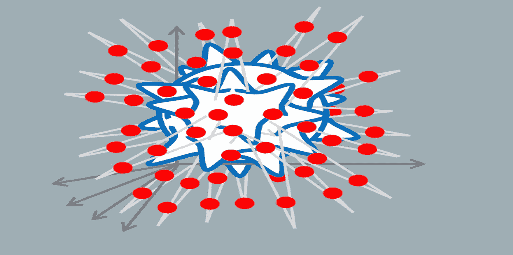
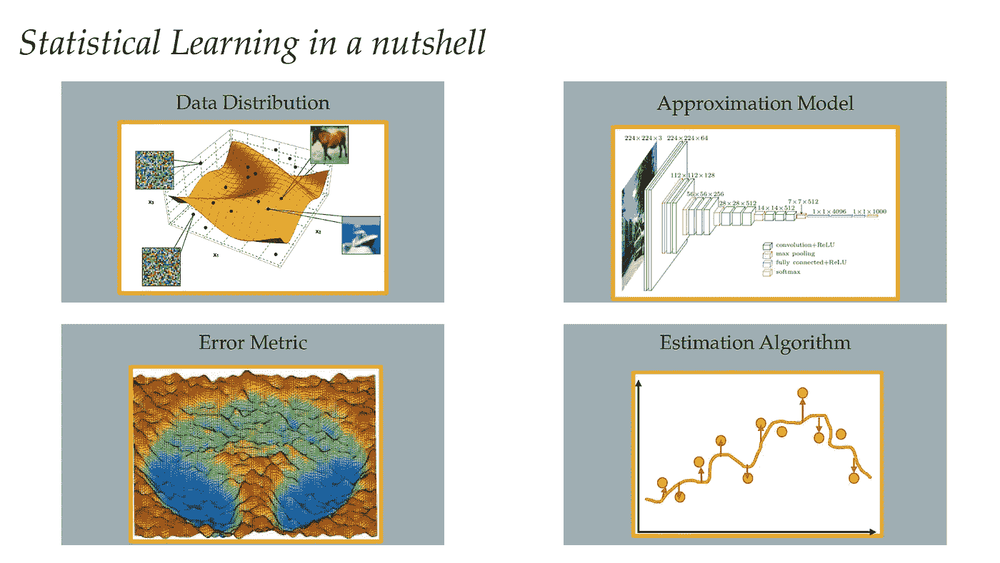
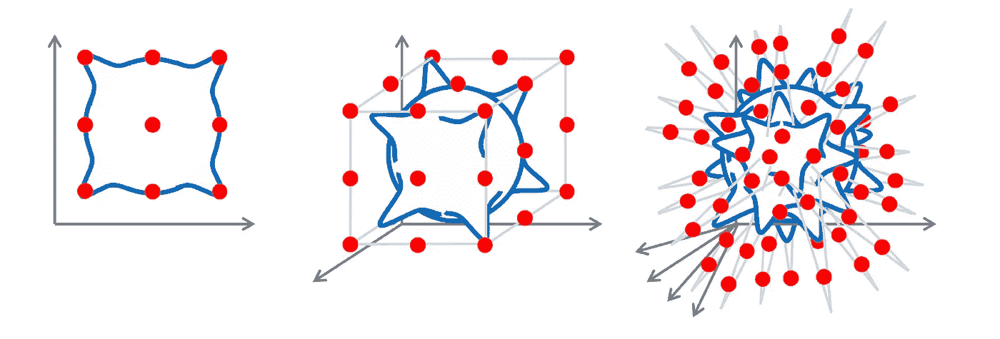
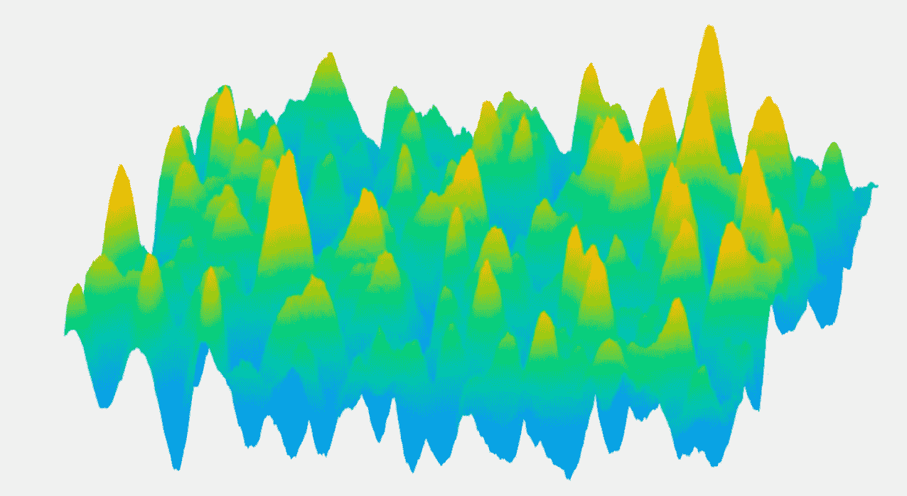
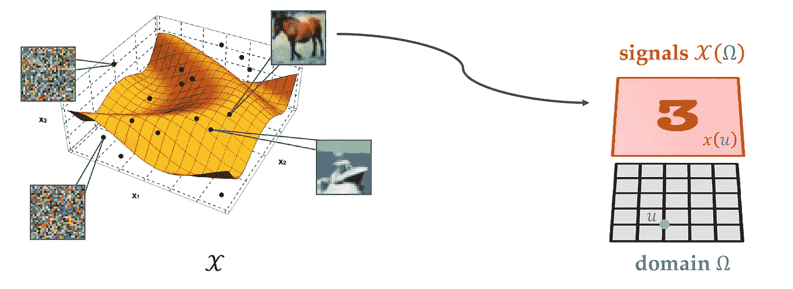

# 高维学习

> 原文：<https://towardsdatascience.com/high-dimensional-learning-ea6131785802>

## [几何深度学习](https://towardsdatascience.com/tagged/geometric-deep-learning)

## 维度的诅咒

*一系列博文，总结了 AMMI 计划的* [*几何深度学习(GDL)课程*](https://geometricdeeplearning.com/lectures/)*；* [*非洲机器智能硕士*](https://aimsammi.org/) *，授课老师* [*迈克尔·布朗斯坦*](https://scholar.google.com/citations?user=UU3N6-UAAAAJ&hl=en) *，* [*琼·布鲁纳*](https://cims.nyu.edu/~bruna/) *，* [*塔科·科恩*](https://tacocohen.wordpress.com/) *，以及*[佩塔尔·韦利奇科维奇](https://petar-v.com/)

解决现实世界问题最重要的需求之一是高维度学习。随着输入数据维数的增加，由于一些计算和统计问题，学习任务将变得更加困难。在本帖中，我们讨论*高维度学习*中的三个故事。首先，我们回顾一下*统计学习任务*中的一些基础知识。然后，我们提出*维度的诅咒*，它是如何发生和影响学习的。最后，我们介绍*几何域* *及其对输入数据的假设*。

维度的诅咒。图片来自 GDL 课程第二讲。

*本帖与*[*M . Elfatih Salah*](https://medium.com/@mmohamedkhair)*合著。另见我们的* [*上一篇*](/geometric-deep-learning-da09e7c17aa3) *关于 ML 的埃尔兰根方案。我们主要参考的是四位导师的*<https://arxiv.org/abs/2104.13478>**，以及* [*GDL 课程*](https://geometricdeeplearning.com/lectures/)*at*[*AMMI*](https://aimsammi.org/)*。**

*统计学习可以被定义为从可能的高维和有噪声的数据中提取信息的任务，以对看不见的数据给出一些性能保证。因为我们想在计算机上完成这项任务，基本上我们需要四种主要材料:*

*   **数据分布。**
*   **近似模型*:处理信息(线性回归、SVM、神经网络等)。*
*   **误差指标*:比较和选择模型。*
*   **估算算法*:我们可以在计算机上实现的一些程序，以找到估算值。*

*我们将在接下来的章节中讨论每种成分。*

**

*统计学习的四个要素。图片来自 GDL 课程第二讲。*

## ***数据分发***

*在监督学习中，会重点关注什么，考虑输入数据是一组 *N* 样本 ***，****𝒟*= {(*𝓍*ᵢ，* 𝓎 *ᵢ): i 从 1 到 n }***绘制 *i.i.d* 。从一个底层数据分布𝒫 **、、**定义过输入空间𝒳×输出空间𝒴.这个定义中的特征𝒳是一个高维空间**(*𝒳*=ℝᵈ).* 为简单起见，我们假设输出空间为***【ℝ】***(实数集)，标签𝓎来自未知函数 *f** 这样𝓎*ᵢ= f **𝓍*ᵢ)*因此 *f*:* 𝒳 *→ ℝ.******

****例如，在医学领域中，为了诊断乳腺癌，输入可以是组织学图像，具有确定它是良性还是恶性的分类输出。这类问题叫做*分类*。对于*回归*，也许在化学中，我们得到了一个分子，我们想预测它的激发能。****

****然而，正如我们也知道的，我们需要一些关于数据的假设来进行任何类型的 ML 分析，因为如果没有关于分布或目标的假设，我们将无法进行归纳。这些假设对于任何事情都是必不可少的，因此对于几何深度学习也是如此，我们将在后面看到。****

## ****近似模型****

****统计学习中的第二个要素是模型或假设类𝓕，它是从输入空间𝒳to 到输出空间 *ℝ* ，𝓕*⊂*{*f:*𝒳*→ℝ}的函数或映射的子集。*****

****假设类别的一些示例可能是:****

*   *****{ k 次以下的多项式}*****
*   *****{给定架构的神经网络}*****

****让我们也定义假设类𝓕 *、*上的复杂性度量γ ，它将像一个范数或非负量，我们可以在我们的假设中评估它以将其分为简单和复杂， *γ:* 𝓕 *→ ℝ₊.*或者简单来说，允许的函数集是否过大。****

****下面可以作为复杂性度量的例子:****

*   *****γ(f)可以是神经网络假设中的神经元数目。*****
*   *****或者也可以是预测器的规范。*****

> ****我们对复杂性度量感兴趣，因为我们想要控制我们的假设。否则，我们可能会陷入一个众所周知的问题，叫做过度拟合。****

## ****误差度量****

****误差度量(也称为损失函数)表示模型输出的质量。通常，我们有不同的模型，我们希望选择最好的一个，为此，我们使用误差度量。这取决于任务。在分类任务中，我们使用*精确度*，在回归中，我们使用*均方差*。在数学上，它被定义为从包含基本事实&的元组、模型输出 *(* 𝓎 *、f(*𝓍*)*到正实数 *ℝ₊.的映射𝓁*****

****损失函数是逐点测量(我们可以测量数据中每一点的损失)。所以我们需要考虑所有点的平均值。显然，在机器学习中有两个基本的平均概念，它们错综复杂地联系在一起；*总体平均值*和*经验平均值。* *总体平均*(我们也称之为*预期风险*)定义为逐点测量𝓁 *(* 𝓎 *，f(*𝓍*)*的数据的期望值，即我们在数据分布上平均能做得多好。数学上，给定损失函数𝓁、模型 *f* ，以及在输入空间𝒳×和输出空间𝒴上定义的底层数据分布𝒫 *、*，将*预期风险* 𝓡( *f* 定义为 follows:︁︁︁****

********

****人口流失。方程式:GDL 课程，第二讲——由作者编辑。****

****平均值的第二个概念是*培训损失*或*经验风险*。我们可以通过用经验预期代替上述等式中数据*的预期来推动这一损失。*****

********

****经验损失。方程式:GDL 课程，第二讲——由作者编辑。****

****事实上，在 ML 的所有方面，我们试图做的是最小化*总体误差*，但是我们无法获得这个误差，相反，我们使用*经验误差。*你可能会问这两个平均的概念是如何相互联系的。如果你用固定的 *f 来看*经验损失*，即如果我们固定*假设，它就是*I . I . d .*的平均值，因为每个𝓍 *ᵢ* 都是来自数据分布的*分布式 I . I . d .*。因此，通过一些基本的概率和统计，并且因为*经验损失*是取决于训练集的随机量，这个*损失*的期望将与*误差度量*的期望相同，这是*总体损失*的无偏估计量。****

***同样*，w* e 可以逐点计算方差，这只是通过将随机变量𝓍 *ᵢ* 组合成函数*f*数学上*，f* 或每个 *f* ∈ 𝓕，𝓡( *f̂* 是𝓡( *f* 的无偏估计量，方差𝜎 ( *f* 定义为:***

******

***逐点方差。方程式:GDL 课程，第二讲——由作者编辑。***

***然而，这种逐点方差界限在 ML 中不是很有用，因为训练和测试误差之间的关系我们不能使它逐点，因为假设*f* 依赖于训练集。所以我们需要做一些叫做*统一界限*的事情，例如 [*Rademacher 复杂度*](https://en.wikipedia.org/wiki/Rademacher_complexity) *。****

## ****估计算法****

***统计学习的最后一个要素是学习算法(或估计算法)。它被定义为从数据集𝒟 *= {(* 𝓍 *ᵢ，* 𝓎 *ᵢ): i from 1 to N}* 到从输入空间𝒳到输出空间𝒴.的函数简单来说，这是一个输出算法的算法！***

***我们将讨论一种流行的预测算法，称为*经验风险最小化(ERM)* 。因此，我们的目标是通过仅访问随机函数(*训练损失*或*经验风险*)来最小化确定性函数(*总体损失或预期风险)*)。如前所述，我们必须控制这两个功能之间的距离，其方式必须超越逐点控制。***

***让我们在假设𝓕 ***，*** 中定义一个半径为 *𝛿* 的球，其复杂性度量 *γ* ***，*** 为:***

******

***半径为*的球𝛿在* 𝓕.定义了一个更小的假设方程式:GDL 课程，第二讲。***

******

***半径为*的球𝛿在* 𝓕.定义了一个更小的假设图片:GDL 课程，第二讲——由作者编辑***

***换句话说，我们拥有所有可能的功能空间，例如，我们可以使用神经网络来实现这些功能，我们希望专注于那些复杂性较小的功能。由于我们在𝓕定义了一组半径为 *𝛿* 的较小假设，我们可以考虑一种称为*经验风险最小化*的算法或估计量(球中的函数恰好最小化*经验风险*)，或者以约束形式:***

******

***经验风险最小化(ERM)的约束形式。方程式:GDL 课程，第二讲。***

***联系到最优化，在实践中使用约束形式可能不容易。所以我们需要考虑另一种形式，比如**惩罚形式*和**插补形式*。在**惩罚形式中，我们引入了*拉格朗日乘数 *λ* ***，*** ，其中约束成为优化目标的一部分( *λ* 是控制正则化强度的超参数)。******

********

****机构风险管理的惩罚形式。方程式:GDL 课程，第二讲。****

****经验风险最小化的第二种形式是*插值形式*，这是一种非常自然的估计方法，由以下等式定义:****

********

****ERM 的插值形式。GDL 课程，第二讲。****

****经验风险为零意味着数据中每个点的逐点误差为零。通常，我们不希望在现实生活中这样做，因为数据包含噪声。****

# ****误差的基本分解****

****答在描述了监督学习中的四个主要因素后，由于我们的目标是最小化总体误差，目前，我们推导出该总体误差的各个组成部分。****

****设 *f̂* 为我们从学习算法(ERM)中得到的模型。然后，𝓡 *(f̂)* 将代表这个特定函数的人口损失。我们将从减去开始:****

********

****误差的基本分解。GDL 课程，第二讲。****

****棕色中的项是 ***总体的所有假设的下确界***；换句话说，在我们的假设中，𝓕.如果𝓕is 稠密，这一项将为零，即逼近几乎任意函数的能力 *(* [*)普适逼近定理*](https://en.wikipedia.org/wiki/Universal_approximation_theorem) *)* 。****

****然后，我们可以写:****

********

****误差的基本分解。GDL 课程，第二讲。****

****我们把绿颜色的术语 ***称为逼近误差***(*ε****ₐ****ₚₚ****【ᵣ】)***其中表明了较小假设的函数能多好地逼近地面真值函数。换句话说，我们可以用很小的复杂度多好地逼近目标函数 *f* ******* 。****

****因此，我们将上述等式简化为:****

********

****误差的基本分解。GDL 课程，第二讲。****

****此外，红色的术语可以写成:****

********

****误差的基本分解。GDL 课程，第二讲。****

****我们将蓝色项 ***称为优化误差***(*ε****ₒ****ₚₜ*)，它将群体目标与训练目标进行比较，从而衡量我们高效解决经验风险最小化(erm)的能力。****

****等式同一侧的其他项可以由下式限定:****

********

****误差的基本分解。GDL 课程，第二讲。****

****我们分解的最后一个成分(橙色的术语)是 ***统计误差***(*εₛₜ****ₐ****ₜ*)。该误差对真实函数(最佳函数)和随机函数(训练误差)之间球(半径为 *δ* )上的均匀波动不利。****

****最后，总体误差可以写成:****

********

****总体误差的四个组成部分。方程式:GDL 课程，第二讲。****

# ****高维学习的挑战****

****S 总结我们在上一节中推动的内容，我们将总体误差分解为四个部分，如下所示:****

*******1。总体假设的下确界。*******

****如在 ***，*** 之前提到的，如果𝓕是稠密的，这一项将为零，例如具有非多项式激活的神经网络。****

********

*****下确界超过所有假设的总体。* GDL 课程，第二讲。****

*******2。近似误差。*******

****近似误差是一个确定性函数，不依赖于训练数据的大小(样本数)。(如果假设空间使得目标函数具有小复杂度，则为小)。****

********

*****近似误差。方程式:* GDL 课程，第二讲。****

*******3。统计误差。*******

****该误差是一个随机函数，随着样本数量的增加而减小。(当假设空间可以被‘几个’小球覆盖时，小)。****

********

*****统计错误。方程式* ***:*** GDL 课程，第二讲。****

*******4。优化错误。*******

****当 ERM 可以被有效地解决时(就迭代复杂性而言)，规模较小。****

********

*****优化错误。方程* ***:*** GDL 课程，第二讲。****

****因为我们不能直接访问我们的总体误差，相反，我们使用上面定义的三种不同的误差作为它的上限(近似、统计和优化误差)。当最小化这些误差时，将保证最小化我们的真实目标(即总体误差)。这里的紧迫问题是，当数据存在于高维空间时，我们如何同时控制这些误差源？****

# ****维度的诅咒****

****维度的诅咒是由美国数学家理查德·贝尔曼在动态规划和最优化的背景下提出的，从那以后它几乎成了高维统计学习的同义词。我们担心维数灾难，因为学习的基本原理从根本上是基于插值的。例如，对于下图中的两类样本，很容易就从给定样本中插入每一类的架构达成一致，这将由学习算法来完成。****

********

****2d 空间中的大量样本。图片来自 GDL 课程第二讲。****

****因此，学习原理基于一个非常基本的性质，即我们可以根据经验密度和人口密度之间的接近程度来提取结构。问题是，这种学习原则在更高维度中受到了很大的影响。为了传达高维问题，让我们考虑下面的例子。****

****我们先定义一下*中*的类 *Lipschitz 函数*。****

> ****Lipschitz 函数是一个函数的假设，类似于初等基本正则性，只依赖于局部性。1-李普希茨函数 f:𝒳→ℝ；满足|f(𝓍f(𝓍)|≤||𝓍𝓍| |所有𝓍、𝓍 ∈ 𝒳.的函数****

****从这个定义出发，假设目标函数 *f** 为*1-李普希兹*，数据分布*𝜈* 为标准高斯分布。然后:****

> ****估计 f ******* 直到误差𝜖所需的样本数 n 为:n =θ(𝜖⁻**ᵈ**)，其中 d 为维数。(为了证明， [GDL 原型本](https://arxiv.org/abs/2104.13478)，第 2.2 节)。****

****很明显，样本数量在维度上呈指数增长，这表明随着输入维度的增加，**李普希茨类*增长过快。如果我们用一个全局平滑假设来替换*lip schitz 类*，比如*[*Sobolev 类*](https://www.jstor.org/stable/2160747) ，这种情况不会更好，我们将在下一节中看到。******

********

****维度的诅咒。图片来自 *GDL 原型书。*****

## ****近似诅咒****

****在解释了维度的诅咒之后，我们想要表明这个诅咒出现在许多其他的上下文中。例如，它也可以是一个纯粹的近似值。****

****让我们考虑一个只有一个隐藏层的神经网络模型，这类函数可以写成简单激活函数的线性组合。这个假设类有一个非常自然的复杂性概念，即隐藏层中神经元的数量。****

********

****浅层神经网络假设类(有一个隐藏层)。GDL 课程，第二讲。****

****有了 [*普适逼近定理*](https://en.wikipedia.org/wiki/Universal_approximation_theorem)*我们几乎可以利用这个假设类逼近任意函数。这里，关键的问题是，近似率是多少？如前所述，我们对在有限的 *δ* 下工作的近似误差感兴趣。我们想要控制复杂度，因此，我们想要查看整个假设空间上的近似和假设空间的具有较小复杂度的子集上的近似之间的差异。*因此，我们如何用少量的神经元来近似函数呢？******

****不幸的是，这些近似率也被诅咒了。如果我们以一个简单的函数类为例， [*索博列夫类*](https://www.jstor.org/stable/2160747) ，*f∈*ℋ*ˢ(s:f 的有限导数的个数)。*然后:****

********

****近似率在 Sobolev 类中是被诅咒的。来自 GDL 课程的方程式，第二讲。****

## ****优化中的诅咒****

****另一个诅咒也出现在高维学习中，优化中的维度诅咒。假设我们想找到下图中定义的景观的全局最小值。先验地，我们需要访问每一个可能的点并存储最小位置。换句话说，我们必须检查整个空间，评估每个可能的点，以确定最小的点。该过程在维度 (NP-hard)上具有*指数依赖性。这又是一个相同的故事，复杂性呈指数级增长。因此，*我们通常如何在实践中克服这种诅咒？******

******

***复杂的景观。图片来自 GDL 课程第二讲。***

***在许多 ML 问题中，场景比上面定义的更简单。就像下面这张图(*总有一条像样的路*)。用更数学的术语来说，我们关心的很多景观并没有很多*坏的局部极小值*；我们将在风景中停留的地方不是很大。这不像最坏的情况，我们有一个指数。如果我们能够实际理解为一个函数寻找*一个局部极小值*而不是寻找*一个全局极小值*的代价有多高，那么这个意义上的问题就简化了。***

******

***简单的风景。图片来自 GDL 课程第二讲。***

***实际上，很容易在高维中找到 *a* *局部最小值*，因为梯度下降可以高效地找到 *a 局部最小值*(就迭代复杂度而言)；维度中没有指数相关性。***

> ***[定理【金等 17】](https://arxiv.org/abs/1703.00887):含噪梯度下降在(β/ *ε* )次迭代中找到一个β-光滑函数的 *ε-* 近似二阶驻点。***

***然而，这种情况并不总是正确的，在 ML 中仍然有许多问题，其中假设*“没有坏的局部最小值”*不正确。***

## ***到目前为止的总结***

***到目前为止，我们已经讨论了维数灾难，以及当假设一个相当大的类，如 *Lipschitz 函数时，它如何出现在统计误差中。*相比之下，如果我们试图强加关于规律性的更强的假设来使问题变得更容易，例如考虑到*[*索博列夫类*](https://www.jstor.org/stable/2160747) ，近似误差将受到维度的诅咒。****

> ****因此，我们需要打破这种模式。因此，问题将是，*我们如何定义更适应的函数空间？*****

# ****走向几何函数空间****

****事实上我们数据中的每一个点都不仅仅是高维空间中的一个点。也可以认为*是一个信号*，其中每个点本身就是*的一个函数*。高维空间𝒳隐藏在*一个低维结构*中，这个*低维结构*可以是 2d 中的网格、组、球体、图形、网格等。我们将在后面的帖子中详细讨论这一点。****

********

****几何函数空间*:I*nput 数据中的每一点也是低维几何域上的信号。图片来自 GDL 课程第二讲。****

> ****这里的主要问题是，我们能不能利用这个几何域来找到一个新的正则性概念，用来克服我们刚刚在经典空间函数中讨论过的这些限制？****

****这个问题的答案是*几何深度学习(GDL)的主要目标之一，*你会在我们后续的帖子中看到。****

****在这篇文章中，我们讨论了统计学习任务，以及我们应该关注的三个主要错误。我们表明，由于维数灾难，没有假设，高维学习是不可能的，Lipschitz & Sobolev 类不是好的选择。最后，我们引入了*几何函数空间*，因为我们在高维空间中的点也是低维几何域上的*信号* *。在下一篇文章中，我们将看到这些*几何结构*如何被用来定义一个使用*不变性和对称性的新假设空间，*由*几何先验定义。******

## *****参考文献**:***

*   ***[GDL 课程](https://geometricdeeplearning.com/lectures/)，( [AMMI](https://aimsammi.org/) ，2021 年夏季)。***
*   ***j .布鲁纳的第二讲[ [视频](https://youtu.be/4RmpSvQ2LL0) | [幻灯片](https://bit.ly/3yB5A14)。***
*   ***米（meter 的缩写））m .布朗斯坦、j .布鲁纳、t .科恩和 p .韦利奇科维奇，[几何深度学习:网格、组、图形、测地线和量规](https://arxiv.org/abs/2104.13478) (2021)。***
*   ***F.巴赫，[从第一原理中学习理论](https://www.di.ens.fr/~fbach/ltfp_book.pdf) (2021)。***

***我们感谢 Rami Ahmed 对草案提出的宝贵意见。***