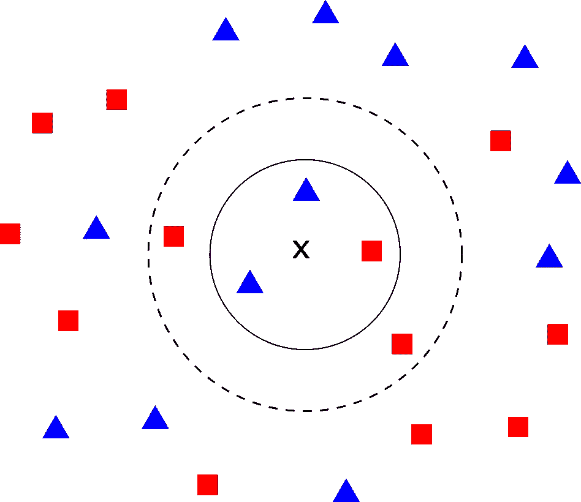

# 智人——KNN 分类器

> 原文：<https://towardsdatascience.com/homo-sapiens-the-knn-classifier-92261023249a>

## 我们的决策是如何受 KNN 方法支配的

Sylas Boesten 在 [Unsplash](https://unsplash.com/s/photos/human?utm_source=unsplash&utm_medium=referral&utm_content=creditCopyText) 上的照片

K 近邻(KNN)法可能是最直观的分类算法，实际上我们每天都在使用它。简而言之，它可以用众所周知的谚语来描述，如

> 物以类聚，人以群分

或者

> 你就是你交往的人

这篇文章将简要概述 KNN 分类器是如何工作的，以及为什么我觉得它很好地描述了某些人类行为？

## KNN 分类器的技术方面

KNN 算法根据数据点的周围环境(它们的“最近邻居”)为数据点分配类别。下图用三个简单的几何图形示意性地说明了它的工作原理。如果基于三个最近的邻居(整个圆的内部)做出决定，则 X 点被分类为三角形。然而，将该模型扩展到五个最近的邻居(虚线圆的内部)会产生一个正方形作为估计值。

KNN 分类器是如何工作的？图片作者。

如果你对更多的技术细节和如何在 R 中实现算法感兴趣，请查看我早先的帖子。如果没有，继续读下去，因为这个简单的解释是我们理解 KNN 算法如何与人相关所需要知道的。

  

## 培训、验证、测试、开始！

为了理解下面的讨论，我将首先简要回顾一下**训练**、**验证**和**测试**数据集的定义。训练集用于拟合我们的模型，验证集用于调整模型超参数，测试集用于查看它在一些以前未见过的数据上的表现。在 KNN 分类器的情况下，没有实际的训练发生-该模型仅包含来自训练集的原始数据，该训练集稍后用于找到最佳超参数值。

KNN 分类器的超参数是什么？它是 K，邻居的数量。我们使用验证集来找到产生最佳可能分类结果的最佳数量的邻居。接下来，来自测试集的未知数据被用于提供我们的模型在先前未知的环境中工作得如何的度量。如果我们对结果满意，我们的模型就可以开始了！

## 人和 KNN 的量词有什么相似之处？

现在我们可以开始实际的比较了。这套训练装备是在我们成长过程中提供给我们的。每次我们遇到一个新的人，我们用我们的感官收集他们的特征，然后将他们归类。一旦我们长大了，我们就用这些数据来让自己在这个世界上立足。当然，在这个过程中有很多尝试和错误。这是因为，在机器学习的语言中，我们正在调整我们的超参数。例如，我们可以从非常高或非常低的 K 开始，即，我们将比较新认识的人的特征与过去许多相似的人的特征，或者只是最相似的(K = 1)。不可能有先验的最佳值，因为最佳解决方案将高度依赖于社会结构的复杂性。综上所述，我们正在认识很多新的人，并试图根据我们以前的经验对他们进行分类。以这种方式，我们使用它们作为验证集，以便为我们的环境选择最佳 K。

一旦我们对我们的模型有了信心，我们的目标就是走出去，在没有能力验证它是否正确的情况下，尝试将人们划分到某些群体中。如果我们的模型得到很好的调整，它可以成为一个很好的工具，因为它允许我们快速评估一个人，并决定下一步的行动。然而，这种方法自然也会导致一些错误。

## 傲慢与偏见

我们之前已经说过，KNN 模型在训练期间实际上不做任何工作，因为它只存储数据点。这就是为什么它经常被称为**懒惰**模型。这对人类来说非常适用，因为我们在评判一个人的时候通常同样懒惰。我们不是给一个人时间去了解他们，而是经常当场评判他们，如果我们不喜欢我们所看到的，我们只是继续前进。KNN 分类器没有第二次猜测。你要么属于某一类，要么不属于。虽然这种简单快速的方法的进化优势显而易见，但它也可能导致误判。在我看来，这种与 KNN 分类器的相似性是我们人类如此倾向于偏见推理的核心原因。

如果训练集不再代表测试集，就会出现另一个潜在的陷阱。发生这种情况的原因有很多，比如搬到另一个城市/国家，或者换工作。当这种情况发生时，我们的模型的准确性将大大降低。如果我们太骄傲，拒绝放弃旧的模式，创造新的模式，我们会很快与周围的人发生冲突。

## 结束语

这个简短的意见仅仅是，我的意见。当然，事情从来没有这么简单，虽然有很多差异，但我认为 KNN 算法很好地描述了我们的原始反射。我认为这种相似性很诱人，决定写这篇文章，因为它为我打开了一个不同的视角。希望你也觉得同样有趣！