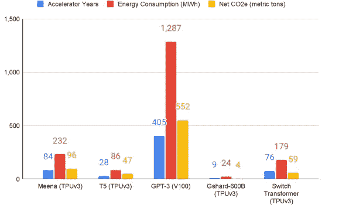
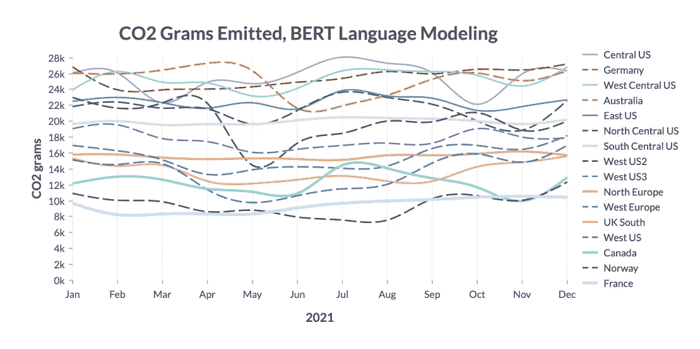

# 人工智能如何加剧全球变暖

> 原文：<https://towardsdatascience.com/how-ai-could-fuel-global-warming-8f6e1dda6711>

## 新的大型模型是能源密集型的。他们的训练需要多少二氧化碳？

作者使用 [DALL-E](https://openai.com/dall-e-2/) 制作的图像

数据和云不是虚拟技术。他们需要昂贵的基础设施和电力。训练人工智能模型也是如此。研究人员预测，未来他们的排放量可能会远远超过预期。简短的概述

**谁不让我们整夜安眠？**

几周前，英国打破了[气温记录](https://www.metoffice.gov.uk/about-us/press-office/news/weather-and-climate/2022/red-extreme-heat-warning-ud)，气温首次超过 40 摄氏度。夏夜温暖潮湿，在类似的日子里很难入睡。到目前为止，这是第五个最热的年份，但是其他四个都在同一十年内(可能我们会记得今年夏天是最冷的一年)。毫无疑问，年复一年，我们面临着更高的温度，这种趋势也被定义为全球变暖的一部分。全球变暖不仅意味着夏季变暖，还意味着极端事件[的增加](https://www.nationalacademies.org/based-on-science/climate-change-global-warming-is-contributing-to-extreme-weather-events)(如[飓风](https://climate.nasa.gov/news/3184/a-force-of-nature-hurricanes-in-a-changing-climate/)、[龙卷风](https://education.nationalgeographic.org/resource/tornadoes-and-climate-change)、[干旱](https://climate.nasa.gov/news/3117/drought-makes-its-home-on-the-range/)、[森林火灾](https://www.bbc.com/news/science-environment-51742646)等等)。

谁是罪魁祸首？由一个碳原子和两个氧原子组成的小分子，通常被称为二氧化碳或 co2。还有其他温室气体，但是二氧化碳仍然是最重要的一种。下图显示了二氧化碳在过去两个世纪中是如何呈指数增长的。

该图比较了大气中的二氧化碳(蓝色)和人类活动产生的二氧化碳(灰色)。图片来源:[此处](https://www.climate.gov/news-features/understanding-climate/climate-change-atmospheric-carbon-dioxide)

简而言之，二氧化碳增加得越多，照射到地球的太阳辐射的红外成分保留的部分就越多。这些额外的能量使地球变暖。谁产生二氧化碳？

人类及其所有活动。撇开我们通过吸入呼出二氧化碳的事实不谈，能量的消耗导致了二氧化碳的产生。汽车和飞机旅行、商业、畜牧场等等都会向大气中释放二氧化碳。

也有一些东西会产生大量的二氧化碳，但鲜为人知。数据。

**云是由二氧化碳构成的**

数据看起来是虚拟对象，几乎是形而上的实体，但它们需要被存储、处理和传输，这就需要基础设施。例如，当你在云端保存一些文件时，它们必须穿过数千公里的光缆才能到达数据中心。全球有数以千计的数据中心，但本质上它们是装满大量硬盘的建筑。这些硬盘持续活动，并产生热量。

> "你的储物空间越大，你积累的东西就越多。"—亚历克西斯·斯图尔特

存储在云中的 1gb 的估计成本是[7 千瓦时](https://medium.com/stanford-magazine/carbon-and-the-cloud-d6f481b79dfe)(不超过一百张高分辨率照片)。我们每天生产 [2.5 万亿字节](https://cloudtweaks.com/2015/03/how-much-data-is-produced-every-day/) (2.5 后跟 18 个零)。如果不算一下，储存起来会很多，而且在这个过程中会产生大量的二氧化碳。事实上，据预测，通信行业的产量将很快超过汽车、航空和能源行业的总和。

由作者用 [Dall-E](https://openai.com/dall-e-2/) 生成的图像(并在[unsplash.com](https://unsplash.com/)使用来自 [C Dustin](https://unsplash.com/@dianamia) 的此图像)

事实上，今天大约有[800 万个数据中心](https://www.datacenterknowledge.com/industry-perspectives/data-center-dilemma-our-data-destroying-environment)(2012 年有 800，000 个)，这表明我们正在以多大的速度增加数据的生产和存储。一些模型预测，到 2030 年，超过 10 %的全球电力供应将专用于数据中心。这些预测只考虑了存储数据所需的能量消耗，但是数据在互联网上传输也是消耗能量的。

许多研究人员正在关注[我们如何减少数据存储对环境的影响](https://www.unsustainablemagazine.com/environmental-impact-of-data-storage/)。然而，数据不仅被存储。事实上，当你有如此多的可用数据时，你可以用它来训练一个非常大的模型。那么问题来了:人工智能消耗了多少？

**(人工)智能吞噬能量来维持自身**

人脑是地球上进化得最复杂的东西之一。它的复杂性使我们能够在抽象推理、科学和艺术之间徘徊。如果拥有如此发达的大脑是一种进化优势，为什么大多数物种的神经元要少得多？一个答案是因为成本高；仅人脑就消耗了人体全部能量的 20-30%。对一个器官来说不便宜。

图片由作者使用 [DALL-E 2](https://openai.com/dall-e-2/)

我们可以怀疑人工智能也在做同样的事情:消耗大量的能量来做所有的计算。这个问题变得越来越重要，因为现在几乎所有公司都在投资机器学习。那么，AI 到底在消耗多少呢？

在关于该主题的第一批作品之一中，艾玛·斯特鲁贝尔计算出，使用[神经架构搜索](https://en.wikipedia.org/wiki/Neural_architecture_search)训练的[变压器模型](https://blogs.nvidia.com/blog/2022/03/25/what-is-a-transformer-model/)将相当于五辆汽车在其一生中的二氧化碳排放量(2019 年论文链接是[这里是](https://arxiv.org/pdf/1906.02243.pdf))。在连续的[文章](https://arxiv.org/ftp/arxiv/papers/2104/2104.10350.pdf)中，帕特森扩展了对不同流行模型架构( [T5](https://ai.googleblog.com/2020/02/exploring-transfer-learning-with-t5.html) 、[伯特](https://en.wikipedia.org/wiki/BERT_(language_model))、 [GPT-3](https://openai.com/api/) )的分析，比较了他们的培训成本和碳足迹。

不同模型训练的能耗和二氧化碳生成量(图片来源:[此处](https://arxiv.org/ftp/arxiv/papers/2104/2104.10350.pdf))

在文章中，Patterson 展示了计算模型的能量成本需要考虑多少因素(加速器、[优化方法](https://analyticsindiamag.com/optimisation-machine-learning-methods-gradient-descent/)、训练集的维度、[超参数的数量](/what-are-hyperparameters-and-how-to-tune-the-hyperparameters-in-a-deep-neural-network-d0604917584a)等等)。在文章中，他们将训练成本比作喷气式飞机的排放，考虑到新模型有更多的超参数，并且训练数据集的大小也在增加，这令人担忧。

在文章中，他们还强调了其他有趣的点:地理位置和基础设施很重要(使用或不使用云)。现在，有许多服务提供了在云上训练模型的可能性(Azure、AWS 等等)。事实上，对于一家小公司来说，在云上训练一个模型比购买一堆昂贵的 GPU 和设置内部基础设施更容易。由于这是一个越来越受欢迎的选择，不同的研究人员在[云实例](https://arxiv.org/pdf/2206.05229.pdf)中研究了人工智能的碳强度。

事实证明，位置仍然很重要，即使是在使用云的时候。在他们的工作中，他们监测了在[微软 Azure](https://azure.microsoft.com/fr-fr/) 上的 11 种算法(从语言模型到视觉算法)的训练，并监测了不同地点的电网电力。差异是巨大的，表明在美国数据中心进行培训产生的排放是在挪威进行的相同培训的两倍。

不同地点训练 BERT 的 CO2 排放。图片来源([此处](https://arxiv.org/abs/2206.05229))

> “效率最高的地区产生了效率最低地区三分之一的排放量”——杰西·道奇，合著者之一，对 [Nature](https://www.nature.com/articles/d41586-022-01983-7) 说

此外，当你训练时，你的模型也在改变你的碳足迹。例如，在华盛顿白天训练模型时，能量来自燃气发电站，而在晚上，能量由水力发电产生。

> “团队只完成了变形金刚训练过程的 13%;道奇说，完全训练它将产生“相当于燃烧一整节装满煤的火车的数量级”的排放。(来源:[自然](https://www.nature.com/articles/d41586-022-01983-7))

**结论和观点**

对于许多中小型公司来说，云将是训练人工智能模型的首选。然而，在全球变暖效应越来越明显的时刻，云和 AI 模型正在增加碳足迹。因此，我们需要考虑如何减少这两种技术的影响。

公司需要投资减少能源的影响。正如研究人员所建议的那样，第一步是在云上训练人工智能时，选择和使用碳足迹最低的数据中心的可能性。此外，当能源需求较低或数据中心由[绿色能源](https://www.twi-global.com/technical-knowledge/faqs/what-is-green-energy)供电时，培训应灵活安排。

> “我们现在应对气候变化做得越少，未来的监管就会越多。”—比尔·奈

由于人工智能市场规模预计将从 2022 年到 2030 年以 38.1%的复合年增长率(CAGR)在[扩张](https://www.grandviewresearch.com/industry-analysis/artificial-intelligence-ai-market)，我们应该尽快解决其能源消耗问题。好消息是，公司和研究人员已经意识到这个问题，并正在努力解决。此外，还有一项制度性努力，即考虑将绿色能源用于培训(如[布鲁姆模型](https://pub.towardsai.net/a-new-bloom-in-ai-why-the-bloom-model-can-be-a-gamechanger-380a15b1fba7))。最后，人工智能模型也有利于优化能源消耗和控制二氧化碳排放。

**附加资源**

*   如果你有兴趣通过训练深度学习模型来跟踪或预测能源消耗和/或碳足迹，你可以尝试: **carbontracker** ( [文章](https://arxiv.org/pdf/2007.03051.pdf)，[资源库](https://github.com/lfwa/carbontracker))， **codecarbon** ( [网站](https://codecarbon.io/)， [GitHub 资源库](https://github.com/mlco2/codecarbon)，[文档](https://mlco2.github.io/codecarbon/))， **ML CO2 影响**(网站)，或者 **EnergyVis**

# 如果你觉得有趣:

你可以寻找我的其他文章，你也可以 [**订阅**](https://salvatore-raieli.medium.com/subscribe) 在我发表文章时得到通知，你也可以在**[**LinkedIn**](https://www.linkedin.com/in/salvatore-raieli/)**上连接或联系我。**感谢您的支持！**

**这是我的 Github 知识库的链接，我计划在这里收集代码和许多与机器学习、人工智能等相关的资源。**

** [## GitHub - SalvatoreRa/tutorial:关于机器学习、人工智能、数据科学的教程…

### 关于机器学习、人工智能、数据科学的教程，包括数学解释和可重复使用的代码(python…

github.com](https://github.com/SalvatoreRa/tutorial)**