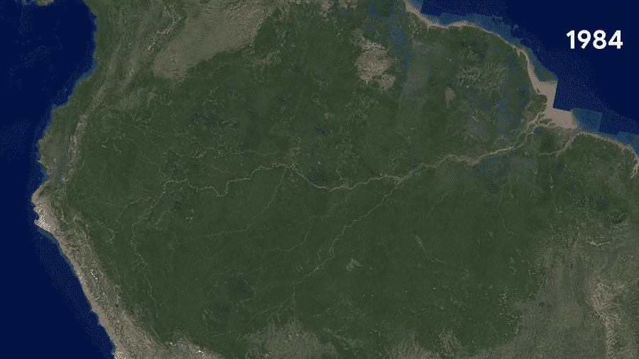
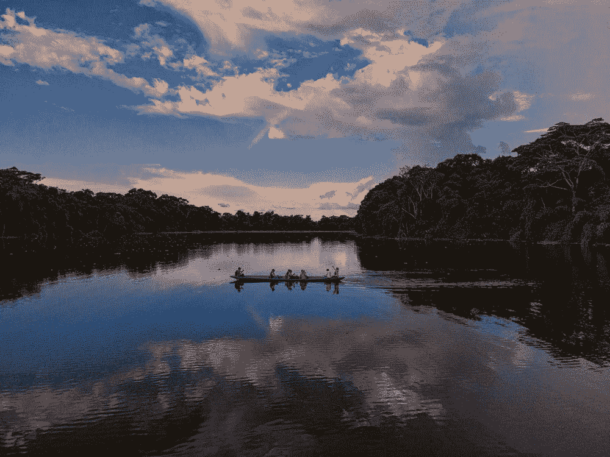
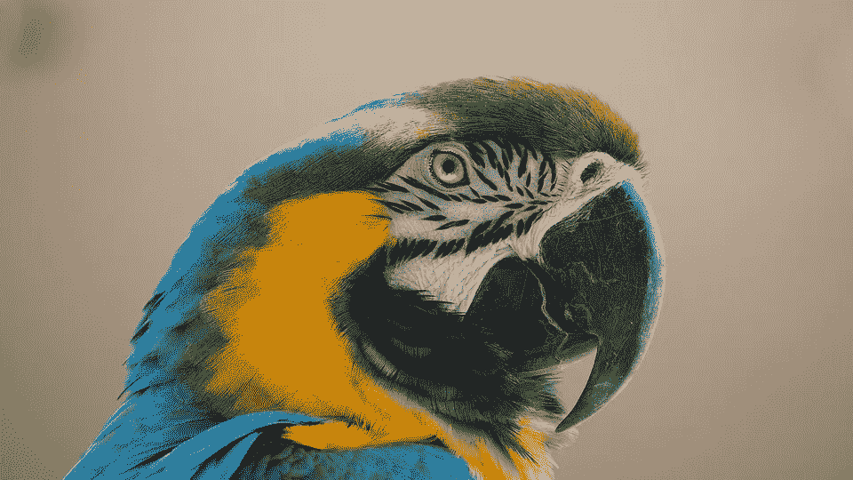

# 人工智能如何拯救亚马逊雨林

> 原文：<https://towardsdatascience.com/how-artificial-intelligence-could-save-the-amazon-rainforest-688fa505c455>

## 亚马逊正处于危险之中，人工智能可以帮助保护它

图片由曼迪·崔在 unsplash.com 拍摄

毒贩、淘金者、伐木工、农民和牧场主正在入侵亚马逊雨林。疫情和博尔索纳罗担任总统加剧了本已暗淡的局势。科学和人工智能如何帮助拯救最基本的雨林？

# **地球的绿肺**

图片来自 unsplash.com[的迭戈·古兹曼](https://unsplash.com/@entrycube)

亚马逊雨林覆盖 500 万公里的雨林，其中大部分位于巴西(60 %)、秘鲁和哥伦比亚。要理解它的重要性，亚马逊雨林代表了现存雨林的 50 %，是最复杂和多样的生物群落之一。亚马逊雨林不仅是数千种不同植物和动物的家园，还居住着 3000 万人(其中 9 %是土著)。

根据一些假说，亚马逊森林开始形成于 5000 万到 3000 万年前。然后，森林慢慢地生长，并蔓延到整个大陆，占据了很大一部分。此外，这是一个复杂而微妙的生态系统。例如，来自撒哈拉沙漠的风通过替换一年中被降雨冲走的磷来肥沃森林。

大约 11000 年前，人类开始在森林中居住。即使在今天，我们对亚马逊地区的人类历史也知之甚少，以至于直到最近才发现了大量的前哥伦布文明的象形文字。

左侧面板是亚马逊雨林的地图，中间面板是哥伦比亚的森林，右侧面板是森林的鸟瞰图。图片来自维基百科(来源:[此处](https://en.wikipedia.org/wiki/Amazon_rainforest))

尽管亚马逊雨林很重要，但它也濒临灭绝。2018 年，估计有 17 %的森林被砍伐。一些研究表明，达到 25 %的森林砍伐将导致灾难性的影响:森林转变为非森林生态系统(一种退化的大草原)。

图片来自维基百科(来源:[此处](https://en.wikipedia.org/wiki/Amazon_rainforest))

非法砍伐森林在 21 世纪初有所下降，然后在 2015 年左右再次上升，在博尔索纳罗担任总统期间，情况急剧恶化。

可以确定几个原因，其中主要有:

*   畜牧业是砍伐森林的主要原因之一。牧民和从事畜牧业的公司经常放火，为放牧牛群腾出空间。
*   农业是森林砍伐的另一个重要原因，农作物要么被用作动物饲料、生物燃料、咖啡等。此外，由于大豆价格上涨，为了腾出土地种植大豆，砍伐森林的行为增加了。
*   伐木是另一个重要原因，具有讽刺意味的是，你砍伐的森林越多，该地区的降雨量就越少，伐木产量也就越低。
*   火灾也是一个越来越重要的原因。在这方面，2019 年是可怕的一年，有 1345 平方公里被烧毁。
*   [非法采矿](https://www.nature.com/articles/d41586-021-02644-x)，不仅导致森林砍伐，还导致环境的重金属污染。
*   贩毒、毒枭和准军事组织经常渗透到森林中，种植古柯和其他非法植物。

左图，为了养牛而砍伐森林。中央面板，秘鲁亚马逊地区的非法采矿。右图:哥伦比亚的森林砍伐。图片来源:维基百科([此处](https://en.wikipedia.org/wiki/Deforestation_of_the_Amazon_rainforest))

砍伐森林对生物多样性有影响，习性的丧失事实上是许多已知物种灭绝的主要原因。此外，达到[临界点](https://www.nature.com/articles/d41586-020-00508-4)可能会导致大规模的荒漠化，这将带来大规模的灭绝。

砍伐森林也会对气候产生影响。亚马逊雨林吸收大量二氧化碳，调节巴西的温度(它的损失将导致该国气温上升近两度)。此外，这将导致水资源的损失、农业产量和电力(水力发电)的急剧下降。

此外，森林是许多土著部落的家园，他们依靠森林获取食物、住所、水、纤维和药物。非法伐木工和矿工往往对针对土著人民的令人发指的罪行负有责任。虽然多年来通过了保护他们的法律，但博尔索纳罗总统反而减少了这些保护。

图片来自 unsplash.com 的[伊藤](https://unsplash.com/@kiyoshi_jpg)

那么，为什么很难阻止亚马逊森林的砍伐呢？与此同时，过去几年一直是完美的风暴:政治气候给人一种有罪不罚的感觉，疫情减缓了监测计划和转移注意力。

此外，亚马逊雨林非常广阔，难以到达，而且监测费用昂贵。分析从卫星上获得的海量数据是困难和费力的，尤其是对人来说。无人机和其他传感器的使用将增加更多的数据。那么科学和人工智能能有什么帮助呢？

# **科学和人工智能在帮助森林**

图片由 [JakeWilliamHeckey](https://pixabay.com/it/users/jakewilliamheckey-2245434/) 在 pixabay 拍摄

让我们明确一点，保卫亚马逊的最佳方式是通过政治选择。事实上，巴西政府在博尔索纳罗总统任期内放松监管和控制导致了创纪录的森林砍伐。此外，外国公民和公司做出的选择也会产生影响。例如，当嘉吉公司决定停止购买亚马逊新砍伐地区生产的大豆时，用于种植大豆的森林砍伐量急剧下降。**在这篇文章中，重点是理解科学和智慧如何帮助保护亚马逊雨林。**

> “人工智能不是魔杖。它无法独自拯救地球。但是人类可以”——N . iels wiela ard，Satelligence 的首席执行官

与此同时，科学家的视野发生了范式转变。直到几年前，人们的想法是保护森林(并防止全球变暖)，今天人们意识到保护也包括保护亚马逊的土著人民。土著社区、科学家、技术和当局终于朝着一个共同的目标走到了一起。

> “政府没有足够的资源在这片土地上巡逻，”阿德里安·福赛思对《自然》杂志说，他指的是秘鲁亚马逊森林

阿德里安·福塞斯(Adrian Forsyth)提出了一个将森林转变为“智能森林”的项目:插入麦克风、相机和无人机等设备，然后用人工智能分析数据。目的是远程监控森林，以免打扰土著居民。事实上，尽管优先考虑保护森林，但必须避免必要的接触:许多部落对各种病原体没有防御能力，因为他们从未接触过。

图片由 [eismannhans](https://pixabay.com/it/users/eismannhans-5686/) 在 pixabay 拍摄

卫星图像分析现在是普遍做法。事实上，多年来已经积累了成千上万的图像，使得人们有可能随着时间的推移跟踪一个地方是如何演变的。对 36 年卫星图像的分析显示，尽管该地区在技术上受法律保护，但在博尔索纳罗担任总统期间，非法采矿活动激增。

一方面，我们现在确实有很多图像，另一方面，分析这些图像的人工智能算法越来越复杂。但这些分析只是回顾过去的情况。无人机、摄像机和麦克风可以实现实时监控，甚至干预的可能性，从而阻止非法活动。

> 对森林的破坏占每年所有温室气体排放的近五分之一。在热带雨林，随着猖獗的伐木业，森林砍伐的速度加快了——高达 90%的砍伐是非法的，而且是在雷达下进行的。—首席执行官雨林([来源](https://www.blog.google/technology/ai/fight-against-illegal-deforestation-tensorflow/)

例如，非营利组织[雨林连接](https://www.blog.google/technology/ai/fight-against-illegal-deforestation-tensorflow/) (RFCx)在森林里使用回收手机记录非法活动的声音。该系统使用算法来识别噪音，如使用链锯(伐木)、偷猎动物(摩托车)和走私毒品(卡车、车辆)，然后通知护林员。声学系统还被用于监测野生动物、濒危鸟类的鸣叫等

将人工智能与众包等项目联系起来已被证明是成功的:全球森林观察(GFH)是一个在线平台，在志愿者的帮助下记录图像，这使得算法更加可靠。这些算法然后被用来计算树木，识别非法采矿区，并警告当局对森林的威胁。

事实上，通过使用卫星图像和雷达数据，人工智能能够实现接近树木的分辨率。人工智能可以用于研究生物多样性如何演变，哪些物种濒临灭绝，通过模拟研究潜在的解决方案等。

图片由 SpaceX 公司在 unsplash.com 拍摄

人工智能算法允许快速分析大量数据。事实上，有几个项目将这些算法与基于云的计算机相结合。例如，MapBiomas 是一个创建森林历史地图的项目，使研究其演变和绘制我们仍然知之甚少的森林成为可能。

此外，机器学习算法可以预测哪里可能发生森林砍伐。事实上，土著代理人使用带有 GPS 和复杂人工智能工具的无人机来预测对他们土地的入侵([该算法由微软和 Imazon](https://www.positive.news/environment/how-ai-is-helping-to-save-the-amazon/) 开发)。考虑到威胁的数量和已经被破坏的区域，这些算法也被用作一个系统来研究干预措施，预测新的威胁，并排列优先级。

如今算法的广泛使用使得协会更容易调查公司是否在反对砍伐森林的承诺上撒谎(包括公司本身和供应链层面)。这使得有可能发起已被证明有效的压力运动。

算法也有助于提高可再生能源的使用和生产。亚马逊流域有 1 [77 座水电站，184 座](https://www.nature.com/immersive/d41586-022-03043-6/index.html)正在规划中。这些基础设施不仅导致森林砍伐，而且往往与进一步增加对森林破坏的活动相关联。

图片由 unsplash.com 的[德里克·奥扬](https://unsplash.com/@goosegrease)拍摄

其他正在研究的技术是使用红外线来远程绘制土著人的地图，或者使用带激光的飞机来绘制 3D 森林地图。

例如，不仅有图像和传感器，还有大量关于森林的报告和文件。近年来自然语言处理的迅猛发展使得有效地分析文本成为可能。正在研究关于亚马逊文件的类似项目。伯克利大学希望将这种方法应用于报告、现场笔记、日志、生物标本、通信和人工制品等数据。

# **离别的思念**

图片由[pixendfertig](https://pixabay.com/it/users/pixundfertig-683277/)在 pixabay 拍摄

过去几年对亚马逊雨林来说是戏剧性的。博尔索纳罗总统放宽了伐木规定，鼓励森林开发，对土著人民的权利不感兴趣。疫情做了剩下的事情，转移了国际社会的注意力，使当局的努力变得困难，并杀害了传统上保卫森林的土著人民。

亚马逊雨林是一个复杂、富饶，但不幸的是，比人们想象的更敏感的环境。失去这样一个生态系统将是毁灭性的，无论是对当地还是全球。

AI 不是银弹，如果没有当局的支持、明确的政策、法律的执行和国际协调，它就不会有真正的影响。事实上，如果不采取有效措施，实时监控或预测风险区域将毫无意义。

另一方面，在巴西上一任总统期间，民主机构不断受到攻击，政客们对土著居民进行威胁。此外，其他邻国的政治也不稳定，哥伦比亚和秘鲁都有一段麻烦的历史，这些项目都与当前的政治气候有关。森林监测，所有可以用人工智能提取的信息都可以作为大规模监控、滥用和土地入侵的武器。

> “政府缺乏稳定性是我们测试和部署这类技术的一大障碍”——Forsyth([source](https://www.nature.com/immersive/d41586-022-03043-6/index.html))

然而，这些工具真的很有效，例如雨林项目已经确定了一万个风险区域，其他项目也显示出了具体的结果。

微软、英伟达、谷歌和其他公司正在研究帮助参与砍伐森林的协会的计划。今年，气候也回到了国际辩论的中心。此外，随着疫情成为过去，公众舆论也开始关注气候变化。所有这些都给我们带来了对美好未来的希望

# 如果你觉得有趣:

你可以寻找我的其他文章，你也可以 [**订阅**](https://salvatore-raieli.medium.com/subscribe) 在我发表文章时得到通知，你也可以在**[**LinkedIn**](https://www.linkedin.com/in/salvatore-raieli/)**上连接或联系我。**感谢您的支持！**

**这是我的 GitHub 知识库的链接，我计划在这里收集代码和许多与机器学习、人工智能等相关的资源。**

**<https://github.com/SalvatoreRa/tutorial>  

或者随意查看我在 Medium 上的其他文章:

<https://medium.com/mlearning-ai/nobel-prize-cyberpunk-e1803aa0e087>  </machine-learning-to-tackle-climate-change-7911e004c3a2>  </machine-unlearning-the-duty-of-forgetting-3666e5b9f6e5>  </how-science-contribution-has-become-a-toxic-environment-6beb382cebcd> **