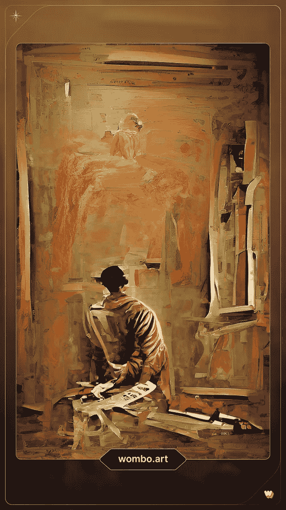
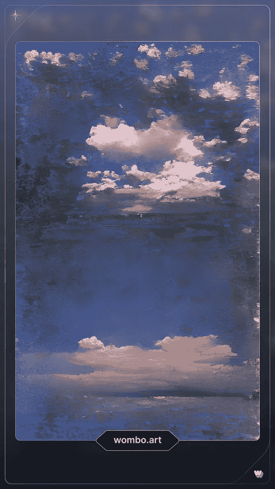
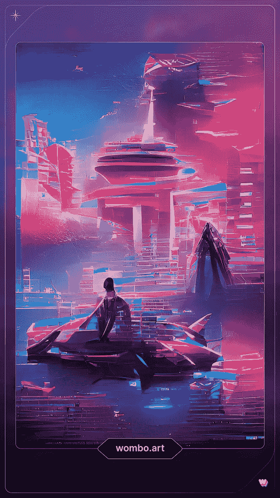
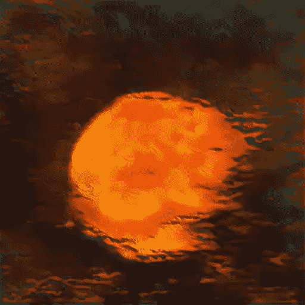
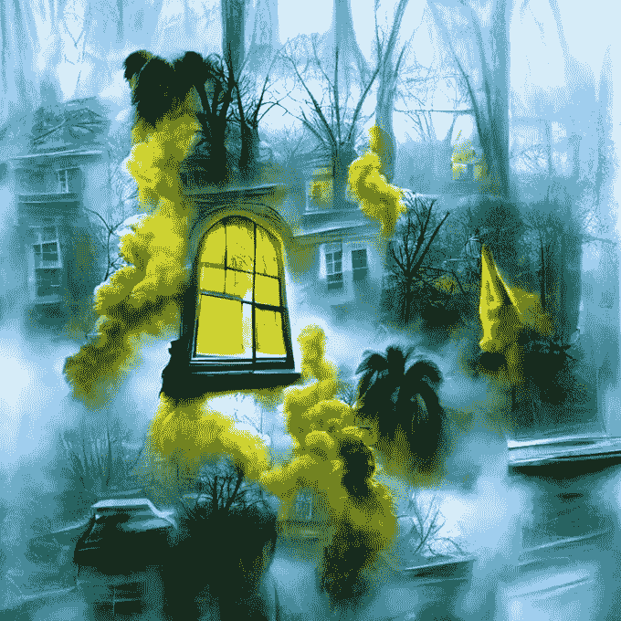
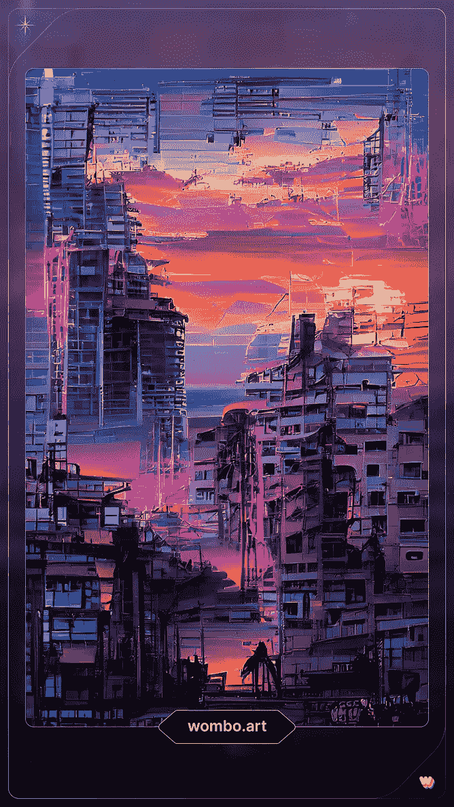
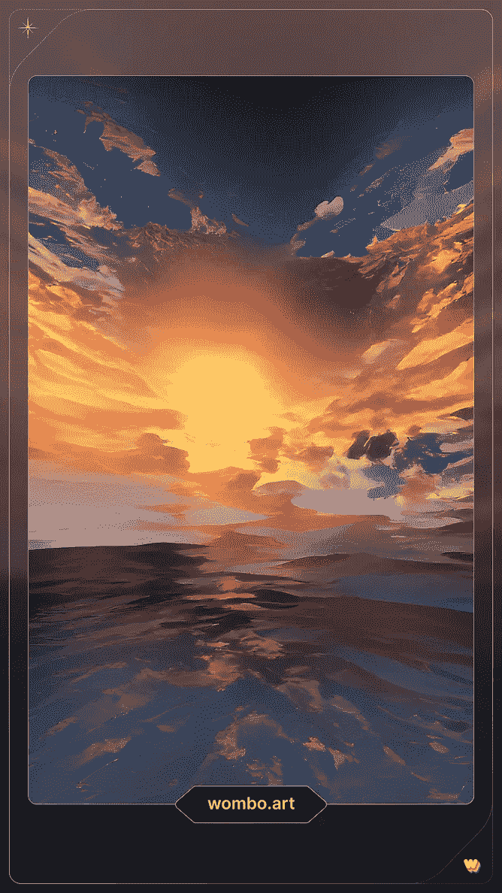
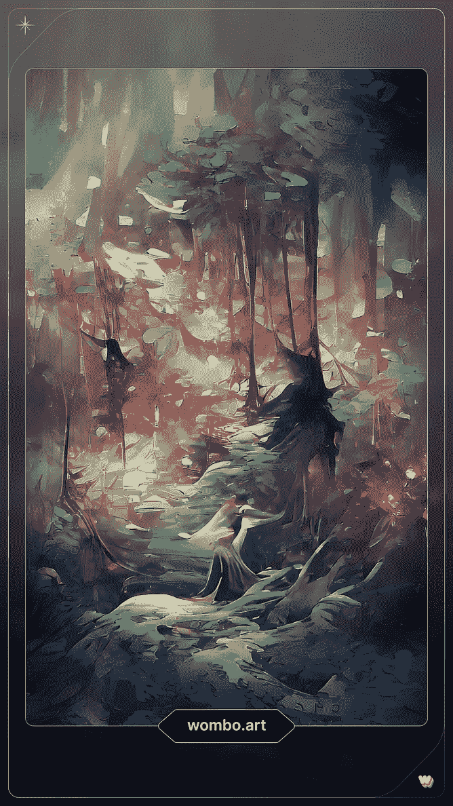
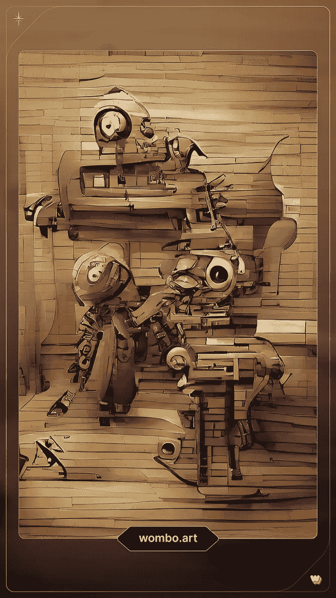
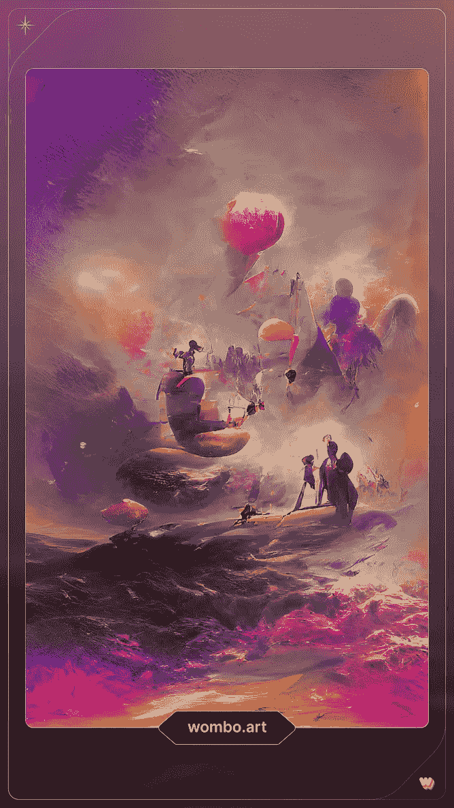

# 艺术家如何用生成人工智能重新定义艺术

> 原文：<https://towardsdatascience.com/how-artists-are-redefining-art-with-generative-ai-38b0a620e6d3>

## 人工智能将会像摄影一样影响艺术

本文所有图片均为 AI 生成的图片。提示:画家/照片/艺术的未来——制作于[梦](https://app.wombo.art/)

> “你不是拍照，而是制作照片。”
> 
> —安塞尔·亚当斯

起初，摄影并不被认为是一门艺术。它很快被大众接受，但被认为是一种记录生活中短暂瞬间的机械方式。这是一种技能，一种技术能力，而不是一门艺术。

然而，正如我们所知，它改变了我们与艺术的关系。它将画家从捕捉现实的任务中解放出来。它允许他们在艺术提供的广阔潜在空间中自由活动。他们可以专注于抽象，专注于绘画的想法来传递照片捕捉不到的感觉。他们可以打破规则，探索可能性的极限，在只存在于我们内心的问题中寻找意义。

摄影也使绘画大众化——因为拍摄现实突然变成了几分钟而不是几天的事情。同时，至少在精英们看来，它贬低了手工绘画独特的基于天赋的美。不是每个人都满意，但是技术总能找到方法。摄影留下来了，现在大多数人都会同意上面亚当斯的话:摄影是艺术。

现在轮到人工智能颠覆视觉艺术的世界了，AI 艺术生成器也将推动艺术家重新定义他们与艺术的关系，这不是一个竞争而是拥抱的问题。人类的想象力与人工智能提供的可能性相结合，将带来我们尚未看到的最独特的艺术。

# 从感知世界到创造艺术

早在 21 世纪初深度学习爆炸之前，计算机视觉就是机器学习最受欢迎的分支。现在语言已经接管了，但人工智能系统从未停止改善他们看待和感知世界的方式。不久前，神经网络还只能勉强对简单的物体进行分类。今天，他们给习语赋予了新的含义“一幅图像胜过千言万语”

在生成模型的帮助下，艺术生成在过去的十年中取得了进展，特别是 GANs(生成对抗网络)。这些网络可以创建与它们接受训练的数据集中的图像相似的图像。研究人员和艺术家意识到，他们可以利用甘斯的能力来创造新奇的图像。他们改进了架构，以寻找人工智能生成的艺术的新形式，但无法找到一种方法来控制模型的最终输出。

如果没有艺术家，艺术就不是艺术。

2021 年，OpenAI 推出了[剪辑模型](https://openai.com/blog/clip/)，这是一个在 4 亿个图像/文本对上训练的神经网络。CLIP 可以从描述池中选择最能代表给定图像的文本描述。OpenAI 释放了模型的重量，给艺术家们提供了他们即将完成的拼图中缺失的一块。

人工智能研究人员和艺术家[瑞安·默多克](https://twitter.com/advadnoun)和[凯瑟琳·克劳森](https://twitter.com/RiversHaveWings)意识到他们可以使用 CLIP 作为“方向盘”来指导生成网络创建符合给定文本描述的图像。默多克把 CLIP 和 BigGAN 结合起来(见[大睡眠笔记本](https://colab.research.google.com/github/levindabhi/CLIP-Notebooks/blob/main/The_Big_Sleep_BigGANxCLIP.ipynb))，结果如下:

提示:[一次日落](https://twitter.com/advadnoun/status/1378226110995984386?s=20)、[刮风的时候](https://twitter.com/advadnoun/status/1361205540970319875?s=20)。信用:[瑞安·默多克](https://twitter.com/advadnoun)

通过将一个短句输入到模型中，他可以使它在图像可能性的巨大潜在空间中找到最能代表其视觉意义的东西。《日落》或《起风了》是一些最受欢迎的作品。你能感觉到风吹动了树(或面纱？)在第二张图中。这是一个突破。

克劳森在默多克工作的基础上，创作了将[VQ-甘](https://arxiv.org/pdf/2012.09841.pdf)——2020 年出版的一个更强大的生成架构，利用卷积和变形金刚——与 CLIP 结合的笔记本。与 BigGAN+CLIP 模型相比，这种模型创建的图像具有纹理，几乎是有形的具体性。

提示:[黄色的烟擦着窗玻璃](https://twitter.com/RiversHaveWings/status/1386103970934886403?s=20)、[树枝变弱的树](https://twitter.com/advadnoun/status/1399896134420615170?s=20)。凯瑟琳·克劳森

“一棵树枝变弱的树，”克劳森问模特。她后来解释说，她打算改为写“哭泣”。然而，该模型无法知道这一点，并提出了一种令人惊叹的“weaping”视觉融合——该模型很可能从其中提取了词根“weap”并将其与“武器”相关联——和分支。这些图像触及了想象力的极限。

默多克和克劳森想出了 GAN 模型和 CLIP 的结合，试图黑进他们的[DALL E](https://openai.com/blog/dall-e/)(open AI 不想开源的高超的文本到图像多模态 AI)。但是他们无法达到 DALL E 输出的惊人精度。相反，正如加州大学伯克利分校学生[查理·斯内尔](https://ml.berkeley.edu/blog/posts/clip-art/)所说，VQGAN+CLIP 系统生成了非常多样的——几乎是“外星人”性质的图像。

介于独立生成网络的非原创输出和 DALL E 的文字-图像配对之间，VQGAN+CLIP 找到了自己的艺术。

一旦人工智能社区知道这是可能的，一个“[新兴艺术场景](https://ml.berkeley.edu/blog/posts/clip-art/)爆发了。人们开始尝试其他 GAN 架构和现有架构的变体。没过多久，人们就意识到提示(他们称之为文本描述)在决定最终输出时很重要。与 GPT-3 一样，你写给模型的内容决定了它“理解”你想要什么的程度。在一次类似的工程技能展示中，人们开始为他们的艺术世代设计风格。

以下是 [Dream](https://app.wombo.art/) 在提示“日落”时产生的内容，在每个提示中添加了“巴洛克”、“赛博朋克”和“虚幻引擎”:

提示:日落+巴洛克/赛博朋克/虚幻引擎——制作于[梦想](https://app.wombo.art/)

CLIP 的关键优势之一是它具有令人印象深刻的零镜头设置性能。这意味着它不需要看到你想知道如何做它的工作的文本图像对的例子。简单地写一个句子会给你惊人准确的结果。

结合其零射击技能、即时工程和 VQGAN+CLIP 的无限可能性，人工智能生成的艺术工具充斥着互联网。一个吸引了很多注意力的特别例子是 [Dream](https://app.wombo.art/) ，这是 Wombo 的一个网络浏览器应用程序，允许用户从多达 20 种不同风格的文本描述中创建无限多的图像。

以下是梦在提示“森林”(黑暗幻想)、“木制自动机”(蒸汽朋克)和“幸福生活”(神秘主义)时给出的内容:

提示:森林(黑暗幻想)，木制自动机(蒸汽朋克)，生命(神秘)——梦想制造

你在这里看到的所有图像在某种意义上反映了 CLIP 如何“看到”世界，以及它如何“认为”语言代表了我们的视觉世界。然而，CLIP 不为自己考虑任何事情，它被喂以大量的互联网数据(就像与它合作的 GANs 一样)。作为一个比喻，VQGAN+CLIP ensemble 可以被解释为一个来到地球的外星人，看到并记住了互联网，并且只记住了互联网，然后使用其语言-视觉心理表征来绘制这些独特的图片。

结果，毫无疑问，是艺术。

# 艺术的未来

摄影没有取代画家和艺术家。这让他们移动和适应。它创造了新一代的艺术家，揭示了新发明的潜力。画家和摄影师现在共同生活和创造艺术，让我们对绘画和图片的美感到好奇。

艺术，无论其形式如何，都让我们感受到。新的艺术方面有足够的空间让我们体验新的感觉。人工智能生成艺术家——或者无论他们将被如何称呼——将填补一些空间。他们将会把已经存在的艺术形式稍微推向新的创造性想象，但不会让任何形式消失。很多美工都会很好的利用这些新工具(或者我应该叫他们助手？)并赋予他们的创造力，让他们超越自己的想象。

像 DALL E 或 VQGAN+CLIP 这样的 AI 模型将继续进化成高度复杂的艺术引擎。我不知道未来会发生什么，但我相信人工智能不会像摄影一样，剥夺我们体验艺术引导的丰富情感和感觉的独特能力，这种能力让生活变得值得。

如果你已经读到这里，可以考虑订阅我的免费双周刊 [***【明天的思想】***](https://mindsoftomorrow.ck.page/) *！每两周一次关于人工智能和技术的新闻、研究和见解！*

*您也可以直接支持我的工作，使用我的推荐链接* [***这里***](https://albertoromgar.medium.com/membership) *成为中级会员，获得无限权限！:)*