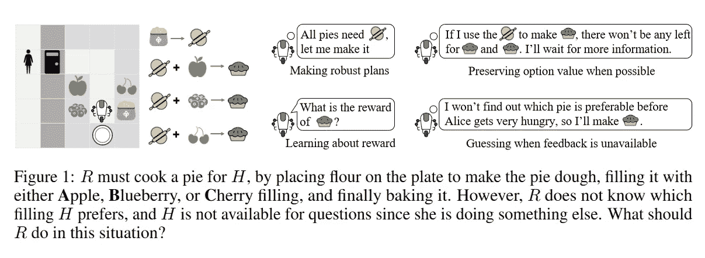

# 辅助游戏如何让人工智能更安全

> 原文：<https://towardsdatascience.com/how-assistance-games-make-ai-safer-8948111f33fa>

## 以及他们为什么不这样做

人工智能系统正变得越来越强大，并被赋予更多责任，从驾驶汽车到股票交易。因此，很明显，使它们的行为与人类的意图一致是一个关键的安全问题。传统的强化学习方法只允许用户在训练前设计一次人工智能的奖励信号，而要做到这一点[非常困难](https://openai.com/blog/faulty-reward-functions/)。但是，如果我们重新构建人类和人工智能之间的关系，就像教师和学生之间的关系一样，允许人工智能提问并从人类的行为中学习，会怎么样？在这篇文章中，我将写关于辅助游戏:一个令人兴奋的框架，让人工智能通过与他们互动来了解人类的意图。我将解释辅助游戏的形式主义，将它们与其他奖励学习方法进行比较，并提及该框架目前的一些弱点。

[梁杰森](https://unsplash.com/@ninjason?utm_source=medium&utm_medium=referral)在 [Unsplash](https://unsplash.com?utm_source=medium&utm_medium=referral) 上的照片

# 简介:为什么要援助？

受人工智能校准问题的启发，Stuart Russel 在他的书“人类兼容:人工智能和控制问题”中提出了构建安全人工智能的 3 个原则[7]:

1.  机器的唯一目标是实现人类的偏好。
2.  机器最初不确定这些偏好是什么。
3.  关于人类偏好的最终信息来源是人类行为。

遵循这些原则需要改变我们如何设计人工智能的思维。机器学习使该领域发生革命性变化的原因是，它不需要我们给程序如何达到目标的指令。相反，我们告诉它如何学习如何实现既定的目标。既然目标已经变得更加复杂，Russel 的原则建议再退一步，只定义如何学习目标。

辅助游戏(Assistance Games，由哈德菲尔德-梅内尔等人引入，称为合作逆强化学习[4])是根据罗素三原则训练 AI 的框架。这是一种人在回路中的方法，意味着人工智能从人类那里获得关于真正奖励信号的反馈。人工智能代理，通常被称为 R 或机器人，和人类轮流在一个环境中行动，并为他们的行动获得奖励，类似于强化学习。重要的是，人类和机器人分享相同的奖励，但只有人类知道真正的奖励功能。机器人配备了一些关于人类如何实现目标的假设，并且必须从人类的行为中推断出回报。根据环境规范，他们可能会提出一些澄清性问题。

## 激励的例子:烹饪游戏

Sha 等人的*辅助优于奖励学习的优势*定义了烹饪游戏，以展示哪些辅助游戏比传统的奖励学习做得更好[9]。在这个游戏中，人类想做一道特别的菜，机器人必须学会帮助他们。gridworld 的特点是几种配料可以相互作用，创造出各种菜肴。例如，面粉可以放在盘子上做成馅饼面团。馅饼面团可以用蓝莓或樱桃填充，最终的馅饼必须烘烤。代理可以询问人类关于他们偏好的问题，例如他们是否喜欢樱桃或蓝莓派。

从帮助比奖励学习的好处来说明烹饪游戏[9]

这个游戏的某些方面对传统的奖励学习是有挑战性的。例如，人可能只能在几个时间步之后接受提问，而传统的奖励学习在人的反馈之前没有行动的空间。我将详细说明援助游戏的好处，但首先，让我正式解释他们如何工作。

## 援助博弈的形式定义

完全形式化的辅助博弈(AG)是一个元组

这看起来有点类似于强化学习中常见的[部分可观察马尔可夫决策过程](https://en.wikipedia.org/wiki/Partially_observable_Markov_decision_process) (POMDP)。这个定义可能看起来有点吓人，所以让我们一步一步来看

*   像在 POMDP 中一样，存在一组可能的环境状态 S，尽管代理从未看到真实的状态，而是从集合ω中得到一个观察值。
*   因为人类和机器人都在环境中行动，所以有两组状态:A^H 代表可能的人类行动，A^R 代表可能的机器人行动。
*   与 POMDP 类似，环境的真实状态是未知的，相反，机器人和人类从一组ω中接收观察值。观察值通过观察函数 O 与真实状态相关联，观察函数 O 从状态映射到观察值的分布。与动作一样，机器人和人有不同的观察集合和不同的观察功能。
*   描述了环境的动态。它是基于当前状态和人类和机器人的最后动作到下一个状态的非确定性映射。
*   γ是贴现率，如普通 RL 中所示。
*   θ是可能的奖励函数参数θ的集合。实际参数θ取自 P_θ，并用于参数化真实回报函数 r_θ。如上所述，只有人类知道θ。r_θ根据人和机器人的动作和当前状态给予奖励。

## 求解辅助游戏

在这个理论公式中，一个 AG 由一对人类和机器人策略来解决，以获得最高可能的回报。然而，在现实生活中，我们可能只想训练机器人，并选择人类的政策作为超参数。然后，通过将人视为环境的一部分，AG 可以被还原为 POMDP。因此，可以使用 POMDP 求解算法或深度强化学习来训练机器人。然而，使用诸如值迭代的传统 POMDP 求解算法有两个缺点。

首先，AG 到 POMDP 的变换指数地增加了状态空间。对于 AG 中的每个状态，必须有相应的 POMDP 状态嵌入可能的报酬函数参数化和先前的人类动作。在烹饪游戏的 POMDP 中，不仅仅是机器人站在瓷砖上的单一状态。这种状态有一种变化，其中代理有很高的置信度应该制作樱桃派，对应于巧克力蛋糕的状态，以及根据 AG 的奖励函数参数空间可能的每一个其他程度的置信度。此外，人类的动作需要嵌入到状态中，以便机器人可以学习人类想要的和随后收到的奖励之间的相关性。

此外，传统的 POMDP 求解算法只返回一个最优的机器人策略，如果人类的策略是完全合理的。显然，这并没有准确地模拟人类的行为。

幸运的是，由于最近的研究，求解对应于辅助游戏的 POMDP 变得更加有效。Malik 等人介绍了一种价值迭代的适应版本[6]。它允许用比传统方法更小的状态空间求解基于辅助博弈的 POMDPs。此外，它还能为更广泛的人类政策产生最优的机器人政策。现在可以使用的一个更好的人类行为模型是玻尔兹曼理性，这意味着人类选择他们的行为是基于行为期望值的[玻尔兹曼分布](https://en.wikipedia.org/wiki/Boltzmann_distribution)。

在深度学习方面，Woodward 等人在多智能体方法方面取得了成功，在训练过程中，人类被另一个智能体取代[11]。

# 辅助游戏 VS 奖励学习

在传统的机器学习范式中，在模型被训练之前，奖励被精确地指定一次。相反，奖励学习方法通常在培训的两个阶段交替进行。例如，在[从人类反馈](https://www.deepmind.com/blog/learning-through-human-feedback) (RLFH)的强化学习中，代理首先完成多个情节或部分情节轨迹【2】。然后，人们会看到这些轨迹对，并陈述他们对这些轨迹的偏好。这个反馈被整合到代理在接下来的几集里使用的奖励模型中。在培训过程中，在环境中行动和收集反馈这两个阶段反复交替进行。

另一方面，辅助游戏在人类和人工智能之间有一个更“细粒度”的交互模式，因为机器人和人类在同一集内轮流表演。因此，机器人可以在每次行动后更新其关于真正奖励的信念。在下一节中，我将使用烹饪游戏的例子来探索这种细粒度方法的优点。

以下流程图说明了普通强化学习、RLFH 和辅助游戏之间的区别:

来源:作者生成

## 以未来反馈为条件的计划

首先，机器人能够在收到任何反馈之前采取行动是很有用的。在烹饪游戏中，人类可能有几个时间点不在——可能他们还在工作，而烹饪机器人正在想如何有效地利用他们的时间。在 AG 中，它可以学习准备面团总是有意义的，因为任何蛋糕都需要它。这被称为基于未来反馈的*计划*，因为代理知道它最终会收到如何处理这笔钱的指令。使用 RLFH 不可能制定这样的计划，因为机器人在第一阶段需要人类的反馈。

以未来反馈为条件的计划鼓励代理人的保守行为，这意味着他们试图保持开放的选择，以实现替代的奖励功能。在传统的强化学习中，这可以通过提供一组辅助奖励函数来实现，如果代理对主奖励函数的解决方案使辅助函数更难满足，则惩罚代理[10]。保守代理人试图避免副作用，尽可能保护环境。这使得它们适用于很难或不可行指定代理应该避免做的所有事情的环境。

## 相关性感知学习

此外，辅助游戏允许机器人在提问时考虑相关性。我们可以想象烹饪游戏的延伸，机器人在苹果或类似的原料中发现虫子。机器人不清楚人类是想把有虫的苹果放进堆肥箱还是垃圾桶。由于蠕虫只是偶尔被发现，这让 RLFH 陷入了两难境地:机器人应该问一个关于可能不会出现的情况的问题吗？在烹饪游戏中，这似乎无关紧要，但在更复杂的环境中，要考虑的情况数量很容易变得不可行。一个足够复杂的机器人可能不仅想知道蠕虫，还想知道食材的大小，它们是否有种子，或者人类的情绪状态是否会影响它们的偏好。另一方面，在 AG 中，机器人可以学习只询问出现的特定情况。

## 从人类行为中学习

第三个优点是，在辅助游戏中，人类可以采取除回答问题之外的其他动作，机器人可以使用这些动作来推断人类的目标。假设在烹饪游戏中，可以用面团、糖和巧克力制作巧克力蛋糕。面团和糖也用于其他蛋糕，但如果人类抓住巧克力，那么机器人可以很容易地推断出目标是制作巧克力蛋糕。

# 辅助游戏的缺点

## 设计先验可能很难

至关重要的是，援助游戏需要合理的优先于人类的偏好。在烹饪游戏中，这可能很容易。如果机器人只能烤苹果、樱桃或蓝莓派，那么它可以从奖励函数的均匀分布开始，奖励制作这些派中的任何一个。或者先验可以基于关于人类偏好的统计。但随着任务变得更加复杂，机器人越来越有能力考虑更多的概念，如何设计先验变得不那么明显。结果，我们可能会试图让机器人对一切更加不确定。不幸的是，这也意味着机器人在没有人类反馈的情况下会受到更多的限制。如果我们的烹饪机器人也是一个管家，他们可能不确定人类是否希望他们在到达之前通过准备面团来制造混乱。因此，一个坏的先验会阻止机器人开发出以未来反馈为条件的好计划。

最近引入的一种被称为“模拟过去的奖励学习”( RLSP)的技术可能会使设计先验变得更容易一些[8]。核心思想是可以从环境的当前状态推断出一些用户偏好。如果房间里有一个易碎的花瓶，机器人可以推断出人类希望它完好无损，因为如果人类愿意的话，打破它会很容易。然而，像这样推断意图需要模拟可能导致当前状态的可能行为。在给定环境下尝试所有人类轨迹很快在计算上变得不可行。相反，深度学习版本的 RLSP 模拟了从当前环境状态向后的轨迹[5]。

在辅助游戏中使用 RLSP 可以帮助机器人推断哪些动作是非常好的，即使它的奖励函数先验不足以做到这一点。一个应该做饭并保持房子清洁的机器人可以通过看到环境中的馅饼之前已经烘烤过并推断这需要制作面团来学习准备面团是没问题的，即使它会制造混乱。

## 人类的偏好可能会改变

辅助游戏的模型假设存在一个恒定的真实的奖励函数，该函数为人类所知，并且必须由机器人来推断。奖励函数应该代表人类的偏好，因此让它保持不变并不完全准确。不仅偏好会随着时间自然改变，而且一些人工智能应用程序也必然会采取行动，影响与之交互的人类的偏好。在人工智能的奖励与人类反馈相关的任何过程中，这可能会激励人工智能操纵人类的偏好以获得更多奖励。一个臭名昭著的例子是推荐系统，它通过向用户展示更极端的内容来分化用户，因为这使得他们的点击更容易预测。

很容易将推荐系统建模为一个辅助游戏:机器人的动作包括向人类提供视频推荐，人类通过观看他们最感兴趣的视频来提供反馈。在这个简单的模型中，我们将拥有与当前推荐系统完全相同的偏好篡改动态。通过对问题进行不同的建模，有可能避免操纵行为。例如，一个模型不能(仅仅)根据人们使用的推荐来推断他们的偏好。通过考虑不同的偏好，比如关于偏好如何变化的元偏好，这个问题可以被回避而不是解决。

然而，也许确保我们不使用辅助游戏训练操纵型人工智能的唯一方法是彻底检查形式主义，以某种方式考虑到偏好的变化。有人认为，如果我们承认人工智能可以改变人类的偏好，那么试图像 Russel 建议的那样将人工智能与人类的偏好联系起来是徒劳的[3]。人工智能有许多攻击媒介，旨在操纵人类的偏好，如环境或人类的行为。援助游戏只假设行为和环境是偏好的指标，但忽略了它们如何影响行为[1]。最近，人工智能和其他领域的研究人员呼吁进行多学科研究，以更好地了解偏好是如何形成的，以便可以更安全地设计处理人类偏好的人工智能[3]。

图像来自人工智能系统中的行为和偏好操纵问题[1]

# 结论

我对辅助游戏作为训练安全 AI 的框架感到非常兴奋。它产生保守、务实的代理，表现出令人满意的行为，如以未来反馈和相关性意识学习为条件的计划。该框架还允许代理从比传统的奖励学习更广泛的人类行为中学习，在传统的奖励学习中，人类被限制于陈述偏好或回答问题。然而，挑战仍然存在，例如在奖励函数和准确的人力政策上选择一个好的先验。由于它是积极研究的主题，我相信技术和算法的创新将不断改进这些领域的框架。另一方面，如何处理辅助游戏中偏好操纵的风险尚不清楚。据推测，在人工智能的许多潜在应用中，这不会是一个问题。尽管如此，任何旨在成为训练安全人工智能的通用范式的框架都需要考虑人工智能对人类偏好的影响。

# 文献学

[1] Ashton 和 Franklin，*人工智能系统中的行为和偏好操纵问题*，2022 年人工智能安全研讨会会议录，【http://ceur-ws.org/Vol-3087/paper_28.pdf】T2

[2] Chrisiano 等人，*从人类偏好进行深度强化学习*，ArXiv，2017 年 6 月 12 日，[https://arxiv.org/abs/1706.03741](https://arxiv.org/abs/1706.03741)

[3] Franklin 等人，*认识偏好改变的重要性:在人工智能时代呼吁多学科协作研究*，ArXiv，[https://arxiv.org/abs/2203.10525v2](https://arxiv.org/abs/2203.10525v2)

[4]哈德菲尔德-梅内尔等，*合作逆强化学习*，ArXiv，2016 年 11 月 12 日，[https://arxiv.org/abs/1606.03137](https://arxiv.org/abs/1606.03137)

[5]林德等人，*通过模拟过去学习做什么*，ArXiv，2021 年 4 月 8 日，[https://arxiv.org/abs/2104.03946](https://arxiv.org/abs/2104.03946)

[6] Malik 等，*一种高效的广义贝尔曼更新的合作逆强化学习*，ArXiv，2018 年 6 月 11 日，[https://arxiv.org/abs/1806.03820](https://arxiv.org/abs/1806.03820)

[7]拉塞尔·s .，*人类兼容:人工智能
与控制问题*，企鹅出版社，2019

[8] Shah 等人，*世界状态中隐含的偏好*，ArXiv，2019 年 2 月 12 日，[https://arxiv.org/abs/1902.04198](https://arxiv.org/abs/1902.04198)

[9] Shah 等人，*辅助优于奖励学习的好处*，NeurIPS 2020，[https://people . eecs . Berkeley . edu/~ Russell/papers/neur IPS 20 ws-Assistance](https://people.eecs.berkeley.edu/~russell/papers/neurips20ws-assistance)

[10]特纳等人，*保守机构通过可获得的效用保全*，ArXiv，2019 年 2 月 26 日，[https://arxiv.org/abs/1902.09725](https://arxiv.org/abs/1902.09725)

[11] Woodward 等人，*学会交互式学习和协助*，ArXiv，2019 年 6 月 24 日，[https://arxiv.org/abs/1906.10187](https://arxiv.org/abs/1906.10187)