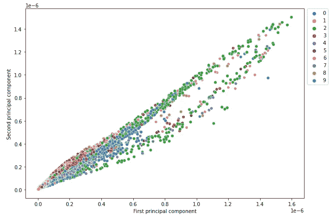
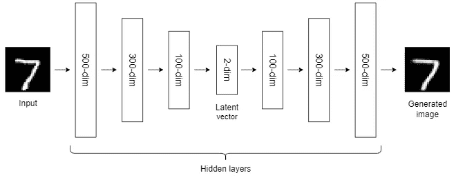
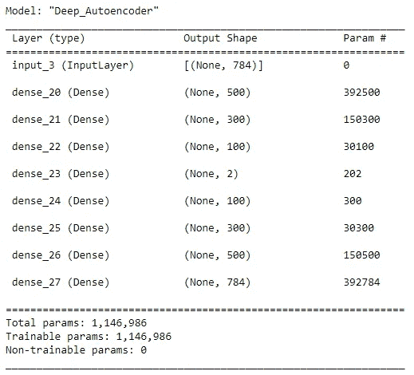
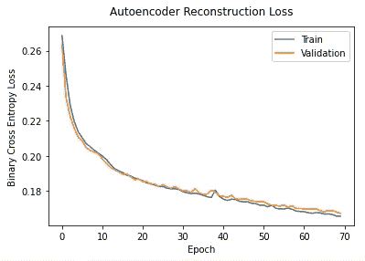
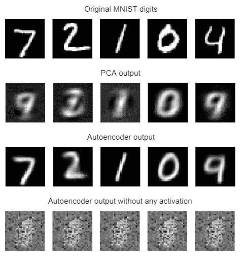

# 自动编码器如何在降维方面优于 PCA

> 原文：<https://towardsdatascience.com/how-autoencoders-outperform-pca-in-dimensionality-reduction-1ae44c68b42f>

## 自动编码器的应用

## 使用非线性数据的自动编码器的维数减少

由 [Unsplash](https://unsplash.com/?utm_source=unsplash&utm_medium=referral&utm_content=creditCopyText) 上的 [Shubham Dhage](https://unsplash.com/@theshubhamdhage?utm_source=unsplash&utm_medium=referral&utm_content=creditCopyText) 拍摄的照片

自动编码器有很多[的实际应用。降维就是其中之一。](https://rukshanpramoditha.medium.com/an-introduction-to-autoencoders-in-deep-learning-ab5a5861f81e#991a)

有这么多的[降维技术](/11-dimensionality-reduction-techniques-you-should-know-in-2021-dcb9500d388b)。自动编码器(AEs)和主成分分析(PCA)在其中很受欢迎。

PCA 不适合非线性数据的降维。相比之下，自动编码器在非线性数据的降维方面做得非常好。

# 目标

在本文结束时，您将能够

*   使用自动编码器降低输入数据的维数
*   使用主成分分析降低输入数据的维数
*   比较 PCA 和自动编码器的降维性能
*   了解自动编码器如何在降维方面优于 PCA
*   了解 PCA 和自动编码器之间的主要区别
*   了解何时使用哪种降维方法

# 先决条件

我推荐你阅读下面的文章作为这篇文章的先决条件。

*   [**深度学习中的自动编码器介绍**](https://rukshanpramoditha.medium.com/an-introduction-to-autoencoders-in-deep-learning-ab5a5861f81e) (推荐使用，因为你需要在实现之前了解自动编码器的原理)
*   [**使用 Keras**](/generate-mnist-digits-using-shallow-and-deep-autoencoders-in-keras-fb011dd3fec3) 中的浅层和深层自动编码器生成 MNIST 数字(推荐使用，因为您需要知道如何使用 Keras functional API 构建自动编码器)
*   [**PCA 与降维文章合集**](https://rukshanpramoditha.medium.com/list/pca-and-dimensionality-reduction-special-collection-146045a5acb5) (推荐是因为你需要了解 PCA 的工作原理，如何应用以及降维背后的大致思路)
*   [**构建 Keras 模型的两种不同方式:顺序 API 和函数 API**](https://rukshanpramoditha.medium.com/two-different-ways-to-build-keras-models-sequential-api-and-functional-api-868e64594820) (推荐，因为您将在这里使用 Keras 函数 API 来构建 autoencoder 模型)
*   [**获取、理解并准备 MNIST 数据集**](https://rukshanpramoditha.medium.com/acquire-understand-and-prepare-the-mnist-dataset-3d71a84e07e7) (推荐使用，因为您将在此使用 MNIST 数据集构建自动编码器和 PCA 模型)

# 用主成分分析法进行降维

首先，我们将使用主成分分析对 MNIST 数据(见最后的数据集[引文](#c5f5))进行降维，并将输出与原始 MNIST 数据进行比较。

*   **步骤 1:** 采集并准备 MNIST 数据集。

(作者代码)

*   **第 2 步:**仅使用两种成分进行 PCA。输入数据的原始维数是 784。

(作者代码)

*   **步骤 3:** 将 PCA 后的压缩 MNIST 数字可视化。

(作者代码)

**PCA 输出**(作者图片)

*   **步骤 4:** 将 PCA 输出与原始 MNIST 数字进行比较。

**原 MNIST 数字**(图片由作者提供)

正如您在两个输出中看到的，应用 PCA 后，MNIST 数字不清晰可见。这是因为我们只保留了两个组件，这两个组件没有捕获输入数据中的很多模式。

*   **步骤 5:** 使用两个主成分可视化测试数据。

(作者代码)

**使用两个主成分可视化测试数据**(图片由作者提供)

所有的数字都没有清晰的独立簇。意味着只有两个分量的 PCA 模型无法清晰地区分测试数据中的九位数字。

# 使用自动编码器执行降维

现在，我们将构建一个[深度自动编码器](/generate-mnist-digits-using-shallow-and-deep-autoencoders-in-keras-fb011dd3fec3#63cc)来对相同的 MNIST 数据进行降维。我们还将潜在向量的维数保持为二维，以便于将输出与 PCA 返回的先前输出进行比较。

*   **步骤 1:** 如前所述采集并准备 MNIST 数据集。
*   **步骤 2:** 定义自动编码器架构。

**深度自动编码器架构**(图片由作者提供，用 draw.io 制作)

(作者代码)

**深度自动编码器架构**(图片由作者提供)

网络中有超过一百万个参数。因此，这将需要大量的计算能力来训练这个模型。如果您为此使用传统的 CPU，则需要花费大量时间来完成训练过程。不如用一个强大的 [NVIDIA GPU](https://rukshanpramoditha.medium.com/setting-up-a-deep-learning-workplace-with-an-nvidia-graphics-card-gpu-for-windows-os-b6bff06eeec7) 或者 [Colab free GPU](https://rukshanpramoditha.medium.com/how-to-use-google-colab-free-gpu-to-run-deep-learning-code-incredibly-faster-760604d26c7e) 来加速 10 倍或者 20 倍的训练过程。

*   **第三步:**编译、训练、监控损失函数。

(作者代码)

(图片由作者提供)

*   **步骤 4:** 在自动编码之后，可视化压缩的 MNIST 数字。

(作者代码)

**自动编码器输出**(图片由作者提供)

自动编码器输出比 PCA 输出好得多。这是因为自动编码器可以学习数据中复杂的非线性模式。相比之下，PCA 只能学习数据中的线性模式。

*   **步骤 5:** 可视化潜在空间中的测试数据，以查看自动编码器模型如何能够区分测试数据中的九个数字。

(作者代码)

**可视化潜在空间中的测试数据**(图片由作者提供)

大多数数字都有清晰的独立簇。这意味着自动编码器模型可以清楚地区分测试数据中的大多数数字。有些数字重叠，例如，数字 4 和 9 之间有重叠。这意味着自动编码器模型不能清楚地区分数字 4 和 9。

*   **步骤 6(可选):**使用相同的自动编码器模型，但在隐藏层中不使用任何激活功能，`activation=None`在每个隐藏层中。您将获得以下输出。

**隐藏层中没有任何激活功能的自动编码器输出**(图片由作者提供)

该输出甚至比 PCA 输出更差。我用这个实验向你展示了神经网络中激活函数的[重要性。在神经网络的隐藏层中需要激活函数来学习数据中的非线性关系。](https://rukshanpramoditha.medium.com/3-amazing-benefits-of-activation-functions-in-neural-networks-22b17b91a46e)[如果隐藏层中没有激活函数，神经网络就是巨大的线性模型](https://rukshanpramoditha.medium.com/what-happens-if-you-do-not-use-any-activation-function-in-a-neural-networks-hidden-layer-s-f3ce089e4508)，其表现甚至比一般的机器学习算法还要糟糕！所以，你需要[为神经网络](/how-to-choose-the-right-activation-function-for-neural-networks-3941ff0e6f9c)使用正确的激活函数。

# PCA 和自动编码器的主要区别

*   **架构:** PCA 是一种通用的机器学习算法。它使用输入数据协方差矩阵的[特征分解](https://rukshanpramoditha.medium.com/eigendecomposition-of-a-covariance-matrix-with-numpy-c953334c965d)或奇异值分解(SVD)进行降维。相比之下，Autoencoder 是一种基于神经网络的架构，比 PCA 更复杂。
*   **输入数据集的大小:** PCA 通常适用于小数据集。因为 Autoencoder 是一个神经网络，相比 PCA，它需要大量的数据。因此，最好对非常大的数据集使用自动编码器。
*   **线性与非线性:** PCA 是一种线性降维技术。它只能学习数据中的线性关系。相反，Autoencoder 是一种非线性降维技术，它也可以学习数据中复杂的非线性关系。这就是为什么在我们的例子中，自动编码器输出比 PCA 输出好得多，因为 MNSIT 数据中有复杂的非线性模式。
*   **用途:** PCA 只用于降维。但是，自动编码器并不局限于降维。它们还有其他的实际应用如*图像去噪*、*图像殖民*、*超分辨率*、*图像压缩*、*特征提取*、*图像生成*、*水印去除*等。
*   **计算资源:**自动编码器比 PCA 需要更多的计算资源。
*   **训练时间:**与自动编码器相比，PCA 运行时间更短。
*   **可解释性:**自动编码器比 PCA 的可解释性差。

# 实验(可选)

您可以通过为以下超参数尝试不同的值来构建不同的自动编码器架构。做完之后，在评论区告诉我结果。

*   层数
*   每层中的节点数
*   潜在向量的维数
*   隐藏层中激活函数的类型
*   优化器的类型
*   学习率
*   时代数
*   批量

# 摘要

考虑下面的图表，它包含了我们之前获得的所有输出。

**输出比较**(图片由作者提供)

*   第一行代表原始的 MNIST 数字。
*   第二行表示由 PCA 返回的只有两个分量的输出。数字不清晰可见。
*   第三行表示由自动编码器返回的输出，具有比 PCA 输出好得多的二维潜在向量。数字现在清晰可见。原因是自动编码器已经学习了 MNIST 数据中复杂的非线性模式。
*   最后一行表示自动编码器返回的输出，在隐藏层中没有任何激活功能。该输出甚至比 PCA 输出更差。我把这个包括进来是为了向你们展示激活函数在神经网络中的重要性。在神经网络的隐藏层中需要激活函数来学习数据中的非线性关系。如果隐藏层中没有激活函数，神经网络就是巨大的线性模型，甚至比一般的机器学习算法还要糟糕！

今天的帖子到此结束。

**如果您有任何问题或反馈，请告诉我。**

## 阅读下一篇(推荐)

*   阅读我的“[神经网络与深度学习课程](https://rukshanpramoditha.medium.com/list/neural-networks-and-deep-learning-course-a2779b9c3f75)”的全部剧集。

**点击图片进入我的神经网络和深度学习课程**(作者截图)

## 支持我当作家

我希望你喜欢阅读这篇文章。如果你愿意支持我成为一名作家，请考虑 [***注册会员***](https://rukshanpramoditha.medium.com/membership) *以获得无限制的媒体访问权限。它只需要每月 5 美元，我会收到你的会员费的一部分。*

  

*或者，您也可以考虑通过点击本文底部的* ***给予提示*** *按钮进行小额捐赠。*

非常感谢你一直以来的支持！下一篇文章再见。祝大家学习愉快！

## MNIST 数据集信息

*   **引用:**邓，l，2012。用于机器学习研究的手写数字图像 mnist 数据库。 **IEEE 信号处理杂志**，29(6)，第 141–142 页。
*   【http://yann.lecun.com/exdb/mnist/】来源:
*   **许可:***Yann le Cun*(NYU 库朗研究所)和 *Corinna Cortes* (纽约谷歌实验室)持有 MNIST 数据集的版权，该数据集在*知识共享署名-共享 4.0 国际许可*([**CC BY-SA**](https://creativecommons.org/licenses/by-sa/4.0/))下可用。你可以在这里了解更多关于不同数据集许可类型的信息。

[鲁克山普拉莫迪塔](https://medium.com/u/f90a3bb1d400?source=post_page-----1ae44c68b42f--------------------------------)
**2022–08–19**