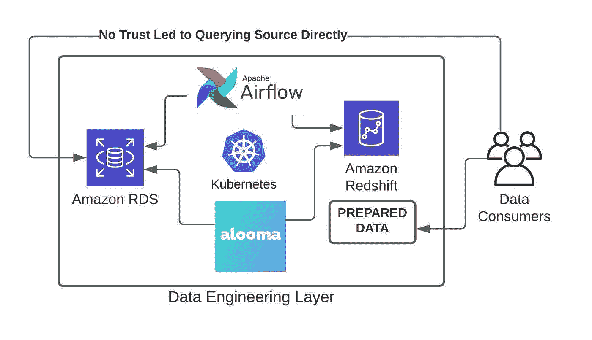
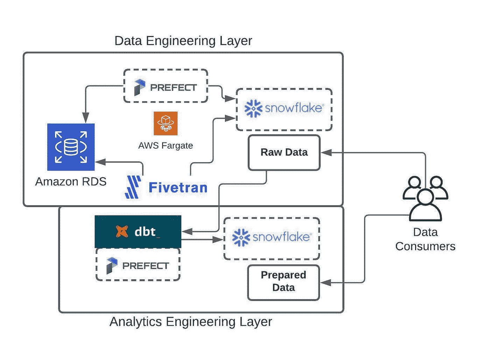

# Clearcover 如何将 ELT 的质量覆盖率提高 70%

> 原文：<https://towardsdatascience.com/how-clearcover-increased-quality-coverage-for-elt-by-70-percent-dd6090c5af1f>

## 以下是数据可观察性如何帮助一家领先的汽车保险提供商的数据工程团队更快地交付更可靠的数据

图片由[克里斯·利维拉尼](https://unsplash.com/photos/HUJDz6CJEaM)在 [Unsplash](https://unsplash.com/) 上提供。

随着组织不断从更多来源获取更多数据，维护高质量、可靠的数据资产成为一项至关重要的挑战。这就是 Clearcover 在 ELT 及其他领域实现端到端数据可观察性的原因。以下是方法。

总部位于芝加哥的 [Clearcover](https://clearcover.com/) 是一家领先的技术驱动型保险提供商，他们为自己能够为全美客户提供快速、透明的汽车保险费率而自豪。他们也为自己的数据感到自豪，他们认为这是一种竞争优势，使他们能够兑现对消费者的承诺:节省资金，同时享受快速理赔、轻松支付和卓越服务。

最近，我与高级数据工程经理 Braun Reyes 坐在一起，讨论 Clearcover 在扩展自助服务数据平台的同时保持实现数据驱动任务所需的信任和质量的旅程，以及当数据可靠性问题开始出现时，他们如何应对。

# Clearcover 的数据环境

当 Braun 加入 Clearcover 时，他是一个人的数据工程团队，并将数据堆栈描述为“数据用于分析”的方法。他在后端使用 Amazon RDS，将数据复制到 Redshift 的 Alooma，并在 Kubernetes 上运行 Apache Airflow 堆栈。Braun 还负责创建准备好的数据集。

*Clearcover 的第一个数据堆栈依靠分析师直接查询来源，由一名数据工程师(Braun)负责清理、处理和存储准备好的数据。这导致了反复出现的瓶颈，减缓了分析速度和洞察时间。图片由 Braun Reyes 提供。*

但是，由于他的一个人数据工程团队负责这么多层，瓶颈开始出现。Braun 花费更多的时间维护他的工具，而不是实际使用它们来传输数据。由于这些瓶颈以及缺乏对数据的可访问性(因此也缺乏对数据的信任)，许多数据消费者通过直接查询源数据找到了解决方法。

> “我在这个数据堆栈上的所有投资都是徒劳的。”

因此，随着数据工程团队的成长，他们迁移到了现代的分布式 ELT 数据堆栈。他们从 Airflow 转向 Prefect，并开始使用 AWS Fargate 来降低他们计算的总拥有成本。该团队还使用了 Fivetran 和 Snowflake，这为他们的需求提供了 Redshift 所缺乏的可访问性。

*Clearcover 的“现代数据堆栈”发展到包括雪花、提督、dbt 和 Fivetran，以及独立的分析工程和数据工程层。图片由 Braun Reyes 提供。*

现在，数据工程层变得更小，专注于处理原始数据，而独立的分析工程团队则利用他们提供的工具和原始数据来为业务生成准备好的数据，从而帮助消除这些早期的瓶颈。

# 问题:对源数据缺乏信任

虽然分布式数据堆栈使得将更多数据源集成到雪花中变得容易得多，但 Braun 的团队遇到了一个新问题:数据可靠性。

随着数据源的激增，对于数据工程师来说，跨管道手动扩展数据质量测试变得越来越困难。因此，虽然他们已经获得了对其数据的运营信任，但他们现在必须解决数据质量和信任问题。

*当团队开始将数据源复制到雪花以加快分析工程工作流程时，他们遇到了两条路:手动编写数据质量检查(一个耗时且不可扩展的过程)或投资自动化覆盖。图片由 Braun Reyes 提供。*

“ELT 很棒，但总有一个权衡，”布劳恩说。“例如，当您将 CRM 中的数据复制到雪花中时，您的数据工程团队不一定是 CRM 或营销系统领域的专家。因此，我们很难对所有这些来源进行量身定制的数据质量测试。”

当出现数据质量问题时，数据工程团队通常会大吃一惊。他们会收到来自数据消费者的 Slack 消息，询问为什么某个表已经几天没有刷新了。

布劳恩说:“你的管道正在运行，一切看起来都很好，但后来你意识到你提供的数据要么不正确，要么根本就没有到达。”“你一直专注于构建管道、交付管道和测试代码的运营方面，可能没有足够的带宽来考虑数据本身的健康状况。”

Braun 和他的团队知道他们需要获得一组基本的常识性检查，以提供建立数据信任所需的覆盖范围。但是，增加覆盖范围在他们的待办事项中不断下移，因为他们正忙于处理业务请求的新数据源。

因此，他们开始探索[数据可观察性](https://www.montecarlodata.com/what-is-data-observability/)，这允许用户通过自动监控、警报和沿袭来获得可见性并了解其数据的整体健康状况。对于 Braun 和他的团队来说，通过可观察性的五个支柱(新鲜度、容量、分布、模式和沿袭)来衡量数据健康的概念立即引起了共鸣。

> “在数据工程团队中，我们都非常注重简单性，以这种方式处理问题对我们来说意义重大。”

# 解决方案:跨关键 ELT 管道的自动化覆盖

有了数据可观察性，提供了数据健康问题的自动监控和警报，Braun 和他的团队对他们所有的表都有了即时的基本覆盖。

> “我们不再需要为每个特定的数据资产定制特定的测试。”

## 关键步骤:减少带有 dbt 伪像的报警白噪声

由于 50 多个来源提供了大量数据，Braun 还希望确保他的团队不会因为实际上与业务无关的数据事件而受到警告和干扰。

为了减少来自自动化监控的噪音，他们围绕解析 dbt 工件构建了自动化，以确定准备好的数据包正在使用哪些原始表。然后，他们围绕标记这些表和将与这些关键资产相关的事件转发到专用通道建立了自动化。“我们希望将我们的注意力集中在企业正在使用的那些东西上，”布劳恩说。

> “通过将这些关键资产隔离在特定的闲置渠道中，我的团队可以专注于这些特定事件。”

很快，这个监控策略产生了立竿见影的效果。Braun 的团队能够主动识别这些无声的故障，启动与利益相关方的对话，并更快地提前解决问题，而不是从分析或业务团队那里收到关于丢失或不正确数据的恐慌的松散消息。

Braun 和他的团队还能够开始防止数据问题影响业务。

“例如，我们不是 Zendesk 的领域专家，”Braun 说。“但是，如果我们收到警报，该数据源的某些模式从数字更改为字符串，我们可以联系 BI 团队并通知他们，这样当他们准备好的数据包在早上运行时，他们就不会遇到任何停机时间。”

# 解决方案:端到端沿袭将数据事件的解决速度加快了 50%

数据可观察性还提供了自动化沿袭，使数据团队能够全面了解从接收到 BI 仪表板的上游和下游依赖关系。这有助于数据工程团队理解模式变化或新集成的影响，并使进行根本原因分析和在出现问题时通知相关风险承担者变得更加简单。

Lineage 还有助于数据工程师了解潜在的下游影响，并发现隐藏的依赖关系。然后，他们能够联系到任何可能对该数据进行查询或将其纳入 Looker 报告的人。

# 解决方案:随着数据生态系统的发展，使用代码来扩展、自动化和定制监控

Clearcover 数据团队利用数据的可观察性来通过代码扩展谱系和监控。Braun 和他的团队可以编写定制的监控脚本，并在其 CI 工作流中轻松构建自动化，以添加更多的关系信息和上下文。

“我们确实有定制的管道和流程，或者像 JSON schema 这样的东西，需要超出开箱即用的机器学习监视器所提供的额外覆盖范围，”Braun 说。“因此，我们可以添加定制的现场运行状况监控器，为我们最重要和最复杂的资产和管道提供更多的上下文，甚至交付 SLA。”

由于这些自定义监视器位于自动化监视器之上，因此数据团队可以轻松设置新的 sli 并密切关注 SLA。“借助这些 JSON 模式监视器，我们能够将常识性的数据质量应用于 JSON 变体，发起对话，并让我们了解任何可能导致停机的潜在事件。”

# 结果:整个数据湖的质量覆盖率提高了 70%

在实施数据可观察性之后，Clearcover 在所有原始数据资产的质量覆盖率方面看到了 **70%的增长。这导致了更主动的对话、更快的根本原因分析以及数据事件的减少。对于团队来说，整合来自 50 多个来源的数据不再是一个问题，他们知道当出现重复或其他异常时，他们会被覆盖。**

Braun 说:“现在，我们可以开始进行主动对话，在利益相关方受到影响之前防止停机，而不是在某个东西损坏后才发现，然后匆忙修复它。”。“因此，至少这些数据在今天结束前仍能被公开。”

虽然该团队一直在考虑构建他们自己的根本原因分析和异常检测工具，但由于所需的数据工程资源，他们从未能够对其进行优先排序。有了数据可观察性，他们就有了两者的载体，而不会增加技术债务，也不会减少对定制代码的需求。

# Clearcover 数据的下一步是什么？

Braun 希望推动数据可观察性在数据工程团队之外得到更广泛的采用，将其应用扩展到分析工程团队，甚至精明的业务用户。他认为，通过在整个组织中采用数据可观察性，对数据的信任程度只会增加。

***好奇数据可观测性如何帮助您的组织实现数据质量覆盖并建立跨团队的数据信任？伸出手去*** [***巴尔摩西***](https://www.linkedin.com/in/barrmoses/) ***了解更多。***

*本文由 Will Robins 合著。*