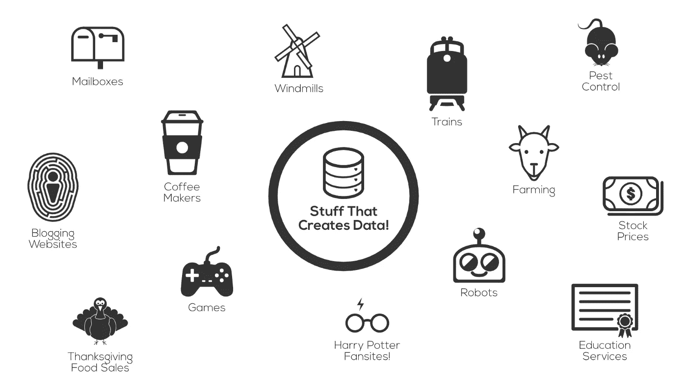

# 数据科学既是一门科学，也是一门艺术

> 原文：<https://towardsdatascience.com/how-data-science-can-be-as-much-an-art-as-it-is-a-science-a6715fc939c>

## 探索不断发展的技术领域中技术含量较低的一面

考虑一下你看过的任何一份数据科学领域的职位招聘信息，比如数据科学家或机器学习工程师。您可能会看到一系列技术要求，包括了解特定的编程语言、拥有统计建模方法的经验等等。当然，鉴于数据科学确实是一个高度技术性的领域，这是有意义的。我个人想不出有哪一份数据科学工作不需要使用计算机，也不需要一些数学背景。

现在对比一下平面设计领域的职位招聘。在成为一名机器学习工程师之前，我认为我想成为一名平面设计师，所以我对这些招聘信息非常熟悉。如果你不熟悉图形设计，实际上有一个相当大的技术要求，因为现在图形设计大部分是在计算机上完成的。这些技术技能主要包括知道如何正确使用软件工具，如 Adobe Creative suite(如 Photoshop、Illustrator)或 Serif 的 Affinity suite(如 Affinity Photo、Affinity Designer)。

正如你可能猜到的那样，平面设计职位和数据科学职位的主要不同之处在于，平面设计职位也非常需要非技术技能。很明显，我指的是需要有一些艺术上的造诣！一个平面设计师可以完全精通如何使用 Adobe Illustrator，但如果他们不知道如何制作好的艺术作品，他们可能不会在这个角色上取得成功。

在继续之前，让我们用我所指的艺术来明确我们的定义，特别是考虑到我可能刚刚用平面设计师的例子把水搅浑了。我指的并不是那种“在画布上作画”的艺术。我更倾向于将这种艺术理念称为创造性地使用工具以独特的方式解决问题的能力。高等教育将这些学位称为“艺术学士”，也可以包括工商管理、领导力和教育等领域。在所有这三个领域，高等教育教授许多技术课程，以更好地为学生未来的工作岗位做准备，但最成功的学生是那些最具创造性地使用他们在大学里学到的知识，以最好地适应他们在职业上的目标的人。不言而喻，并不是每个拥有领导力学位的人都是伟大的领导者。(反之亦然！)

所以我很好奇，数据科学的工作职位往往会掩盖这一领域。不要误会我的意思，我确实认为，鉴于这确实是一个主要的技术角色，所以非常强调技术非常重要，但公司不多强调一点数据科学的非技术方面会给自己带来伤害吗？我认为是的，为了帮助你理解我的想法，以一种你以前可能没有考虑过的方式重新构建数据科学是很重要的。让我们在下一节中探讨这一点。

# 将数据科学重构为一门艺术

几年前，我在 Coursera 上了一门名为[数学思维入门](https://www.coursera.org/learn/mathematical-thinking)的 MOOC 课程，老师是斯坦福大学教授 Keith Devlin 博士。**在最早的一次视频讲座中，德夫林博士将数学描述为“模式科学”，从而改变了我的生活我是认真的。在那之前，我从整体上理解数学的视角基本上不存在。我在这个时候的数学教育并没有真正超越高中数学，尽管我在高中数学上表现很好，但除了模糊的理解，我从来没有一个数学参考框架，嗯，它一定对工程师有好处！德夫林博士的这一见解几乎立刻改变了我的大脑，我对数学的欣赏从不存在变成了近乎崇敬。**

您可能已经意识到，数据科学很大程度上是建立在数学原理之上的，而将数学重新定义为“模式科学”有助于巩固这种联系。**我们关心数据科学领域的全部原因是为了在数据中发现对人类观察者来说不太明显的模式**。数学通过提供“工具”(算法)来帮助人们以多种方式理解数据，从而帮助了数据科学领域。想知道如何正确地将相似的数据分组在一起吗？K-means 或 DBSCAN 聚类算法支持您。想弄清楚一堆不同的数据特征如何预测一个二进制分类目标？只需看看逻辑回归或随机森林分类算法。尽管我们已经在改进如何在现代数据科学中使用数学算法方面取得了很大进展，但我真的很兴奋地认为我们可能只是触及了表面。我非常期待在未来我们能以非常酷的方式看到这些数学算法的新应用！

作者创作的插图

**但问题是:数据科学依赖于数据**。现在您可能会想，“谢谢你，明显队长，”但这给数据科学界带来了一个严重的问题。考虑上面的插图。我为[以前的博客文章](/an-aws-data-lake-with-s3-explained-c67c5f161db3)制作了这张图，在那里我简要地讨论了物理数据捕获在我们捕获数据的所有地方是如何爆炸的。物联网(IoT)市场在过去的五年里增长了很多，我预计它将继续增长。

让我们从数据上退一步，理解我们真正试图对整个数据科学行业做些什么。**我们真正在做的是寻找现实生活活动/现象中的预测模式**。无论是了解明天的天气，还是创造一辆自动驾驶汽车，我们人类基本上都在试图了解支撑这些活动的模式，以便我们能够采取适当的行动。如果这些事情没有一个模式，*数据科学领域就不会存在*。恰好数学算法是帮助我们理解这些模式的最好工具。

因为我们在现代数据科学中使用计算机，这意味着我们必须将现实世界“编码”成电子信息。当我说“电子信息”时，我当然指的是数据。问题是，总的来说，我们作为人类一直在努力以一种恰当地代表现实生活的方式来恰当地整理这个世界。部分问题纯粹是技术性的(例如，数据存储/压缩的发展)，但大部分问题来自于试图将语义捕获为数据。作为一个极端的例子，考虑一下这个:你将如何编纂爱？即使是浪漫的约会网站也很难解决这个问题！

因此，虽然物联网行业等行业继续寻求解决“数据不足”的问题，但现实是，我们几乎总是要通过这个我们称为“数据”的小窥视孔来更好地理解现实生活。数学算法无疑将继续成为数据科学领域的福音，但我们将不得不在如何使用数据和数学来创建这些数据科学解决方案方面有所创新。

(你知道我要去哪里了吗？😃)

当我们以创造性的、独特的方式使用工具集来解决不同的问题时，我们叫它什么？

我们称之为艺术。

# 雇主应如何考虑调整数据科学职位发布

当然，继续专注于技术技能仍然很重要，因为它们绝对是在数据科学职位上取得成功的基础，但我认为数据科学行业如果不专注于数据科学这一更艺术化的方面，就会给自己带来伤害。俗话说，任何老驴都可以踢倒一个谷仓，但它需要一个木匠来建造。同样，一个人完全有可能在计算机科学或数学方面非常倾向于技术，但缺乏创造力，这将抑制他们最大限度地发挥这些技能。(如果你想知道的话，是的，我知道在某些场景中，情况确实如此。)

现在你可能有理由怀疑，“我们如何评估艺术作为一种技能？”这个概念其实很简单。考虑前面提到的平面设计师工作。他们评估一个人艺术水平的方法是检查候选人的作品组合。**同样，雇主可以通过要求候选人的作品样本组合来评估候选人在数据科学艺术方面的熟练程度**。这是我做这些个人数据科学项目的众多原因之一，你可能已经在我以前的博客文章中读到过。我正在建立一个作品组合，它不仅锻炼了我的技术能力，还展示了我在使用这些技术技能来构建有用和酷的东西时的创造力。

事实上，最好的数据科学候选人已经这样做了。我有幸为我的雇主参加机器学习工程师面试，最成功的候选人会主动与像我一样的面试官分享他们的投资组合。作为我的机器学习工程师同事 Marcin Waz 的大喊，他通过分享[一个他完成的关于咖啡拿铁艺术](https://www.youtube.com/watch?v=GY7n2YlpZOc)图像分类的个人项目很好地展示了这一点。Marcin 显然能够展示他在该项目中的技术能力，他在一个独特、酷的项目中应用这些技能的独创性给我留下了深刻的印象。和我的其他机器学习工程师同事一样，在迄今为止与我们一起工作的 18 个月中，Marcin 已被证明是一名优秀的雇员。😃

# 总结想法

让我最后一次重申，让人们觉得我没有轻视它:在招聘数据科学候选人时，技术技能是绝对“必须”的。这个领域的技术技能永远不应该让位于数据科学更具创造性的一面。但是，如果你真的想雇用一名高质量的数据科学候选人，我强烈建议你考察如何评估候选人将数据科学作为一门艺术来应用的能力的机会。如果你发现自己站在面试者一边，可以考虑收集自己的个人作品来帮助展示这一点。显然，做到这一点可能很难，但我几乎可以向你保证，这将使世界变得完全不同。