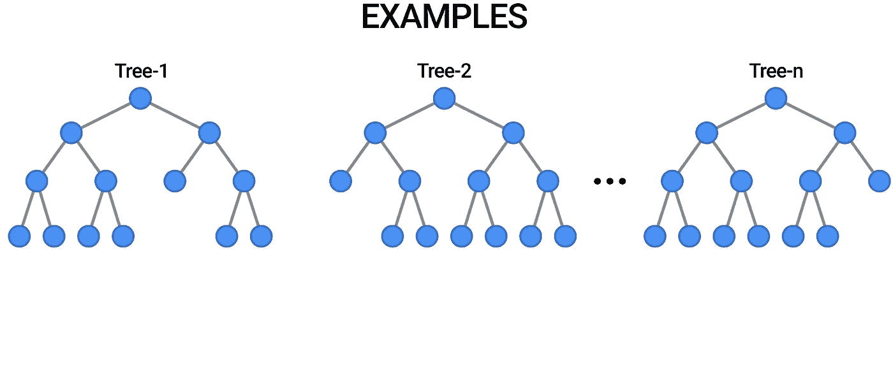
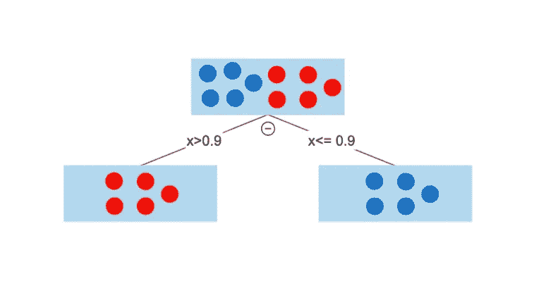
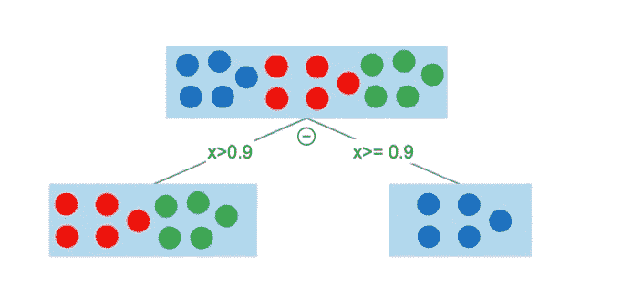
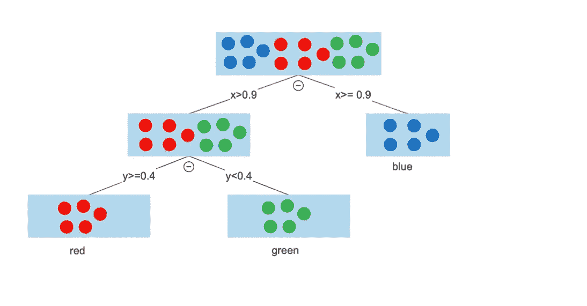
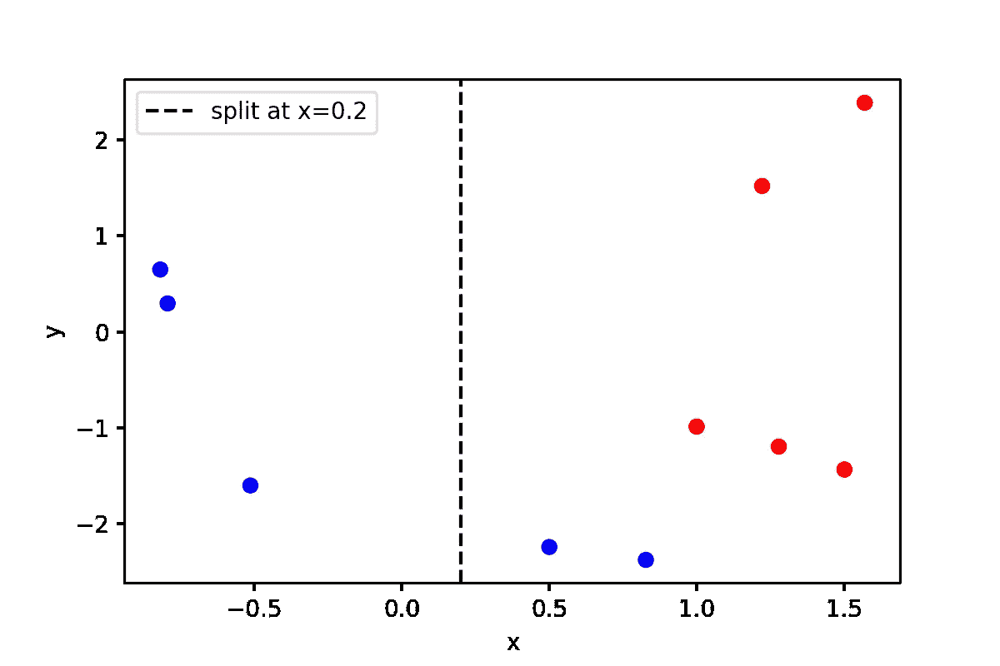

# 随机森林和决策树是如何决定的:用 Python 简单解释了一个例子

> 原文：<https://towardsdatascience.com/how-do-random-forests-decision-trees-decide-simply-explained-with-an-example-in-python-6737eb183604>

## 什么是决策树？什么是随机森林？他们如何决定分割数据？他们是如何在分类任务中预测类别标签的？9 分钟解释一切。



一个由 3 棵决策树组成的随机森林的可视化例子( [Source](https://blog.tensorflow.org/2021/05/introducing-tensorflow-decision-forests.html) )。

嗨伙计们！我希望你一切都好。我早就想写这个帖子了，所以现在就来了！我们开始吧！

# 介绍

*   随机森林是**一种用于分类、回归和其他任务的集成学习方法[1]。**它是一种非常著名的机器学习(ML)算法，被广泛应用！
*   **每个随机森林由多个决策树**(有道理；一个森林包含许多树！).
*   在**分类** **任务**中，随机森林的**输出**是**样本**的**类**。例如，您可以使用动物图像作为输入(以矢量化的形式)并预测动物种类(狗或猫)。
*   在**分类** **任务中，**我们需要有一个**标签为**的数据集。这是指**知道**每个**样本**(上例中的猫/狗)的**标签** / **类别**。

在我们了解**随机** **森林** (RF)如何工作和决策之前，我们需要先了解什么是**决策** **树**以及它们是如何工作的。

# 决策树

## 示例 1:理想情况

假设我们有一个标记为 **的**数据集**，总共有 **10 个样本**。这些样品中的 5 个属于狗类(蓝色)，其余 5 个属于猫类(红色)。此外，我们假设我们只有 2 个特征/变量，因此我们的变量空间是 2D。**

以下是创建数据集并绘制数据集的一些 Python 代码:

```
X , y = make_classification(n_samples=10, n_features=2, n_informative=2, n_redundant=0, n_repeated=0, random_state=0)c = ["blue" if i==0 else "red" for i in y]plt.figure(dpi=200)
plt.scatter(X[:,0], X[:,1], c=c)
plt.xlabel("x")
plt.ylabel("y")
plt.axvline(x=0.9, label="split at x=0.9", c = "k", linestyle="--")
plt.legend()
plt.show()
```


图 1:数据集的例子。作者用 python 制作的图。

**决策** **树**做的事情很简单:它们找到方法**分割**数据，例如**尽可能多地分离**类**的样本**(增加类的可分离性)。

在上面的例子中，**完美** **分裂**将是在 **x=0.9** 处的分裂，因为这将导致 5 个红色点在左侧，5 个蓝色点在右侧(**完美** **类** **可分离性**)。每次我们像这样分割空间/数据时，我们实际上构建了一个具有特定规则的决策树。

决策树将如下所示:



图 2:决策树。在 x=0.9 时分割。作者在 [smartdraw](https://www.smartdraw.com/) 中制作的图。

这里我们最初有包含所有数据的**根** **节点**，然后，我们在 **x=0.9** 处分割数据，导致两个**分支**，导致两个**叶** **节点**。由于我们不能进一步分割数据(我们不能添加新的决策节点，因为数据已经完全分割)，决策树构造到此结束。

无需在第二特征维度，即 **y** 轴上分割数据。

**进行新的预测:**如果我们将传递一个**新的** **样本**(例如，来自测试集)，该样本具有一个特征/变量 **x=5** ，它将在左叶节点结束，并将被分类为**类****红色**。

> 每次我们在一个特定的 x 或 y 坐标上分裂，我们就创建了一个决策节点！

## 示例 2:使用基尼系数的真实案例

通常，数据不能如此容易地分离，并且需要大量的努力/迭代(这在模型训练/拟合期间完成)来找到**最佳分割**。

但问题是:

> 我们如何用数学公式找到这些分裂？

让我们看看另一个例子，现在有 3 个类，每个类有 5 个样本。以下是创建数据集并绘制数据集的一些 Python 代码:

```
X,y = make_classification(n_samples=15, n_features=2, n_informative=2, n_redundant=0, n_repeated=0, random_state=1,n_classes=3, n_clusters_per_class=1)c = ["blue" if i==0 else "red" if i==1 else "green" for i in y]plt.figure(dpi=200)
plt.scatter(X[:,0], X[:,1], c=c)
plt.xlabel("x")
plt.ylabel("y")
plt.axvline(x=0.9, label="split at x=0.9", c = "k", linestyle="--")
plt.axhline(y=0.4, xmin=0, xmax=0.59, label="split at y=0.4", c = "pink", linestyle="--")
plt.legend()
plt.show()
```


图 3:数据集的例子。作者用 python 制作的图。

让我们首先使用和以前一样的初始规则(我们在 x=0.9 时分开)。



图 4:决策树。**在 x=0.9 处分割**。作者在 [smartdraw](https://www.smartdraw.com/) 中制作的图。

我们再次从一个包含所有数据的**根** **节点**开始，然后，我们在 **x=0.9** 处分割数据，导致两个**分支**，导致两个**叶** **节点**。右叶包含所有蓝色样本，左叶包含 ref 和绿色样本。

在这里，我们不能停下来，我们需要向前迈进一步。我们现在将在第二特征维度，即 **y** 轴上分割数据，以尝试从红点中修复绿点。

决策树变成(对于 y=0.4 的分割):



图 5:决策树。**第二个** **在 y=0.4 时分裂**。作者在 [smartdraw](https://www.smartdraw.com/) 中制作的图。

**进行新的预测:**如果我们将传递一个**新的** **样本**(例如，来自测试集)，该样本具有一个特征/变量 **x=5 和 y=-2** ，它将在左叶节点结束，并将被分类为**类****绿色**。

> 提醒:每次我们在一个特定的 x 或 y 坐标上分割，我们创建了一个决策节点！

# 基尼不纯与基尼收益

基尼系数背后的原理很简单:

*   假设您在我们的数据集中随机选择了一个样本。
*   接下来，根据数据集中的类分布对其进行随机分类。

**基尼杂质**告诉我们，我们对数据点分类错误的**概率是多少**【3】。

在上面的例子中，我们通过目视检查发现了完美的分离水平。然而，在现实世界的问题中，这是不可能的，因为样本和特征的数量很大。为了找到**最佳分割级别**(在每个特征维度中)，决策树**选择**最大化******基尼增益**【3】的**分割。**

> **可能的最佳基尼系数为 0，它对应于模型当前水平/状态下的最优分割。**

****数学** **公式**如下。**

**对于我们数据中的 **C** 类， ***p(i)*** 是选择属于 ***i*** 类的数据样本的概率， **Gini** **杂质** (G)由下式给出:**

****

**作者在 markdown 制作的公式。**

**现在，让我们回到我们的第一个(最简单的)例子(**例 1** )，**定义一个新的不良分割**并逐步估算**基尼杂质**和**增益**！**

**首先，让我们**估计** **p(i)对于每个类** ( **还没有拆分**):**

*   ****蓝色** **类**:我们 10 个样本中有 5 个是蓝色的，所以 **p(蓝色)= 5/10=0.5** 概率随机挑选一个蓝色样本。**
*   ****红色****

**现在，让我们估计**初始 G(还没有任何分割**):**

*   ****G0**= 0.5 *(1–0.5)+0.5 *(1–0.5)= 0.5**

**(50%的机会将其错误分类，因为我们有 4 个可能的事件，只有 2 个是正确的**，即**选择蓝色，将蓝色分类**，选择蓝色，将红色分类，选择红色，将蓝色分类，**选择红色，将红色分类**)。****

********

****图 6:数据集的例子。作者用 python 制作的图。****

****现在，让我们估计一下 **x=0.2 的“非完美”分割**的**基尼系数**。****

*   ******G _ left _ space**=(3/3)*(1–3/3)(蓝色)+ 0(无红色)= **0** (值不错，因为我们只有蓝点，没有红色，即杂质为 0)。****
*   ******G _ right _ space**=(2/7)*(1–2/7)(对于蓝色)+(5/7)*(1–5/7)(对于红色)= **0.4081** (此处杂质不为 0，因此这意味着分离包含不同类别的样品)。****

****通过从原始杂质 G0(无分割)中减去加权杂质(G_left & G_right)来计算最终基尼系数:****

*   ******Gini_gain** = G0 — (3/10)*0(左)— (7/10)*0.4081 = 0.5— (3/10)*0(左)— (7/10)*0.4081 = **0.214******

> ******提醒:基尼系数越高，分割越好**。****

****总之，决策树算法尝试了许多不同的分割，它估计每个分割的基尼系数，并根据最大基尼系数进行分割。**因此，我们最终得出基尼系数的最优分割。******

## ******任务**:现在尝试估算如图 1 所示的完美分割的基尼系数。****

****提示:你会很容易地发现 G0 = 0.5，G_left & G_right = 0，这样基尼增益为 0.5-(5/10)*0-(5/10)*0 = **0.5！******

# ****随机森林****

****既然你已经理解了决策树是什么，以及它是如何找到最佳分裂的(基于基尼增益)，那么是时候介绍**随机**森林**了。******

******随机森林**只不过是决策树的集合。这里需要注意的一件重要事情是，对于随机森林中的每个唯一决策树，随机森林通常使用可用变量/特征的子样本，而不是所有变量/特征。****

****例如参见[https://sci kit-learn . org/stable/modules/generated/sk learn . ensemble . randomforestclassifier . html](https://scikit-learn.org/stable/modules/generated/sklearn.ensemble.RandomForestClassifier.html)模型中的输入参数“ **max_features** ”。****

****最后，随机森林通常通过采取**多数** **投票**或构成森林的**个体决策树**的**平均**预测类来决定。****

# ****结论****

****决策树和随机森林是强大的机器学习模型，可用于回归和分类。在分类问题的情况下，如上所述，最佳分割是基于基尼系数进行的。****

****在不久的将来，我将写一篇纯 python 的文章，展示如何使用 sklearn 和真实数据拟合模型。****

****请务必订阅我的邮件列表，以免错过！****

****那都是乡亲们！希望你喜欢这篇文章。有什么问题吗？把它们作为评论贴出来，我会尽快回复。****

****如果你想在交互式路线图和活跃的学习社区的支持下自学数据科学，看看这个资源:[https://aigents.co/learn](https://aigents.co/learn)****

# ****敬请关注并支持这一努力****

****如果你喜欢这篇文章并觉得有用，**关注**我，确保你订阅了我的邮件列表并成为会员:****

*   ******短短 5 秒我的邮件列表**:[https://seralouk.medium.com/subscribe](https://seralouk.medium.com/subscribe)****
*   ******成为会员，支持我**:[https://seralouk.medium.com/membership](https://seralouk.medium.com/membership)****

# ****参考****

****[1][https://en.wikipedia.org/wiki/Random_forest](https://en.wikipedia.org/wiki/Random_forest)****

****[【2】https://www.smartdraw.com/](https://www.smartdraw.com/)****

****[【3】https://en.wikipedia.org/wiki/Decision_tree_learning](https://en.wikipedia.org/wiki/Decision_tree_learning)****

# ****和我联系****

*   ******领英**:[https://www.linkedin.com/in/serafeim-loukas/](https://www.linkedin.com/in/serafeim-loukas/)****

## ****您可能还喜欢:****

****</support-vector-machines-svm-clearly-explained-a-python-tutorial-for-classification-problems-29c539f3ad8>  </k-means-clustering-how-it-works-finding-the-optimum-number-of-clusters-in-the-data-13d18739255c>  </lstm-time-series-forecasting-predicting-stock-prices-using-an-lstm-model-6223e9644a2f>  </time-series-forecasting-predicting-stock-prices-using-an-arima-model-2e3b3080bd70>  <https://medium.com/@seralouk/the-best-free-data-science-resources-free-books-online-courses-9c4a2df194e5>  </roc-curve-explained-using-a-covid-19-hypothetical-example-binary-multi-class-classification-bab188ea869c>  </support-vector-machines-svm-clearly-explained-a-python-tutorial-for-classification-problems-29c539f3ad8>  </pca-clearly-explained-how-when-why-to-use-it-and-feature-importance-a-guide-in-python-7c274582c37e>  </everything-you-need-to-know-about-min-max-normalization-in-python-b79592732b79>  </how-and-why-to-standardize-your-data-996926c2c832> ****