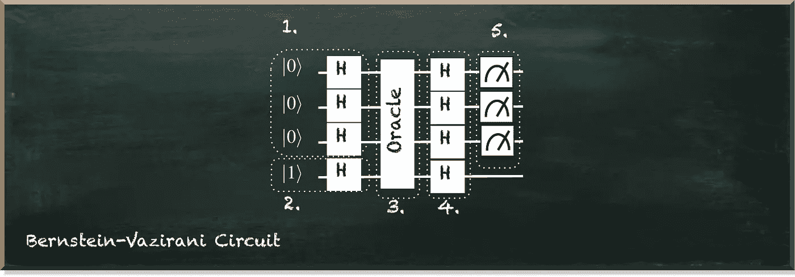
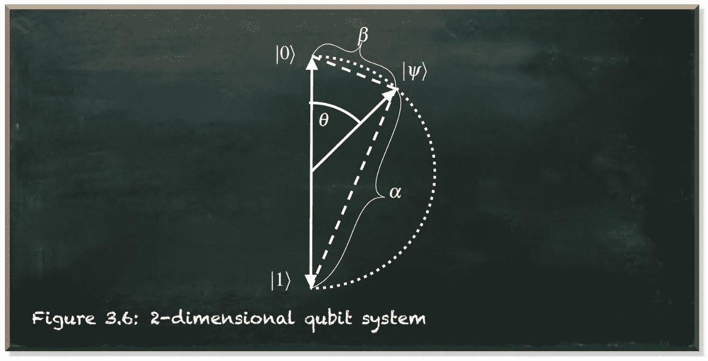
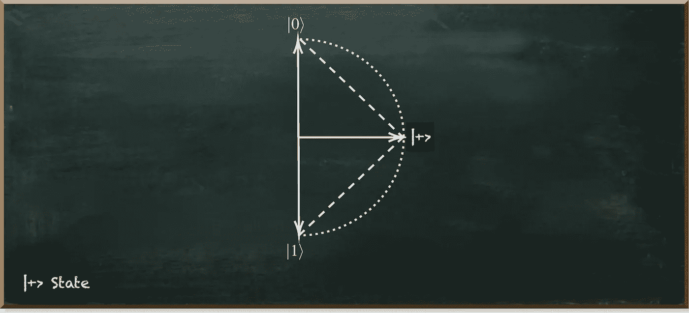
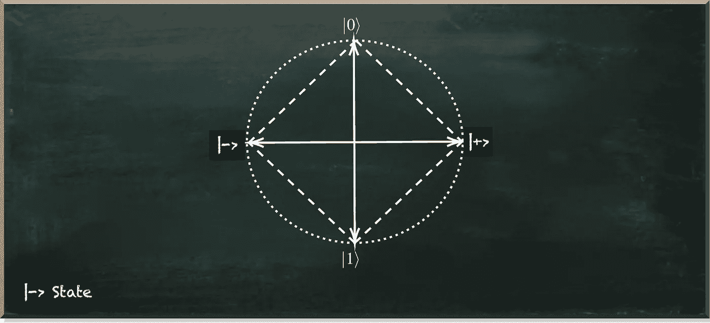

# 伯恩斯坦-瓦齐拉尼量子电路是如何工作的？

> 原文：<https://towardsdatascience.com/how-does-the-bernstein-vazirani-quantum-circuit-work-f69cb037f40f>

## 打破密码术的量子算法的第一个例子

当彼得·肖尔提出能够有效分解数字的算法时，量子计算变得很有名。

它在 It 安全领域引起了轩然大波，因为现代非对称加密认为分解大数实际上是不可能的。因此，这种算法威胁到我们今天使用的加密技术，使我们所有的秘密都变得脆弱。

然而，Shor 的算法并不是第一个破解加密的算法。这就是伯恩斯坦-瓦齐拉尼算法。而且，这是理解 Shor 算法的一个至关重要的前提和基础。

Bernstein-Vazirani 算法可以在一次传递中识别一个秘密的二进制字符串(参见本文)。对于这个问题，一个经典算法需要 n 个步骤，其中 n 是字符串中的位数(见本文)。

如下图所示，Bernstein-Vazirani 算法由五部分组成:

1.  在|+⟩状态下叠加的一组量子位，每个量子位代表一个数字。
2.  |−⟩.态中的一个辅助量子位
3.  代表秘密密钥的量子预言
4.  使量子比特脱离叠加
5.  量子位的测量

作者图片

如果你是量子计算的新手，第一部分可能已经很难理解了:一系列叠加的量子位。但它是你掌握任何量子电路都需要了解的基本概念。

量子位是一个二维系统，如下图所示。可视化的极点代表|0⟩和|1⟩.这两个基本州箭头是量子态矢量。接近极点(基态)表示振幅，其平方是量子位被测量为 0 或 1 的概率。简单来说，量子态向量越接近|1⟩基态，量子位被测量为一的概率就越高。

作者图片

量子位基态向量对|0⟩和|1⟩的近似的线性组合表示量子叠加。

在 Bernstein-Vazirani 算法的例子中，我们把量子位放在一个特定的状态:|+⟩.在这种状态下，两个基态的接近度是相等的。因此，测量两个结果之一的概率是 0.5。

作者图片

我们通过在|0⟩.态的量子位上应用哈达玛门来达到这个状态

第二部分是|−⟩.状态下的辅助量子位这个态几乎等于|+⟩态，因为到两个基态的接近度也是相等的。因此，测量两个结果之一的概率也是 0.5。

但是如果我们用图形来看量子位状态，我们会看到它指向|+⟩状态向量的相反方向。

作者图片

我们通过将哈达玛门应用于|1⟩态的量子位来实现|−⟩态。

顺便说一句，我们已经确认了哈达玛门对量子位元的重要影响。它把|0⟩国家变成了|+⟩，把|1⟩变成了|−⟩.而且，这在第 4 步中会变得很重要，它会自我反转。因此，如果我们在|+⟩态的量子位元上加上哈达玛门，它就会回到|0⟩态。最后，将它应用于|−⟩态的量子位，它就处于|1⟩态。

如果我们现在跳过第 3 步，直接看第 4 步，我们看到我们再次将哈达玛门应用于所有的量子位。所以我们把他们从他们的|+⟩和|−⟩州转移出来，让他们回到|0⟩和|1⟩的基地州。如果我们在第五步中测量它们，当它们处于这样的基态时，就不再有随机性了。如果我们在|0⟩态测量一个量子位，我们总是得到 0。如果我们在|1⟩态测量一个量子位，我们总是得到 1。

现在让我们回到步骤 3。这里我们使用一个量子预言机来实现我们想要识别的秘密字符串。例如，假设我们的秘密二进制字符串是 101(从右向左读)。

我们对二进制字符串中代表 0 的量子位不做任何处理。相反，我们为二进制字符串中的每个 1 添加一个受控非门。这里，我们用代表数位的位置上的量子位作为控制量子位，辅助量子位作为目的量子位。

受控非门有两种作用。首先，它反转目标量子位元的状态向量的振幅。因为在辅助位的|−⟩态中，两个基态的振幅相等，所以我们可以忽略这种影响。

第二，它将目标量子位的相位复制到控制量子位。这被称为相位反冲。这个阶段将|+⟩国家与|−⟩国家区分开来。即使这些状态具有相同的状态振幅，它们仍然是不同的。

我们已经在上面了解了这种差异是如何发生的。哈达玛门把|+⟩变成了|0⟩，把|−⟩变成了|1⟩.

因此，由于用作目标位的辅助位处于|−⟩状态，受控非门将控制位从|+⟩翻转到|−⟩.

因此，第四步中的哈达玛门将控制量子位元从|−⟩翻转到|1⟩.但是他们没有对这些留在|+⟩.的量子位做任何事情这些又变成了|0⟩。

当我们最终测量量子位时，它们揭示了秘密的二进制串。

伯恩斯坦-瓦齐拉尼算法没有像肖尔算法那样受到重视。然而，它第一次展示了量子计算机如何加速秘密字符串的发现，例如用于加密的字符串。

<https://pyqml.medium.com/membership>  

不要错过下一集，订阅我的[子栈频道](https://pyqml.substack.com/)。

量子机器学习要不要入门？看看 [**动手量子机器学习用 Python**](https://www.pyqml.com/page?ref=medium_howbreak&dest=/) **。**

在这里免费获得前三章。