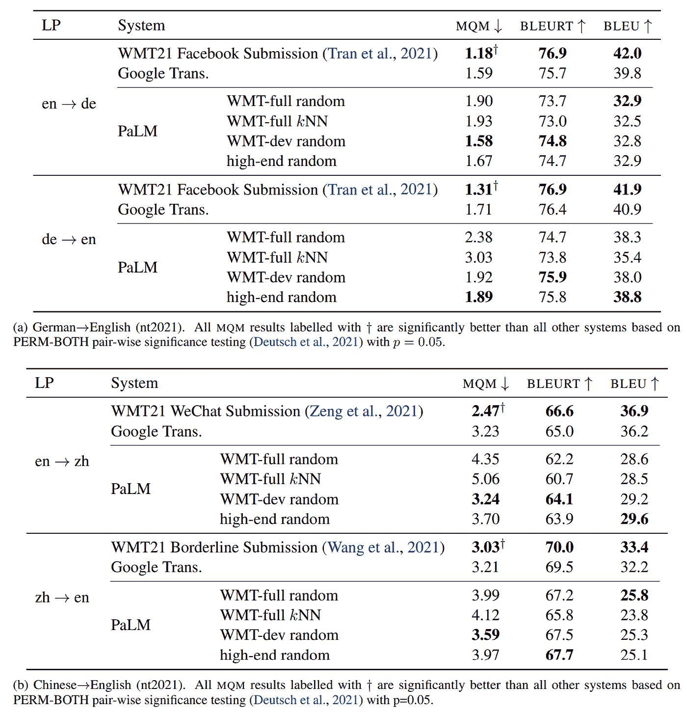

# Google PaLM 的翻译有多好？

> 原文：<https://towardsdatascience.com/how-good-is-google-palm-at-translation-f4a40c2ce562>

## 不太好，但我们正在努力


图片来自 [Pixabay](https://pixabay.com/illustrations/cat-mouse-silhouette-gray-mouse-1218093/)

自 GPT-3 发布以来，机器翻译中已经引入并评估了其他几种大型语言模型。

*但是与标准的机器翻译编码器-解码器方法相比，大型语言模型在翻译方面有多好？*

很遗憾，我们不能轻易回答这个问题。

用于翻译的大型语言模型的评估**通常过于草率或不完整**而无法得出可信的结论。

为了得到一个明确的答案，谷歌的一个研究团队提出了第一个广泛的评估，将一个大型语言模型与最先进的机器翻译系统进行比较。

这项工作已于 arXiv(11 月 28 日)公开发布，由大卫·维拉、马库斯·弗莱塔格、科林·切里、罗家明、维莱什·拉特纳卡和乔治·福斯特提出。

在这篇博客文章中，我回顾了他们的工作，分享了我的评论，并总结了他们的发现。我还指出了为什么我认为这项工作中进行的评估是杰出的，并呼吁对语言模型进行更好的评估的主要原因。

# 语境

GPT-3、FLAN 以及最近出现的 PaLM 等语言模型都展示了令人印象深刻的翻译能力。

GPT-3 和 PALM 甚至声称其翻译质量与一些标准的机器翻译系统不相上下。

然而，这些声明仅仅基于机器翻译的标准自动评估指标 BLEU 的改进。众所周知，蓝色与人类判断的相关性很差。

[](/bleu-a-misunderstood-metric-from-another-age-d434e18f1b37) [## BLEU:来自另一个时代的被误解的指标

### 但是今天仍然在人工智能研究中使用

towardsdatascience.com](/bleu-a-misunderstood-metric-from-another-age-d434e18f1b37) 

需要使用**更好的自动指标和/或手动评估**进行评估，以确认语言模型和标准机器翻译系统实现了相似的翻译质量。

对大型语言模型的良好评估还应该全面报告**提示是如何设计和选择的**。

> ***什么是提示？***
> 
> 让我们定义一个提示是作为语言模型的输入给出的文本。它可以包含我们希望模型完成的任务的描述和/或任务的例子，例如翻译。

在 PaLM 和 GPT-3 论文中，没有公开用于机器翻译实验的提示，以及用于**少量提示**的翻译示例的选择策略，尽管众所周知，这些模型的性能会根据提示而显著变化。

> ***什么叫少拍才貌双全？***
> 
> 大型语言模型通常不是为特定任务而训练的。由于预先训练，我们可以通过简单地包括一些任务的例子来教他们一个任务。例如，在这部作品中，PaLM 提示了 5 个翻译示例。

在他们的工作中，Vilar 等人首先评估了制作和选择提示的不同策略。

他们选择最有前途的，然后使用 BLEURT 作为自动评估指标，使用 [MQM 框架(Lommel et al .，2014)](https://ddd.uab.cat/record/130144) 进行人工评估，来评估语言模型 PaLM 和标准机器翻译系统的翻译质量。

> ***什么是 BLEURT？***
> 
> [*BLEURT*](https://github.com/google-research/bleurt)*的知识库给出了如下定义:“* BLEURT 是一个自然语言生成的评价度量。它将一对句子作为输入，一个参考和一个候选，并返回一个分数，该分数指示候选人的流利程度并传达参考的意思。
> 
> **这是一种最先进的神经度量，与机器翻译评估的 BLEU 相比，它与人类判断的相关性更好。**

# *机器翻译的提示*

*他们使用以下提示设计:*

```
*[source]: X₁
[target]: Y₁
... 
[source]: Xₙ
[target]: Yₙ
[source]: X
[target]:*
```

*其中*【源】*和*【目标】*是英语中的语言名称，Xₙ是要翻译的【源】语言中的句子的一些示例，Yₙ是它们在【目标】语言中的相应翻译，x 是我们想要翻译的当前句子。有了最后一行“*【target】:*”，我们期待语言模型生成 x 的翻译。*

*Vilar 等人假设提示的设计对于少镜头提示是“不重要的”。他们没有引用任何以前的工作来支持这个假设。它可能来自于他们在初步实验中的观察，尽管我相信它强烈依赖于所使用的语言模型。*

*假设提示设计不重要，也有助于使文章更简洁，以专注于更关键的方面，如少数镜头提示的翻译示例的选择。*

*这些例子的来源是翻译数据集，在本文的剩余部分，我将把它们称为*池*。*

*他们探索了不同的策略来从给定的库中选择样本:*

*   *随机选择*
*   **k*-最近邻(kNN)搜索*

**k* NN 搜索从池中检索 *k* 个句子的例子，以及它们相应的翻译，也就是最接近我们想要翻译的句子的**。***

*为了衡量句子的接近程度，他们使用了两种不同的模型来嵌入句子:*

*   *单词袋(蝴蝶结)*
*   *罗伯塔*

*他们通过使用 [ScaNN](https://github.com/google-research/google-research/tree/master/scann) 保持了 *k* NN 搜索的高效性。*

*在他们的评估中，他们发现 RoBERTa 的 NN 比 BOW 检索到更多有用的例子。*

**注意:为了使本文简洁，我不会进一步详述他们这方面的工作。**

# *提示池*

**

*照片由[克拉克·泰](https://unsplash.com/@clarktai?utm_source=medium&utm_medium=referral)在 [Unsplash](https://unsplash.com?utm_source=medium&utm_medium=referral) 上拍摄*

*翻译示例选自 3 种不同类型的资源库:*

*   *混合了多个领域和风格的百万翻译的大数据集，表示为 *WMT 全集。**
*   *一个由几千个翻译组成的小数据集，其领域和风格与我们要翻译的数据相同，标为 *WMT 开发*。*
*   *包含不到 200 个段落翻译的微小数据集，手动选择，但在域和风格上可能与要翻译的数据不匹配，称为*高端*。*

*基于使用这三个库的实证实验，作者发现**选择高质量的翻译是最重要的**。尽管风格和领域不匹配，从高端池中选择例子的结果接近于从 WMT 开发池中选择例子的结果。*

# *出色的评价*

**

*图片来自 [Pixabay](https://pixabay.com/illustrations/darts-goal-target-direct-hit-arrow-2349364/)*

*他们主要使用由 [WMT21](https://github.com/wmt-conference/wmt21-news-systems) 发布的评估数据集对德语-英语和汉语-英语语言对进行评估。*

*它们还显示了英语-法语的结果，但是使用了可能已经包含在被评估的机器翻译系统的训练数据中的旧得多的评估数据集。作者公开评论了这个问题，并提供了该数据集的结果，只是为了遵循在 [PaLM 论文](https://arxiv.org/abs/2204.02311)中提出的原始评估设置。他们没有从英法的结果中得出任何明确的结论。*

*让我们看看他们如何展示他们的主要成果:*

**

*David Vilar、Markus Freitag、Colin Cherry、Jiaming Luo、Viresh Ratnakar 和的表格(谷歌)*

*那可是一大堆数字啊！*

*但是我认为它们都是需要的，并且是相关的，以便从实验中得出结论。*

*正如我们之前讨论的，他们分别用 **MQM 和**来报告人工和自动评估。BLEU 在这里只是为了与 PaLM 论文中给出的结果进行一些比较。他们评论说，BLEU 是误导性的，如果他们的评估仅仅基于 BLEU，他们的结论就会改变。*

*有趣的是，作者没有自己建立任何机器翻译系统，而是选择了提交给 WMT21 的公开翻译。这种选择使得他们的结果具有**再现性**。*

*他们也评价谷歌翻译。通常，我会认为对这种黑盒系统的评估是不可信的，因为我们不知道它是否是根据评估数据进行训练的(即，可信的数据泄漏)。作者考虑了这个可能的问题，并通过直接咨询谷歌翻译团队确认**没有任何数据泄露**。这似乎是评估中显而易见的一步，但这实际上很少被评估商业系统的研究人员所证实。*

*我还注意到，他们没有从以前的工作中复制任何数字，即所有的分数都是由作者计算的，这与 PaLM 论文中报告的评估相反，确保所有的分数都是可比的。*

*这是我在一篇机器翻译研究论文中看到的最科学可信的评价之一(相信我，[我研究了 900+的机器翻译评价](https://github.com/benjamin-marie/meta_evaluation_mt))。总而言之，我们有:*

*   *使用最先进的框架(MQM)和详细的翻译错误计数进行人工评估*
*   *使用最先进的度量标准(BLEURT)进行自动评估*
*   *PERM-BOTH 的统计显著性检验*
*   *确认不存在数据泄漏*
*   *为了更好的再现性，评估了一些翻译的可用性*
*   *确认分数都是可比较的，即使用相同的指标、符号化等进行计算。*
*   *使用 SacreBLEU 进行 BLEU 评分，以及相关签名，以确保评分的可重复性，从而能够在未来的工作中进行比较。*

# *他们得出了什么结论？*

> *SOTA 系统比最好的 PaLM 结果有 1 到 3 个 BLEURT 点的显著优势，这一差距反映在他们低得多的 MQM 分数上。*

*换句话说，标准的机器翻译系统明显优于 PaLM。*

*即使我们只看报告的 BLEU 分数，PaLM 和 WMT21 系统之间的差异似乎是突出的。*

*这一发现与 PaLM 论文(第 6.5 节)中进行的评估相矛盾，该评估发现 PaLM 优于以前的最佳系统。不同之处在于，PaLM 中的评估仅基于已为旧机器翻译系统计算的 BLEU 分数和/或使用的不可比较的标记化…*

# *限制*

*这项工作的主要限制，也是作者承认的，是 PaLM 实际上不是在独立的句子上训练，而是在文档上训练。*

*可以有把握地认为，如果 PaLM 翻译较长的文本以获得更多的上下文，PaLM 和标准机器翻译系统之间的翻译质量差距将不会那么明显。*

*另一方面，标准的机器翻译系统是在独立考虑的句子上训练的。*

*因此，在句子级别运行和评估系统会使评估偏向机器翻译系统。*注:PaLM paper 中进行的原始评估也是在句子级别进行的。**

*评估还遗漏了对使用自动度量计算的结果的统计显著性测试。它们在 BLEU 中显得很重要，但很难一眼就判断 BLEURT 中的差异是否真的很重要。*注:鉴于布鲁分数和 MQM 分数之间的差距，我想说它们是显著的，但还需要进一步证实。**

*[](https://pub.towardsai.net/yes-we-need-statistical-significance-testing-927a8d21f9f0) [## 是的，我们需要统计显著性检验

### 经验法则可能会产生正确的结果，但在科学上是不可信的

pub.towardsai.net](https://pub.towardsai.net/yes-we-need-statistical-significance-testing-927a8d21f9f0) 

据我所知，作者没有发布 PaLM 生成的用于评估的提示和翻译。我希望他们会。这将允许研究社区研究它们，并促进在未来的工作中使用不同的指标进行比较，类似于 [Meta AI 为 No Language Left Behind](https://github.com/facebookresearch/fairseq/blob/nllb/examples/nllb/evaluation/README.md) 所做的工作。

这是特别需要的，因为 MQM 评价是昂贵的和难以复制的。他们似乎还使用了一种定制的 BLEURT 模型，这种模型还没有(还没有？)公开提供，防止了 BLEURT 乐谱的复制。* 

# *结论*

*标准的机器翻译系统仍然优于大型语言模型。*

*事实证明，PaLM 比 FLAN 和 GPT-3 等其他同类机型在翻译方面更胜一筹。我们可以预期 Vilar 等人得出的结论可以扩展到这些其他模型。*

*尽管如此，重要的是要记住，机器翻译系统和语言模型不是在相同的数据上训练的，并且具有非常不同的计算成本。*

*PaLM 是一个 5400 亿参数的模型，但是可以翻译，不需要经过翻译方面的直接训练。另一方面，机器翻译系统具有低得多的计算成本，但是需要训练大量的翻译。*

**如果你喜欢这篇文章，支持我工作的最好方式就是使用我的链接成为一个媒体成员:**

*[](https://medium.com/@bnjmn_marie/membership) [## 通过我的推荐链接加入媒体-本杰明·玛丽

### 阅读本杰明·玛丽(以及媒体上成千上万的其他作家)的每一个故事。您的会员费直接支持…

medium.com](https://medium.com/@bnjmn_marie/membership) 

*如果你已经是会员，想要支持这项工作，* [*就在 Medium*](https://medium.com/@bnjmn_marie) *上关注我吧。**