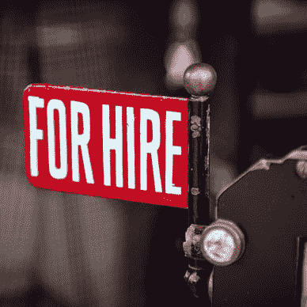

# 我如何成为一名数据科学家

> 原文：<https://towardsdatascience.com/how-i-became-a-data-scientist-7f5b10606612>

[ev](https://unsplash.com/@ev?utm_source=unsplash&utm_medium=referral&utm_content=creditCopyText) 在 [Unsplash](https://unsplash.com/collections/8358587/data-science?utm_source=unsplash&utm_medium=referral&utm_content=creditCopyText) 上的照片

## 我的经济学博士之旅

作为一名拥有经济学博士学位的数据科学家，我总是会收到很多关于我为什么选择成为数据科学家的问题，以及我的旅程是怎样的。我认为这是一个很好的机会来分享我的经验，特别是我做对和做错的事情，以帮助任何对数据科学感兴趣但来自不同背景的人。

# **为什么是经济学博士**

早在 2015 年，我很兴奋地获得了经济学博士学位，并开始了在美国的研究生学习。我在大学期间曾是美国的交换生，这里的教育质量给我留下了深刻的印象，因此我决定在这里继续我的研究生学习。对于专业的选择，我没有想太多。我本科主修经济学，我对经济学家解释世界规则的方式非常着迷。当时继续学习经济学是一个自然的选择。当我申请这些项目时，我表达了我对教学的热情，我决心进入学术界，因为我的梦想是成为一名教授。我知道这将是一个艰难的旅程，但我已经准备好迎接挑战。

# **为什么不是学术界**

当我作为本科生直接进入博士项目时，我对什么是研究有着模糊的、可能是错误的印象。我受到了许多不同领域的研究人员的启发，他们决心扩展某些领域的知识前沿，但很快就发现了在不断研究没有正确答案的事物时处理模糊性的困难。我真的很难想出研究想法，并用值得信赖的方法来实现它们。渐渐地，我意识到我想从事快节奏的项目，在我进入“修改和改进”的兔子洞之前，我可以在早期阶段收到反馈并看到我的影响。因此，我把目光放到了学术界之外，开始在这个行业寻找潜在的机会。

# 为什么选择数据科学

该行业有许多经济博士的潜在职位，因为我们在学校解决的问题和培养的技能与公司在许多领域的需求相吻合。我的研究背景是实证研究，即使用数据驱动的方法解决问题。面对一个问题，如何获取相关数据，如何清洗数据，如何从数据中驱动洞察来回答问题，是我每天在完成论文时练习的内容。我在一个章节的数据分析过程中遇到了 Python，并参加了在线课程，以了解更多关于 Python 的知识，并了解数据科学。当我发现我的技能已经部分符合成为一名数据科学家的要求后，我对数据科学的兴趣开始出现并持续增长。

# 我是如何成为数据科学家的

参加 Python、机器学习基础和其他数据科学技术的在线课程是第一步。利用 Python 来完成我论文中的数据分析过程确实给了我征服这种语言的良好开端。然后我在我的一篇论文章节中得到了一个使用机器学习算法的想法，并与另外两位有相同兴趣的同事一起实现了它。在这种背景下，我申请并获得了为期八周的数据科学训练营的奖学金，这是我真正涉足各种项目并发展相关技能的时候。训练营还提供职业指导、求职帮助和校友小组，帮助我更多地了解数据科学家每天都在做什么，并增强了我申请数据科学家职位的决心。关于训练营的更多细节，你可以在这里阅读文章:

  

作为一个在提高数据科学技能的同时从动手项目中受益的人，我想回馈社会，我正在开发一门[数据科学课程，其中包含时间序列预测中的动手项目](https://www.greedyacademy.com/training-product-detail/supply-chain-optimization)，面向那些有兴趣学习时间序列分析并接触行业最佳实践的人。不幸的是，该课程目前只有中文版，但我会有一系列的博客帖子来提供与该课程相关的教程和有趣的实践。如果你有兴趣参加这个课程，请在这里或在 [LinkedIn](https://www.linkedin.com/in/zijingzhu/) 上给我发短信。

# 申请数据科学家职位

对于那些跟踪我一段时间的人来说，你可能知道我的求职之旅并不容易。这是一个长达七个月的过程，一路上有很多拒绝。这是对自信的不断挑战，让我多次怀疑自己是否做出了正确的选择。当我回头看时，我很感激自己没有轻易放弃，继续为下一次面试做准备。终于有了回报。我还写了一篇文章来分享整个经历，你可以在这里查看:

  

在漫长的求职过程中，我真正受益的不仅是宝贵的面试经验，还有我写的总结每次面试准备的文章，许多人发现这些文章对准备自己的面试也很有用:

[朱](https://zzhu17.medium.com/?source=post_page-----7f5b10606612--------------------------------)

## 数据科学面试准备

[View list](https://zzhu17.medium.com/list/data-science-interview-preparation-bfb0986a61a3?source=post_page-----7f5b10606612--------------------------------)5 stories

# 我作为两家公司的数据科学家的旅程

时光飞逝，现在我已经做了一年半多的数据科学家。中间换过公司，也许以后会分享更多关于如何边应聘边准备面试的细节。在这里，我想重点谈谈我作为一名数据科学家所做的工作。

基本上，我在这两家公司所做的事情都符合我的期望。作为一名博士，我可能会在研究和建模方面承担更多的责任，我在探索和应用新方法方面得到了同事和经理的信任。我也一直从事端到端的项目，这意味着我负责一个项目从收集数据到交付最终产品的整个过程。我的第一份工作是以项目为基础的，在这份工作中，我和我的同事参与不同的项目，解决不同的问题。我现在的职位有一个固定的目标，就是做时间序列预测。虽然目标是相同的，但为了提高预测的准确性，我们需要不断调整我们的模型和方法，以应对不断变化的宏观经济形势。这两个职位都具有挑战性，但也是有益的，在那里我可以看到我的工作是如何投入生产的，或者我的预测是如何被上游采纳的。反馈，不管是积极的还是消极的，都显示了我工作的影响，这是激励我不断改进的动力。

数据科学是一个具有挑战性的职位，需要不断学习，因为世界在快速变化，技术变化更快。它有如此多的潜在用例，并且它一直在塑造所有公司做出数据驱动决策的行业。我担任这一角色的时间越长，我就越意识到数据科学不仅仅是我所认为的花哨的数据分析、高级建模或复杂的编码，而是与不同团队的合作、揭示和交流见解以及数据故事有关。在下一篇文章中，我将讨论如何成为一名优秀的数据科学家，以及我根据自己的经验遵循的七条原则:

  

总而言之，我从经济学博士到数据科学的旅程包含了很多快乐、挑战、拒绝、满足等等。我很高兴能在一个既有激情又有技能的岗位上工作。希望这篇文章给那些处于职业生涯或任何人生十字路口的人一个参考点，如果它能以某种方式激励任何人，我会很激动。感谢您的阅读！如果感兴趣，请查看我的其他文章:

  

订阅我的电子邮件列表:

  

注册成为中级会员:

  

或者在 YouTube 上关注我:

 