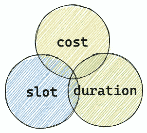
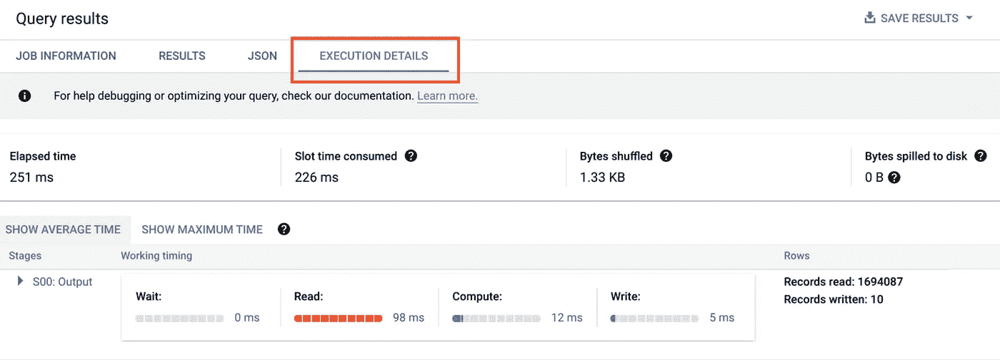
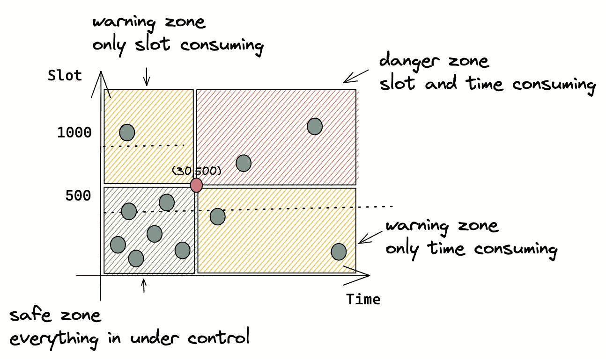
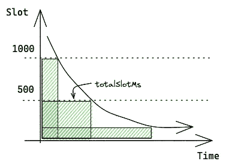
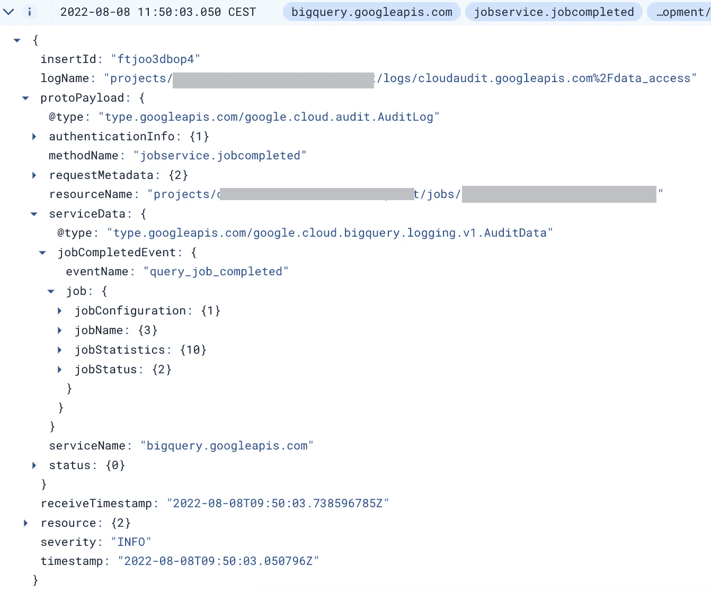
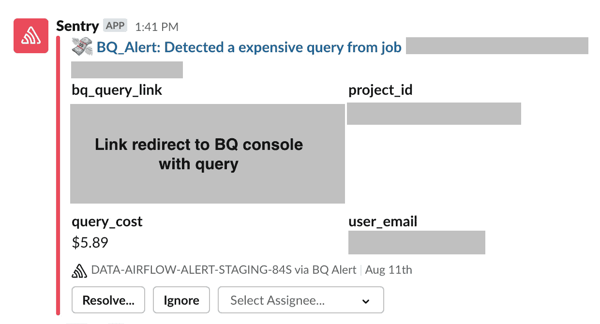

# 如何构建实时 BigQuery 管道以节省成本和规划容量

> 原文：<https://towardsdatascience.com/how-i-build-a-real-time-bigquery-pipeline-for-cost-saving-and-capacity-planning-15712c97f058>

## BigQuery 中的成本和资源管理

摩根·豪斯尔在 [Unsplash](https://unsplash.com/) 上的照片

C 当数据工程师使用基于云的大数据堆栈时，成本和资源控制是一个重要问题。如果没有这方面的知识，您可能很容易面临极高的云服务账单，或者收到组织对缓慢环境的投诉。除了包含节省成本的技巧和诀窍的备忘单之外，另一个最佳实践是实施监控和警报，以实现以下目标:

*   发现组织中任何人执行的昂贵/繁重的查询。数据仓库可以在整个组织中共享，包括那些不一定理解 SQL 但仍然试图寻找信息的人。一个警告是警告他们低质量的查询，数据工程师可以帮助他们良好的 SQL 实践。
*   在早期阶段发现昂贵/繁重的预定查询。如果一个预定的查询是非常昂贵的，这将是有风险的。有适当的警报可以防止月底的高额账单。
*   了解资源利用率，更好地进行容量规划。

每个云提供商都有不同的规则，在本文中，我们将重点关注 BigQuery。我将讨论如何评估查询作业以及如何在 GCP 建立实时警报系统。无论你是管理资源的工程师还是收到账单的经理，这都是适合你的文章！

## 三个维度—成本、时段、持续时间

BQ 查询的 3 个维度

我们从三个角度评估查询——成本、时段和持续时间。

***成本***

大多数组织，尤其是初创公司，都在节约成本上下了很大功夫。相信我，这本身就是一个有趣的话题。每次我通过优化查询来省钱时，我都会超级兴奋，就好像我从谷歌赚了钱一样。如果查询是一个预定的查询，好处甚至会被放大。值得注意的是，BigQuery 提供了 2 个[定价模型](https://cloud.google.com/bigquery/pricing#flat-rate_pricing)不同的成本节约策略。Google 有一篇[文章](https://cloud.google.com/blog/products/data-analytics/choosing-bigquery-pricing)可以帮助你选择定价模式。

[按需定价](https://cloud.google.com/bigquery/pricing#on_demand_pricing):你为每个查询处理的字节数付费(每 TB 5 美元)。您可以通过减少查询处理的字节数来直接降低成本。**成本监控和警报对于按需定价模型非常重要，因为技术上没有成本上限。**

按需定价适用于数据量可预测的工作负载(例如报告工作负载)。这里有一些示例警报规则，用于查找昂贵的计划作业和不可预测的昂贵的临时请求。**如果临时请求的成本太高，您可能希望将临时请求转移到具有统一费率定价的项目中。**

*   > X 美元/查询
*   > X 美元/用户/天
*   > X 美元/工作/天
*   > X 美元(特别/月)
*   …..

[统一价格](https://cloud.google.com/bigquery/pricing#flat-rate_pricing):您需要为专用的查询处理能力付费，以槽位为单位(2000 美元/月/100 个槽位)。这里监控成本不太重要，因为每个月都是一样的。但是您可以通过使用更少的槽来提高查询的运行效率，从而降低成本。在这种情况下，监控您的插槽使用情况更有意义。

统一费率定价适用于具有 SLA 或临时请求的工作负载，这些工作负载需要成本可预测性和容量保证。通过 [BigQuery Reservations](https://cloud.google.com/bigquery/docs/reservations-intro) ，可以在组织之间共享插槽。例如，具有高服务级别协议的项目 a 保留 1000 个时隙，具有临时请求的项目 b 保留 300 个时隙。如果目前没有太多的特别请求，projectA 可以从 projectB 借用插槽，反之亦然。但是当 projectA 运行时，BigQuery 会自动且无中断地抢占已经与其他项目共享的槽。并且您不关心临时请求扫描了多少数据。

**资源—时间段和持续时间**

无论您选择哪种定价模式，插槽数量都将是固定的。(2K 用于按需定价模式，X 用于统一费率定价，具体取决于您购买的插槽数量)。那么什么是插槽，为什么我们需要监控它呢？

> BigQuery [槽](https://cloud.google.com/bigquery/docs/slots)是 BigQuery 用来执行 SQL 查询的虚拟 CPU。BigQuery 根据查询的大小和复杂程度，自动计算每个查询需要多少个槽。

如果同时运行太多复杂的查询，查询需求将超过您承诺的槽。BigQuery 不会对额外的槽收费，但是您的单个工作单元会排队。您可以在查询作业的[执行细节](https://cloud.google.com/bigquery/docs/query-plan-explanation)中找到它们的性能。每个作业都分为几个阶段:等待、读取、计算和写入。等待阶段的高峰时间意味着 BigQuery 可能会耗尽存储槽。

[BQ 作业执行详情](https://cloud.google.com/bigquery/docs/query-plan-explanation)

容量规划需要监控插槽使用情况。**如果你看到太多的查询在排队，你可能会想改变你的定价模式，或者购买更多的插槽，或者考虑如何让你的查询更有效。**值得从 BigQuery 查看[优化查询计算](https://cloud.google.com/bigquery/docs/best-practices-performance-compute)页面。

好，我们知道什么是插槽。但是我们应该如何设置警报规则呢？我们可以从简单的东西开始—基于插槽容量的硬编码值。假设我们固定了 1000 个插槽。如果一个查询使用超过 500 个槽，那么它肯定是一个危险信号，需要进一步调查。

然而，这可能会导致许多误报，因为我们需要另一个维度:**时间。**如果一个查询平均使用 600 个槽，但是只运行了 10 秒，我们要不要报警？而 vice visa，如果一个查询运行 30 分钟却平均只用了 50 个槽呢？

这完全取决于你的团队的 SRE 战略。我推荐[谷歌 SRE 图书](https://sre.google/books/)学习 SRE 原则和最佳实践。经验法则是**警报应该是可操作的。**

在这个图中，我可视化了 3 个查询及其时间/时隙使用情况。绿色查询使用了很多槽，但是运行速度很快。黄色查询需要很长时间，但只使用了几个时间段。红色查询介于两者之间。

具有不同资源使用的查询(由[高](https://medium.com/u/2adc5a07e772?source=post_page-----15712c97f058--------------------------------)创建)

比方说，我的警报策略是找出占用太多空间太长时间的查询，因为它们可能会妨碍关键工作负载。找到阈值的一个技巧是对历史作业及其时间和插槽信息有一个整体的了解(我将在下一节讲述如何做到这一点)。在下面的例子中，我的阈值是(持续时间> 30 分钟，时间段> 500)。一个保守的团队也可能会考虑黄区。

BQ 资源阈值(由[高](https://medium.com/u/2adc5a07e772?source=post_page-----15712c97f058--------------------------------)创建)

查看阈值的另一个方法是使用查询的*区域，*，即 *totalSlotMs=duration*slot。*这是查询在其整个执行时间内消耗的槽总数，以毫秒为单位。

基于 totalSlotMs 的 BQ 资源阈值(由[高](https://medium.com/u/2adc5a07e772?source=post_page-----15712c97f058--------------------------------)创建)

好吧！我们已经学习了如何从三个不同的维度衡量一个查询，以及如何定义阈值。接下来，我们将看到如何从 BigQuery 中检索信息。

## 监控 BigQuery 作业的实时管道

接收 BQ 警报的实时系统(由[高](https://medium.com/u/2adc5a07e772?source=post_page-----15712c97f058--------------------------------)创建)

BigQuery 为监控查询提供了不同的选项，例如通过 [INFORMATION_SCHEMA](https://cloud.google.com/bigquery/docs/information-schema-intro) 或 [BigQuery 监控图表](https://cloud.google.com/bigquery/docs/admin-resource-charts)。本文关注的是 [BigQuery 审计日志](https://cloud.google.com/bigquery/docs/reference/auditlogs/)，它是实时管道的最佳数据源。流水线包含 3 个阶段。

**LogsRouter —将 BigQuery 数据访问日志路由到 PubSub**

云审计日志是一个日志集合，提供对与您使用包括 BigQuery 在内的 GCP 服务相关的运营问题的洞察。每个数据访问作业都流入审计日志。

BigQuery 数据访问日志示例(由[高](https://medium.com/u/2adc5a07e772?source=post_page-----15712c97f058--------------------------------)创建)

你可以通过[接收器](https://cloud.google.com/logging/docs/export/configure_export_v2)将日志路由到不同的[目的地](https://cloud.google.com/logging/docs/export/configure_export_v2#supported-destinations)，比如云存储、发布/订阅和大查询。其中，发布/订阅是最好的选择，因为它天生适合实时用例。在接收器中，您可以包含一个与您想要包含的日志条目相匹配的过滤器。否则，发布/订阅主题将被不相关的消息过载。

接收器过滤器示例

接收器过滤器示例

**PubSub—将日志路由到云函数进行处理**

PubSub 本质上是一个队列。我们需要像 cloud function 这样的订阅者来消费日志并处理它们。创建主题后，可以点击“触发云函数”按钮，用任何编程语言创建云函数。这多容易啊！

创建云功能的按钮

**云功能—处理日志并发送警报**

每个过滤后的日志都会触发一个云函数，日志以 JSON 格式呈现，如上例所示。您可以在这里查看最新的审计日志模式。我们将利用`JobStatistics`部分进行警报。

作业统计示例

下面是一段解析 BigQuery 审计日志的示例代码。

解析 BigQuery 审计日志的示例代码(由[高](https://medium.com/u/2adc5a07e772?source=post_page-----15712c97f058--------------------------------)创建)

根据阈值，警报区域中的作业将被发送到您在团队中拥有的任何通信渠道。在我的团队中，我们使用 [Sentry](https://sentry.io/welcome/) 作为集中的问题跟踪和监控平台。每个有问题的作业都被发送给 Sentry，然后 Sentry 会以更好的格式发送给 Slack。这是我们最终的结果！

通过哨兵(由[高](https://medium.com/u/2adc5a07e772?source=post_page-----15712c97f058--------------------------------)创建)在空闲时收到的示例警报

## 结论

一如既往，我希望这篇文章对你有用，并能给你启发。一旦有了合适的基础设施，您就有很大的空间来尝试不同的监控和警报策略。干杯！

## 参考

<https://cloud.google.com/blog/products/data-analytics/bigquery-audit-logs-pipelines-analysis> 