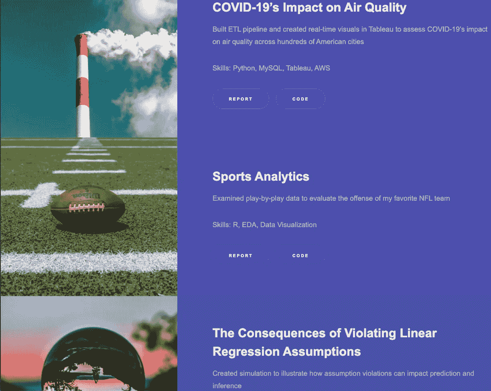

# 我如何在 4 个月内找到一份数据分析师的工作

> 原文：<https://towardsdatascience.com/how-i-landed-a-data-analyst-job-in-4-months-96ee08944ea2>

## 通过数据分析师面试指南

图片来自 [Unsplash](https://unsplash.com/photos/6ie6OjshvWg) 上的 [LinkedIn 销售解决方案](https://unsplash.com/@linkedinsalesnavigator)

在疫情的鼎盛时期，我找到了第一份数据分析师的工作。作为一个没有什么经验的应届毕业生，这绝对是一个挑战。但是经过四个月的申请、面试和准备，我收到了多份工作邀请。在本文中，我将解释在这些面试中你可以期待什么，以及你如何才能最好地准备获得你的第一份数据分析师工作。

# **技术评估(SQL、R、Python)**

图片由[卡斯帕·卡米尔·鲁宾](https://unsplash.com/@casparrubin)在 [Unsplash](https://unsplash.com/photos/fPkvU7RDmCo) 上拍摄

大多数数据分析师面试都包括一项技术评估，以测试你在相关语言(如 SQL、Python 或 r)方面的编码能力。评估要么现场进行——在面试官面前解决问题——要么通过[带回家的作业](/acing-the-data-science-take-home-assignment-530a93164e52)进行。我经历了更多的现场采访，这是一种不同于作业的体验(稍后会有更多的介绍)。

## **SQL**

在大多数数据分析师角色中，SQL 技能是必需的，因为您需要它来从数据库中检索数据。如果您不能提取数据，那么您就无法完成工作—没有数据，就没有分析。我面试的几乎每家公司都给了我一份 SQL 评估，通常是在初步筛选之后。那么，我到底是怎么准备 SQL 评估的呢？对我来说，解决 SQL 练习题是最有用的。 [HackerRank](https://www.hackerrank.com/domains/sql) 和 [Leetcode](https://leetcode.com/problemset/database/) 都是很棒的资源。HackerRank 上的简单级问题非常适合学习基础知识(即加入、聚合、过滤等)。).Leetcode 问题有点复杂。我发现，一旦我能够始终如一地解决 Leetcode 上的简单问题(目标是在 15 分钟内解决)，我在 SQL 评估方面就没有问题了。我建议你在回答这些问题时大声思考，因为这在[现场编码面试](https://www.youtube.com/watch?v=uLCFCzVLi4Q)中是有望的。很多时候，面试官更感兴趣的是你如何表达你的思维过程，而不是你如何得出完美的解决方案。此外，如果你沟通清晰，面试官通常会提供提示，或者在你遇到困难时给你指明正确的方向。

除了帮助我通过 SQL 评估，花时间解决这些挑战对我目前的数据分析师角色来说也是无价的。虽然 Leetcode 问题的背景与我在工作中面临的不同，但我从解决这些问题中学到的技巧在工作中也是适用的。

## **Python/R**

虽然我的技术评估中没有包含 Python 或 R，但我为它们准备了很多，因为[这些工具对于任何数据分析师都是必要的](https://www.section.io/engineering-education/why-python-is-essential-for-data-analysis/)。我喜欢网站[数据营](https://www.datacamp.com/courses/intro-to-python-for-data-science)，因为它的游戏化学习方式。虽然像 Datacamp 这样的网站帮助我学习基本概念，但我只在从事项目工作后才对自己的编码能力感到满意，因为它让我能够在现实环境中应用这些概念。这就是为什么如果你是这个领域的新手，参与项目是很重要的原因之一(见下一节)。

# **建立投资组合**

图片来自作者的[作品集](https://hajimealabanza.github.io/myportfolio/)

对于那些几乎没有经验的人来说，建立一个投资组合是必要的。

拥有相关项目组合的一个好处是，它能让你的简历脱颖而出。因为数据分析是一个热门领域，所以你要和一大群候选人竞争。如果你是这个领域的新手，许多候选人会比你更有经验，所以建立一个作品集是让你的申请更有竞争力的一种方法。事实上，有一家公司主动联系我，因为他们对我的投资组合印象深刻，并希望讨论我的项目。

拥有作品集的另一个好处是它会在面试中给你更多的弹药。作为一名应届毕业生，我没有什么专业经验，所以有一个作品集让我在面试时有更多话题可谈。这也证明了我有能力解决问题，尽管我缺乏工作经验。

你应该做什么样的项目？我建议做一些原创的东西。所谓原创，我指的是一个项目，在这个项目中，你定义自己的问题，提取自己的数据，清理数据，然后分析这些数据——分析 Kaggle 的泰坦尼克号数据集不会让你脱颖而出。一个原创的项目不仅表明你有能力解决分析问题，还表明你对这个领域感兴趣，并且干劲十足。我已经联系了[我的投资组合](https://hajimealabanza.github.io/myportfolio/)作为例子。此外，[这篇文章](/5-steps-to-develop-unique-data-science-project-ideas-6c2b3a0014b)可以帮你开拓项目思路。

# **对你的项目有深入的了解**

图像由[空气聚焦](https://unsplash.com/@airfocus)在[未溅射](https://unsplash.com/photos/K_VeavYEfdA)上

准备好详细谈论你的项目。

在每次面试中，我都被要求谈论我参与的一个项目。大多数时候，面试官让我选择项目。在这些情况下，我选择了我最引以为豪的项目。首先对你的项目做一个高层次的概述(动机、目标、方法、结果等)。).面试官会问一些后续问题(你从哪里得到的数据，你面临的最大挑战等等。)，所以要做好准备。能够回答后续问题将表明你是一个有效的沟通者，是数据分析师的一项重要技能，能够从头到尾承担一个分析项目。了解你工作的细节也能让你提供更详细的答案。例如，面试官可能会问你是否了解任何数据可视化工具。如果你能谈谈你利用 Tableau 构建仪表板的那段时间，而不仅仅是说是，会更有影响力。

# **行为问题**

图像由 [NeONBRAND](https://unsplash.com/@neonbrand) 在[上取消绘制](https://unsplash.com/photos/2RRq1BHPq4E)

最后，不要忘记准备行为问题。根据我的经验，我面试的每家公司都会问我行为问题，而且通常是多轮。

为了做准备，我研究了[面试中常见的行为问题](https://www.springboard.com/blog/data-science/data-science-interview-questions/#behavioral)，并大声练习我的答案。很明显，你不想记住一个脚本，但是，通过练习，你不太可能在面试中出错。试着想出与数据分析相关的回答，并提供例子来支持它们(参见 [STAR 方法](https://www.kforce.com/articles/common-behavioral-interview-questions/))。

# **结论**

图片由[菲利普·姆罗兹](https://unsplash.com/@mroz)在 [Unsplash](https://unsplash.com/photos/C3Qs4MbxeKY) 拍摄

通过在上述领域做好准备，你应该能在几个月内找到一份数据分析师的工作。我再怎么强调准备的重要性也不为过，尤其是对那些缺乏工作经验的人来说。现实是，如果你缺乏经验，你将不得不提交许多申请才能获得成功——这就是我的经验。有鉴于此，你必须充分利用每一次面试机会。面试愉快，祝你好运！

图片由 [Katrina Wright](https://unsplash.com/@littleforestowl) 在 [Unsplash](https://unsplash.com/photos/yMg_SMqfoRU) 上拍摄