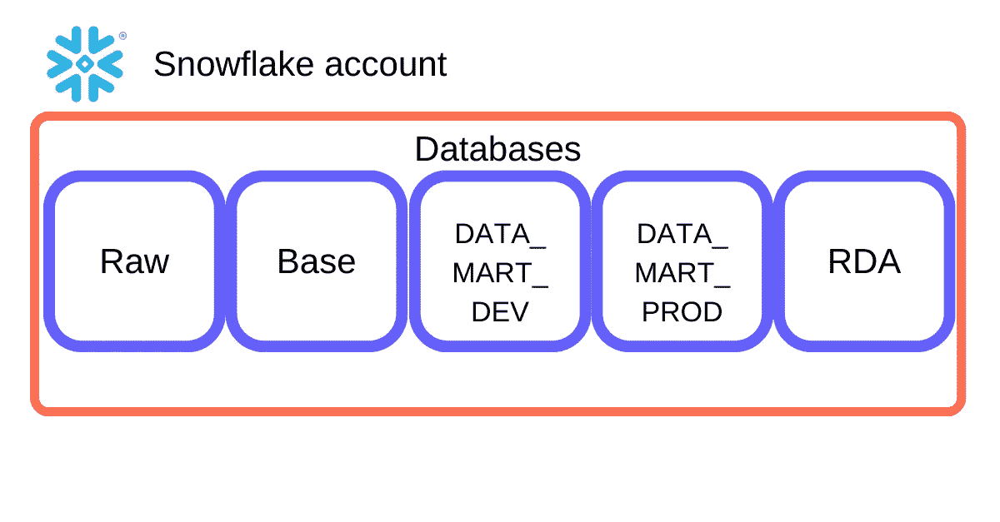
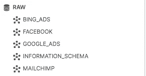
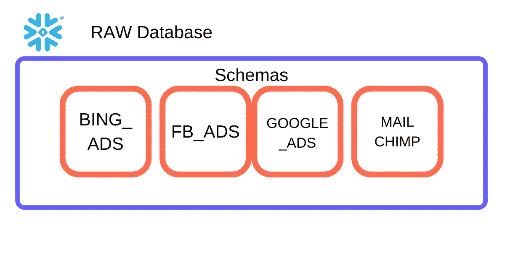
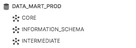
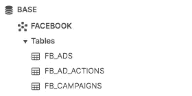

# 我如何组织我的雪花数据仓库

> 原文：<https://towardsdatascience.com/how-i-organize-my-snowflake-data-warehouse-996965fe51dc>

## 存储数据的数据库、模式和表

娜娜·斯米尔诺娃在 [Unsplash](https://unsplash.com/s/photos/warehouse?utm_source=unsplash&utm_medium=referral&utm_content=creditCopyText) 上的照片

您的数据仓库是您现代数据堆栈的中枢。数据通过像 [Airbyte](https://airbyte.com/) 这样的数据摄取工具流入其中，确保原始数据可用。数据在其中使用 SQL 和现代数据转换工具(如 dbt)进行转换。然后，数据从 it 流向业务用户和数据可视化平台。

所有数据都存在于您的仓储解决方案中*。*

这是一个强大的工具。你需要确保你做得对。您数据的完整性取决于制定此解决方案的分析工程师、数据工程师和数据分析师。考虑到不同的因素，如开发和生产、安全性和业务用例，必须正确地完成。

在本文中，我解释了如何组织我的雪花数据仓库，以便尽可能少出错。我将介绍如何决定您的数据仓库解决方案，确定您的数据库、模式和不同类型的表。

# 为什么选择雪花作为你的数据仓库？

在整篇文章中，我将特别提到雪花作为我的数据仓库解决方案。我认为雪花是市场上最好的数据仓库。雪花是专门在云上构建的，这意味着您和您的团队可以随时随地访问它。Snowflake 速度很快，允许您根据预算轻松扩展或缩减计算能力。雪花也使得在许多用户之间共享数据变得容易。

在我们开始对您的数据仓库架构做出所有决策之前，让我们讨论一下雪花数据仓库的组件。雪花数据仓库架构由不同的数据库组成，每个数据库都有自己的用途。雪花数据库包含模式来进一步分类每个数据库中的数据。最后，最细粒度的级别由表和视图组成。雪花表和视图包含您熟悉的典型数据库表的列和行。

# 组织您的雪花数据库

您的数据仓库有三个主要组件。您接收原始数据的位置。数据转换发生的位置(通常使用 dbt)。以及存储报告和实验的位置。

作者图片

# 存储原始数据

先说第一个地点。您将在哪里将原始数据导入到雪花中？我建议创建一个雪花数据库来接收所有的原始数据。这应该是任何数据首先到达的地方。

重要的是始终保存一份原始数据的副本，以防出现问题。拥有一个原始副本将允许您在发现其中一个错误时重新运行您的数据模型。

唯一可以完全访问它的系统必须是您的摄取工具。在我的例子中，它是 Airbyte，一个开源数据摄取工具，您可以使用它从任何可用的源连接器将数据加载到雪花中。Airbyte 会将所有原始数据转储到您专门为摄取而创建的“原始”数据库中。除非使用另一个摄取工具，否则其他任何人都不应该将数据转储到这个位置。

作者图片

# 存储转换后的数据

现在，数据仓库中有几种类型的转换。首先，也是最简单的，是基本模型。这些是对原始数据进行的基本转换，以便分析师和分析工程师在数据模型中使用它们。我写了另一篇关于[为这些基本模型创建 dbt 风格指南](https://airbyte.com/blog/best-practices-dbt-style-guide)的文章。

在设计雪花架构时，避免从原始数据库中读取转换是一个最佳实践。您的数据模型应该总是从包含这些基础模型的另一个雪花数据库中读取。

这本质上是一个类似于“原始”数据库的数据库，但有一些基本的转换，如数据类型转换和字段名更改。为了简单起见，我称我的为“基础”。dbt 通常称之为“分期”。

“基础”数据模型也是视图，而不是表。这在您的雪花仓库中节省了成本，因为您没有存储底层数据的完整副本。相反，你正在创建一个生活在它上面的层。

因为这些数据总是相同的，无论是在开发还是生产中，都不需要创建单独的环境。视图不需要每天自动化和部署，因为它们只是从原始数据中读取。

与您的其他转换一样，这些将是您使用 dbt 构建的更复杂的模型。这些都需要开发和生产环境。您不希望一个数据库同时包含开发和生产模型，所以最好为每个模型创建不同的数据库。

我把我的叫做“数据集市开发”和“数据集市产品”。

作者图片

这两个数据库都从“基本”数据库的表中读取数据，但一个用于测试数据模型的创建，另一个由业务部门验证、编排和依赖。您的“DATA_MART_PROD”表应该每天创建一次，或者使用编排解决方案更频繁地创建。

请记住，使用 dbt 在雪花中创建的表是 [*瞬态表*](https://docs.snowflake.com/en/user-guide/tables-temp-transient.html) 。这些表类似于永久表，只是它们在 Snowflake 上没有完整的历史。这有助于节省存储成本，但也是为什么总是保留所有原始数据的副本很重要的另一个原因。

# 为报告和实验存储数据

出于报告和实验的目的，分析师通常希望编写更长的一次性查询。随着查询的编写，有了一个地方来存储这些查询，以便业务用户和可视化工具可以访问它们。

因为这些通常只编写一次，不需要每天自动运行，所以您不希望在开发或生产中存储它们。我们在 BI 工具中完成大部分报告，使用生产中内置的数据模型，而不是在雪花中。

然而，如果您在雪花中自动化您的报告，在“DATA_MART_PROD”中创建这些报告可能是一个更好的主意。

在我的雪花环境中，我为这些数据创建了一个名为“RDA”的数据库。在这里，分析师可以从他们的查询中创建表，然后供其他人使用。

您可能想知道，如果这些是一次性的分析，为什么我首先需要存储它们？如果这些查询非常复杂，您不会想要在可视化工具中直接使用它们。你会想要利用雪花的速度和力量来运行它们。此外，通过这种方式，您将能够方便地引用以前的报告代码，以便将来查询。

作者图片

在这里，您可以看到我的数据库的雪花架构是什么样子的。注意还有“UTIL_DB”、“雪花”和“DEMO_DB”。这些是默认情况下用任何雪花帐户创建的。“雪花”主要用于内部雪花设置，涉及权限、账户使用和账户历史。“UTIL_DB”和“DEMO_DB”可以删除。

一旦确定了要创建的数据库，就可以在雪花工作表中运行下面的[命令](https://docs.snowflake.com/en/sql-reference/ddl-database.html#database-management)来实现这个目的:`create database [database_name]`

# 组织您的雪花模式

既然已经创建了数据库，就可以确定需要在每个数据库中构建的模式了。雪花模式作为一种更细粒度的方式来组织数据库中的表和视图。它们应该帮助您更快地编写查询，确切地知道在哪里可以找到某些数据。

# 原始数据和基本模型

您的“原始”和“基础”数据库应该由完全相同的模式组成。“BASE”本质上只是原始数据库的副本，但是应用了基本的转换。在这两个数据库中，我建议为每个数据源创建一个新的模式。

作者图片

例如，如果您从 Google Ads、脸书、Bing Ads 和 Mailchimp 获取数据，您将为其中的每一个创建不同的模式。您的数据库将如下所示:

作者图片

每个雪花数据库都包含默认模式“PUBLIC”和“INFORMATIONAL_SCHEMA”。虽然我建议删除“PUBLIC”，但“INFORMATIONAL _ SCHEMA”包含描述每个模式内容的视图。这个可以派上用场，留着也无妨。

当您添加新的数据源时，您可以轻松地为每个数据源创建一个新的模式。现在，当访问原始数据或基本模型时，您知道在哪里可以找到您需要的每一个数据。

# 开发和生产模型

类似于“RAW”和“BASE”，“DATA_MART_DEV”和“DATA_MART_PROD”应该具有相同的模式。它们是彼此的精确副本，除了一个用于开发目的，另一个由业务团队验证和使用。其中，我只使用了两种模式:“中间”和“核心”。

作者图片

作者图片

这些术语通常在 [dbt 文档](https://github.com/dbt-labs/corp/blob/master/dbt_style_guide.md)中使用。**中间模型**是介于基础模型和最终产品之间的模型，或者核心数据模型。它们是 SQL 文件的输出表，不一定用于分析，但却是构建最终模型的重要一步。唯一真正需要访问它们的人是分析工程师，或者是编写它们的人。

**核心模型**是数据模型的最终产品。它们是代码序列中最后一个 SQL 文件产生的表。这些是数据分析师和业务用户需要在您的生产环境中访问的。所有分析、仪表板和报告都将基于这些数据模型构建。

# 组织雪花表和视图

在决定如何命名表和视图之前，需要决定何时使用它们。如果您不熟悉的话，视图充当表，但不是数据的物理副本。它是一个位于底层表之上的 SQL 查询，如果您正在寻找一个安全的解决方案或省钱的方法，这是一个很好的选择。

就我个人而言，我在 Snowflake 中为我所有的基础和中间模型使用视图。因为基本模型只包含原始数据的基本转换，所以实际上不需要存储另一个完整的副本。至于中间模型，因为分析师不直接查询，所以没必要在上面浪费存储空间。

但是，我的原始数据和核心数据模型总是表。您的原始数据需要以表格的形式存储为物理副本。这对您的核心数据模型也很重要，因为这些模型通常每天都在运行，并且经常被访问。你希望历史记录存在。

# 表和视图的命名约定

雪花表和视图的名称与 dbt SQL 文件的名称相同。dbt 自动生成与代码所在的文件名同名的表和视图。因此，正如我在上一篇文章中所分享的，创建一个一致的、强大的 [dbt 风格指南](https://medium.com/geekculture/how-to-best-organize-your-dbt-project-3d285d063a4d)是非常必要的。

如果您在 dbt 中查看我的 SQL 文件的名称，您将会看到在我的雪花模式中作为表生成的那些确切的文件名。例如，我有 *fb_ads.sql* 、 *fb_campaigns.sql* 和 *fb_ad_actions.sql* 作为 sql 文件，它们包含我的基本模型的代码。如果您查看我的“BASE”数据库和“FACEBOOK”模式，您可以将这些确切的文件名视为表格。

作者图片

作者图片

# 结论

确保通过规划和设计数据库、模式和表/视图来开始构建雪花架构的过程。在你知道你的整个数据生态系统是什么样子之前，你不想创造任何东西。

我建议记录您的雪花数据仓库架构的每一部分及其背后的目的。在决定最适合您的体系结构之前，请与您的团队一起多次查看此文档。

记住，这个过程不是一劳永逸的。随着新的业务用例的出现，您将添加新的数据库、模式和表。而且，如果你觉得有些东西不适合你，不要害怕去改变它。

有许多不同的方法来组织您的雪花数据仓库架构。我见过在数据库中通过模式分离环境的团队，在生产环境中自动化报告的团队，以及拥有多个开发和生产数据库的团队。这完全取决于什么对你的用例有意义。

我的团队只有一名分析工程师，就是我。所以我不知道这个架构如何与在 dbt 中编写数据模型的多个分析工程师一起工作。

作为唯一一个用 dbt 写作的人，它工作得很好，创造了一种非常简化的做事方式。请关注第二部分，了解如何在雪花数据仓库中设置用户、角色和权限。

更多关于分析工程、现代数据堆栈和雪花的信息，[订阅](https://madisonmae.substack.com/)我的免费每周简讯。