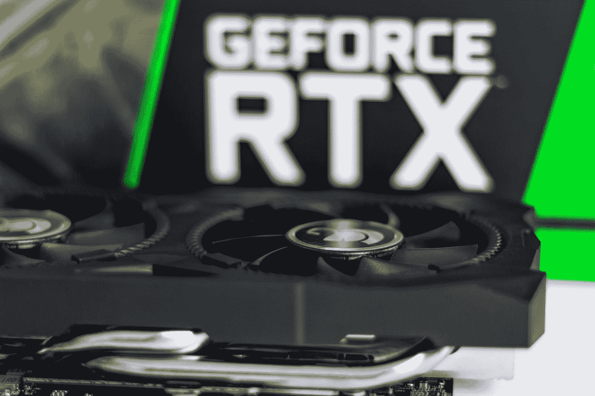

# 我是如何在英伟达获得一个数据科学家的实习机会的

> 原文：<https://towardsdatascience.com/how-i-secured-an-internship-at-nvidia-as-a-data-scientist-28f50c009a3d>

克里斯蒂安·威迪格在 [Unsplash](https://unsplash.com?utm_source=medium&utm_medium=referral) 上拍摄的照片

**英伟达**是一家为游戏玩家以及深度学习和人工智能目的制造**图形处理器(GPU)**的公司。它最近涉足人工智能领域，正在为无人驾驶汽车、医疗应用和推荐系统构建计算平台。它目前是世界上第八大最有价值的公司，其股票和收入都在稳步增长。

在 NVIDIA**实习可能会很艰难，尤其是在毕业期间成为一名数据科学家实习生。一个人必须在这个过程中付出巨大的努力，并且展示出这个行业最需要的技能。确保雇主和招聘人员认可你的才能的最好方法之一是建立有趣的工作组合，展示你的技能和优势。进入英伟达还有其他方法，要么去一所好大学，确保你保持良好的 GPA。**

以下是我作为数据科学家在英伟达获得实习机会的一些步骤。

1.  **坚持练习**

这是我非常强调的最重要的提示，这就是我如何能够建立一个可靠的项目组合，同时不断学习机器学习所需的最新技能和工具。当一个人坚持不懈地工作时，通常情况下，与一次做完所有事情而不停顿相比，他不需要付出太多的努力。因此，我建议做的一件事是坚持不懈地研究数据科学，比如阅读博客、文章、听视频、构建有趣的项目以及其他许多事情。确保你定期进行所有这些活动，以便通过努力，你学会在该领域取得进展，并对深度学习和数据科学领域的主题和进展建立良好的理解。

罗伯特·鲁杰罗在 [Unsplash](https://unsplash.com?utm_source=medium&utm_medium=referral) 拍摄的照片

**2。养成阅读他人代码的习惯**

虽然练习编程和学习用正确的编程技能单独解决一些复杂的任务是很好的，但应该考虑到阅读别人的代码也有助于你成为更好的程序员，并培养数据科学家实习所需的正确技能。在学会编码并养成每天阅读他人代码的习惯后，你的编码技能将会有显著的提高，你也将能够在许多领域学习和应用你的知识。因此，学习如何编码和阅读他人的代码是明智的，因为这会让你成为一名更好的程序员。

图多尔·巴休在 [Unsplash](https://unsplash.com?utm_source=medium&utm_medium=referral) 上的照片

**3。建立一个强大的作品集**

这是在许多顶尖科技公司获得实习或全职工作的最重要的一步。进入数据科学职位的竞争非常激烈。在统计、数据挖掘、数据分析、数据科学和计算机科学等各个领域攻读硕士学位的人争夺这些职位。更糟糕的是，这些职位通常需要机器学习和数据科学方面的丰富经验。因此，必须做一些工作，让你从竞争中脱颖而出，这可以借助于展示你在该领域的工作和经验的坚实的投资组合。在面试中，展示你的工作并向他们解释，而不是仅仅说你的经历，这总是一个好主意，这样他们也知道你做了大量的工作，他们会愿意给你这份工作。

请随意看看我的**作品集**，我在里面突出了我在机器学习和数据科学领域的所有技能。下面是链接。

[苏哈斯·马达利(苏哈斯·马达利)(github.com)](https://github.com/suhasmaddali)

你也可以在 **GitHub** 上关注我，这样你就可以了解我在账户中定期更新的最新变化和提交。

乔安娜·科辛斯卡在 [Unsplash](https://unsplash.com?utm_source=medium&utm_medium=referral) 上拍摄的照片

**4。浏览在线课程**

虽然直观地看，参加在线课程可以增加获得实习的机会，但只有少数人会不断地浏览课程并修改课程，以至于他们可以在面试中解释相同的信息。因此，我建议你可以重温那些你在机器学习和数据科学领域已经学过的课程。之后，你可以重温和修改这些主题，这样你就对这些主题有了一个坚实的概念，你也可以用它来建立一个好的文件夹。

照片由[卢卡斯劳](https://unsplash.com/@lucaslaw__?utm_source=medium&utm_medium=referral)在 [Unsplash](https://unsplash.com?utm_source=medium&utm_medium=referral)

**5。学习所有重要的 ML 和人工智能库**

假设您将使用 **Python** 作为您的机器学习语言，我建议您熟悉这些库，因为它们在大量项目中使用。一些库包括 Seaborn、Pandas、Matplotlib、Numpy 和许多其他库。熟悉这些库可以确保它们可以用于各种深度学习应用。因此，使用 ML 的正确库和工具，人们将能够轻松地执行数据可视化以及数据处理和建模。

照片由[龙之介·菊野](https://unsplash.com/@ryunosuke_kikuno?utm_source=medium&utm_medium=referral)在 [Unsplash](https://unsplash.com?utm_source=medium&utm_medium=referral) 上拍摄

**6。在 ML 和数据科学方面有很强的理论基础**

由于互联网上有大量用于数据科学的库和工具，很容易认为仅仅学习使用这些库就足以成为一名优秀的**机器学习工程师**。然而，重要的是要注意，拥有强大的理论基础可以确保尽管用于机器学习的库或方法有所改变，但人们也可以学习实现这些库，而不需要从头开始学习一切。这确保了即使在升级库或者废弃旧库的时候，一个具有良好理论知识的人也可以毫不费力地实现它们。

斯科特·布雷克在 [Unsplash](https://unsplash.com?utm_source=medium&utm_medium=referral) 上拍摄的照片

**7。开始质疑事物并寻找替代方法**

当你阅读传达 ML 概念的文章或博客时，如果你质疑为什么一种特定的方法有效而其他方法却失败了，这将是一个很好的习惯。通过这种方式，你将能够解释在 ML 中工作的事实，并且学习其他方法以及它们对于手头问题的缺点。因此，你倾向于提高你的分析方法，并开始在工艺上变得更好。

照片由 [Tamanna Rumee](https://unsplash.com/@tamanna_rumee?utm_source=medium&utm_medium=referral) 在 [Unsplash](https://unsplash.com?utm_source=medium&utm_medium=referral) 上拍摄

# 结论

总而言之，这些是我想强调的一些重要提示，它们帮助我在一家享有盛誉、极具价值的公司(NVIDIA)获得了数据科学家实习生的实习机会。这些是我会向那些期待在机器学习和数据科学领域的顶级科技公司工作的人建议的一些步骤。

如果你正在寻找建立一个有趣的作品组合，并且正在寻找最好的 ML 项目，请随意看看我的另一篇文章，在那里我强调了当你通过建立你的网站或使用 GitHub 来建立一个组合时可能会考虑的各种想法。下面是文章的链接。谢谢！

[机器学习作品集最佳展示项目|作者:Suhas Maddali | mlearning . ai | Medium](https://medium.com/mlearning-ai/best-projects-to-showcase-in-machine-learning-portfolio-11fd5fa00bfc)

如果你想进一步了解我的工作，下面是我们可以联系的细节，你也可以查看我的工作。

**GitHub:**[https://github.com/suhasmaddali](https://github.com/suhasmaddali)

**领英:**[https://www.linkedin.com/in/suhas-maddali/](https://www.linkedin.com/in/suhas-maddali/)

**https://www.facebook.com/suhas.maddali**脸书