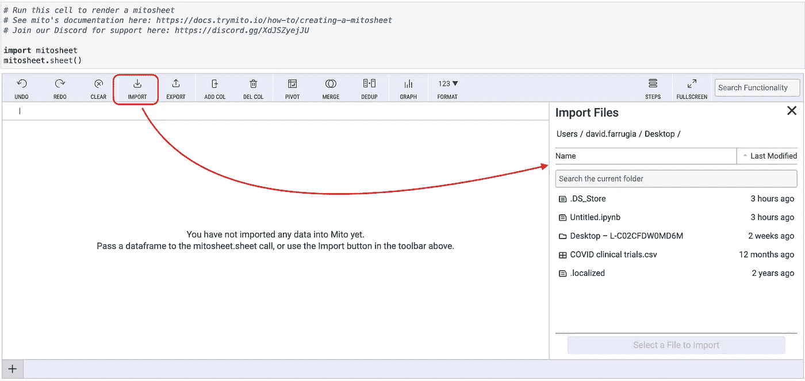
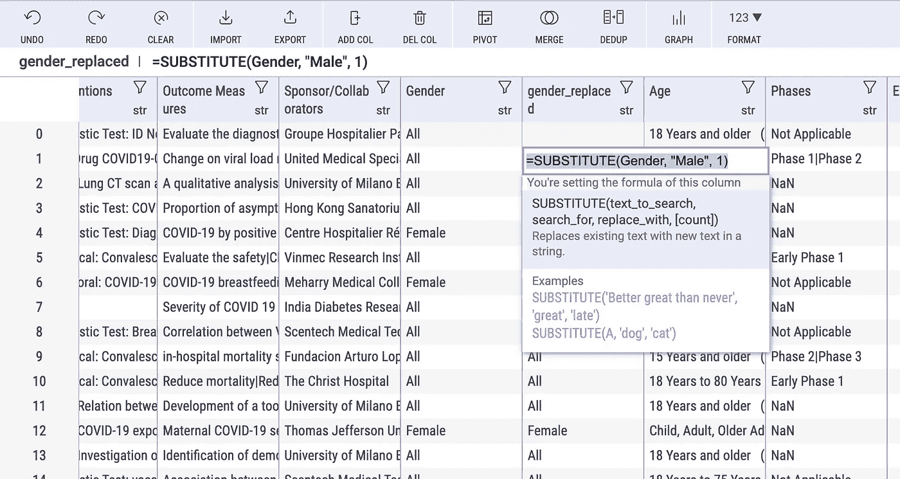
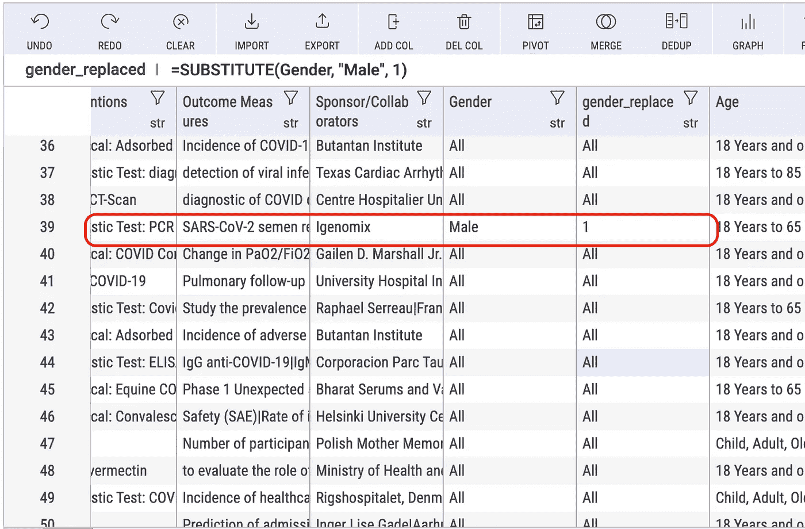
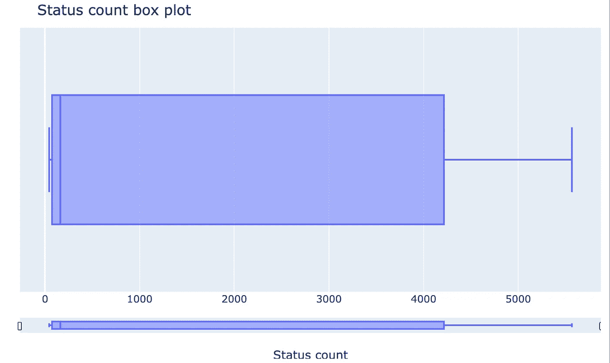
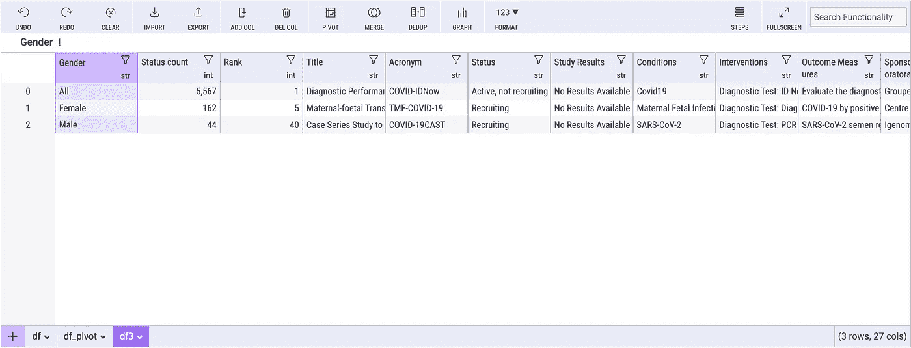
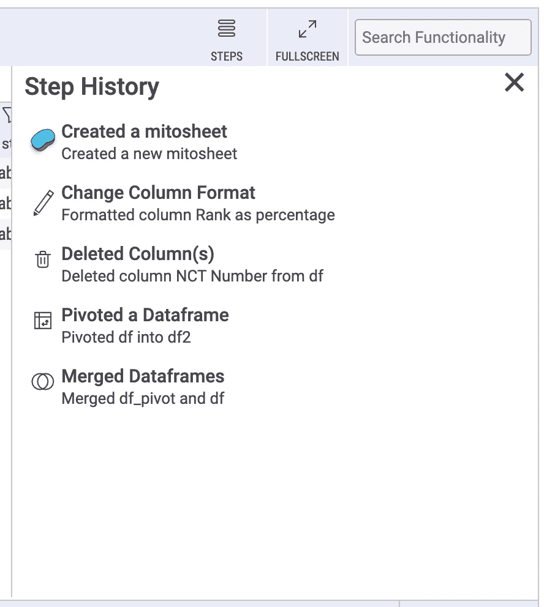

# 我如何使用米托加速我的数据分析过程

> 原文：<https://towardsdatascience.com/how-i-sped-up-my-data-analytics-process-using-mito-f3a2a80e0bc8>

## 数据分析| PYTHON |编程

## 使用这个了不起的 Python 包，用更少的时间做更多的事情


马修·施瓦茨在 [Unsplash](https://unsplash.com?utm_source=medium&utm_medium=referral) 上的照片

作为数据专业人员，我们每天都要花费大量精力处理数据，并提供关键见解。数据分析过程极其耗时且详尽，但同时，它也是整个实验的基础。但是我们如何改进这个过程呢？

进入米托，这是我最近发现的新开发的 Python 工具，它将我们的分析过程提升到了一个新的水平。米托是一个免费使用的软件包，它消除了所有复杂的数据处理，并把它们塞进一个易于使用的界面。最棒的是。它会根据您的操作自动生成相应的 Python 代码！

那么，让我们一起跳进水里去探索米托，好吗？

[](https://docs.trymito.io/) [## 米托文献

### 欢迎来到米托！

docs.trymito.io](https://docs.trymito.io/) 

# 安装米托

首先，安装米托。米托集成在 Jupyter 实验室环境中。要开始使用它，我们首先必须通过 pip 安装米托软件包，如下所示:

```
python -m pip install mitoinstaller
```

其次是，

```
python -m mitoinstaller install
```

一旦安装过程完成，Jupyter 实验室标签将自动为您打开，我们可以开始玩米托。

# 将数据输入米托

> 在整篇文章中，我将使用来自[Kaggle 知识库](https://www.kaggle.com/parulpandey/covid19-clinical-trials-dataset)的新冠肺炎临床试验数据集。

在启动时，我们被要求登录(免费)，然后迎接我们的是以下代码块:

```
# Run this cell to render a mitosheet
# See mito's documentation here: [https://docs.trymito.io/how-to/creating-a-mitosheet](https://docs.trymito.io/how-to/creating-a-mitosheet)
# Join our Discord for support here: [https://discord.gg/XdJSZyejJU](https://discord.gg/XdJSZyejJU)import mitosheet
mitosheet.sheet()
```

米托通过电子表格工作。那么，我们如何导入数据集呢？

## 选项 1: Pandas 整合

我们可以将熊猫数据帧直接传递给工作表对象。

```
df = <<SOME DATAFRAME>>import mitosheet
mitosheet.sheet(df)
```


从熊猫数据框创建米托表—作者图片

## 选项 2:导入功能

米托提供了一个打开文件查找器的 UI 按钮，允许我们直接导入任何本地存储的数据集。



从导入功能创建米托表单—按作者排序的图像

# 和米托一起玩耍

因此，我们只是将数据集加载到米托工作表中。现在怎么办？

米托的力量来自其敏捷的思维。米托使我们能够快速执行数据操作，如任何数据处理任务和数据可视化。这些操作都是通过它的电子表格 UX 处理的。然而，通过 UI 处理的每一个操作都会在下面的单元格中自动生成 Python 代码。

因此，米托允许我们快速分析和研究我们的数据集，但也为我们提供了相应的代码来扩展我们的实验。

米托提供的一些基本操作包括:

1.  *添加新列*
2.  *删除一列*
3.  *重新排序栏目*
4.  *过滤列值*
5.  *删除重复项*

我们可以快速处理我们的数据。对于电子表格中的每一列，我们能够进行过滤和排序，还可以查看值的汇总。


汇总统计—按作者分类的图像

米托还允许我们在电子表格中直接使用 Excel 函数。例如，让我们创建另一个列，将男性的性别值替换为 1。我们可以通过以下方式简单地做到这一点:

```
=SUBSTITUTE(Gender, "Male", 1)
```



Excel 函数-作者图片



Excel 函数结果-作者图片

我们甚至可以与另一个数据集合并，或者从现有的数据集创建一个数据透视表。

让我们举一个简单的例子。让我们将数据集转换成一个数据透视表，以了解每个性别每个状态的研究结果。为此，我们只需点击旋转按钮，并设置我们想要的结果。


数据透视表示例—作者图片

我们可以很快观察到我们的结果有 3 行 13 列(从工作表的右下角开始)。我们还可以调整我们希望对我们的值使用哪种聚合—在本例中，我选择了计数。对于我们选择作为转换一部分的每个选项，米托都在后台生成相应的 Python 代码，并在下一个单元格中显示。米托为上述透视转换生成了以下 Python 代码:

我喜欢的米托的另一个令人敬畏的特征是动态视觉化。让我们快速绘制一个性别与 covid 相关干预的柱状图。


条形图示例—作者提供的图像

目前，米托允许我们将数据可视化为条形图、柱状图、散点图或箱线图。

再一次，我们在一瞬间就有了这种分裂:

所以，让我们通过一系列的步骤来想象米托到底有多强大。

在本例中，我进行了以下操作:

*   在位置 4 创建了一个新的空列
*   删除了新创建的列
*   透视数据以显示每个性别的状态计数
*   丢弃任何重复项
*   创建了状态计数的下图
*   将原始表与数据透视表合并



状态计数示例的箱线图—按作者分类的图像

这个过程花了我最多 30 秒的时间来完成——没有写一行代码！米托提供了以下代码:



所有步骤后的结果—作者提供的图片

米托还列出了整个过程中采取的步骤。



步骤历史-按作者分类的图像

## 缺失功能

米托肯定不是完美的，在我玩这个工具的整个过程中，我确实注意到了一些限制，如果有这些限制会很酷。例如，我发现在不同列之间执行计算分析的过程，比如计算 z 值，是不必要的复杂。

另一个我认为应该成为这个工具一部分的特性是执行 python 代码的能力。没错，米托的全部意义在于消除实际编写代码的开销；然而，在许多情况下，能够访问其他 Python 包是可取的。每当我想在同一个列上执行多个聚合时，情况尤其如此。在这种情况下，Excel 功能的相似性并不能解决问题。

不管它是什么，米托绝对是一个神奇的工具，可以快速检验我们的假设，并对我们正在处理的事情有所了解。我将米托作为我最初数据调查的一部分，并立即感受到分析时间的重大影响。米托的 Github 可以在这里找到。

你喜欢这篇文章吗？如果是的话，也许你可以考虑成为会员来支持我和你其他喜欢的作家。

[](https://david-farrugia.medium.com/membership) [## 加入我的介绍链接媒体-大卫法鲁吉亚

### 作为一个媒体会员，你的会员费的一部分会给你阅读的作家，你可以完全接触到每一个故事…

david-farrugia.medium.com](https://david-farrugia.medium.com/membership) 

**想给我买杯咖啡吗？**

[](https://paypal.me/itsdavidfarrugia?country.x=MT&locale.x=en_US) [## 使用贝宝支付大卫法鲁吉亚。我

### 如果您接受 cookies，我们将使用它们来改善和定制您的体验，并使我们的合作伙伴能够向您展示…

paypal.me](https://paypal.me/itsdavidfarrugia?country.x=MT&locale.x=en_US) 

# 想联系吗？

我很想听听你对这个话题的想法，或者任何关于数据和人工智能的东西。如果你想联系我，请给我发电子邮件至 davidfarrugia53@gmail.com*。*

*Linkedin — [Twitter](https://twitter.com/davidfarrugia53)*