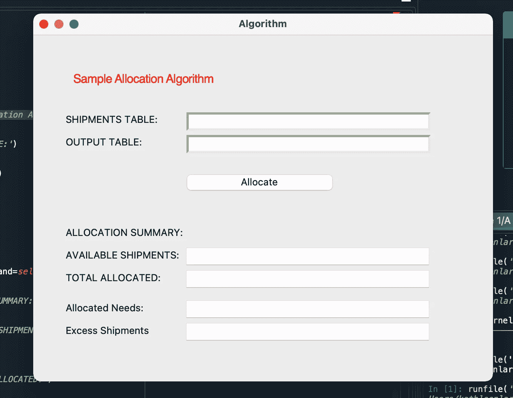
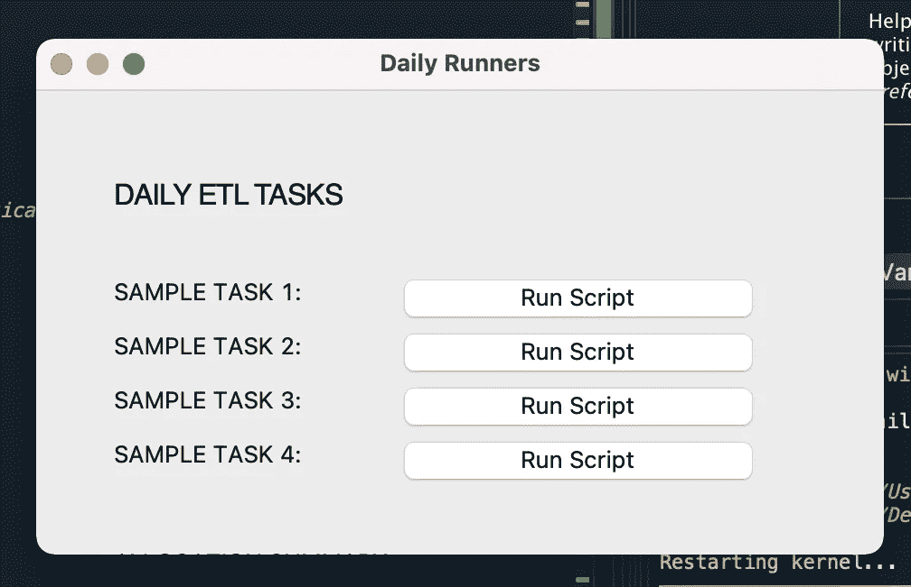

# 我如何使用 Python 的 Tkinter 来运行算法

> 原文：<https://towardsdatascience.com/how-i-use-tkinter-python-library-to-run-algorithms-6be85f8f4e5b>

## 如果您正在为您的 ETL 任务或算法运行几个 python 脚本——Tkinter 是一个可以支持构建 GUI 的 python 库。

来自[像素](https://www.pexels.com/photo/blue-pen-beside-black-smartphone-on-white-paper-196646/)的图像

# 为什么使用 Tkinter 库

我们每天或每周都要完成一些任务，这些任务涉及到运行多个 python 脚本，在大多数情况下，会占用我们大量的时间。通过自动化我们的一些日常流程，始终找到最大限度提高生产力和工作效率的方法是很重要的。

拥有一个 GUI，通过一个允许你点击一个按钮就可以运行脚本的界面，让日常工作更有效率。它可以被转换成一个可执行文件，使你自己或不太懂技术但想自己运行脚本的团队成员运行 python 脚本更加流畅。

在本文中，我将分享我如何设计一个简单的 GUI 来运行 python 脚本算法。为了这篇文章，我创建了一个简单的 GUI 代码。

> **示例 GUI 项目概述:**下面的分配算法 GUI 是一个 UI，您可以在其中从 Oracle 数据库读取和写入一个表。Allocate 按钮在后端有一个算法，该算法根据不同的指标计算应该将多少产品分配给不同的商店。summary 部分让您快速了解运行算法后整个分配的情况，完整的结果/输出表被发送回 Oracle 数据库。

# 构建 GUI: MyWindow 类

作者图片

这个窗口是通过一个名为 myWindow 的类(也称为容器)构建的。这个类很好地组织了函数，有助于避免全局名称空间的混乱。在 myWindow 类中有两个主要的函数，第一个是让你创建用户界面窗口的函数，第二个是主要的算法函数*(还有几个与之相关的函数)*，它驱动整个代码。

## **用户界面功能:**

MyWindow 函数的语法非常简单，可以添加标签、按钮和名称字段。(*我不会看代码，但我会在下面分享我的 github 源代码。)*

单个元素的示例代码块如下所示:

创建按钮元素

正如您所看到的，在上面的代码块中，您可以定制按钮元素，并通过调整 x 和 y 将它放置在窗口中的特定位置。

该窗口中的小部件或元素连接到主算法函数中的特定变量——在上面的示例代码中，它是通过 *command=self.algorithm* 连接的。

## 算法功能

您可以创建一个或多个包含特定任务的函数，例如连接到数据库或运行特定的计算。这些函数使用户界面小部件变得可用。他们运行整个应用程序并产生输出。

在上面的示例中，有几个正在运行的算法函数，第一个是连接到数据库，以便您可以从数据源中读取和写入表，其他函数用于执行数据清理、操作、计算以及将输出表写回数据库。

# Tkinter 类调用方

这几行代码调用 MyWindow 类，并根据您希望看到的维度或您希望为其添加的标签对其进行定制。

调用 MyWindow 类

# 用 Tkinter 做更多

上面的示例项目只是一个例子，展示了如何使用 Tkinter 通过点击按钮来轻松运行 python 算法。您可以使用这个库做一些其他的事情，比如构建一个接口，您可以通过一个接口连接多个 python 脚本。可能是这样的:

作者图片

还可以完全定制和添加不同的功能，如错误处理、成功或失败消息、打印输出等。

总的来说，tkinter 是一个非常棒的库，可供数据科学家和工程师用于日常 ETL 任务、自动化脚本或构建可供非技术用户使用的应用程序。

**样本源代码:**【https://github.com/kathleenlara/tkinter-scripting-gui 

【https://twitter.com/itskathleenlara】我们来连线: