# 我如何用人工智能重新想象 10 幅著名的风景画

> 原文：<https://towardsdatascience.com/how-i-used-ai-to-reimagine-10-famous-landscape-paintings-3e2924e03f79>

## 这是我和 GPT 3 号、Midjourney 的合作成果。

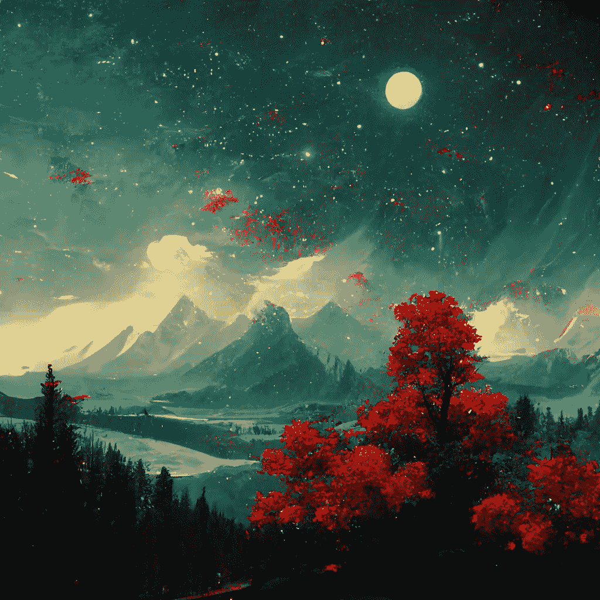

图片由作者通过 Midjourney 提供

如果你关注我的工作，你可能已经注意到我已经开始使用人工智能创建的封面图像。

对于那些不知道它的人来说， [Midjourney](https://www.midjourney.com/) 是一个独立的研究实验室，几个月前秘密成立，目的是“探索新的思维方式[和]扩展人类的想象力。”Midjourney 也是我用来创建图像的文本到图像模型的名字。

几个星期以来，我一直在寻找新的想法，用人工智能视觉生成器来探索。这个实验提供了一种方法，可以在视觉上对比历史上一些最优秀的人类画家的创造性掌握与这些人工智能模型的能力。我用 GPT 3 号和 Midjourney 创建了一个几乎自动化的端到端流程——尽管我也在帮助他们沟通。

我选择著名的山水画有三个原因。它们非常容易辨认，GPT-3 可以很容易地提供视觉描述来设计提示，Midjourney 擅长画风景。

一旦我选定了画，我必须提示 GPT-3 给我描述。我使用了一个通用的简单提示:“用一段文字描述[作者姓名]的视觉细节[画作名称]。”即使我知道 GPT 3 号漏掉了一些元素，我还是未经编辑就完成了第一或第二个版本。

然后，我将描述修改为 Midjourney 可以理解的提示。除了 GPT 3 号的描述之外，我在所有的提示中添加了四个元素。在开始的时候，我包括了媒介(如布面油画)、风格(如印象主义)、流派(如风景)。最后我加上了原作的长宽比，以便更清晰的对比。

我没有提示作者或画的名字来迫使 Midjourney 只从原作中获取间接的灵感——正如 GPT 3 所设想的那样。

我公开了提示让你自己试试。我意识到不公开提示已经成为数字艺术家(以及文本到图像模型的用户)的普遍做法。我不打算出售这些画，也不打算保留用人工智能创作艺术所需的技能，所以我分享了未经编辑的提示。

如果你想了解更多关于提示的知识，我推荐从[提示狂](https://promptomania.com/)开始。如果你想在不学习提示技巧的情况下创造伟大的提示，试试[这个位于拥抱脸的提示生成器](https://huggingface.co/succinctly/text2image-prompt-generator)。

如果你想提高更多，你必须练习和实验。我远远没有达到一些人工智能艺术家的水平，这些艺术家从这个新的人工智能艺术场景开始就一直在磨练他们的技艺。

向 Midjourney 发送提示后，它给了我四张图片供我选择。我升级了那些让我想起原版的，然后选择了一个。

下面的每个部分包括左边的原始风景画和右边的中途再创作。在图片上方，我写下了 GPT 3 号对原画的描述和我对中途的语法正确提示的翻译。

尽情享受吧，并在评论中告诉我你的想法！

# 文森特·梵高的《星夜》(1889)

**描述:**

> 这幅画以夜晚为背景，天空中有一轮明月。群星闪耀，风景沐浴在蓝光中。天空衬托出远处的树木和房屋的轮廓，整个场景宁静而梦幻。

**提示:**

> 布面油画+后印象主义+云景+夜晚+天上的明月+闪亮的星星+沐浴在蓝光中的风景+远处的树木和房屋在天空的映衬下形成轮廓+一种宁静的梦幻般的品质，— ar 5:4。

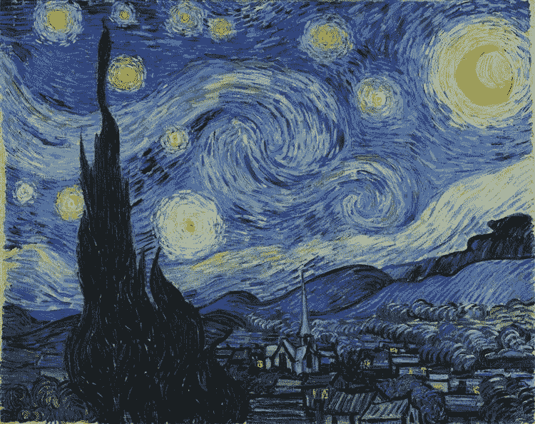

左图:文森特·梵高的《星夜》(公共领域)。右图:作者在中途拍摄的图片

# 约翰·康斯太勃尔的《干草堆》(1821)

**描述:**

> 这幅画描绘了一辆干草马车，由两匹马拉着过河。这个场景以山、树和云为背景。这幅画以其对英格兰乡村生活的简单而田园般的描绘而闻名。

**提示:**

> 布面油画+浪漫主义+风景+两匹马拉着干草过河+背景中的山脉、树木和云彩+对英格兰乡村生活简单而田园诗般的描述，— ar 30:21。

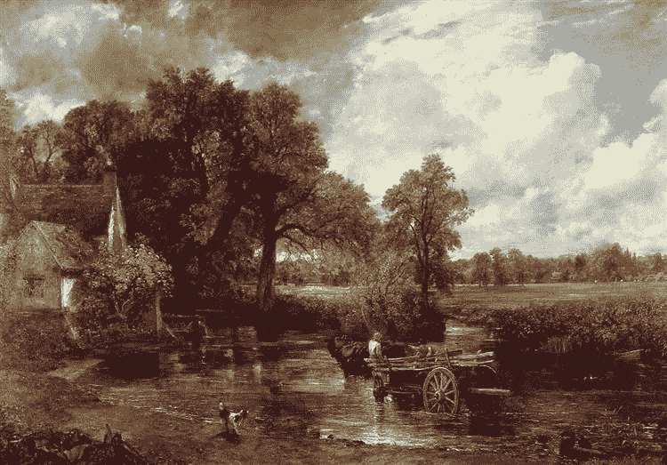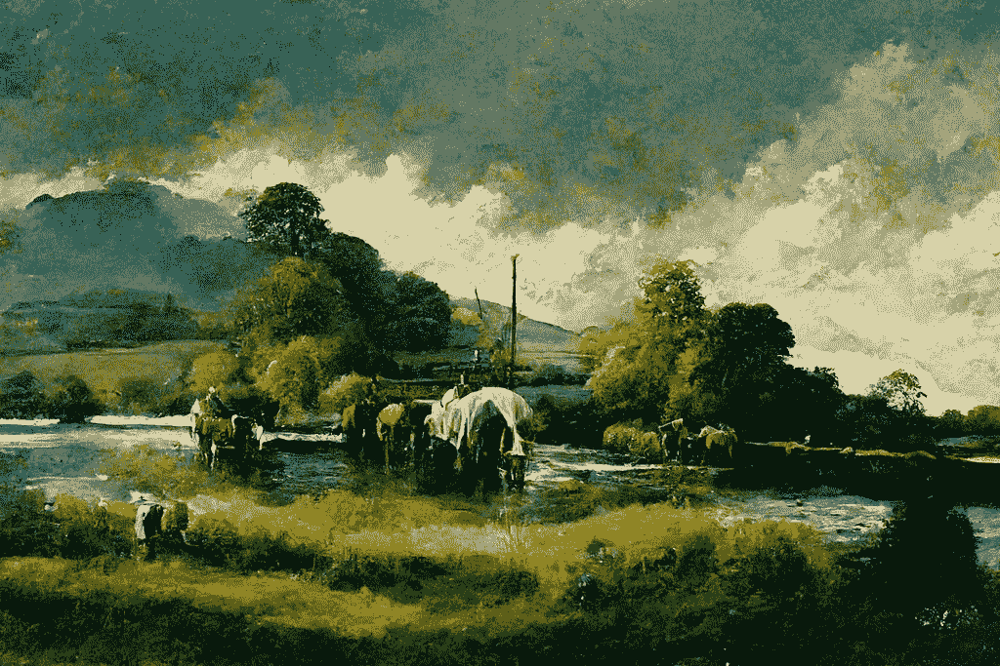

左图:约翰·康斯太勃尔的《干草围脖》(公有领域)。右图:作者在中途拍摄的图片

# 印象，克洛德·莫内的日出(1872)

**描述:**

> 这幅画是太阳刚刚从地平线上露出来，天空是美丽的橙色和红色。海水是深蓝色的，远处有一些小船。笔触厚重而有质感，使这幅画看起来几乎像一张照片。

**提示:**

> 布面油画+印象主义+城市景观+地平线上的太阳+美丽的橙红色天空+深蓝色的水+远处的小船+厚重而有质感的笔触，— ar 21:16。

左:印象，克洛德·莫内的日出(公共领域)。右图:作者在中途拍摄的图片

# 老彼得·勃鲁盖尔的《雪地猎人》(1565)

**描述:**

> 这幅画是一幅冬季风景画，描绘了一群打猎归来的男人。男人们累了，他们的狗在叫。大雪纷飞，树木被白雪覆盖。男人们把他们死去的猎物扛在肩上。

**提示:**

> 油画+北方文艺复兴+风俗画+冬季风景画+一群打猎归来的男人+疲惫的男人+狂吠的狗+下雪+树木被雪覆盖+男人把他们死去的猎物扛在肩上，— ar 34:25

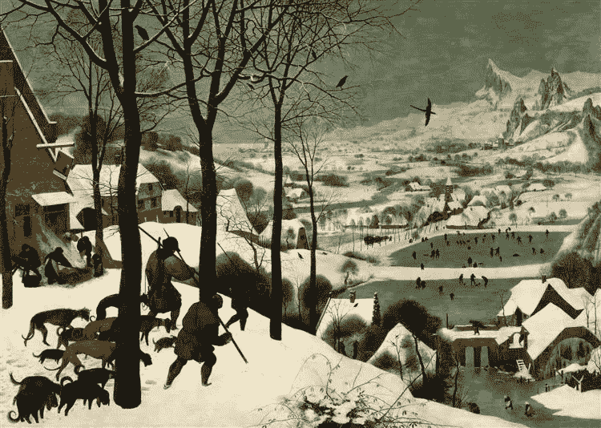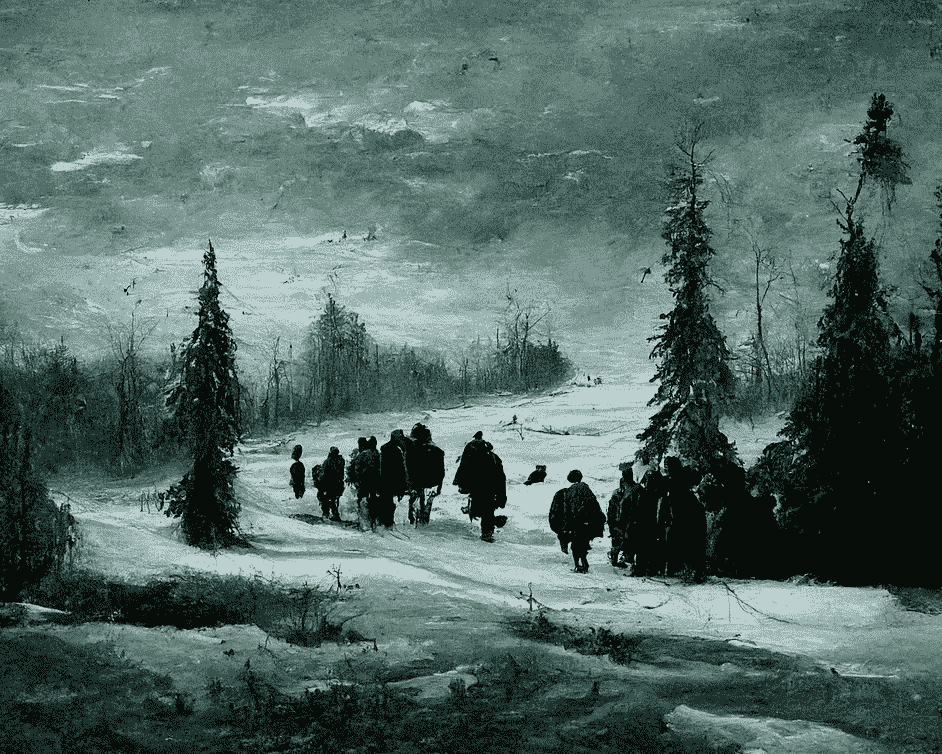

左图:老彼得·布鲁格尔的《雪地猎人》(公共领域)。右图:作者在中途拍摄的图片

# 卡斯帕·大卫·弗里德里希的《海雾之上的流浪者》(1818)

**描述:**

> 这幅画是一幅风景画，画中一名男子背对观众站在露出地面的岩石上。这个人正在眺望远处群山环绕的雾蒙蒙的山谷。这幅画有一种忧郁的色调，传达出一种孤独感。

**提示:**

> 布面油画+浪漫主义+寓言画+风景画+一个站在岩石露头上的人+后视图+这个人正在眺望一个雾蒙蒙的山谷+远处的群山+忧郁的色调+一种孤独感，— ar 63:79。

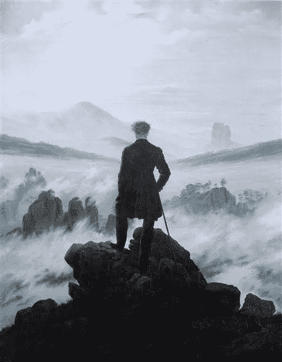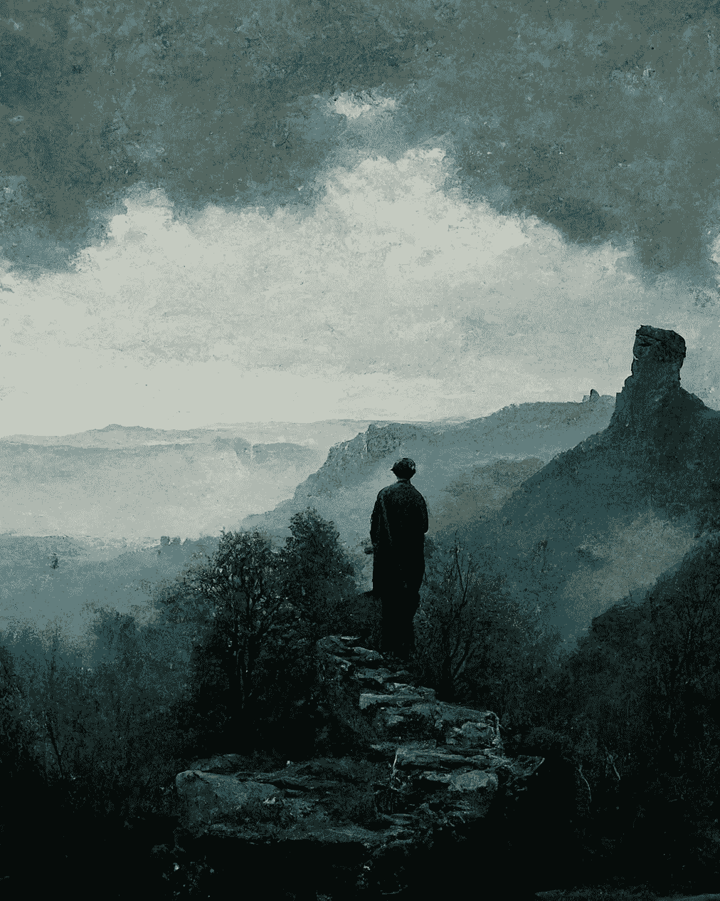

右图:卡斯帕·大卫·弗里德里希《海雾之上的流浪者》(公共领域)。右图:作者在中途拍摄的图片

# 埃尔·格列柯(1596-1600)的托莱多全景

**描述:**

> 在这幅画中，远处是托莱多市，可以看到一些建筑和山脉。天空是深蓝色的，光线反射在前景中的河流上。色彩非常鲜明和明亮，使这幅画看起来几乎是超现实主义的。

**提示:**

> 布面油画+矫饰主义+文艺复兴晚期+城市景观+风景+远处的托莱多市+一些建筑和山脉+深蓝色的天空+前景中的河流+近乎超现实主义的绘画，— ar 70:63。

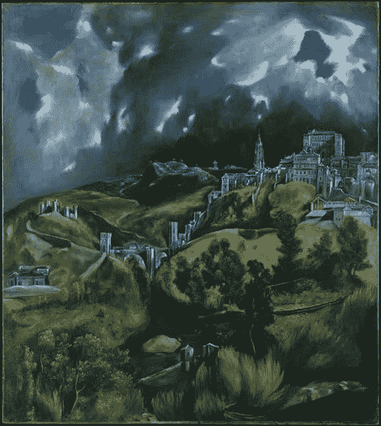

左图:埃尔·格列柯的托莱多视图(公共领域)。右图:作者在中途拍摄的图片

# 安德烈·德朗的《国家》(1905 年)

**描述:**

> 这幅画的背景是法国马赛附近的埃斯塔克镇。这个城镇建在一座小山上，房子被漆成各种颜色。屋顶是红色的，墙壁是白色的，门窗是蓝色的。天空是深蓝色的，阳光灿烂。这幅画色彩非常鲜艳，很有动感。

**提示:**

> 布面油画+野兽派+风景+法国马赛附近的 Estaque 镇+该镇建在山上+涂有各种颜色的房屋+红色屋顶+白色墙壁+蓝色门窗+深蓝色天空+阳光照耀+色彩非常鲜艳的绘画+大量运动，— ar 99:80

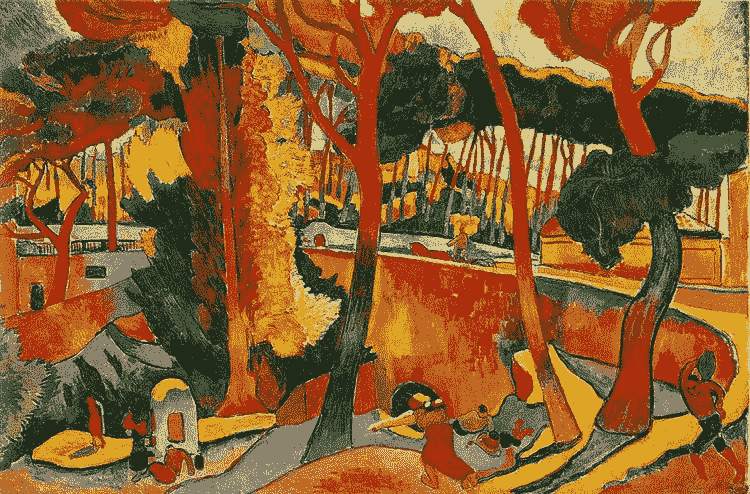

左图:安德烈·德朗(美国公共领域)的作品。右图:作者在中途拍摄的图片

# 保罗·塞尚设计的圣维克多山(1904-1906)

**描述:**

> 在《圣维克多山》中，保罗·塞尚描绘了一座耸立在法国乡村的大山。这位艺术家简化了画中的形式，将场景浓缩到其本质。结果是一个传达了山的宏伟和静止的作品。柔和的色彩和柔和的光线给这幅画增添了平静和安宁的感觉。

**提示:**

> 布面油画+后印象主义+风景+坐落在法国乡村上方的一座大山+简化的形式+山的宏伟和宁静+柔和的颜色+柔和的光线+平静和安宁的感觉，— ar 5:4

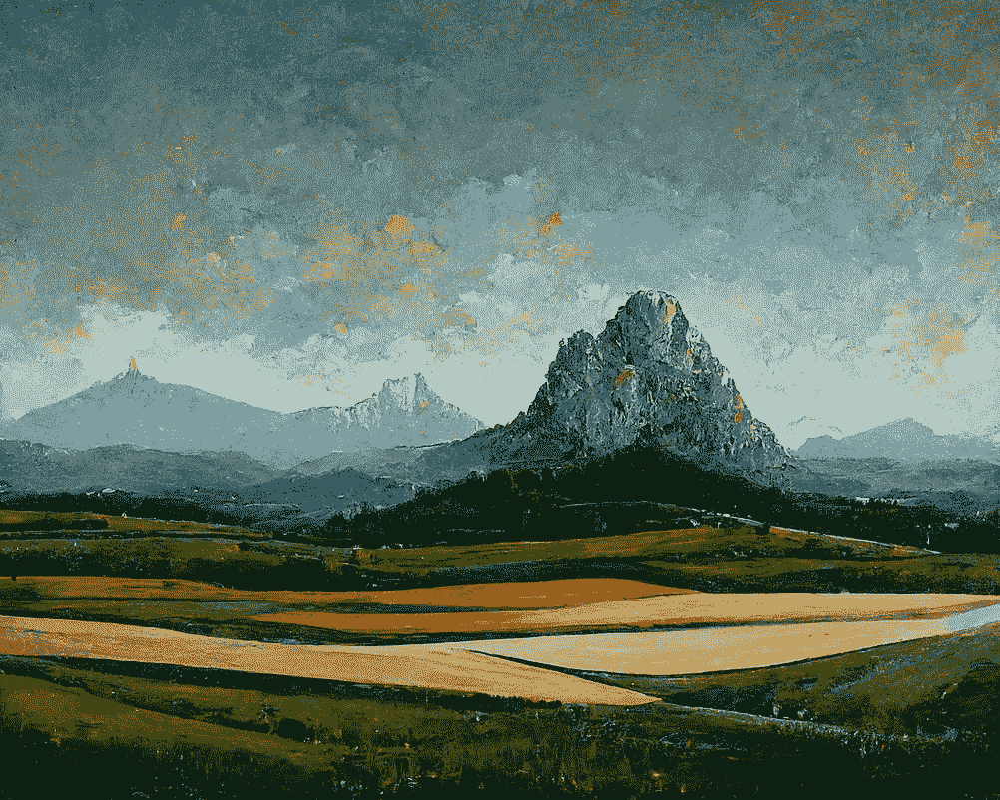

左图:保罗·塞尚的圣维克多山(公共领域)。右图:作者在中途拍摄的图片

# 克洛德·莫内的睡莲(1897-1899)

**描述:**

> 克洛德·莫内的《睡莲》是一幅美丽的画，画的是池塘里的百合花。百合花是深浅不同的粉红色和白色，它们被绿叶包围着。水面风平浪静，天空倒映在池塘水面上。

**提示:**

> 布面油画+印象主义+花卉绘画+池塘中的百合花+百合花是粉红色和白色的阴影+被绿叶环绕+水是平静的和静止的+天空反映在池塘的表面，— ar 4:2

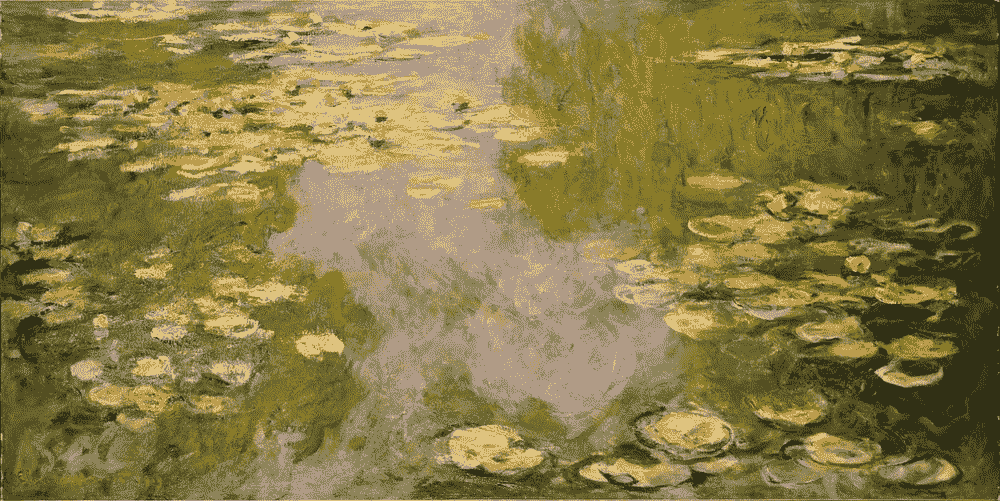

左图:克洛德·莫内的《睡莲》(公有领域)。右图:作者在中途拍摄的图片

# 伦勃朗的《加利利海上的风暴》(1633)

**描述:**

> 在《加利利海的风暴》中，伦勃朗描绘了圣经故事中的门徒在加利利海的一艘小船上被风暴吓坏了。门徒们在船上挤在一起，他们的脸上充满了恐惧。海浪冲击着船，天空布满了乌云。

**提示:**

> 布面油画+巴洛克风格+宗教绘画+圣经故事中的门徒在加利利海的一艘小船上+被风暴吓坏了+门徒在船上挤成一团+脸上充满恐惧+海浪冲击着船+天空布满了黑暗、险恶的云，— ar 4:5

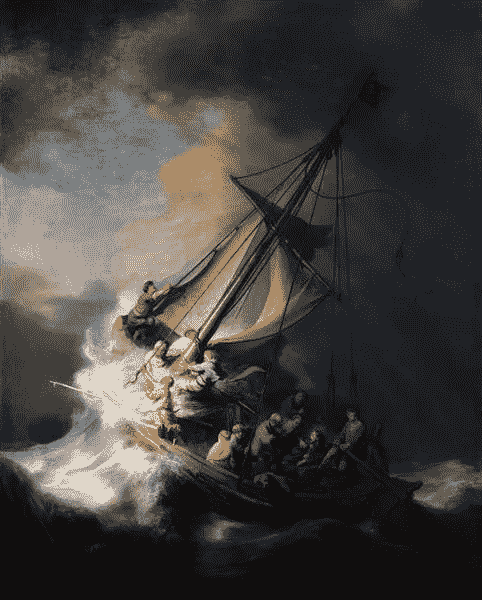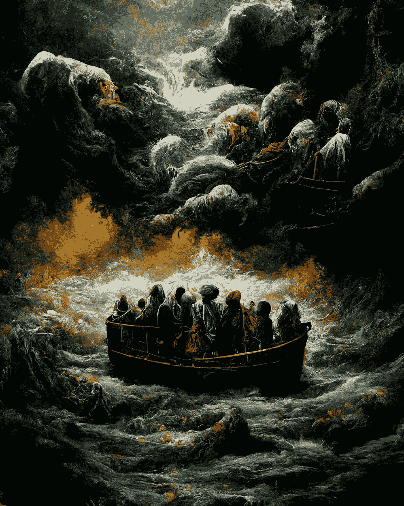

左图:伦勃朗《加利利海上的风暴》(公共领域)。右图:作者在中途拍摄的图片

# 结论

总的来说，我不得不说，大多数画虽然画得很好，但远不是原作的再现。一个原因是，GPT-3 无法给出精确的细节，除非这些细节非常有代表性(它往往是通用的)。

如果我使用人为的绘画细节描述，我会得到更好的结果。尽管如此，文本到图像的模型在[组合性](https://twitter.com/GaryMarcus/status/1512647983317151747?ref_src=twsrc%5Etfw)方面通常相当糟糕。这意味着他们很难理解“X 在 Y 之上”或“X 在 Y 的右边”。他们不知道元素的相对位置，而这些往往是艺术品的关键区别特征。

另一个原因是，我在这个实验中限制了 GPT 3 号和中途。GPT-3 的提示很简单，我选择了第一代或第二代。在中途，我从第一批结果中选择了这幅画，没有进行编辑或修补。

这个实验的一个重要收获是，GPT-3 和 Midjourney 都可以给你令人印象深刻的结果，只要你不打算引导他们达到预定的结果。它们很适合一般的作品，但不适合特定的作品(DALL E 2 在这方面更好)。

总之，我想看看 GPT-3+中途组合——我也在其中——将如何重新想象最初的人造艺术品。这是人类和人工智能之间的交流实验。

作为最后的提醒:这不是一个证明这些人工智能能力的实验。这只是为他们原本不透明的头脑打开了一扇门。

*订阅* [**算法桥**](https://thealgorithmicbridge.substack.com/) *。弥合算法和人之间的鸿沟。关于与你生活相关的人工智能的时事通讯。*

*您也可以直接支持我在 Medium 上的工作，并通过使用我的推荐链接* [**这里**](https://albertoromgar.medium.com/membership) 成为会员来获得无限制的访问权限！ *:)*