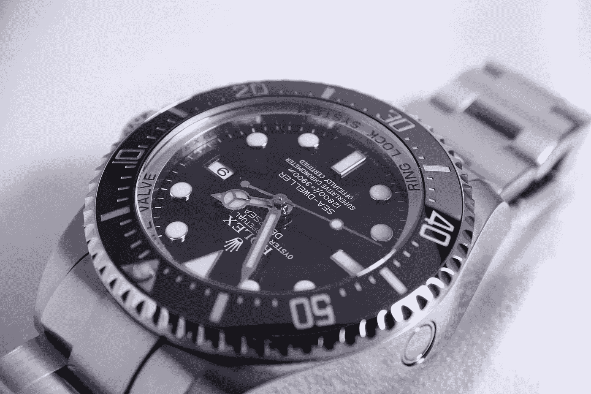
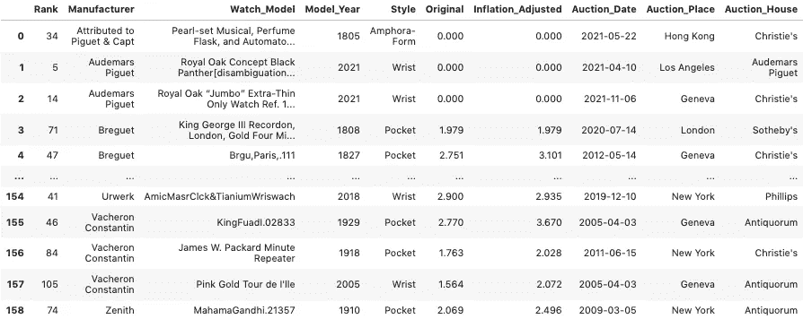
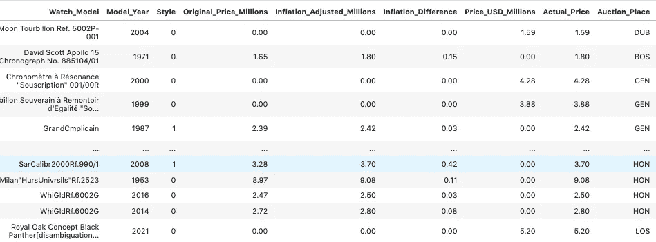
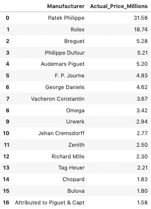
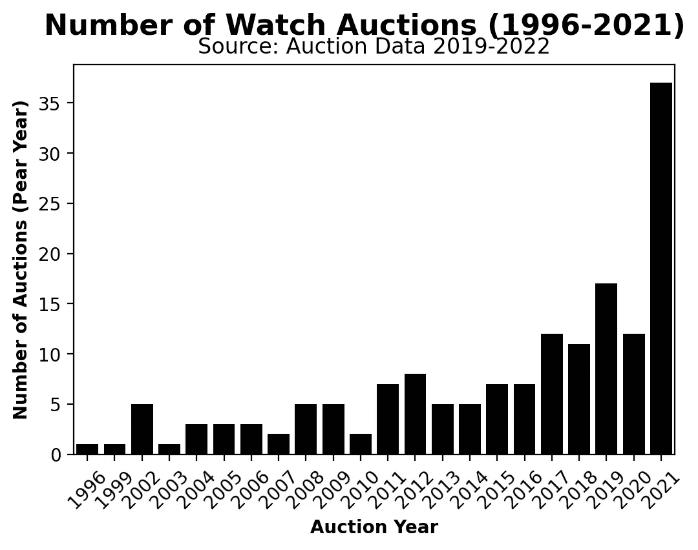

# 我如何使用 Python 和 SQL 找到世界上最贵的手表

> 原文：<https://towardsdatascience.com/how-i-used-python-and-sql-to-find-the-most-expensive-watches-in-the-world-785ff71bc893>

## 从使用 Python 抓取网页，到构建数据集，再到编写分析性 SQL 查询，这就是我如何找到在 1996 年至 2021 年的一场奢侈品拍卖会上售出的最昂贵的手表。



约翰·托尔卡西奥在 [Unsplash](https://unsplash.com/s/photos/watches?utm_source=unsplash&utm_medium=referral&utm_content=creditCopyText) 上拍摄的照片

上周，在我的出版物[Pipeline:A Data Engineering Resource](https://medium.com/pipeline-a-data-engineering-resource)中，我写了一篇关于奢侈品手表拍卖市场趋势的文章，并提到我将继续使用我的方法。从获取数据到获取、清理数据，最后用 SQL 查询数据，我将带您了解我创建最新数据驱动故事的过程，并说明如何构建一个端到端数据分析项目。

由于这是一个端到端的数据工程和数据分析项目，以下是各个阶段的划分:

*   数据来源和摄取
*   数据清理
*   创建数据集和表并加载到数据库中
*   分析查询
*   可视化见解

# 数据来源和摄取

除了在谷歌上搜索“昂贵手表列表”，这个过程的第一步是确定一个高质量和可访问的数据集，以便摄取和稍后格式化进行分析。

我在维基百科页面上找到了“拍卖的最贵手表清单”。原始数据表如下所示:


截图由作者提供。

从数据整洁的角度来看，有几个问题立即困扰着我，比如“Ref”在分析中有些无用的列。我一消化完数据就放弃了那个专栏。Pandas 的 read_html 功能令人难以置信，它消除了一些通常与 BeautifulSoup 抓取网页文本和数据的方法相关的手工工作。

```
base_url = '[https://en.wikipedia.org/wiki/List_of_most_expensive_watches_sold_at_auction'](https://en.wikipedia.org/wiki/List_of_most_expensive_watches_sold_at_auction')watches = read_html(base_url, attrs={'class': 'wikitable sortable'}, header=1)watch_df = pd.DataFrame(watches[0])watch_df.rename(columns={'.mw-parser-output .tooltip-dotted{border-bottom:1px dotted;cursor:help}M.Y.': 'Model_Year', 'Watch model': 'Watch_Model', 'Inflation-adjusted': 'Inflation_Adjusted',
'Auctiondate': 'Auction_Date', 'Auctionplace': 'Auction_Place', 'Auctionhouse': 'Auction_House'}, inplace=True)

watch_df = watch_df.drop(['Ref.'], axis=1)
```

这里要注意的另一件事是，因为我们正在获取[类‘wiki table sortable’](https://en.wikipedia.org/wiki/Help:Sorting)的所有实例，所以将会返回多个表。为了获取第一个结果，即“Top 77”表，我从索引位置 0 开始:

```
watch_df = pd.DataFrame(watches[0])
```

虽然我可以遍历每个索引值，但是由于每个表都需要自己独特的格式，所以我认为我最好分别抓取和格式化它们。

# 数据清理

我的转换都不是特别复杂，但是我想指出，如果您必须从 wiki 表中删除括号或括号表达式，这是一段非常有用的代码:

```
for col in watch_df.columns:
        watch_df['Watch_Model'] =
        watch_df['Watch_Model'].str.replace('[Note 4]', '')
        watch_df['Watch_Model'] =   watch_df['Watch_Model'].str.replace(r'\[.*\]', ' ')
```

结合使用 [str.replace 方法](https://pandas.pydata.org/docs/reference/api/pandas.Series.str.replace.html)和一点 [regex 语法](https://docs.python.org/3/library/re.html)可以去掉维基百科引用周围的括号。

对于最后一个表，我合并了三个返回的 wiki 表。我还考虑了 NA 值，并使用 [Pandas 的 sort_values()方法](https://pandas.pydata.org/docs/reference/api/pandas.DataFrame.sort_values.html)过滤掉重复的。

```
watch_all = pd.concat([watch_df, watch_second_half_df, watch_third_df], ignore_index=True)
watch_all = watch_all.sort_values(by=['Manufacturer'], ascending=True).reset_index(drop=True)
watch_all['Original'] = watch_all['Original'].fillna(0)
watch_all['Inflation_Adjusted'] = watch_all['Inflation_Adjusted'].fillna(0)
watch_all['Price_USD_Millions'] = watch_all['Price_USD_Millions'].fillna(0)

watch_all_df = pd.DataFrame(watch_all)
```

# 创建数据集/表并加载到数据库中

这是目前为止数据框的外观(减去 Price_USD_Millions 列，未显示):



截图由作者提供。

我对这个输出很满意。由于我更喜欢 SQL 进行数据分析(对不起熊猫)，我将把这个上传到我的 BigQuery 数据库。


截图由作者提供。

下面是模式，我在 BigQuery 的 UI 和代码中都定义了它(为了安全起见)。尽管 BigQuery 会自动检测 CSV 文件的模式，但我过去在使用自动检测功能时遇到过问题，所以我尝试总是包含一个模式。


截图由作者提供。

这是表格预览的样子:


截图由作者提供。

# 分析查询——也就是有趣的部分

在这个阶段从表中查询和获得洞察力确实使这个项目成为一个端到端的项目。这也令我兴奋，因为我的工作往往局限于数据科学过程的管道和 ETL/EL 阶段。因此，当我能够在我的个人项目中做一些数据分析时，我很开心。

因为我的职业是数据工程师，所以我能从表格中提取见解而不用太费力，这对我非常重要。这意味着，即使在我获取了数据帧之后，我也要做一些更改，以便更好地为我未来的分析服务。

我做的第一个更改是将“Style”列从字符串转换为布尔值。如果我需要在后面的分析阶段引用它，这将使计算值和使用该度量作为分类变量变得更加容易。

```
SELECT
  EXTRACT(DATE
  FROM
    Auction_Date) AS Auction_Date,
  Manufacturer,
  Watch_Model,
  Model_Year,
  CASE
    WHEN Style = 'Wrist' THEN 0
  ELSE
  1
END
  AS Style
FROM
  `ornate-reef-332816.watches.auction_prices`
```

我也不喜欢原始数据框中美元值与无关值一起出现的方式，所以为了可读性，我将每个值四舍五入到两位小数。

```
SELECT
  EXTRACT(DATE
  FROM
    Auction_Date) AS Auction_Date,
  Manufacturer,
  Watch_Model,
  Model_Year,
  CASE
    WHEN Style = 'Wrist' THEN 0
  ELSE
  1
END
  AS Style,
  ROUND(Original, 2) AS Original_Price_Millions,
  ROUND(Inflation_Adjusted, 2) AS Inflation_Adjusted_Millions,
  ROUND(Price_USD_Millions, 2) AS Price_USD_Millions
FROM
  `ornate-reef-332816.watches.auction_prices`
```

我也意识到有几行的定价有出入。原始数据集包括多个具有美元值的列。原始数据包括原始价格和虚高价格。这使得数据有点不清楚。为了找到给定手表的实际价格，我取了各列的最大值(使用最大函数)，因为这可能是手表的售价。

```
SELECT
  EXTRACT(DATE
  FROM
    Auction_Date) AS Auction_Date,
  Manufacturer,
  Watch_Model,
  Model_Year,
  CASE
    WHEN Style = 'Wrist' THEN 0
  ELSE
  1
END
  AS Style,
  ROUND(Original, 2) AS Original_Price_Millions,
  ROUND(Inflation_Adjusted, 2) AS Inflation_Adjusted_Millions,
  ROUND(Price_USD_Millions, 2) AS Price_USD_Millions,
  ROUND(GREATEST(Inflation_Adjusted, Price_USD_Millions, Original),2) AS Actual_Price,
  Rank
FROM
  `ornate-reef-332816.watches.auction_prices`
```

最后，因为我知道轴上的字符串值会变得多么混乱，所以我通过大写和截断字符串值来创建城市的缩写。我还删除了“等级”一栏，因为这对我来说有点武断。

```
SELECT
  EXTRACT(DATE
  FROM
    Auction_Date) AS Auction_Date,
  Manufacturer,
  Watch_Model,
  Model_Year,
  CASE
    WHEN Style = 'Wrist' THEN 0
  ELSE
  1
END
  AS Style,
  ROUND(Original, 2) AS Original_Price_Millions,
  ROUND(Inflation_Adjusted, 2) AS Inflation_Adjusted_Millions,
  ROUND(Price_USD_Millions, 2) AS Price_USD_Millions,
  ROUND(GREATEST(Inflation_Adjusted, Price_USD_Millions, Original),2) AS Actual_Price,
  UPPER(LEFT(Auction_Place, 3)) AS Auction_Place,
  Auction_House
FROM
  `ornate-reef-332816.watches.auction_prices`
```

下面是最终的干净表格的一个片段，其中包含调整后的列:



截图由作者提供。

项目的其余部分包括针对这个表编写查询。由于其中一些有点基础(但仍然是必要的)，我将分享一个更有趣的片段。这是一段 SQL 代码，用于查找哪个制造商销售了最多的库存(以百万美元计)。

```
SELECT * EXCEPT(row_num)
FROM(
SELECT Manufacturer, MAX(Actual_Price) AS Actual_Price_Millions, ROW_NUMBER() OVER(PARTITION BY Manufacturer) AS row_num
FROM clean_tab
GROUP BY 1
)
WHERE row_num = 1
ORDER BY Actual_Price_Millions DESC
```

除了查找实际价格之外，该查询还包含一行消除重复值的内容，以确保我们获得准确的数据。下面是作为数据帧的输出(我使用 Python 的 [BigQuery API 进行查询):](https://cloud.google.com/bigquery/docs/reference/libraries)



截图由作者提供。

# 可视化见解

就像我喜欢干净的数据一样，我也喜欢简约、干净的可视化。由于我已经在 Jupyter 笔记本上工作，我决定使用 Matplotlib 和 Seaborn 来可视化我从这个数据集获得的见解。

下面是一个简单的例子:


图表由作者提供。



图表由作者提供。

从这里，我可以结合可视化来建立一个仪表板，这样我就知道我要为我的梦想手表存多少钱了。

如需额外的可视化和完整的分析，请随意阅读全文:

<https://medium.com/pipeline-a-data-engineering-resource/ticktock-the-most-expensive-watches-in-the-world-a-data-story-c425df9b9648>  

如果你对这个项目的范围感到好奇，你可以在 [my GitHub](https://github.com/Zachlq/Professional_Portfolio/blob/main/Data%20Engineering/PIpelines/Batch_Pipeline/Watches/watch_viz_work.ipynb) 上查看代码。