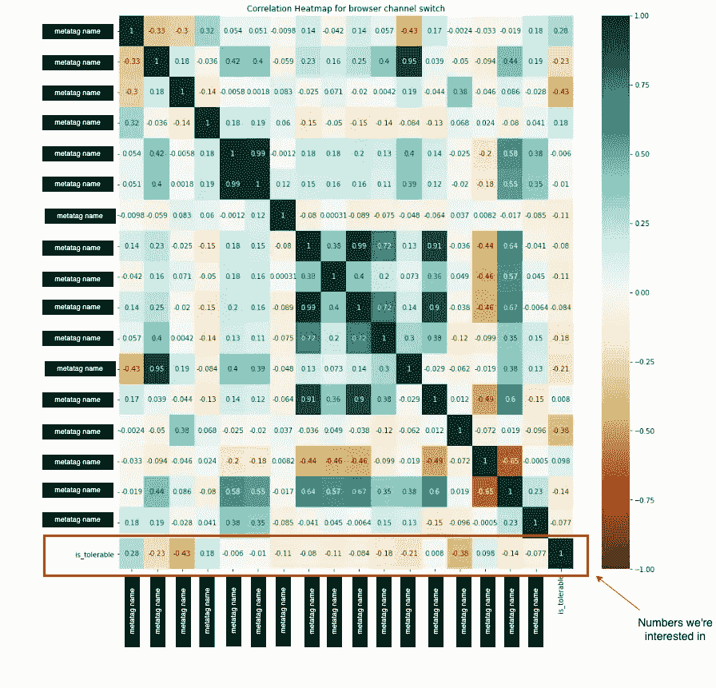
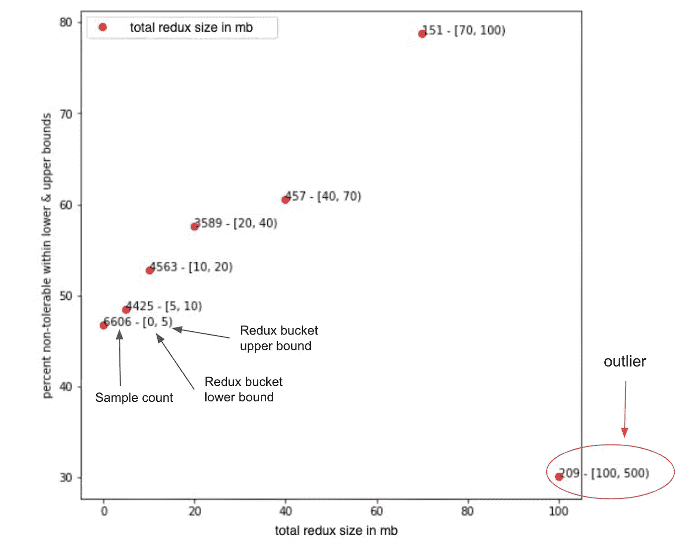
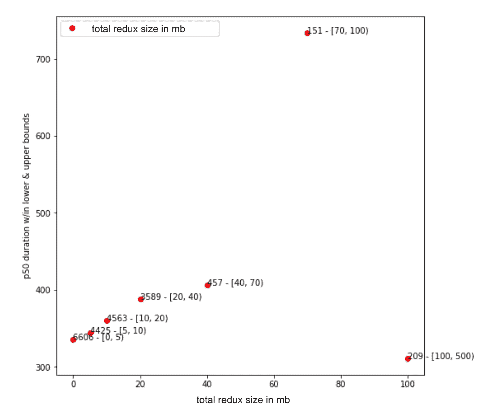

# 我如何使用跟踪和数据科学来学习 Redux 与糟糕的应用程序性能有关

> 原文：<https://towardsdatascience.com/how-i-used-tracing-and-data-science-to-learn-redux-correlates-with-terrible-app-performance-4fe976ef8a06>

## 为什么减少 redux 大小是值得的


图像来源:[像素](https://www.pexels.com/photo/person-writing-on-notebook-669615/)

几年前，我是 Slack 前端性能团队的创始成员之一。目标是了解什么影响 Slack 的前端性能。该公司想要了解的一个指标是从一个频道切换到另一个频道所需的时间，即什么导致频道切换缓慢？

该项目的开始只是为了跟踪不同的数据，以便我们可以了解频道切换期间发生了什么。例如，我们跟踪了频道切换期间发生的所有 redux 动作以及它们花费的时间；后来，我们跟踪反应渲染以及。我们使用的工具是一个与 [OpenTelemetry](https://opentelemetry.io/docs/instrumentation/js/api/tracing/) 具有相同 api 的 tracer，以及一些数据分析软件，包括 [Honeycomb](https://www.honeycomb.io/) 。如果您不熟悉跟踪，请阅读我以前的文章[关于如何使用跟踪来测量应用程序性能的文章](https://medium.com/dev-genius/measuring-react-performance-with-opentelemetry-and-honeycomb-2b20a7920335)。

<https://blog.devgenius.io/measuring-react-performance-with-opentelemetry-and-honeycomb-2b20a7920335>  

我们还用关于用户和团队的信息来标记每个跟踪。这些信息包括他们使用哪种电脑，他们来自哪个地理区域，他们有多少渠道，他们的团队有多少人，**他们的 redux 商店**有多大，等等。

下面是通道切换跟踪的样子:


作者用 Honeycomb.io. Image 可视化频道切换轨迹。

注意:我划掉了可能被认为是专有的信息。

主父跟踪测量从单击一个频道到该频道完成呈现最近消息列表所用的时间。子跨度是 redux 动作、thunks 和 react 组件的呈现。

添加痕迹或多或少是这个项目中比较容易的部分。实现一个健壮的、可伸缩的、其他开发人员可以轻松使用的系统仍然存在技术挑战。然而，这是很简单的工作。困难的部分来自于确定应该测量什么以及如何分析跟踪来理解性能瓶颈。

本文的大部分内容是关于我用来分析前端性能的技术，以及我在团队工作时学到的经验。

# 分析应用性能的基本工具和技术

我使用 Jupyter notebook 和几个 python 库来创建可视化并进行分析。

有几种方法可以获得跟踪数据。你可以直接从 Honeycomb 下载一个 CSV 文件(但我认为有 1000 行的限制)。你也可以通过他们的 [API](https://docs.honeycomb.io/api/query-results/) 查询蜂巢的数据。Slack 将跟踪数据存储在自己的数据库中，所以我查询了 Slack 的数据库来进行数据分析。

下一步是使用`pandas` python 库从 CSV 文件或 api 数据创建一个[数据帧](https://pandas.pydata.org/docs/reference/api/pandas.DataFrame.html)。在完成了创建数据帧的所有预处理之后，就可以开始分析轨迹了！

## 相关热图

[关联热图](https://seaborn.pydata.org/generated/seaborn.heatmap.html)是了解哪些标签可能与频道切换时间相关的一种简单而有见地的方式。

在 Jupyter notebook 中，使用`seaborn`和`matplotlib`用几行代码制作热图。

```
import seaborn as sns
import matplotlib.pyplot as pltcorrelations = dataframe.corr()heatmap = sns.heatmap(correlations, vmin=-1, vmax=1, annot=True, cmap='BrBG')heatmap.set_title(f'Correlation Heatmap for {dataframe_name}')plt.show()
```

最终的热图将会是这样。



关联热图—标记的编辑名称。图片作者。

整个热图显示了所有标签之间的相互关系。我们最感兴趣的行是最后一行，即这些标签的系数与频道切换是否可容忍(即不慢)的关系。

从热图中，我可以识别与频道切换是否缓慢最相关的标签。接近 0 的数字表示给定的两列之间没有相关性。接近 1 的数字表示强正相关，接近-1 的数字表示强负相关。

与`is_tolerable`最不相关的标签与 redux 商店规模有关。换句话说，这是我第一次暗示 redux 存储大小与应用程序性能相关。

## 散点图

我进一步用散点图研究了 redux 商店规模对频道切换性能的影响。

为此，我在 x 轴上存储了 redux 存储大小。在 y 轴上，我查看了该时段内被视为“慢”的频道切换的百分比



Redux 大小与慢速通道切换百分比的关系。图片作者。

如您所见，redux 存储大小越大，慢速频道切换的百分比就越大。

我还查看了每个时段内频道切换时间的 p50(中值)。趋势与预期相似。redux 商店规模越大，p50 值越高。



Redux 尺寸与通道切换时间 p50 的关系。图片作者。

对于这两个图，我使用了`[matplotlib.pyplot.scatter](https://matplotlib.org/3.5.1/api/_as_gen/matplotlib.pyplot.scatter.html)`。

我根据不同的标记值进一步分解了样本数据。例如，我观察了企业与非企业的性能，我观察了硬件能力如何影响性能，等等。

# redux 动作和 thunks 呢？

使用像 Honeycomb 这样的工具很难分析子跨度的存在或属性如何影响其父跨度。例如，并非所有通道开关都触发相同的 redux 动作集，但是您不能比较包含 redux 动作“A”的通道开关轨迹与不包含 redux 动作“A”的通道开关轨迹。您也不能在子跨度和主通道开关跨度之间进行相关性分析。也许蜂巢最终会有这个功能，但目前还没有。这意味着进行子跨度分析的唯一方法是将关于这些跨度的信息作为父跨度上的标签添加到父跨度中。您还可以编写复杂的查询和预处理脚本来提取子 span，并通过`parent_id`将它们绑定到主通道交换机 span。这是一个很大的努力，最终，我们没有决定去那个方向。

# 为什么 redux 大小与应用程序性能相关，以及注意事项

相关性并不意味着因果关系。虽然 redux 存储大小与通道切换速度(以及我们测量的其他几个指标)密切相关，但这并不意味着因果关系。

一般来说，redux 存储大小与应用程序的复杂性有关。应用程序越复杂，应用程序拥有的组件和信息越多，redux 就越大。性能退化通常是应用程序复杂性的一个症状。这是因为低效率往往被埋在各处。例如，在我在 Slack 的团队通过引入 lint 规则解决这个问题之前，我在`mapStateToProps`看到过许多创建新对象(例如新数组)的案例。我见过不必要的道具被传递到组件中，导致组件不必要地重新呈现。应用程序越大，redux 大小越大，这些反模式就变得越有症状。

因此，如果您做了其他所有正确的事情，redux size 本身可能不会对性能产生太大的影响。然而，软件在生产中并不是完美的，至少我没见过。因此，更大的 redux 大小会导致更多的渲染和更长的处理时间，从而导致更差的性能(在 mapStateToProps、选择器、reducers 等中)。).

# 挑战和经验教训

总的来说，这是一个极具挑战性的项目，涉及许多未知因素和反复试验。它原本应该是一个调查通道切换性能的短期项目。然而，它演变成了一个多季度的计划，导致在 Slack 创建了一个独立的性能工程部门！我和一个由 4-5 名前端工程师组成的小组在这个性能可观察性项目上工作了将近 1.5 年。

团队的目标不时改变，但想法是找到性能回归的大贡献者，并为开发人员创建容易看到他们的项目的性能影响的方法。

我在可观察性团队中最大的收获是工具问题。很多。不同的分析产品适合不同的使用案例。试错法中的部分“错误”来自对大量数据的追踪，这些数据最终并没有带来多少可操作的见解。正如我之前提到的，很大一部分原因是用我们现有的工具很难分析一些数据，如儿童跨度。

因此，在实现跟踪(或任何软件特性)之前，您应该对如何分析数据有一个很好的认识，并弄清楚您收集信息的方式对于手边的工具是否理想。

另一个重要的收获是，当处理一个你没有受过训练的领域时，有一个容易接近的结对编程伙伴，或者更好的是一个导师。

我的背景是前端。为了这个项目，我走进了数据科学的世界，之前没有任何培训或指导。我自学了 python 和它的许多数据科学库，并且在伯克利和斯坦福上了统计学和数据科学课。

尽管我在学习我必须学习的内容方面足智多谋，我有空闲的渠道可以提问，我也向数据科学家咨询过几次寻求帮助，但缺乏适当的指导仍然导致了可以避免的障碍。

我认为一个软件工程师应该具备的最重要的技能之一是多才多艺。拥有一个成长的心态会有所帮助。在过去的几年里，我学到了很多关于跟踪、可观察性、性能、数据科学和机器学习的知识！