# 线性代数在机器学习中是如何应用的

> 原文：<https://towardsdatascience.com/how-is-linear-algebra-applied-for-machine-learning-d193bdeed268>

## 从使用矩阵和向量来表示数据开始


用于机器学习的线性代数(图片来自作者的[网站](https://www.visual-design.net/)

说实话，线性代数在机器学习中的作用一直困扰着我，因为我们大多是在数学背景下学习这些概念(如向量、矩阵)，而放弃它们在机器学习环境中的应用。事实上，线性代数在机器学习中有几个基本的用例，包括数据表示、维数约简和向量嵌入。从介绍线性代数中的基本概念开始，本文将构建一个如何将这些概念应用于数据表示的基本视图，例如求解线性方程组、线性回归和神经网络。但是，如果您想了解更多关于主成分分析(PCA)的线性代数，您可能会发现这篇文章更有帮助。

</a-visual-learners-guide-to-explain-implement-and-interpret-principal-component-analysis-cc9b345b75be>  

*对于机器学习线性代数的视频演练，我在本文底部包含了我的 YouTube 视频。*

# 标量、向量、矩阵和张量的定义

首先，让我们解决线性代数的构建模块——标量、向量、矩阵和张量。


标量、矢量、矩阵、张量(图片由作者提供)

*   标量:单个数字
*   Vector:一维数字数组
*   矩阵:数字的二维数组
*   张量:多维数组的数字

为了实现它们，我们可以在 python 中使用 [NumPy](https://numpy.org/doc/) 数组`np.array()`。

```
scalar = 1
vector = np.array([1,2])
matrix = np.array([[1,1],[2,2]])
tensor = np.array([[[1,1],[2,2]], 
                   [[3,3],[4,4]]])
```

让我们看看上面生成的向量、矩阵和张量的形状。

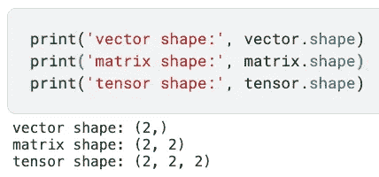

向量、矩阵、张量形状(图片由作者提供)

# 矩阵和向量运算

## 1.加法、减法、乘法、除法


矩阵运算中的加减乘除(图片由作者提供)

类似于我们对数字的运算，同样的逻辑也适用于矩阵和向量。但是，请注意，对矩阵的这些操作对两个大小相同的矩阵有限制。这是因为它们是以元素方式执行的，这与矩阵点积不同。

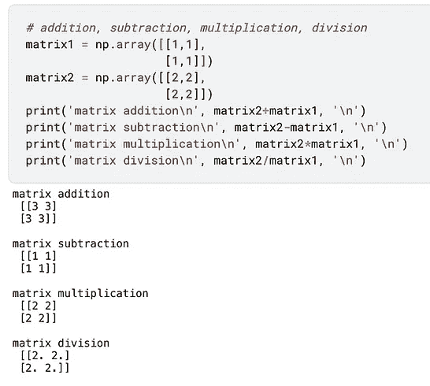

矩阵运算(图片作者提供)

## 2.点积

点积经常与矩阵元素乘法混淆(上面已经演示过)；其实是对矩阵和向量比较常用的运算。

点积通过将第一个矩阵的每一行与第二个矩阵的每一列一次一个元素地迭代相乘来操作，因此`j x k`矩阵和`k x i`矩阵之间的点积是一个`j x i`矩阵。这是一个 3x2 矩阵和 2x3 矩阵之间的点积的例子。


矩阵点积(图片由作者提供)

点积运算需要第一个矩阵中的列数与第二个矩阵中的行数相匹配。我们用`dot()` 来执行点积。运算中矩阵的顺序至关重要——如下所示，`matrix2.dot(matrix1)`将产生与`matrix1.dot(matrix2)`不同的结果。因此，与逐元素乘法相反，矩阵点积是不可交换的。

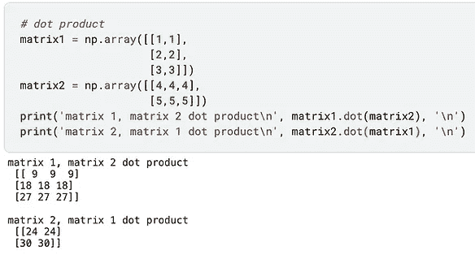

矩阵点积(图片由作者提供)

## 3.使再成形

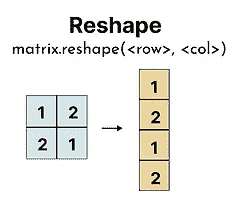

矩阵整形(图片由作者提供)

一个向量通常被视为一个只有一列的矩阵，通过使用`reshape()`指定列数和行数，它可以被重新整形为矩阵格式。我们也可以将矩阵改变成不同的布局。例如，我们可以使用下面的代码将 2x2 矩阵转换为 4 行 1 列。

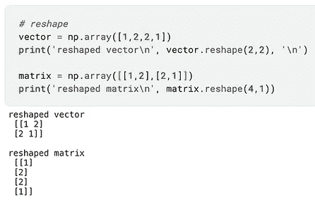

矩阵整形(图片由作者提供)

当矩阵的大小未知时，`reshape(-1)`常用来降低矩阵维数，将数组“展平”成一行。整形矩阵可广泛应用于神经网络中，以使数据适合神经网络结构。


矩阵整形(图片由作者提供)

## 4.移项

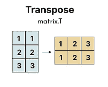

矩阵转置(作者图片)

转置交换矩阵的行和列，这样一个`j x k`矩阵变成了`k x j`。为了转置一个矩阵，我们使用`matrix.T`。


矩阵转置(作者图片)

## 5.单位矩阵和逆矩阵


矩阵求逆(图片作者提供)

逆矩阵是矩阵的一种重要变换，但是为了理解逆矩阵，我们首先需要解决什么是单位矩阵。单位矩阵要求列数和行数相同，并且所有对角元素都为 1。此外，矩阵或向量在乘以其对应的单位矩阵后保持不变。

为了用 Python 创建一个 3×3 的单位矩阵，我们使用了`numpy.identity(3)`。

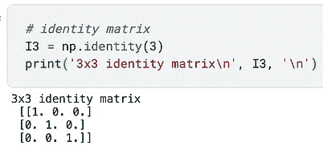

身份矩阵(图片由作者提供)

矩阵本身(下面表示为 M)和矩阵的逆矩阵的点积是单位矩阵，它遵循以下等式:


关于矩阵求逆，有两件事需要考虑:1)矩阵和矩阵求逆的顺序无关紧要，即使当顺序改变时，大多数矩阵点积是不同的；2)并非所有矩阵都有逆矩阵。

为了计算矩阵的逆矩阵，我们可以使用`np.linalg.inv()`。

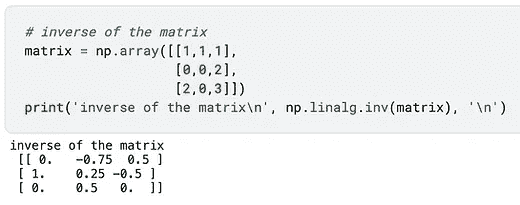

矩阵求逆(图片作者提供)

在这个阶段，我们只涉及了线性代数中支持数据表示应用的一些基本概念；如果你想更深入地了解更多的概念，我发现 Deisenroth，Faisal 和 Ong 的书《[机器学习的数学](https://mml-book.github.io/book/mml-book.pdf)》特别有帮助。

**感谢您远道而来。如果你想阅读我更多关于媒介的文章，我将非常感谢你的支持，注册成为** [**媒介会员**](https://destingong.medium.com/membership) **。**

# 线性代数在 ML 中的应用

我们将从向量和矩阵在解线性方程组中最直接的应用开始，并逐渐推广到线性回归，然后是神经网络。

## 1.线性代数在线性方程组中的应用

假设我们有下面的线性方程组，计算 a 和 b 的值的典型方法是一次消除一个元素，这对于两个变量来说需要 3 到 4 个步骤。

> *3a + 2b = 7*
> 
> *a — b = -1*

另一种解决方案是用矩阵和向量的点积来表示。我们可以将所有系数打包成一个矩阵，将所有变量打包成一个向量，因此我们得到如下结果:


矩阵表示给了我们一种不同的心态，一步解决方程。如下所示，我们将系数矩阵表示为 *M* ，变量向量表示为 *x* 和输出向量 *y，*然后将方程的两边乘以矩阵 M 的逆矩阵。由于矩阵的逆矩阵和矩阵本身之间的点积是单位矩阵，我们可以将线性方程组的解简化为系数矩阵 M 的逆矩阵和输出向量 *y* 之间的点积。


我们使用下面的代码片段一步计算变量 a 和 b 的值。


以矩阵形式求解线性方程组(图片由作者提供)

通过用矩阵表示线性方程组，这大大提高了计算速度。假设我们使用传统的方法，它需要使用几个 for 循环来一次消除一个元素。对于这样一个简单的系统来说，这似乎是一个小小的增强，但如果我们将其扩展到机器学习，甚至是由大量像这样的系统组成的深度学习，它会大大提高效率。

## 2.线性代数在线性回归中的应用

在求解线性方程系统中示出的相同原理可以被推广到机器学习中的线性回归模型。如果你想刷新你对线性回归的记忆，请查看我的文章“线性回归实用指南”。

</a-practical-guide-to-linear-regression-3b1cb9e501a6>  

假设我们有一个包含 n 个特征和 m 个实例的数据集，我们通常将线性回归表示为这些特征的加权和。

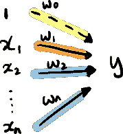

如果我们用矩阵的形式来表示一个实例的公式呢？我们可以将特征值存储在一个`1 x (n+1)`矩阵中，权重存储在一个`(n+1) x 1`向量中。然后我们将相同颜色的元素相乘，将它们相加得到加权和。

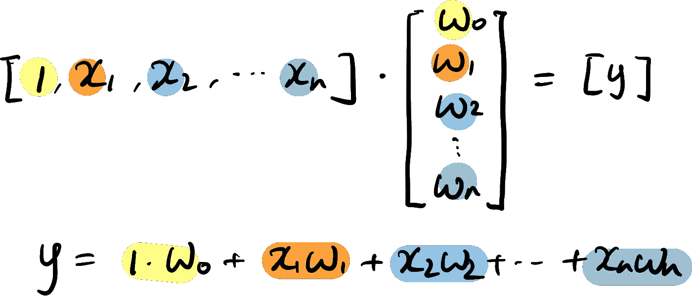

线性回归矩阵表—一个实例(图片由作者提供)

当实例数量增加时，我们自然会想到使用 for 循环一次迭代一个条目，这可能会很耗时。通过以矩阵格式表示算法，线性回归优化过程归结为通过线性代数运算求解系数向量[ *w0，w1，w2 … wn]* 。

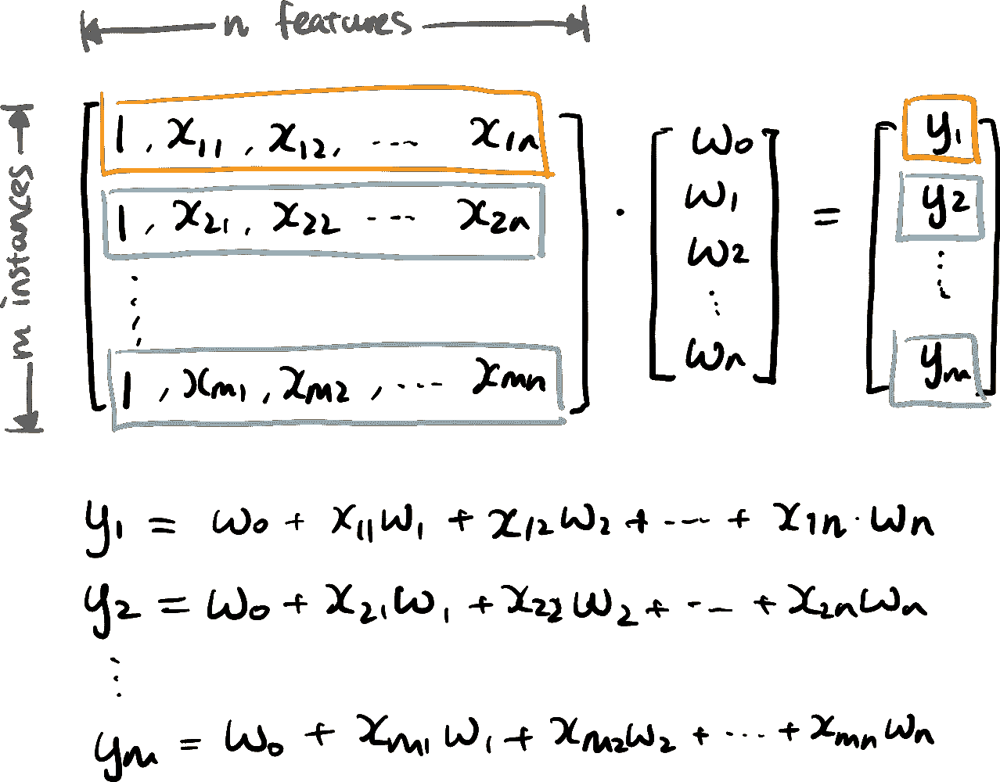

线性回归矩阵表单—多个实例(图片由作者提供)

此外，流行的 Python 库(如 Numpy 和 Pandas)建立在矩阵表示的基础上，并利用“矢量化”来加快数据处理速度。找到了文章《[告别 Python 中的循环，欢迎矢量化！](https://medium.com/codex/say-goodbye-to-loops-in-python-and-welcome-vectorization-e4df66615a52)“在 for-loop 和矢量化的计算时间比较方面很有帮助。

## 3.线性代数在神经网络中的应用

神经网络由多层互连的节点组成，其中来自前几层的节点的输出被加权，然后被聚合以形成后几层的输入。如果我们放大神经网络的互连层，我们可以看到回归模型的一些组件。

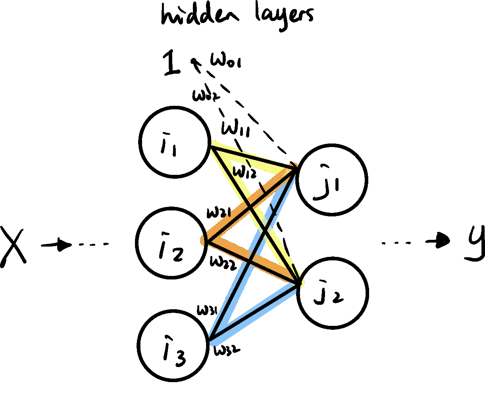

神经网络中的隐藏层(图片由作者提供)

举一个简单的例子，我们从一个神经网络中可视化出隐藏层 I(具有节点 *i1，i2，i3* )和隐藏层 j(具有节点 *j1，j2* )的内部过程。 *w11* 代表馈入节点 *j1、*的输入节点 *i1* 的权重， *w21* 代表馈入节点 *j1* 的输入节点 *i2* 的权重。在这种情况下，我们可以将权重打包成 3x2 矩阵。

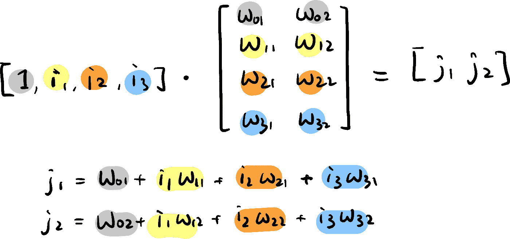

矩阵形式的神经网络—一个实例(图片由作者提供)

这可以推广到数千甚至数百万个实例，形成神经网络模型的大规模训练数据集。这个过程类似于我们如何表示线性回归模型，除了我们使用一个矩阵来存储权重，而不是一个向量，但是原理是一样的。


矩阵形式的神经网络—多个实例(图片由作者提供)

更进一步，我们可以将此扩展到深度学习的深度神经网络。这就是张量在表示二维以上数据时发挥作用的地方。例如，在卷积神经网络中，我们对图像像素使用 3D 张量，因为它们通常通过三个不同的通道(即，红色、绿色、蓝色通道)来描述。

正如你所看到的，线性代数在机器学习和深度学习算法中起着构建模块的作用，这只是线性代数在数据科学中的多个用例之一。希望在未来的文章中，我可以介绍更多的应用，如线性代数降维。要阅读更多我关于媒体的文章，我将非常感谢你的支持，注册成为媒体会员。

# 带回家的信息

线性代数在机器学习中的重要性似乎是不言而喻的，然而，它在数据表示等方面发挥着重要作用。在本文中，我们首先介绍一些基本概念，例如:

*   标量、矢量、矩阵、张量
*   加法、减法、乘法、除法、点积
*   整形、转置、反转

此外，我们讨论了这些概念如何应用于数据科学和机器学习，包括

*   线性方程组
*   线性回归
*   神经网络

## 更多这样的文章


[德斯坦贡](https://destingong.medium.com/?source=post_page-----d193bdeed268--------------------------------)

## 机器学习实用指南

[View list](https://destingong.medium.com/list/practical-guides-to-machine-learning-a877c2a39884?source=post_page-----d193bdeed268--------------------------------)10 stories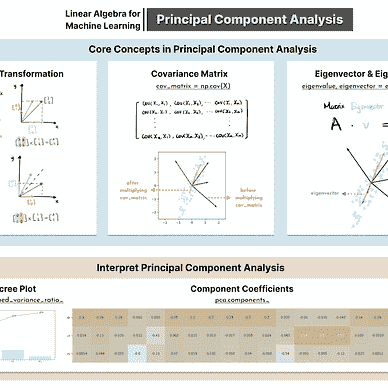</tensorflow-template-for-deep-learning-beginners-3b976d0ee084>  

[德斯坦贡](https://destingong.medium.com/?source=post_page-----d193bdeed268--------------------------------)

## 开始学习数据科学

[View list](https://destingong.medium.com/list/get-started-in-data-science-8006bb4ba3ad?source=post_page-----d193bdeed268--------------------------------)8 stories

*原载于 2022 年 12 月 28 日*[*【https://www.visual-design.net】*](https://www.visual-design.net/post/semi-automated-exploratory-data-analysis-process-in-python)*。*