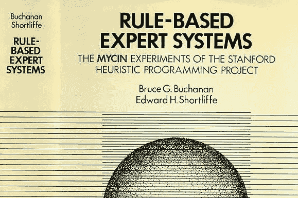
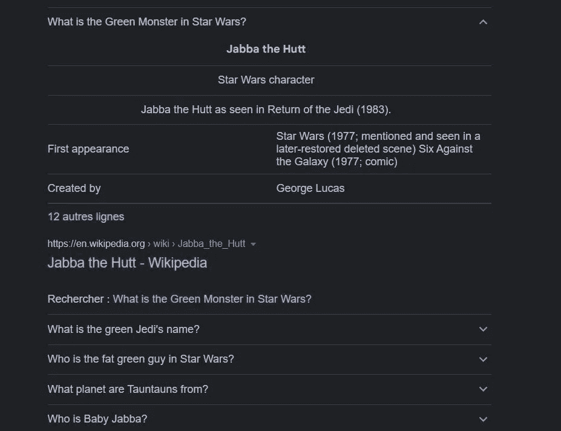

# 知识图表如何让人工智能理解我们的世界

> 原文：<https://towardsdatascience.com/how-knowledge-graphs-are-making-ai-understand-our-world-666bc68428e2>

# 知识图表如何让人工智能理解我们的世界

## 基于逻辑的计算方法的成功与失败

萨拉·库菲在 [Unsplash](https://unsplash.com/s/photos/word-structure?utm_source=unsplash&utm_medium=referral&utm_content=creditCopyText) 上拍摄的照片

你可能听说过谷歌的知识图，它为用户在搜索引擎上的查询提供文字答案。

这些知识图表在计算机科学中有很长的历史。研究人员在 70 年代就已经试图建立一个通用的数据库来回答任何可能的问题。但是这种方法很快就在可伸缩性和理解能力方面达到了极限。

今天，这些数据结构在企业数据库、市场情报和推荐算法中找到了第二次生命。让我们看看这些知识体系的好处和局限性。

# 专家系统的历史

斯坦福启发式编程项目的霉素实验封面，1984 年

在 20 世纪 70 年代，一些人工智能研究人员怀疑计算系统能否形成对事物的全局理解。所以他们决定让他们研究狭窄的、定义明确的问题。

通过向算法提供特定专业领域的知识，他们认为自己会做出比人类专家更好的决策。他们称之为基于计算机的专家系统有三个部分。

首先，一个知识库，里面装满了与当前主题相关的“如果-那么”规则(例如，如果一个动物有羽毛，它就是一只鸟)。其次，包含当前断言和信息的运行记忆系统(“这种动物有一层毛”)。第三，推理系统，用不同的规则对案例进行推理，并给予它们或多或少的权重(“这种动物没有羽毛，因此它不是鸟”)。

研究人员已经用成千上万条规则构建了专家算法，并对结果感到非常惊讶。在某些情况下，他们发现他们几乎可以击败人类专家的判断。

例如，斯坦福大学的一个团队试图创建一个专家系统，对血液疾病进行准确的诊断。这个名为 MYCIN 的系统是由真正的医生的知识提供的，这些医生把他们的一生都奉献给了这个课题。随着案件变得越来越复杂，该算法还包括概率因素，以评估决策的不确定性。

多亏了这个复杂的数据库，[霉素](https://en.wikipedia.org/wiki/Mycin#:~:text=MYCIN%20was%20an%20early%20backward,antibiotics%20themselves%2C%20as%20many%20antibiotics)可以在同一病例中提供等同于或优于人类医生的诊断。这为许多其他处理类似狭窄主题的专家系统铺平了道路。

但是，尽管有这些说法，这些系统可能显示出真正的局限性，这取决于所研究的主题的性质。其中之一就是很难提取出复杂话题背后的所有显性规律。

# 通用信息库的诱惑

一个本体工程图的例子【https://en.wikipedia.org/wiki/Ontology_engineering 

受基于符号的人工智能成功的激励，研究人员在 80 年代提出了越来越雄心勃勃的项目。

他们中的一个，道格拉斯·莱纳特，设想了一个计算系统，它包含足够的知识来建立我们世界的智能。他所谓的 Cyc 项目。

为了实现这样一个项目，Lenat 和他的团队试图描述每一个让我们了解我们环境的明确规则(例如，扔进池塘的石头会下沉，或者飞机需要推力才能飞行)。

但在解释规则之前，研究人员必须首先教给系统一些基本概念，以便能够思考(什么是一个事物，它与其他事物有什么关系……)。他们必须试图构建他们所谓的工程本体论，即共同理解的基础。在这个结构基础上，团队经过大量努力，历时十年创建了一个极其庞大的知识图谱。

计算机科学的先驱 Vaughan Pratt 被他们的项目迷住了，他决定严格评估他们系统的智能。[在几次演示中](http://boole.stanford.edu/cyc.html)，Pratt 用认知练习测试了对 Cyc 的理解。一项是分析一个人放松的照片。Cyc 的反应是展示一张人们拿着冲浪板的照片，将冲浪与海滩和放松的环境联系在一起，这显示了很好的推理。然而，在检查系统思维链时，普拉特也意识到它依赖于不太必要的逻辑推理(就像人类有两只脚一样)。

这不是 Cyc 的唯一缺陷。在更复杂的常识性问题上，它也表现不佳。当被问及面包是否是一种饮料时，系统没有给出任何可理解的答案。同样，虽然 Cyc 知道许多死亡原因，但他不知道饿死。演示因此以悲观的基调结束:Cyc 似乎总是被侵蚀其全球一致性的知识缺口所绊倒。

尽管如此，Douglas Lenat 继续从事这个项目，为建立知识库带来了新的方法。而且他可能仍然对某些东西感兴趣，因为知识系统现在正在寻找新的有趣的应用。

# 使用知识图促进数据理解

谷歌上“星球大战中的绿色怪物是什么”的搜索结果。作者制作的标题。

自从 80 年代的实验以来，智能知识系统已经找到了更具体的商业应用。

最具标志性的例子是谷歌将知识图表应用于其服务的方式。2012 年，该公司推出了一个系统，可以掌握互联网上的知识结构，为其搜索引擎提供信息。基于用户的意图，谷歌的算法可以将一个词与一个概念联系起来，并解开单个词背后的不同含义。

例如，人们键入类似“泰姬陵”的查询，既可以查找关于印度纪念碑的信息，也可以查找关于同名艺术家的新闻，还可以找到街角的印度餐馆。这完全取决于用户输入它的意图。

为了做出正确的回应，谷歌正在构建一个知识系统，这个系统能够比字面上的关键词查询匹配更深入地理解信息。它可以从文本中提取一般规则，并对事实进行逻辑推理。例如，当你寻找“星球大战中的绿色怪物”时，谷歌可以从链接中判断出你正在寻找贾巴小屋，说明它是“一个巨大的，类似鼻涕虫的外星人”。所以它可以把“外星人”这个概念和查询“绿怪”联系起来，相对准确。

但是除了搜索模型之外，知识图也被用于其他人工智能模型。例如，在卫生部门，研究公司收集了大量没有任何标签或结构的数据。这些数据是一个巨大的错过的机会，以获得对药物开发和治疗可能性的更好的见解。

通过自动注释和使用人类的洞察力，[自然语言处理模型为研究数据提供意义](https://www.ontotext.com/blog/knowledge-graphs-and-healthcare/)，在疾病和治疗之间做出推断。基于精心构建的知识，这种模型可以通过准确、有根据和透明的推理将疾病或已知的健康状况与科学研究联系起来。

这种模型也越来越多地用于投资和商业发展决策。大公司需要市场情报，而不仅仅是基于无意义的数据搜集。他们希望捕获与其特定业务问题相关的信息。

他们还希望能够监控所有关于该公司的新闻和评论，以评估他们的声誉。基于知识图表，智能数据处理软件可以帮助发现新的见解，并收集关于公司的深层反馈。

换句话说，人类知识和数据智能之间的协作从未如此激烈。而这仅仅是人类和机器之间漫长而富有成效的对话的开始！