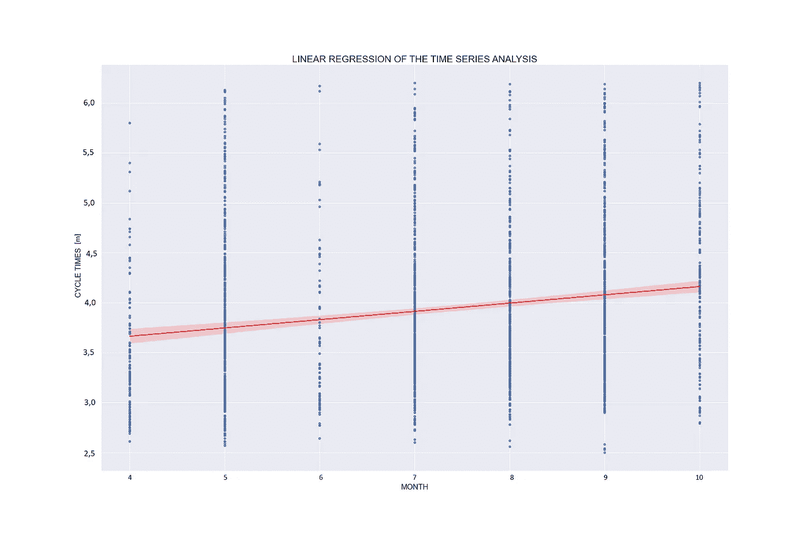
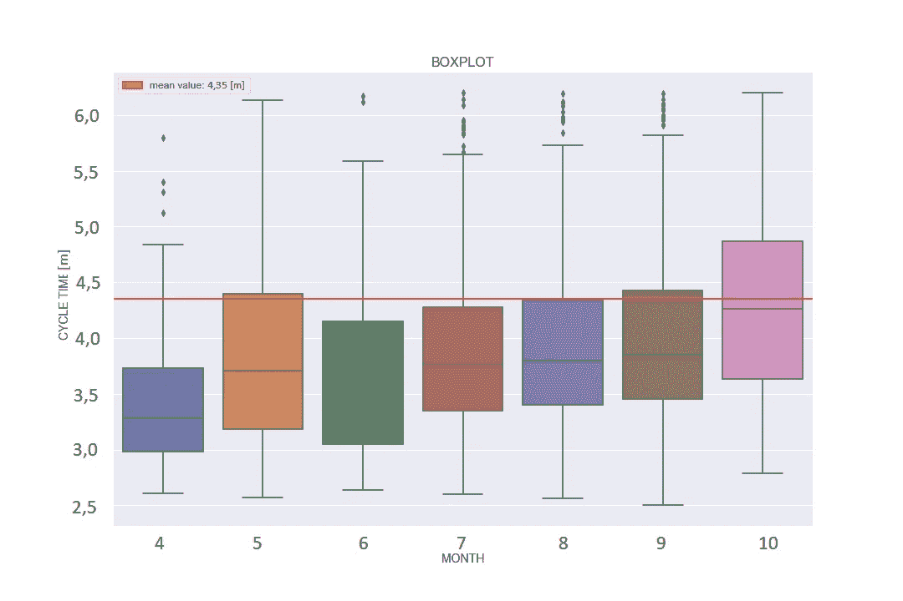

# 线性回归、时间序列分析和箱线图如何帮助我们理解制造过程

> 原文：<https://towardsdatascience.com/how-linear-regression-time-series-analysis-and-box-plot-can-help-us-understand-manufacturing-5c581f945edb>

## 关于如何在不了解流程的情况下，查看制造数据并尝试理解是否可能存在系统性制造问题的一些想法


乔希·比奇在 [Unsplash](https://unsplash.com/s/photos/manufacturing?utm_source=unsplash&utm_medium=referral&utm_content=creditCopyText) 上的照片

说到制造业，数据变得越来越重要。我研究了不同种类的制造过程，我可以说，我们可以通过分析数据来了解过程中是否存在一些制造问题；当然，在分析之后，如果我们认为某些制造问题可能存在，则必须在制造生产环境中调查该过程。

在继续之前，我必须说，这种方法已经在真实的案例研究中得到测试和验证，但我在本文中展示的图表是根据模拟数据生成的。当然，即使这些数字是模拟的，这也不会影响过程，它仍然是有效的:显示的数字只是理解过程的参考。

首先要知道的是，我只分析了由人类操作员实现的制造过程:我从未(直到现在)分析过由机器人或以某种方式自动化的制造过程(我认为，这项研究必须以不同的方式进行)。这种分析制造数据的方式可以在许多手工制造过程中给出好的结果；它们可以是:焊接、装配、功能测试、钣金弯曲等。

因此，假设我们有一个在“x”制造阶段实现的产品。“x”的值是多少并不重要，因为这种方法是通用的，每次研究一个阶段是有用的。
假设我们已经注册并存储了产品的生产数据。我们拥有的数据是每个阶段制造产品所需的时间，我们甚至知道是什么时候制造的(日期，用日、月和年表示)。
最后，我们将“周期时间”定义为每个阶段制造产品所需的时间。

现在，假设我们已经导入并清理了我们的数据(“周期时间”)，我们希望看到每个月的周期时间，用回归线分布。让我们称我们的数据框架为“阶段”。
首先，我们希望从“日期”列中提取“月份”,并添加“月份”作为数据框的新列；我们可以这样做:

```
#pandas as pd already importedphase[‘month’] = pd.DatetimeIndex(phase[‘date’]).month
```

现在，我们可以用回归线绘制每个月的周期时间散点图:

```
import seaborn as sns
import matplotlib.pyplot as plt#plotting the time series analysis with a regression line
sns.regplot(data=phase, x="month", y="time",
line_kws={"color": "red"})#labeling
plt.title(f"LINEAR REGRESSION OF THE TIME SERIES ANALYSIS", fontsize=25) #plot TITLEplt.xlabel("MONTH", fontsize=20) #x-axis label
plt.ylabel("CYCLE TIMES [m]", fontsize=20) #y-axis label
```

这是结果:



周期时间的时间序列的线性回归(红线)。图片由作者提供。

因此，从 4 月(第 4 个月)到 10 月(第 10 个月)，平均周期时间增加了，因为回归线具有正斜率。我们只能说这些吗？能不能稍微深入分析一下这个阶段？

可以试试箱线图分析，看能不能帮到我们。让我们创建箱线图:

```
#boxplot
sns.boxplot(data=phase, x='month', y='time')#labeling
plt.title(f"BOXPLOT", fontsize=16) #plot TITLE
plt.xlabel("MONTH", fontsize=14) #x-axis label
plt.ylabel("CYCLE TIME[m]", fontsize=14) #y-axis label#adding an horizotal line to the mean cycle time
plt.axhline(mean, color="red") #horizontal line of mean cycle time
red_line = mpatches.Patch(color="red",
label=f"mean value: {mean:.1f} [m]")#handling the legend
plt.legend(handles=[red_line],prop={"size":12})
```

这是结果:



周期时间的箱线图。图片由作者提供。

箱线图似乎更有帮助。事实上，我们可以看到，从 4 月到 6 月，盒子有一点“波动”,这是正常的；但是，从 7 月到 10 月，箱子的周期时间明显变长了！

当然，我们不知道是什么导致了这种转变，但既然转变是明显的，即使根据回归线，周期时间也有所增加。

这种分析为我们提供了进入细节的输入，试图理解是什么导致了周期时间的增加，以及是否可以消除它。因为，因为我们是在制造业，周期时间的增加可能是因为需要提高产品的质量(例如，我生产得更慢，提高质量和减少错误)。

# 结论

我认为这种方法真的有助于理解是否存在“系统性制造问题”，分析我们拥有的数据。当然，在此分析之后，必须在生产环境中分析制造流程，以了解为什么会出现这种系统性的制造问题，这是什么问题，以及是否必须消除这种问题。

*我们一起连线吧！*

[](https://federicotrotta.medium.com/)

*[***LINKEDIN***](https://www.linkedin.com/in/federico-trotta/)*(向我发送连接请求)**

**如果你愿意，你可以* [***订阅我的邮件列表***](https://federicotrotta.medium.com/subscribe)**这样你就可以一直保持更新了！***

**考虑成为会员:你可以免费支持我和其他像我一样的作家。点击 [***这里***](https://federicotrotta.medium.com/membership)**成为会员。****