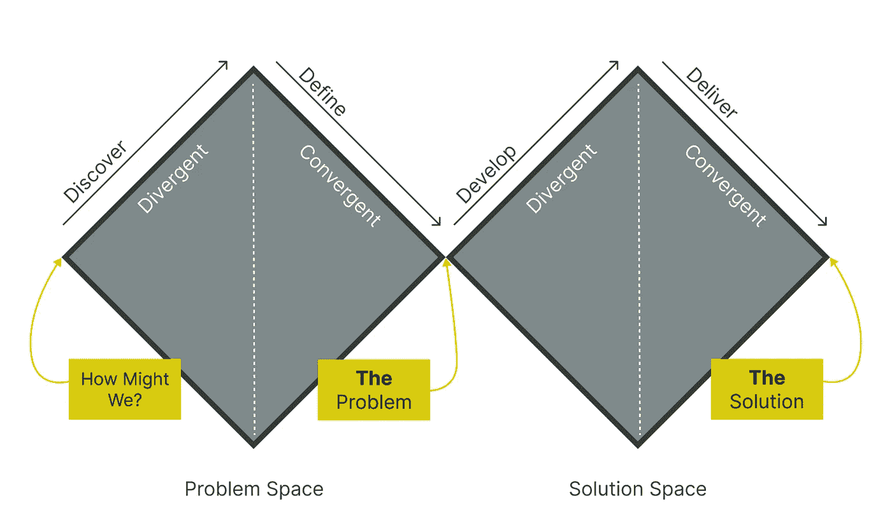
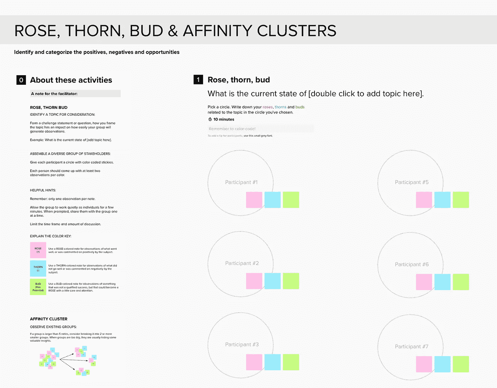
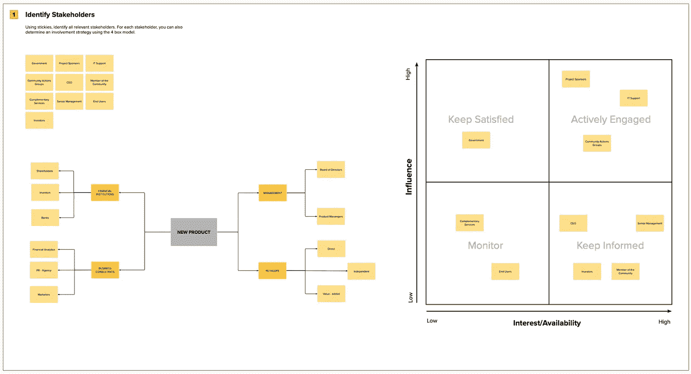
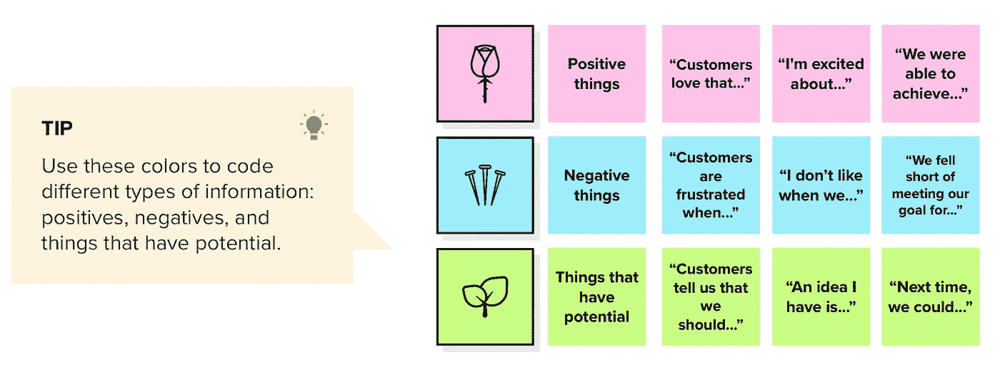
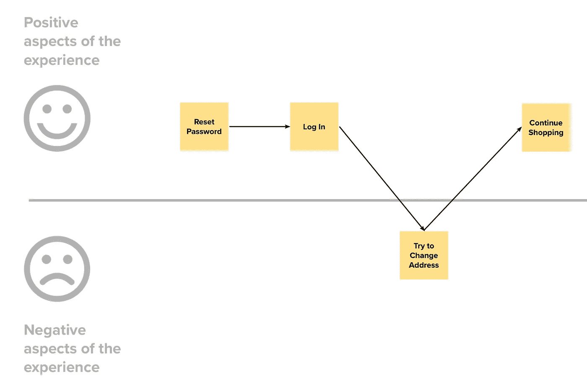
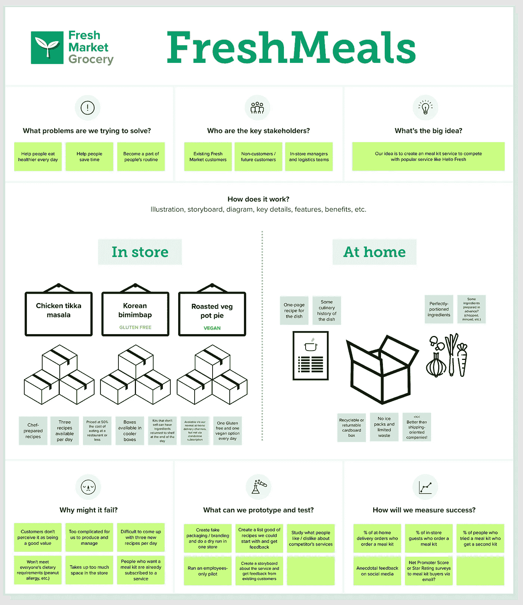
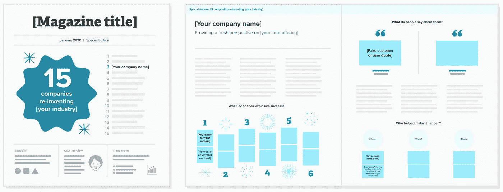

# 我们如何利用设计思维来推动数据科学项目

> 原文：<https://towardsdatascience.com/how-might-we-utilize-design-thinking-to-boost-data-science-projects-f530bf282455>

## 你如何像设计师一样思考，做出更有用、更有影响力、更创新的数据驱动产品

威尔·麦克马汉在 [Unsplash](https://unsplash.com?utm_source=medium&utm_medium=referral) 上的照片

首先，你可能会想，“设计思维和数据科学有什么关系？!"我们先来定义一下[设计思维](https://en.wikipedia.org/wiki/Design_thinking)，然后看看大家如何将设计思维方法应用到数据科学中。

设计思维的早期先驱之一，他们将设计思维定义为:

> *设计思维是一种以人为中心的创新方法，从设计师的工具箱中汲取灵感，整合人们的需求、技术的可能性和商业成功的要求。*

一些事情跳出来。首先，这是一种以人为本的方法，这意味着你设计的解决方案是为人服务的，而不是技术。每个数据科学家和分析师都应该首先考虑用户！第二，它采用设计师的工具，并将它们应用于普遍的商业成功。设计思维不仅仅是设计师的，当然也不仅仅是软件用户界面(UI)的！

作为一名数据科学家，有许多方法可以将设计思维融入到工作中来帮助解决问题，例如:

1.  利益相关者管理
2.  确定要解决的最重要的问题
3.  确定工作优先级
4.  得到深思熟虑的批评
5.  确定解决方案的可用性
6.  在构建之前，构建一个启动计划

在开始之前，我们先来看看设计思维的几个基本要素。

# 双菱形

我首先要讲一下**双钻石**的概念。[双菱形](https://en.wikipedia.org/wiki/Double_Diamond_(design_process_model))是设计思维中的一个核心概念，帮助你构建如何思考解决问题和开发解决方案的框架。这个概念是，你从左边开始，做两组**发散**和**收敛**练习，帮助你确定**要解决的问题**，然后探索解决方案周围的广阔空间，最后得出**解决方案**。设计思维中你会经常听到的两个词是发散和收敛。

*   发散型:向广泛的可能性敞开你的心扉。正如我的朋友兼导师在开始一个疗程时所说的:

> 驯服一个疯狂的想法比放大一个微弱的想法更容易。

*   **收敛**:将可能性的范围缩小到单一的一个。

双菱形以及发散和收敛思维被应用到不同的设计思维方法中，以帮助开发解决方案。

作者图片

# 我们怎么可能

你可能听说过这个短语，**我们怎么可能**，通常缩写为 **HMW** 。这三个强有力的词帮助我们以一种强有力的、包容的方式构建一个问题陈述。

*   **如何:**暗示我们还不知道解决方案。
*   **可能:**暗示一个解决方案是可能的，并且可能有几种实现它的方法。
*   **我们:**把大家召集起来帮助解决问题。

在练习设计思维时，你会经常看到这一点，我建议你亲自尝试一下，看看它是如何邀请合作来帮助你从新的角度展开问题陈述的。让我们看一个简单的例子:

**来自**

> *构建流媒体音乐推荐系统*

**至**

> 我们怎样才能让用户喜欢的音乐排队，让他们听上好几个小时？

注意到区别了吗？更具启发性，同时也给用户带来了问题。

# 设计思维方法

你可以利用许多不同的设计思维方法，可能有成百上千种。不同的组织已经策划了设计思维方法的“系统”，并为你选择了这些方法，例如 [IDEO 的设计工具包](https://www.designkit.org/methods)、 [Google Design Sprints](https://designsprintkit.withgoogle.com) ，或者我所认证的 [LUMA Institute 的方法](https://www.luma-institute.com/about-luma/luma-system-explore-methods/)。

这是他们网站上亮度方法的完整列表。我们将在这篇文章中讨论其中的几个，但实际上，每一个都可以在某个时间点应用于数据科学。如果你想了解更多，他们的网站上记录了每种方法。

图片作者来自亮度研究所

我们开始吧！

# 设计思维工具

设计思维的核心工具通常是[便利贴](https://www.amazon.com/dp/B07RK52772)、[夏普斯](https://www.amazon.com/Sharpie-30001-Permanent-Markers-Point/dp/B00006IFHD)、[投票点](https://www.amazon.com/ChromaLabel-Removable-Color-Code-Assorted-Fluorescent/dp/B08MT7XMQ2)和[画架垫](https://www.amazon.com/Post-Sticky-559VAD4PK-Premium-Sticking/dp/B000N4AI8M)。这些极其简单的项目可以帮助你在一个房间里进行会议，产生惊人的结果。

在过去的几年里，令人惊讶的事情之一是数字工具的激增，这有助于促进虚拟设计思维会议。Figma 的[壁画](https://mural.co)、[米罗](https://miro.com)、[谷歌 Jamboard](https://workspace.google.com/products/jamboard/) 和 [FIGJAM](https://www.figma.com/figjam/) 等工具都是很好的帮助工具。每个都有一个免费的选项让你开始你的旅程。

我选择的工具是壁画。我也经常把它作为个人生产力工具。

其中一些甚至加载了[模板](https://www.mural.co/templates)，让你更快上手。

作者图片

# 利益相关者管理

当开始一个项目时，你要考虑谁是你的用户或利益相关者。您的利益相关者可能是销售、服务或工程部门的内部成员，也可能是高管或外部客户。每个利益相关者都有不同的需求和愿望；这就是利益相关者管理的用武之地。

在开始一个新项目之前，我喜欢做的第一个方法是运行一个 [**利益相关者映射**](https://www.luma-institute.com/stakeholder-mapping/) 练习，如果可以的话，这是一个和你的团队一起做的很好的练习。这有助于对谁是最重要的人达成共识。我喜欢从树状结构开始，最重要的人物在顶层，然后从那里开始建立。然后根据每个参与者在项目中的参与程度绘制他们的地图。

确定所有关键人物后，您可以将他们映射到一个简单的两两矩阵，以**影响力**和**兴趣/可用性**为轴。利用这些象限，你可以为他们确定你的参与模式，如**保持满意**、**积极参与**、**保持知情**和**监督**。一个简单的模型，让您在参与过程中保持结构化。

作者图片

接下来，基于我的利益相关者地图，我喜欢思考我的 [**面试**](https://www.luma-institute.com/interviewing/) 策略。我应该与谁交谈，以确保我正确理解客户的需求。面试是一个简单的过程，但是有一些最佳实践:

1.  如果你为了以后使用而记录面试，确保你得到了对方的同意。
2.  确保您有一套一致的问题来比较不同的受访者。从简单的问题开始，然后越来越具体。
3.  确保你是一个好的倾听者，而不是引导别人得到你想要的答案。

# 确定要解决的最重要的问题

当你开始一个项目时，你必须确保你正在解决正确的问题。我们从识别和采访我们的利益相关者开始，但是我们如何解决最重要的问题呢？确定什么是最重要的工作的一个很好的方法是把你的利益相关者召集在一起开一个引导式会议，让他们实时产生想法。我经常使用的两个活动是一个叫做**创意矩阵**的发散活动和一个叫做**可视化投票**的收敛活动的组合。

[**创意矩阵**](https://www.luma-institute.com/creative-matrix/) 包含行和列，允许你在合适的地方给你的参与者一些帮助。这些行通常代表一些**使能器**，例如*技术*、*环境*、*地点*、*游戏*等等。这些列通常代表**个人或一个问题陈述**。对于人来说，可以是*销售*、*服务*、*工程*等角色，也可以是任何*问题陈述*。通常，如果你使用问题陈述，你可能想在开始这个练习之前和你的小组一起集思广益，想出那些问题陈述。

设置一个 5-10 分钟的计时器，鼓励人们用想法填满所有的矩阵框。甚至指出缺少内容的区域，并引导他们填充这些框。

作者图片

当你在创意矩阵中产生想法后，你可以通过让参与者用一种叫做 [**的技术对最有影响力的事情进行投票来缩小这些想法的范围。将投票**](https://www.luma-institute.com/visualize-the-vote/) 可视化。给每人几个投票点(贴)；4-5 人通常效果很好，让他们静静地回顾并把它们放在黑板上。完成后，您可以提取投票最高的想法，并进一步发展它们。

像[壁画](https://support.mural.co/en/articles/2113758-run-a-voting-session)这样的电子工具内置了投票机制！

# 确定工作优先级

通常，当您有大量工作积压时，您需要额外的帮助来选择处理它们的最佳顺序。有很多区分工作优先级的技巧，但是如果你想合作完成，有一些有趣的技巧，比如**购买功能**和**重要性难度矩阵**。

[**购买功能**](https://www.luma-institute.com/buy-a-feature/) 是一个工具，让您的参与者为投票的各种功能赋予一个加权值。您首先要为您拥有的每一个特性分配一个美元值，这个值应该基于特性的相对工作量或实现量。一项大规模的任务可能价值很高，而你一天左右就能完成的事情可能价值较低。

给你的参与者有限的钱花。然后他们将被迫选择在每个功能上的花费。你可以指示他们按照他们希望的任何方式进行分割，包括把所有的钱都放在一个单一的功能上。

这种技术的一个很酷的技巧是让一个非常昂贵的特性无法用他们的钱来实现。例如，购买它可能需要 200 美元，但参与者只收到 100 美元。然后告诉他们，他们可以共同努力，作为一个团体来筹集资金，以资助这些更昂贵的功能。

接下来是 [**重要性/难度矩阵**](https://www.luma-institute.com/importance-difficulty-matrix/) **—** 团队合作的绝佳工具。两个轴代表两个不同的值。你首先把一个想法放在黑板的底部。然后拿出你的下一个想法，确定它是比中间那个更重要还是更次要。继续这个过程，直到它们都沿着底部展开，如下图所示。

接下来，把一个想法垂直移动到棋盘中间。然后重复这个过程，直到所有的想法都被排序。这个练习的一个关键提示是，每个音符应该只占据棋盘上的一行或一列，迫使小组不要把所有的东西都放在一个象限中。每一个想法对对方来说都是相对重要和困难的。根据重要性和实现的难易程度，你最终会得到四个象限，分别代表**速赢**、**最佳选择**、**登月**和**低优先级**。

作者图片

# 得到深思熟虑的批评

在我的职业生涯中，获得正面反馈很容易；得到批评(不是批评)可能非常困难。人们通常不想说一些他们可能认为是负面的话。在公司里，不能给出批评是一个糟糕的文化问题，但我一次又一次地看到了这一点。克服这一点的一个奇妙方法是利用技术****，它提供了一种便捷的方式来带来以下类型的想法:****

*   ******玫瑰**:积极的东西****
*   ******刺**:消极的东西****
*   ******萌芽**:有潜力的东西****

****有了这些类别，你的参与者很容易给你各种类型的反馈。想法产生后，你们分组讨论。你会发现，这种方法在提供反馈方面非常有效，让你超越了通常收到的“一切都很好”的反馈。****

********

****作者图片****

# ****确定解决方案的可用性****

****因此，您已经构建了最新的仪表板、流失预测工具或惊人的预测模型。你如何获得对其可用性的反馈？我们可以使用产品开发中常用的技术来评估我们的数据科学项目，这与任何其他产品没有什么不同。在我的团队中，我们一直在对我们的数据产品和仪表板进行可用性研究。****

****我喜欢用第一种手法， [**将经验用图表表示**](https://www.luma-institute.com/experience-diagramming/) 。这种方法让用户走完你的工具之旅，然后指出他们一路上的体验如何。从一条水平线开始，在上面有**正面经历，**在下面有**负面经历**。然后让用户写下通过工具的流程。每一个过程步骤都被放置在这条线的上方或下方，从用户的角度来看，表明什么是有效的或者无效的。****

********

****作者图片****

****如果你想要一个更系统、可重复的可用性测试，可以使用 [**系统可用性量表**](https://www.luma-institute.com/system-usability-scale/) 或者 SUS。SUS 是一种经过验证的确定可用性的方法，它是一个简单的 10 个问题的调查，会问一些问题:****

1.  ****我想我会经常使用这个系统。****
2.  ****我发现这个系统不必要的复杂。****
3.  ****我认为这个系统很容易使用。****
4.  ****我认为我需要技术人员的支持才能使用这个系统。****
5.  ****我发现这个系统中的各种功能整合得很好。****
6.  ****我认为这个系统中有太多不一致的地方。****
7.  ****我想大多数人会很快学会使用这个系统。****
8.  ****我发现这个系统用起来很麻烦。****
9.  ****我对使用这个系统很有信心。****
10.  ****在进入这个系统之前，我需要学习很多东西。****

****你可以在这里了解更多关于[的信息。你甚至可以使用像 Survey Monkey 或](https://www.usability.gov/how-to-and-tools/methods/system-usability-scale.html) [Question Pro](https://www.questionpro.com/survey-templates/system-usability-scale-survey-questions-template/) 这样的数字调查工具来进行管理。****

# ****在构建之前构建一个发布计划****

****最后，您已经准备好启动您的数据科学项目。你不必等到所有的工作都完成了才开始考虑你的发布，你可以在你的产品启动时就开始考虑。****

****第一种方法是开发一张 [**概念海报**](https://www.luma-institute.com/concept-poster/) 。这个框架使得考虑构建和启动解决方案的一些实际问题变得简单。在概念中，你填写你试图解决的问题，关键利益相关者，大想法，它可能失败的原因，如何原型化和测试，最后，你将如何衡量成功。你也可以用一个例子来说明你的想法。****

********

****作者图片来自壁画样本****

****最后但同样重要的是 [**封面故事模型**](https://www.luma-institute.com/cover-story-mock-up/) 。这种方法类似于为你的产品发布写一篇新闻稿，但是可以帮助你讲述从项目开始你将会产生的影响。通过创建封面故事或新闻稿，你会发现项目团队成员会更好地理解你想要创造的**客户价值**，因为故事是以你的客户为中心的。玩得开心点。根据您希望收到的反馈类型，包括有关所创造价值的详细信息，甚至是虚假的客户报价。****

********

****作者图片来自壁画样本****

# ****结论****

****设计思维是一种以人为中心的创新方法。它可以把人们聚集在一起，形成新的想法，这在你开始之前可能都不会想到。我介绍了识别和优先考虑如何与项目中的利益相关者互动的方法——产生一系列不同的想法，然后将它们缩小到最重要的想法。我介绍了几种通过包含利益相关者来确定工作优先级的方法。当你准备好接受反馈时，玫瑰-荆棘-花蕾法是征求意见的一个很好的方法。我介绍了两种不同的方法来确定您的解决方案的可用性，可以帮助您微调您构建的内容。最后，我分享了一些在产品发布前考虑产品发布的方法。本文只是对如何将设计思维融入数据科学工作的一个高度概括。我鼓励你学习更多，并开始利用一到两种技术！****

****如果你喜欢阅读这样的故事，并想支持我成为一名作家，考虑注册成为一名媒体会员。每月 5 美元，可以无限制地访问数千篇文章。如果你使用 [*【我的链接】*](https://medium.com/@broepke/membership) *注册，我将免费获得一小笔佣金。*****