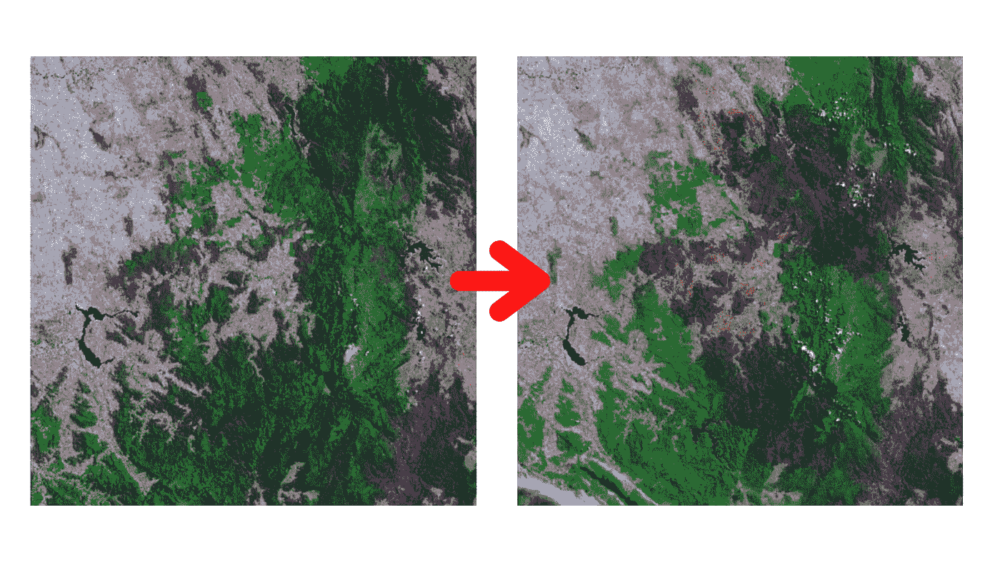
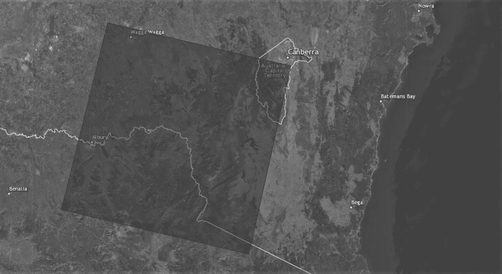
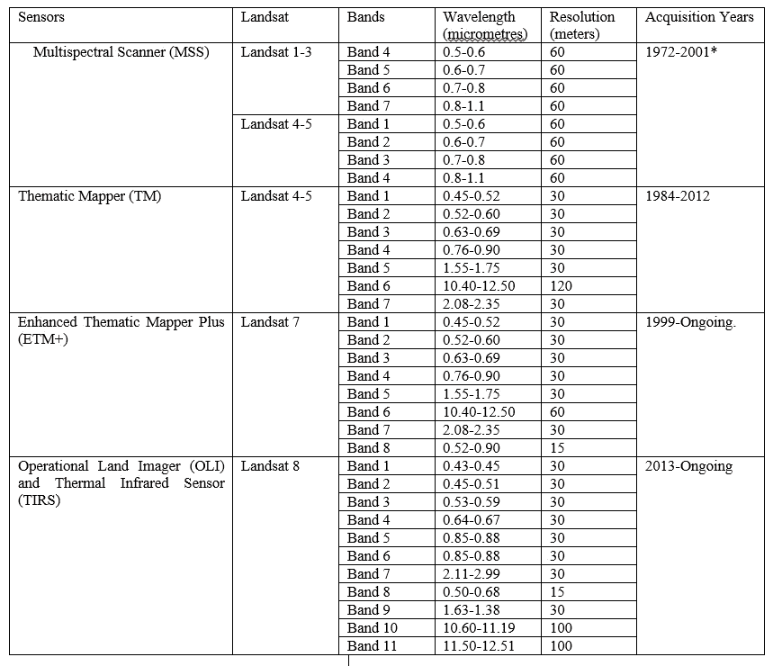
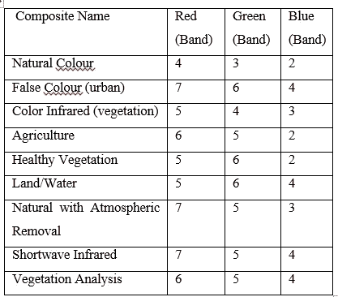
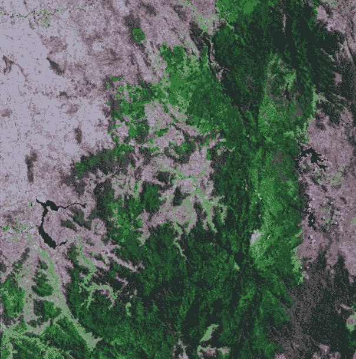
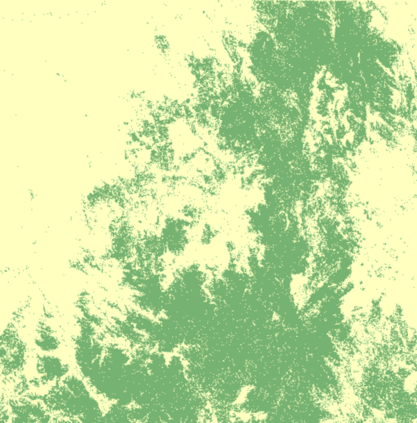
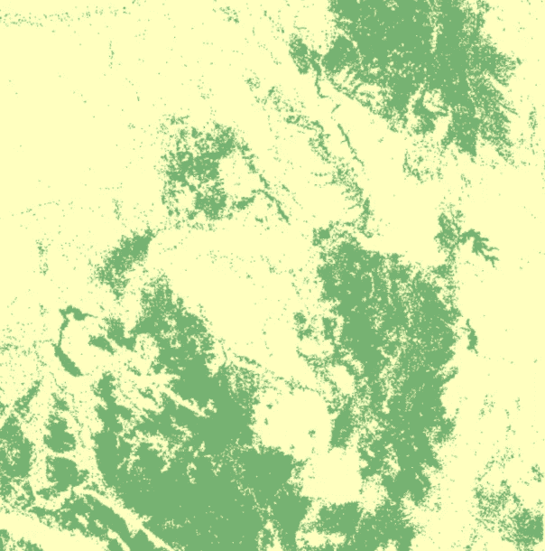
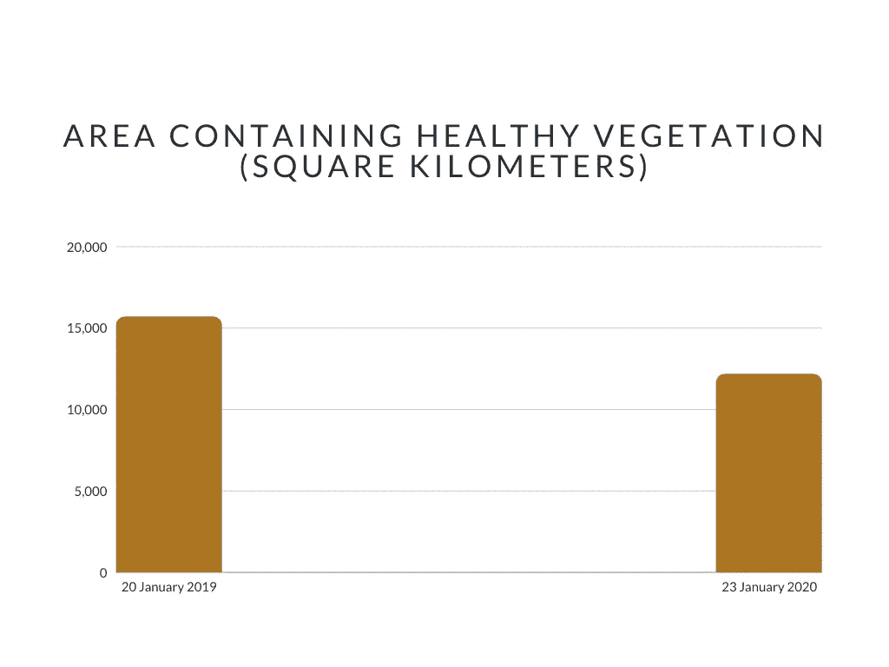

# 澳大利亚在 2020 年的森林大火中损失了多少绿色？—使用 Landsat-8 图像进行计算

> 原文：<https://towardsdatascience.com/how-much-green-did-australia-lose-during-2020-bushfires-calculating-using-landsat-8-images-36f35c67edb4>

## 用 Landsat-8 图像计算澳大利亚森林火灾后某一地区健康自然植被的变化

一定区域内健康自然植被的变化。按作者分类的图像(根据数据集创建)。

***摘要*——**自从欧洲人定居后，澳洲正经历大规模的森林砍伐，危及其野生动物，并为气候危机打开了新的大门。大约 16%的澳大利亚被森林覆盖，但是由于森林砍伐，森林覆盖面积也在迅速减少。从 2019 年 6 月到 2020 年 5 月，大规模的丛林大火摧毁了澳大利亚大面积的森林和其他健康的自然植被。这场丛林大火在 2019 年底至 2020 年初造成了最大的破坏，成为了世界范围内的重大新闻。因此，对这场森林大火造成的破坏进行分析，对于计算有多少森林和健康的自然植被损失以及需要恢复非常重要。Landsat 级数据的增加为分析人员轻松检测和计算生物量的变化提供了新的机会。Landsat 计划已经连续 40 多年提供地球观测。凭借易于获取的高分辨率 Landsat 8 数据，观测者越来越容易直观地识别城市地区、水体、健康和不健康的植被、农田甚至云层。在这项研究中，我们使用了 2019 年 1 月 20 日和 2020 年 1 月 23 日我们在澳大利亚选择的特定地区的卫星图像，并计算了这一时期健康的自然植被的变化。来自 Landsat 8 的 11 个不同光谱波段的图像为 ArcGIS 中的非监督或监督分类提供了足够高分辨率的数据，然后用于对植被进行分类并计算与之相关的面积。使用卫星数据大大有助于减少误差和更准确地探测土地覆盖变化。

**关键词** —林火、野火、对地观测、陆地卫星、森林监测。

# 一.导言

澳大利亚是世界上第七大洲和第六大国，完全被水包围，是唯一占据整个大陆的国家。尽管澳大利亚是世界上最干燥的国家之一，但它却是世界上最发达的国家之一。最近森林砍伐率有所上升，野火使得澳大利亚健康的植被状况更加糟糕。澳大利亚最严重的自然灾害可能是 2009 年 2 月 7 日的黑色星期六丛林大火[1]。但最近从 2019 年 6 月到 2020 年 5 月的丛林大火可能是其中最严重的一次。这场大火造成 34 人直接死亡，400 多人间接死亡，9300 多所房屋被毁。在全球生态系统中，野火和丛林大火扮演着非常重要的角色，因为它们威胁着生命和植被等自然资源。有必要单独确定火灾事件，以便更好地了解火灾事件如何影响当地和全球环境[3，4]。发现被烧毁的森林和健康的植被并计算总的受灾面积也很重要。通过这种方式，我们将能够估计野火或丛林大火对自然资源的破坏程度。我们的研究工作集中在这个问题上，并利用卫星图像对火灾前后的健康植被进行无监督分类和计算来解决这个问题。植被覆盖变化的计算依赖于不同日期的两幅图像之间的数据驱动属性的比较[6]。在[7]中，研究人员计算了 1967 年至 2007 年间多类土地覆盖分类图的变化，并分析了非洲马里植被覆盖的变化和变异。最近可以找到更多的实验方法，例如基于神经网络和决策树的方法。

由于最近开展的研究工作，人们越来越认识到生物质燃烧在全球碳循环中的重要作用。通过燃烧消耗的生物质数量的估计通常基于下面提到的简单关系[10]。

*M = ABc …(1)*

这里，在给定的时间间隔内燃烧的植被的质量用 M 表示，在相同的时间间隔内，燃烧的面积用 A 表示，B 是生物量密度，描述燃烧完全性的因子用 c 表示[10]。不过在我们的研究中，我们使用了其他更简单的技术来更快地了解被烧毁植被的规模。

地球表面被 Landsat 卫星传感器系列连续观测了四十多年[8]。在当前和过去的 Landsat 任务中，有 4 种不同类型的传感器用于收集 EO 数据，表 1 [8]提供了每种传感器的特性。

为了探测热异常，在许多研究中使用了 Landsat 级数据。为了研究火山活动，Landsat-5 专题成像仪数据被广泛使用。为了给火灾管理系统提供信息，卫星遥感主动火灾数据已经被广泛使用了十多年[14]。采用免费数据政策和发射新仪器有助于增加大地卫星级数据的可用性，但单个大地卫星级传感器提供的空间和时间覆盖范围相对保持不变。在我们的研究中，我们使用了来自 https://usgs.gov 的陆地卫星数据。我们使用 2019 年 1 月 20 日和 2020 年 1 月 23 日澳大利亚东南部特定地区的 Landsat 影像来进行我们的研究。Landsat-8 图像在 11 个不同的光谱带中下载以进行我们的研究，而我们仅使用前 7 个光谱带图像的不同组合进行我们的研究。

# 二。相关研究

2010 年，Roger A. Pielke Jr .和 Katharine Haynes 做了一项关于建筑对气候影响的历史研究[1]。该研究还涵盖了 1925 年至 2009 年澳大利亚丛林火灾的影响，重点是 2009 年维多利亚州的黑色星期六火灾。2013 年发表的一项研究报告了通过光谱分析进行火灾严重性研究的应用[15]。这项研究的重点是澳大利亚北部热带稀树草原的火灾严重性分析，描述了火灾后受火灾影响的植被的即时光谱响应。对于火灾严重程度分类，该论文提出了一套候选模型，其中包括中分辨率成像光谱仪的第 2、5、6 和 7 通道。L. Giglio 等人在 2005 年进行了一项类似的研究，该研究使用 MODIS [10]对烧伤面积进行了全球估计。2016 年发表的一项研究重点关注如何利用卫星数据来确定森林火灾的着火点及其可能的日期[2]。2015 年发表了一篇专注于 Landsat-8 数据在主动火灾探测中的意义的论文[14]。他们算法关注的技术之一是从卫星图像中探测地表，并探测潜在的火灾和烟雾。在多种多样的训练和验证场景下，本文提出了一种误差非常小的算法。M. Schmidt 等人在 2015 年发表的一项研究介绍了多分辨率时序图像在澳大利亚森林干扰和生长监测领域的使用情况[11]。Grahame Douglas 等人提出在森林火灾概率检测中使用极值分析[12]。在他们的研究中，广义极值法被扩展到确定森林火灾危险指数(FFDI ),用于设计森林火灾探测。

# 三。陆地卫星数据和分类方法

表 1 提供了用于收集陆地卫星任务中的地球观测数据的 4 种不同传感器的特性。从 1972 年到 1992 年，多光谱扫描仪(MSS)获取了 Landsat 1–5 的数据。MSS 收集数据的空间分辨率约为 80 米，辐射测量覆盖 4 个光谱带。这 4 个光谱带从可见绿色到近红外(NIR) [8]。Landsat 4-5 使用了专题成像仪，空间分辨率在 30 米至 120 米之间。从 1984 年到 2012 年，使用了专题制图仪。7 个光谱带用于收集数据。大地卫星 7 号正在使用增强型专题制图仪(ETM+)，其空间分辨率约为 30 米，分 8 个不同的光谱带。实用陆地成像仪(OLI)和热红外传感器(TIRS ),分辨率在 15 米至 100 米之间，有 11 个不同的光谱带。它从 2013 年开始运作。表 2 列出了 Landsat 1–8 中使用的所有光谱带的波长和用途。

## 数据集和许可:

Landsat 数据访问页面指出，“美国地质调查局档案馆保存的 Landsat 数据产品可以从各种数据门户网站免费搜索和下载”[17]。

## 图像选择

我们选择了 2019 年至 2020 年澳大利亚森林大火事件影响最严重的地区之一。图 1 显示了我们研究的选定区域。我们的研究将仅限于这一领域。我们选择的面积大约是 33，300 平方公里。所选区域在图 1 中用深色阴影示出。我们下载了前面提到的两个日期的 11 个不同光谱波段的 Landsat 8 图像。我们选择了这两个特定的日期，牢记最低陆地云量(LCC)的图像将给出最好和最准确的结果。2019 年 1 月 20 日，LCC 为 0.15%，2020 年 1 月 23 日，LCC 为 1.79%。

图一。选定的研究领域。来源:图片来自[16]。

我们使用地理信息系统(GIS)ArcGIS 来使用不同的波段组合并对 Landsat 图像中的不同区域进行分类，如森林、城市地区和水体等。，基于不同的颜色。

表 1。Landsat 传感器及其特性[13]。

**在 Landsat 5 上的 TM 传感器出现故障之后，MSS 传感器在卫星退役之前被重新激活了一小段时间[8]。*

表二。Landsat 1–8 中使用的不同光谱波段及其用法[13]

## 分类

不同的波段组合为目视检查和监督分类提供了不同的结果。这也有助于无监督分类。表 3 列出了不同波段组合及其用途。

表 3。Landsat 8 的波段组合。图片作者。

我们使用表 3 中的第 9 个波段组合来目视检查我们的研究区域。图 2 和图 3 分别显示了我们在 2019 年 1 月 20 日和 2020 年 1 月 23 日的“植被分析”波段组合中的研究区域。从目测来看，差异非常明显，我们将执行更多的步骤来获得被森林火灾事件砍伐的确切面积。

图二。2019 年 1 月 20 日“植被分析”波段组成中的研究区域。按作者分类的图像(根据数据集创建)。

图 3。2020 年 1 月 23 日“植被分析”波段组成中的研究区域。按作者分类的图像(根据数据集创建)。

我们在 ArcGIS 中使用了非监督分类，以不同的配色方案对影像中的不同区域进行分类。我们用颜色标记了被归类为健康植被的浅绿色区域。根据 2019 年和 2020 年的数据对健康植被进行正确分类后，森林砍伐区变得很容易看到。包含 2019 年 1 月 20 日和 2020 年 1 月 23 日影像中健康植被的分类区域如下所示。

图 4。2019 年 1 月 20 日影像中健康植被的分类。按作者分类的图像(根据数据集创建)。

图 5。2020 年 1 月 23 日影像中健康植被的分类。按作者分类的图像(根据数据集创建)。

在无监督分类过程中，分类的准确性取决于我们对图像不同区域进行分类的类的数量。类别数量过多或过少都会导致分类不准确。在我们的研究中，在对分类图像和原始图像进行视觉检查时，使用 7 个类别给了我们最好的结果。分类后，我们计算了被分类为健康植被的面积。

# 四。结果和讨论

我们研究的总面积约为 33，300 平方公里。根据两个日期计算出健康植被的面积后，我们得到了表 4 中的结果。

表 4。不同日期包含健康植被的计算面积。图片作者。

图 6。不同日期包含健康植被的计算区域的图形表示。图片作者。

根据这一计算数据，在我们进行研究的地区，有 3522.27 平方公里的森林或健康植被因森林火灾或其他原因被砍伐。这里森林砍伐如此严重的主要原因是 2019 年 6 月开始的丛林大火爆发。从 2019 年 1 月 20 日到 2020 年 1 月 23 日，近 22.46%的现有森林在这一年中被烧毁。

检测和计算森林火灾后的损失对于土地利用规划和建设实践是非常重要的。随着易于获得的卫星图像数量的增加，研究人员使用这些数据和估计森林火灾事件的后果变得更加有效。在我们的研究中，我们使用了 ArcGIS 中非常常用的分类技术，即非监督分类技术，并使用它来计算两个不同日期包含健康植被的面积。无监督分类通常用于对河流和湖泊等水体进行分类，但在这里我们将其用于不同的目的。这种方法既适用于大洲范围的监测，也适用于小范围的监测。它开辟了使用 Landsat 数据计算森林火灾后果的新方法，这将有助于政府、企业和环境研究人员在未来创建生态可持续的基础设施。

# 动词 （verb 的缩写）结论

Landsat 系列卫星传感器是运行时间最长的地球观测项目之一，它仍在监测地球。自从 2008 年实行大地遥感卫星数据的免费和公开分发政策以来，大地遥感卫星数据是森林管理和分析中使用最多的数据之一，而且由于大地遥感卫星数据具有空间、光谱和时间分辨率，因此非常适合这种情况。

本文描述了用于根据 Landsat 8 数据计算健康植被分布的方法，但该方法可以灵活地用于计算其他要素的分布，如城市地区、水体、农田等。

来自卫星的数据可以大大有助于火灾探测，通过准确的信息和我们的方法，在火灾发生后监测森林和自然资源变得更加容易。这将有助于自动燃烧区域测绘系统和火灾强度分析系统。

我希望你喜欢阅读这篇文章。如果你有，请成为灵媒的一员。只要每月 5 美元，你就可以阅读 Medium 上的任何文章(不仅仅是我的文章，任何文章)。单击下面的链接。

[https://samratduttaofficial.medium.com/membership](https://samratduttaofficial.medium.com/membership)

 [## 通过我的推荐链接加入媒体

### 作为一个媒体会员，你的会员费的一部分会给你阅读的作家，你可以完全接触到每一个故事…

samratduttaofficial.medium.com](https://samratduttaofficial.medium.com/membership) 

这篇文章是我，萨姆拉特·杜塔和我的朋友[吉妮娅·帕尔文](https://www.linkedin.com/in/jinia-parvin-9a2b06211/)写的。我们双方的信息如下。

## 萨姆拉特·杜塔:

Github:[https://github.com/SamratDuttaOfficial](https://github.com/SamratDuttaOfficial)

**领英:**[https://www.linkedin.com/in/SamratDuttaOfficial](https://www.linkedin.com/in/SamratDuttaOfficial)

请我喝杯咖啡:[https://www.buymeacoffee.com/SamratDutta](https://www.buymeacoffee.com/SamratDutta)

## 吉妮亚·帕尔文:

**领英:**[https://www.linkedin.com/in/jinia-parvin-9a2b06211/](https://www.linkedin.com/in/jinia-parvin-9a2b06211/)

**Github:【https://github.com/jiniaparvin】T22**

# 参考

[1] RP Crompton，KJ McAneney，K Chen，RA Pielke Jr，K Haynes .位置、人口和气候对澳大利亚森林火灾造成的建筑损坏和死亡的影响:1925-2009 年。天气、气候和社会。2010;2, 300-10.

[2] A .贝纳利、A .鲁索、AC Sá、R .平托、O .普莱斯、N .库特西亚斯、J .佩雷拉。用卫星数据确定火灾日期和定位着火点。遥感。2016;8, 326.

[3]LB lantie，ZA Holden，AM Smith，MJ Falkowski，AT Hudak，P . mor gan，SA Lewis，PE Gessler，NC Benson。评估现行火灾特征和火灾后影响的遥感技术。国际荒地火灾杂志。2006;15, 319-45.

[4] L .吉廖，法学博士肯德尔，首席法官。用模拟 AVHRR 红外数据评估全球火灾探测算法。国际遥感杂志。1999;20, 1947-85.

[5] EA 莱曼，JF 华莱士，PA Caccetta，SL Furby，K 兹杜尼奇。澳大利亚大陆时间序列陆地卫星数据的森林覆盖趋势。国际应用地球观测和地理信息杂志。2013;21, 453-62.

[6] P .科平，I .琼克希尔，K .纳卡耶茨，B .穆伊，E .兰宾。生态系统监测中的数字变化检测方法。国际遥感杂志。2004;25, 1565-96.

[7]D . Ruelland，F . Levavasseur，A . tribo TTé。1960 年代以来马里三个试验区土地覆盖变化的模式和动态。国际应用地球观测和地理信息杂志。2010;12、S11-7。

[8] A 班斯科塔，N 卡亚斯塔，MJ 法尔科夫斯基，MA Wulder，RE Froese，JC White。利用 Landsat 时间序列数据进行森林监测:综述。加拿大遥感杂志。2014;40, 362-84.

[10] L .吉利奥、g .范德维尔夫、JT·兰德森、GJ·科拉茨、P .卡西布哈特拉。使用 MODIS 主动火观测对燃烧区域的全球估算。大气化学和物理学，2006；6, 957-974.

[11] M .施密特、R .卢卡斯、P .邦廷、J .韦贝尔塞尔、J .阿姆斯顿澳大利亚昆士兰州森林干扰和再生监测的多分辨率时间序列图像。环境遥感。2015;158, 156-68.

[12] G .道格拉斯，Y .何，Y .向，EC .莫里斯。极值分析在确定森林防火设计年超越概率中的应用。消防安全科学。2014;11, 1379-92.

[13]陆地卫星任务，可在:[http://landsat.usgs.gov](http://landsat.usgs.gov)获得，2020 年 11 月访问。

[14] W .施罗德，P .奥利瓦，L .吉利奥，B .奎尔，E .洛伦茨，F .莫雷利。使用 Landsat-8/OLI 数据的主动火灾探测。环境遥感。2016;185, 210-20.

[15] AC Edwards，SW Maier，LB Hutley，RJ·威廉姆斯，J . Russell-Smith。澳大利亚北部热带稀树草原火灾严重程度的光谱分析。环境遥感。2013;136, 56-65.

[16]陆地卫星任务，可在 http://landsat.usgs.gov获得，2020 年 11 月访问。

[17]陆地卫星任务，可在 https://www.usgs.gov/landsat-missions/landsat-data-access获得，2020 年 11 月访问。