# 隐藏层数如何影响自动编码器潜在表示的质量

> 原文：<https://towardsdatascience.com/how-number-of-hidden-layers-affects-the-quality-of-autoencoder-latent-representation-181215c8e7d1>

## 自动编码器中超参数调谐—第 1 部分

Clark Van Der Beken 在 [Unsplash](https://unsplash.com/?utm_source=unsplash&utm_medium=referral&utm_content=creditCopyText) 上拍摄的照片

# 介绍

你可能已经知道[自动编码器潜在表示](https://rukshanpramoditha.medium.com/an-introduction-to-autoencoders-in-deep-learning-ab5a5861f81e#d259)包含了输入数据的最重要的特征，当它的维数明显低于输入数据的维数时。

自动编码器潜在表示的质量取决于许多因素，例如*隐藏层数*、*每层中的节点数*、[、*潜在向量的维数*、](https://rukshanpramoditha.medium.com/how-the-dimension-of-autoencoder-latent-vector-affects-the-quality-of-latent-representation-c98c38fbe3c3)、[、*隐藏层中激活函数的类型*、](/how-to-choose-the-right-activation-function-for-neural-networks-3941ff0e6f9c)、*、*、*优化器的类型*、*学习速率*、*数量*、[、技术上，这些因素被称为自动编码器模型](/creating-a-multilayer-perceptron-mlp-classifier-model-to-identify-handwritten-digits-9bac1b16fe10#7540) [*超参数*](https://rukshanpramoditha.medium.com/parameters-vs-hyperparameters-what-is-the-difference-5f40e16e2e82) 。

获得这些超参数的最佳值称为*超参数调整*。机器学习中有不同的[超参数调整技术](/python-implementation-of-grid-search-and-random-search-for-hyperparameter-optimization-2d6a82ebf75c)。一个简单的技术是手动调整一个超参数(这里是隐藏层数)，同时保持其他超参数值不变。

今天，在这一集里，我将向你展示隐藏层的数量是如何影响自动编码器潜在表现的质量的。

# 我们使用的数据集

我们将使用 [**MNIST 数据集**](https://rukshanpramoditha.medium.com/acquire-understand-and-prepare-the-mnist-dataset-3d71a84e07e7) (见最后的[引文](#aec6))在这里建立自动编码器模型。

**获取并准备 MNIST 数据集**(作者代码)

# 方法

我们将建立三个具有不同架构的自动编码器模型，这些模型仅取决于隐藏层的数量，而模型中的其他超参数值保持不变。我将使用几种可视化技术来验证结果。

# 具有一个隐藏层的自动编码器

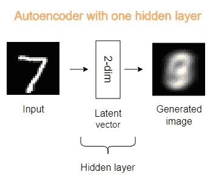

(图片由作者提供)

上述自动编码器架构可以编码如下。

**用一个隐藏层定义自动编码器架构**(作者代码)

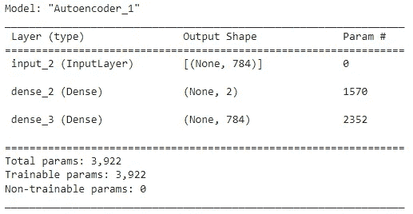

(图片由作者提供)

现在，我们可以训练模型了。

(作者代码)

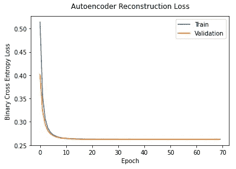

(图片由作者提供)

现在，我们可以看到编码后压缩的 MNIST 数字。

(作者代码)

**带有一个隐藏层的自动编码器的输出**(图片由作者提供)

此输出不够清晰，无法区分 MNIST 数据集中的每个数字，因为单个隐藏图层不足以捕捉 MNIST 数据中大多数复杂的非线性模式(关系)。

我们可以将上面的输出与原始的 MNIST 数字进行比较。

(作者代码)

**原 MNIST 数字**(图片由作者提供)

现在，我们可以在潜在空间中可视化测试 MNIST 数据，以查看具有一个隐藏层的自动编码器模型如何能够区分九个数字。

(作者代码)

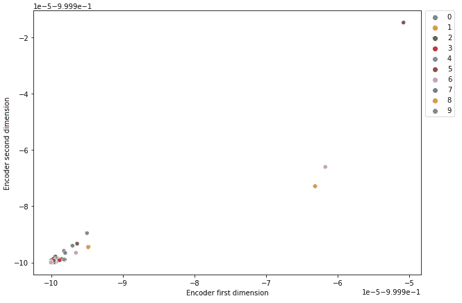

**可视化潜在空间中的测试 MNIST 数据**(图片由作者提供)

这些数字在潜在空间中没有清晰的独立簇。这意味着仅具有一个隐藏层的自动编码器模型不能清楚地区分测试 MNIST 数据中的九个数字。

作为一个解决方案，我们可以增加自动编码器模型中的隐藏层数。

# 具有两个隐藏层的自动编码器

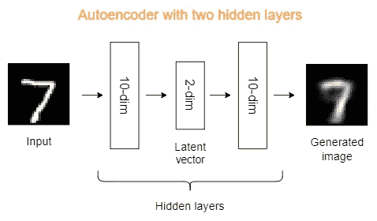

(图片由作者提供)

上述自动编码器架构可以编码如下。

**定义具有两个隐藏层的自动编码器架构**(作者代码)

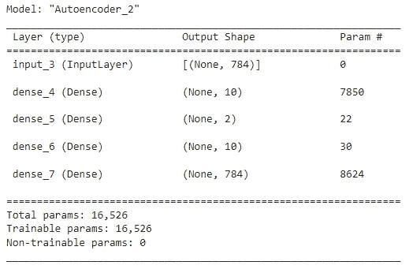

(图片由作者提供)

现在，我们可以像以前一样训练模型。

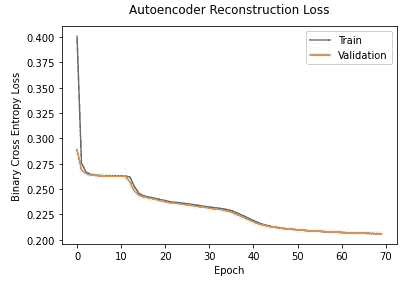

(图片由作者提供)

现在，我们可以看到编码后压缩的 MNIST 数字。

**具有两个隐藏层的自动编码器的输出**(图片由作者提供)

此输出比前一个输出好得多，因为两个隐藏层可以捕获 MNIST 数据中大量复杂的非线性模式(关系)。但是，这个结果仍然离最初的 MNIST 数字相差甚远。

**原 MNIST 数字**(图片由作者提供)

现在，我们可以在潜在空间中可视化测试 MNIST 数据，以查看具有两个隐藏层的自动编码器模型如何能够区分九个数字。

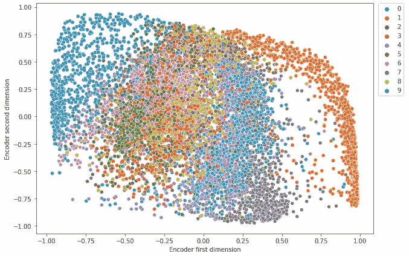

**可视化潜在空间中的测试 MNIST 数据**(图片由作者提供)

与之前的输出相比，一些数字在潜在空间中有清晰的独立簇，而一些没有。这意味着具有两个隐藏层的自动编码器模型可以在一定程度上区分测试 MNIST 数据中的九个数字，但不是完美的！

作为一个解决方案，我们可以进一步增加自动编码器模型中的隐藏层数。

# 具有三个隐藏层的自动编码器

(图片由作者提供)

上述自动编码器架构可以编码如下。

**定义具有三个隐藏层的自动编码器架构**(作者代码)

(图片由作者提供)

现在，我们可以像以前一样训练模型。

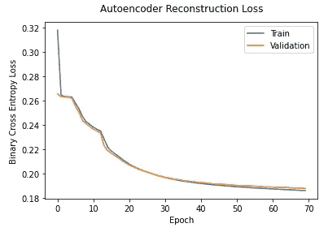

(图片由作者提供)

现在，我们可以看到编码后压缩的 MNIST 数字。

**三层隐藏自动编码器的输出**(图片由作者提供)

此输出比前两个输出好得多，因为三个隐藏层可以捕获 MNIST 数据中大多数复杂的非线性模式(关系)。除此之外，这个输出足够接近原来的 MNIST 数字，但它并不完美！

**原 MNIST 数字**(图片由作者提供)

现在，我们可以在潜在空间中可视化测试 MNIST 数据，以查看具有三个隐藏层的自动编码器模型如何能够区分九个数字。

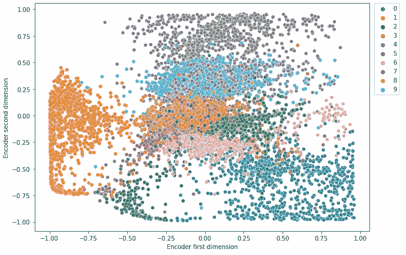

**可视化潜在空间中的测试 MNIST 数据**(图片由作者提供)

与前两个输出相比，大部分数字在潜在空间中具有清晰的独立簇。这意味着具有三个隐藏层的自动编码器模型可以清楚地区分测试 MNIST 数据中的九个数字。

# 结论

您可以尝试进一步增加自动编码器模型中的隐藏层数。当您这样做时，由于模型变得更加复杂，有许多隐藏层，这可能会导致[过拟合](https://rukshanpramoditha.medium.com/list/addressing-overfitting-868959382d1d)，从而显著降低自动编码器潜在表示的质量。为了减轻自动编码器模型中的过拟合，您可以尝试不同的[正则化技术](https://rukshanpramoditha.medium.com/list/regularization-techniques-for-neural-networks-c4ad21cce618)，如 [***辍学***](https://rukshanpramoditha.medium.com/how-dropout-regularization-mitigates-overfitting-in-neural-networks-9dcc3e7102ff) 或 [***提前停止***](https://rukshanpramoditha.medium.com/using-early-stopping-to-reduce-overfitting-in-neural-networks-7f58180caf5b) 。

在这篇文章的结尾，我想用一张图片向您展示三种自动编码器模型的输出，并与原始的 MNIST 数据进行比较。

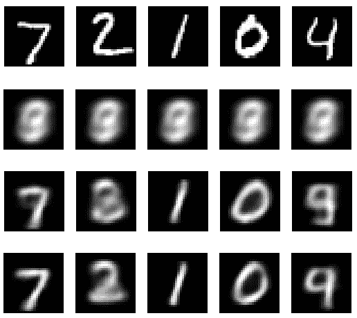

**自动编码器输出一张图片**(图片由作者提供)

最上面一行代表原始的 MNIST 数据。随着我们一个接一个地增加 autoencoder 模型中隐藏层的数量，autoencoder 潜在表示的质量也会提高！我们可以考虑进一步增加隐藏层的数量，但这可能会导致我前面提到的过度拟合。

今天的帖子到此结束。

如果您有任何问题或反馈，请告诉我。

## 阅读下一篇(推荐)

*   **深度学习中的自动编码器介绍**

  

*   **自动编码器潜在向量的维度如何影响潜在表示的质量**

  

*   **自动编码器如何在降维方面优于 PCA**

  

*   **全集我的** [**神经网络与深度学习教程**](https://rukshanpramoditha.medium.com/list/neural-networks-and-deep-learning-course-a2779b9c3f75)

**

**点击图片进入我的神经网络和深度学习课程**(作者截图)** 

## **支持我当作家**

**我希望你喜欢阅读这篇文章。如果你愿意支持我成为一名作家，请考虑 [***注册会员***](https://rukshanpramoditha.medium.com/membership) *以获得无限制的媒体访问权限。它只需要每月 5 美元，我会收到你的会员费的一部分。***

**  

非常感谢你一直以来的支持！下一篇文章再见。祝大家学习愉快！** 

## **MNIST 数据集信息**

*   ****引用:**邓，l，2012。用于机器学习研究的手写数字图像 mnist 数据库。 **IEEE 信号处理杂志**，29(6)，第 141–142 页。**
*   ****来源:**[http://yann.lecun.com/exdb/mnist/](http://yann.lecun.com/exdb/mnist/)**
*   ****许可:***Yann le Cun*(NYU 库朗研究所)和 *Corinna Cortes* (纽约谷歌实验室)持有 MNIST 数据集的版权，该数据集在*知识共享署名-共享 4.0 国际许可*([**CC BY-SA**](https://creativecommons.org/licenses/by-sa/4.0/))下可用。您可以在此了解有关不同数据集许可类型[的更多信息。](https://rukshanpramoditha.medium.com/dataset-and-software-license-types-you-need-to-consider-d20965ca43dc#6ade)**

**[鲁克山普拉莫迪塔](https://medium.com/u/f90a3bb1d400?source=post_page-----181215c8e7d1--------------------------------)
**2022–08–23****