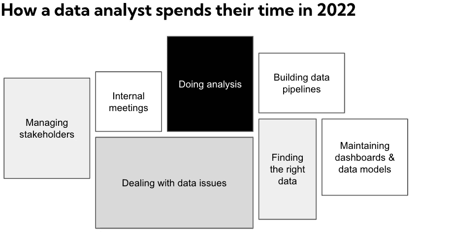
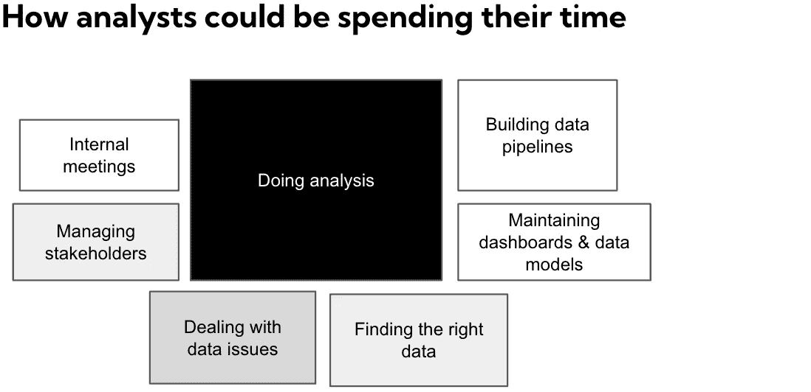

# 分析师应该如何打发时间？

> 原文：<https://towardsdatascience.com/how-should-analysts-spend-their-time-e390872ceb70>

## 如何多做重要的工作，少做不重要的工作

当我在谷歌开始建立机器学习模型时，我首先看到的是下图。它强调了编写实际的机器学习代码只是我要做的全部工作的一小部分。事实证明这是真的。

来源:[机器学习系统中隐藏的技术债务](https://proceedings.neurips.cc/paper/2015/file/86df7dcfd896fcaf2674f757a2463eba-Paper.pdf)

但是处理数据不仅仅是机器学习，那么对于数据分析师来说，这个图表是什么样的呢？

答案并不简单。有些时候，专注于构建仪表板和底层数据模型是有意义的，而有些时候，专注于分析和洞察更有意义。

考虑到这一点，这是我对分析师平均一周生活的评估。

作者图片

正如机器学习一样，有许多不同的任务与分析一样有价值。

然而，一个常见的话题是，数据人员花费超过 50%的时间被动工作，经常处理数据问题或试图查找或访问数据。这方面的例子有:

*   一位利益相关者提到，仪表板中的 KPI 看起来与上周不同，您必须回答这是为什么
*   dbt 中的数据测试失败，您必须了解问题的根本原因是什么
*   你想为一个新的客户群使用一个数据点，当你在 Looker 中搜索时，有五种不同的定义，但不清楚使用哪一种

# 不同地分配时间

以下是数据分析师如何分配时间的另一种选择

作者图片

那么，有什么不同呢？

## 更多的分析时间

分析师应该做…等等…分析。他们应该有在上班的路上获得灵感的自由，并在午餐时间得到答案。这种类型的工作通常需要长时间的专注，准备好合适的工具，并且接受花半天时间在可能没有结果的工作上是可以的。

我看到，当数据分析师与其他人(如用户研究)密切合作时，这一点做得特别好，他们可以快速制定假设，在知道并非所有测试都是全垒打的情况下，让 A/B 测试运行良好。

> “花额外的时间来确保你在做正确的工作，而不是把工作做好，通常是最值得花的时间”

## 处理数据问题花费的时间更少

我接触过的数据团队每天要花 20%以上的时间处理数据问题，随着规模的扩大，这变得更加棘手。当您是一个小型数据团队时，您可以查看一些数据模型来找到根本原因。随着规模的扩大，您开始有几十个其他数据人员依赖您的数据模型，工程系统在您没有得到通知的情况下崩溃，您不知道会影响您的数据模型的代码更改。

## 减少查找要使用的数据的时间

随着数据团队规模的扩大，寻找正确数据的难度也呈指数级增长。当你是一个小团队时，你知道所有东西在哪里。随着您的规模越来越大，这变得越来越困难，并且您经常会遇到同一个指标有多个定义的问题。当你变得非常大的时候，在最坏的情况下，仅仅是访问正确的数据就要花费几个月的时间。

# 为了寻找最佳的时间分配

每个人的最佳分配是不同的，但我的猜测是你有改进的空间。最重要的第一步是仔细考虑如何度过你的时间。

> “我建议每周花几分钟时间回顾过去的一周，记下你是如何度过时间的。如果你经常这样做，你会对自己是否合理利用时间有一个惊人的了解。”

# 寻找正确的数据

数据目录在理论上是伟大的，但是它们经常不能实现它们的潜力。相反，它们最终成为事后的想法，与破窗理论没有太大不同的事情开始发生。一旦人们停止维护数据目录中的几个数据点，你也可以把整个东西扔出窗外。幸运的是，事情正在朝着正确的方向发展，许多人正在思考如何让定义和元数据更贴近人们日常使用的工具。

# 减少处理数据问题所花费的时间

在过去的几年中，数据团队变得越来越大，并且正在创建更多的数据。当你是一个五人数据团队时，处理数据问题是很容易的。当有几十个数据人员都在创建不同的数据时，事情就不那么简单了。

作者图片

我们需要能够将当您是一个较小的数据团队时使生活变得简单的一些东西应用到较大的数据团队中。如何做到这一点的一些想法:

*   每个数据资产都应该有一个所有者
*   将数据资产封装到具有公共和私有访问端点的域中，因此并非所有人都可以访问所有数据
*   与共享所有权的数据生产者形成闭环，以便尽可能在上游捕获问题
*   让每个人都能够调试数据问题，这样他们就不必每次都上报给同样的几个“数据英雄”

> “不要将每个数据问题都视为临时火灾，而是投资于基本的数据质量和控制，以降低数据问题再次发生的可能性”

如果您对如何改善您在数据团队中的工作有一些想法[，请告诉我](https://uk.linkedin.com/in/mikkeldengsoe)！