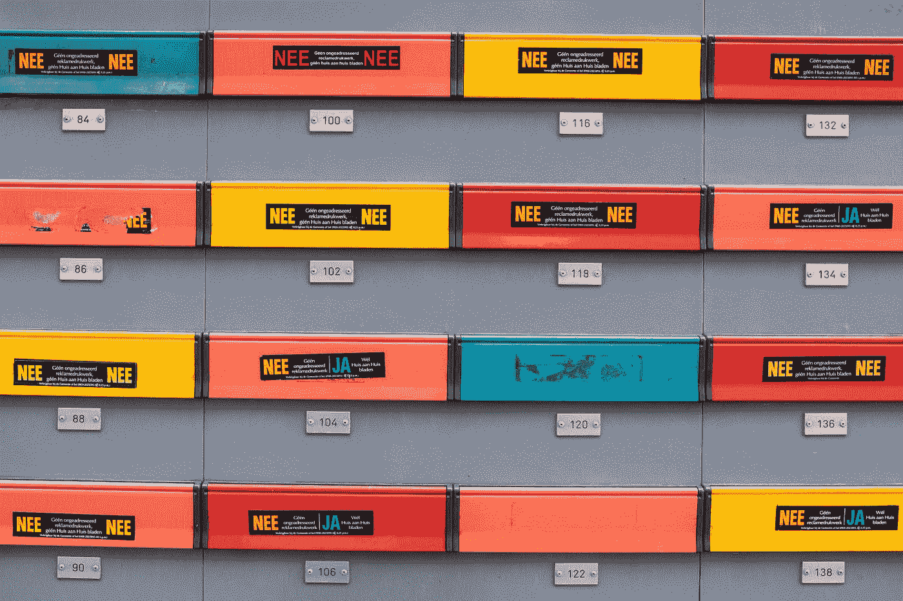

# 2022 年公司应该如何处理数据？

> 原文：<https://towardsdatascience.com/how-should-companies-handle-data-in-2022-922595d9ea4c>

随着工具、角色和数据架构的不断变化，有时很难跟上数据科学的最新行业方法。但我们是来帮忙的:本周，我们将重点介绍几篇出色的帖子，它们涉及技术、数据和商业交叉领域的广泛话题。(寻找其他主题的精彩读物？向下滚动。)我们开始吧:

*   [**有效数据治理的想法还有意义吗？**](/the-new-face-of-data-governance-44eee0a91e68)[Louise de ley ritz](https://medium.com/u/a926de8a6b3f?source=post_page-----922595d9ea4c--------------------------------)和 Molly Vorwerck 最近的文章中发人深省的前提是，数据治理未能兑现其简化以数据为中心的工作流的承诺。但作者也认为，现在恢复和重塑这一概念还为时不晚，这样它才能与业务需求和现代数据堆栈相协调。
*   [**权力大，责任大**](/corporate-imperatives-and-the-future-of-ai-part-ii-fc086d25060a) 。人工智能和算法驱动的决策的最新进展正在渗透到我们生活的方方面面。对于特拉维斯·格林(Travis Greene)来说，大量消耗数据的科技巨头的巨大社会和经济足迹必须伴随着更高的透明度和问责制——这是谷歌、Meta 和其他公司有很大发展空间的两个领域。
*   [**混合数据组织的承诺**](/the-case-for-a-hybrid-data-organization-bb6dc6211acf) 。在各种形状、大小和配置的数据团队中呆了 15 年后， [Matthew Dawson-Paver](https://medium.com/u/5470a6271431?source=post_page-----922595d9ea4c--------------------------------) 对什么可行，什么不可行有了很强的认识。他的图解概述解释了为什么将自治数据团队和业务或产品团队与嵌入式数据专家相结合的混合结构通常是最佳方法。
*   [**企业如何找到合适的数据科学家？**](/the-best-interviews-ive-had-were-never-coding-challenges-95ec0cde765b) 在担心工具、框架和团队结构之前，有必要雇佣技能与公司目标和使命一致的数据科学家。为了做到这一点， [Rose Day](https://medium.com/u/a7f2e8e50135?source=post_page-----922595d9ea4c--------------------------------) 建议少关注筛选过程的技术层面，多关注有助于确定共同兴趣和价值观的对话。

如果你想了解关于数据和商业的最新文章，请收藏我们来自行业专栏的[笔记。](https://towardsdatascience.com/tagged/notes-from-industry?gi=a4ecbd2d699b)

照片由 [Serhat Beyazkaya](https://unsplash.com/@serhatbeyazkaya?utm_source=medium&utm_medium=referral) 在 [Unsplash](https://unsplash.com?utm_source=medium&utm_medium=referral) 上拍摄

等等，还有呢！(但你知道。)我们最近也在其他领域发表了精彩的文章，我们不能*不*分享其中任何一篇。这里有几个你绝对不想错过的:

*   [Nura Kawa](https://medium.com/u/b627ffbd638e?source=post_page-----922595d9ea4c--------------------------------) 引入了 [class maps，这是一个新颖的可视化工具](/explainable-ai-xai-with-class-maps-d0e137a91d2c)，它解释了分类算法的结果(包括 R 和 Python 中的例子！).
*   [在他的最新贡献](/learning-on-graphs-with-missing-features-dd34be61b06) , [迈克尔·布朗斯坦](https://medium.com/u/7b1129ddd572?source=post_page-----922595d9ea4c--------------------------------)展示了特征传播是如何在图形机器学习应用中处理缺失特征的一种高效、可扩展的方法。
*   如果你想在本周得到一份实践指南，你一定不会错过 [Rashida Nasrin Sucky](https://medium.com/u/8a36b941a136?source=post_page-----922595d9ea4c--------------------------------) 的卡方相关测试患者指南[和](/chi-square-test-for-correlation-test-in-details-manual-and-python-implementation-472ae5c4b15f)。
*   对于那些对理论感兴趣的人来说，[古斯塔夫·希尔](https://medium.com/u/2105c93a35e0?source=post_page-----922595d9ea4c--------------------------------)的[深入研究关系机器学习的迷人世界](/what-is-relational-machine-learning-afbe4a9c4231)绝对会成功。
*   我们永远不会厌倦可以帮助实现更大利益的数据科学项目——比如[喜马拉雅·比尔·施雷斯塔](https://medium.com/u/ba33e6d0d27b?source=post_page-----922595d9ea4c--------------------------------)最近对学习曲线效应的探索，以及[它如何推动可再生能源技术进入良性循环](/learning-curve-effect-on-the-global-variable-renewable-energy-deployment-73d1e28da390)。

我们希望你度过了愉快的一周，充满了学习和新想法。感谢您一如既往地[支持我们出版的作品](https://medium.com/membership)。

直到下一个变量，

TDS 编辑