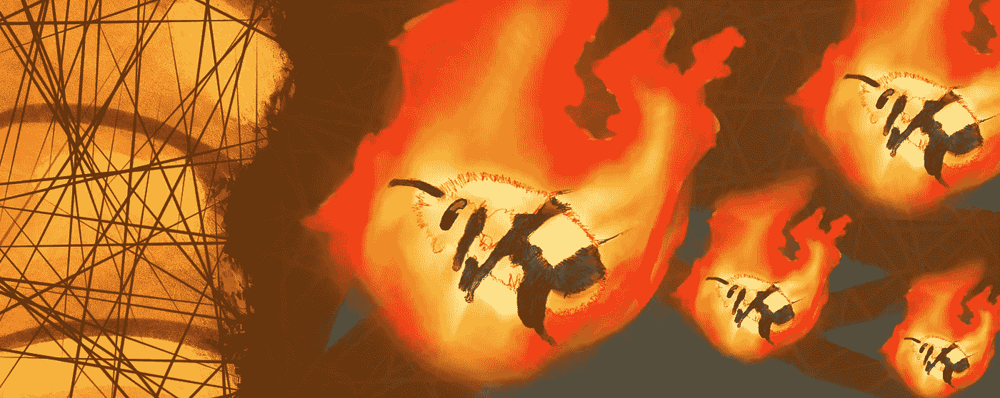
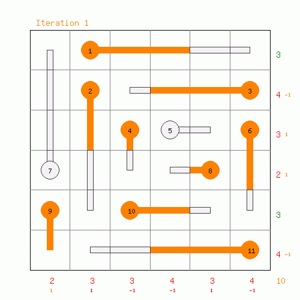
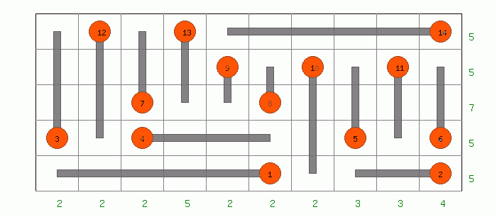
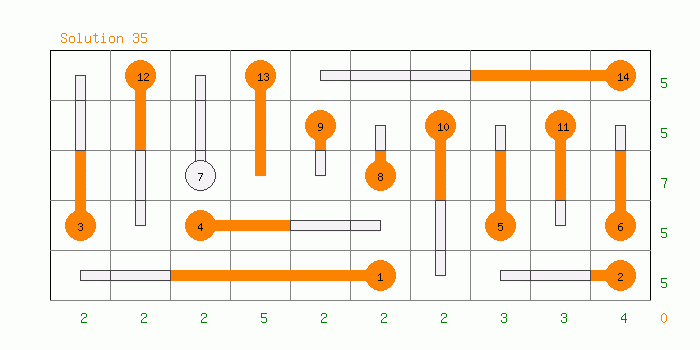
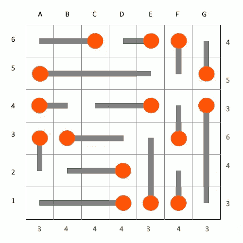
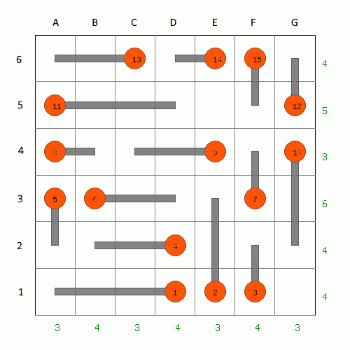
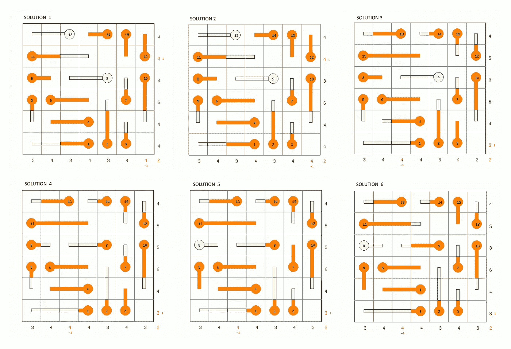
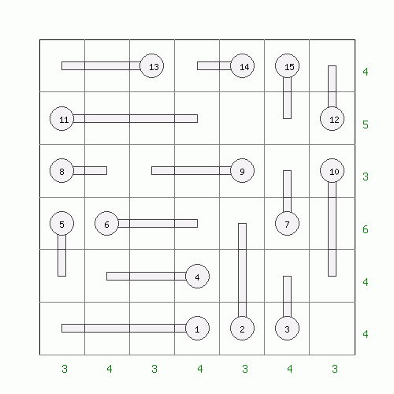

# 如何应用人工蜂群算法解决非常规问题

> 原文：<https://towardsdatascience.com/how-to-apply-artificial-bee-colony-algorithm-to-solve-unconventional-problems-a41c5098eb3a>



图片由 [Silv3rXArt](https://www.instagram.com/silv3rxart/) 提供。经许可使用。

## 解谜取乐。学习一种新的算法。双赢。全部代码。

我在[上一篇文章](/implementing-artificial-bee-colony-algorithm-to-solve-business-problems-cb754f3b9255)中提到的人工蜂群(ABC)算法相当灵活，但它是否足够灵活来解决一个非常规问题；一个逻辑难题？答案变成了“为什么不呢？”。因此，我们将详细讨论如何建模和求解。经历这个过程也许能帮助你发现其他问题，做出更明智的商业决策。

本文的非常规问题是受门萨日历启发的[火柴棍拼图](http://delphiforfun.org/Programs/MatchStick%20Puzzle.htm)。目标是燃烧火柴棒，以在每一列和每一行中获得指定数量的燃烧段。


火柴杆拼图。图片由作者提供。

我们将使用 ABC 算法来解决这个问题。


在解决过程中探索解决方案。图片由作者提供。

# 为什么是火柴杆

在 AAXIS Digital ，我和我的同事们经常会遇到并解决需要打破常规思考的复杂业务问题。同时，我也是一个活跃的工程师和谜题爱好者社区的一员，这个社区叫做 Rowdy 谜语者。因此，对于商业和娱乐，你可以说逻辑问题是我的难题。

我在吵闹谜语小组遇到了这个谜题。如果你觉得应该手动解决；我同意。我们去了，很有趣。但是在我看来，通过计算来解决它是一个有趣且值得的练习。

一位智者曾经说过:“如果你只有一把锤子，那么一切看起来都像钉子。”虽然这句古老的格言中有智慧，但我认为 ABC 算法更像一把瑞士军刀，你可以用它来解决不同类型的问题。我们对其应用的不同例子看得越多，我们就越能更好地识别日常优化问题中的模式，这将使我们能够做出更明智的商业决策。

# 烧伤婴儿烧伤

现在，我希望你相信这是一个值得做的任务，让我们更详细地看看这个难题。概括地说，目标是“燃烧”火柴棒，以获得每一列和每一行中燃烧段的指定总数。让我们看一看。


火柴杆拼图。图片由作者提供。

一个典型的 NxN 网格包含几个不同大小的火柴棍，只能从头烧到尾(没有跳过的部分)，可以是未燃、部分燃或完全燃。目的是燃烧火柴杆，以在每列和每行中获得指定数量的燃烧段。

例如，要获得第 6 行(顶行)的燃烧计数 3，我们可以燃烧 3 段棒 1(棒号在棒的头部)或两段棒 1 和棒 7 的所有段。但是，刻录 stick 7 的所有片段(以到达 stick 7 的最后一个片段)是不可能的，因为我们会违反 a 列的刻录计数。因此，刻录 stick 1 的 3 个片段是唯一的可能性。

不断重复这个逻辑过程，谜题就解决了！

# 让我们解决这个问题

现在我们已经讨论了如何手动解谜，让我们来看看解决技巧。

问题中的每一根火柴棍都像是栈。每一段都应该从上到下烧(后进先出)。以下是一个备选解决方案示例。



候选解决方案。图片由作者提供。

这个解可以表示为每根火柴杆从顶端燃烧的段数。火柴杆 1 有 3 段燃烧，火柴杆 2 有 2 段燃烧，等等。因此，数学表达式为:

```
[3,2,3,1,0,2,0,1,2,2,3]
```

给定这个解决方案和电路板，我们现在可以用数学方法计算出每行和每列中烧坏的部分。有了这个候选解决方案，我至少能想到四种技术来计算解决这个问题:

**蛮力**:有 11 根棍子，最多 5 段可以烧。你可以进行强力全空间扫描，依次烧掉所有 11 根棍子。但是，这有什么意思呢？不过说真的，随着空间随着更多的行和列而扩展，强力将花费太长的时间并且变得不切实际。

**逻辑**:人们可以像数独一样解决它。按顺序应用必要和充分条件。然而，大多数问题都需要回溯的实现；这是一种技术，您可以从停止的地方进行存储，这样，如果选择的路径没有产生解决方案，您可以继续。这需要复杂的代码、内存使用，并且看起来越来越像暴力。此外，很难将这种技术推广到其他问题。

蒙特卡洛模拟(Monte Carlo Simulation):这种技术在这个[维基页面](https://en.wikipedia.org/wiki/Monte_Carlo_method)上有更详细的描述，它使用随机猜测来解决问题。一万只不停打字的猴子可能会偶然发现解决方案，方法是随机设置有多少段被烧掉，然后测试答案是否接近；冲洗并重复。也许这对某些问题有用，但是大多数问题既没有时间也没有猴子来得到满意的解决方案。此外，我不能把我的手指放在它上面，但是关于猴子和点燃的火柴的一些事情似乎是错误的！

**进化算法**:这些算法从随机的初始群体(候选解)中构建，这些群体会不断变异，每一代都会变得更好，朝着一个解努力。遗传算法、蜂群算法、蚁群算法、粒子群算法以及[人工蜂群算法](https://en.wikipedia.org/wiki/Artificial_bee_colony_algorithm)都属于这一类。 [ABC 算法](https://en.wikipedia.org/wiki/Artificial_bee_colony_algorithm)受蜂群觅食行为的启发，在多个点随机探索解空间，随着每一个连续的世代收敛到更好的解。这使得它成为这个问题和其他业务决策案例的理想选择，因为它们可能没有完美的解决方案，或者可能需要太长时间才能得到一个。

# 让那些蜜蜂工作

人工蜂群(ABC) [算法](http://www.scholarpedia.org/article/Algorithm)由 Karaboga 于 2005 年[1]推出，“是一种基于群体的元启发式算法，用于优化数值问题，其灵感来自蜜蜂的智能觅食行为”(Karaboga)。

我的[上一篇文章](/implementing-artificial-bee-colony-algorithm-to-solve-business-problems-cb754f3b9255) [2]在对各种标准测试函数和业务问题进行测试时，分解了 ABC 算法的细节、目的和应用。但是，这里有一个快速总结:

该模型由四个基本组件组成:

*   **食物来源**代表正在解决的问题的解决方案。
*   **雇佣蜜蜂**在食物源周围搜索，对其进行微调，并使其进化以产生更多的花蜜。
*   **看客蜜蜂**观察被雇佣的蜜蜂，探索最有希望的食物来源。这确保了越有希望的食物来源越能被开发。
*   侦察蜂随机选择新的食物来源，以确保我们不会陷入局部最小值。


蜜蜂活动解 Himmelblau 函数。图片由作者提供。

通过对蜜蜂活动的进一步研究，在解决 Himmelblau 函数的同时，我们可以更好地理解上述组成部分。在周期 1 中(左上角)，蜜蜂随机分布，每个点代表(X，Y)平面中被开发的食物源。当被雇佣的蜜蜂评估花蜜时，它们开始倾向于函数的 4 个最小值。旁观的蜜蜂被分配到最有希望的食物来源。同时可以看到侦察蜂随机出现，以确保评估整个空间，并且我们不会错过局部最小值。到第 25 个周期，大多数蜜蜂都集中在 4 个解决方案上。

这个解决方案的代码库和我上一篇文章的代码库是一样的，可以在[这里](https://github.com/aaxis-nram/abc-algorithm-php)找到。

# 清楚明白的细节

概括地说，问题如下:


火柴杆拼图。图片由作者提供。

网格在配置文件 config matchplay-1 . ini([PHP ini 文件格式](https://www.php.net/manual/en/configuration.file.php))中被捕获

```
stack[] = B6,C6,D6,E6,F6    ;1
stack[] = B5,B4,B3,B2       ;2
stack[] = F5,E5,D5,C5       ;3
stack[] = C4,C3             ;4
stack[] = D4,E4             ;5
stack[] = F4,F3,F2          ;6
stack[] = A3,A4,A5,A6       ;7
stack[] = E3,D3             ;8
stack[] = A2,A1             ;9
stack[] = C2,D2,E2          ;10
stack[] = F1,E1,D1,C1,B1    ;11rCounts = "3,4,2,3,4,3"
cCounts = "3,3,3,4,3,3"
```

“堆栈”数组从头到脚定义了每个棒的位置。例如，棍子 1 通过 F6 占领 B6。每行和每列的拼图的理想烧焦段数分别在*计数*和*计数*变量中给出。该配置文件在 *MatchplayFoodSource* 脚本中解析如下:

每一个 B6，C6 类型的符号都被转换成坐标([1，5]，[2，5]等)并被存储。

剩下的部分是为给定的解决方案定义花蜜。然后，解决方案可以表示为下面的数组:

```
[3,2,3,1,0,2,0,1,2,2,3]
```


候选解决方案。图片由作者提供。

解决方案数组中的第一个数字是 3。这意味着棒 1(在最顶端)应该在它的 5 个片段中的 3 个中燃烧。斗杆 2(垂直)被烧成两段。诸如此类。

给定这个可能的解，我们可以将目标函数定义为候选解和理想解之间的均方根(RMS)误差。由于理想的解决方案是每一行和每一列中被烧毁的段的计数，我们可以通过编程来“计数”每一行和每一列中被烧毁的段，如图所示。

```
**╔════════╦═══╦═══╦═══╦═══╦═══╦═══╗**
║ **Row    ║ 1 ║ 2 ║ 3 ║ 4 ║ 5 ║ 6** ║
**╠════════╬═══╬═══╬═══╬═══╬═══╬═══╣**
║ Ideal  ║ 3 ║ 3 ║ 3 ║ 4 ║ 3 ║ 3 ║
╠════════╬═══╬═══╬═══╬═══╬═══╬═══╣
║ Actual ║ 4 ║ 3 ║ 2 ║ 3 ║ 4 ║ 3 ║
╠════════╬═══╬═══╬═══╬═══╬═══╬═══╣
║ Error  ║-1 ║ 0 ║ 1 ║ 1 ║-1 ║ 0 ║
╚════════╩═══╩═══╩═══╩═══╩═══╩═══╝**╔════════╦═══╦═══╦═══╦═══╦═══╦═══╗**
║ **Column ║ 1 ║ 2 ║ 3 ║ 4 ║ 5 ║ 6** ║
**╠════════╬═══╬═══╬═══╬═══╬═══╬═══╣**
║ Ideal  ║ 3 ║ 4 ║ 2 ║ 3 ║ 4 ║ 3 ║
╠════════╬═══╬═══╬═══╬═══╬═══╬═══╣
║ Actual ║ 2 ║ 3 ║ 3 ║ 4 ║ 3 ║ 4 ║
╠════════╬═══╬═══╬═══╬═══╬═══╬═══╣
║ Error  ║ 1 ║ 1 ║-1 ║-1 ║ 1 ║-1 ║
╚════════╩═══╩═══╩═══╩═══╩═══╩═══╝
```

现在我们有了烧坏部分的行和列计数，我们可以计算均方根。

函数值= ∑(行数-最佳行数)+ ∑(列数-最佳列数)

```
Function Value = (1+0+1+1+1+0) + (1+1+1+1+1+1) = 10
```

对于上一节中提出的解决方案，函数值是 10。

在上面的第一个循环中，从 0 到$dimensions，我检查了烧毁的段，并根据行(索引 0)和列(索引 1)进行计数。在上面的第二个循环中，我计算了理想值(堆栈数)和实际值(fsCount)之间的均方根差。

nectar 值在 AbstractFoodSource 类中处理如下:


# 现在是蜂蜜

现在我们已经掌握了血淋淋的细节，让我们看看几个解决方案。使用 configMatchPlay-1.ini 运行 ABC 算法时，其输出如下:


ABC 算法在比赛中的输出。

可视化解决方案，我们得到:


困惑与解答。图片由作者提供。

快速检查显示，解决方案是正确的，因为我们只从头部开始燃烧，没有跳过部分。根据谜题的规则，一些木棒没有燃烧，一些部分燃烧，另一些完全燃烧。为了帮助验证图像中的解决方案，沿着行和列显示了分段计数，这些计数加起来就是所需的结果。ABC 算法探索的候选解决方案如下所示。


在此过程中探索解决方案。图片由作者提供。

完成这个谜题后，让我们尝试一个更复杂的，网格不是正方形的，而是 5x10 的。



谜题 2:一个长方形的谜题。图片由作者提供。

该算法正确地缩小到解决方案。


探索难题 2 的解决方案。图片由作者提供。

最终正确的解决方案是:



矩形难题的解答 2。图片由作者提供。

现在，让我们来看看这个难题有不止一个解的情况。



谜题 3。图片由作者提供。

不出所料，ABC 算法准确地识别出了这个难题的两个正确答案，并且两个答案都准确地遵守了所有规则，如下所示:


谜题 3 的解答。图片由作者提供。

我现在要稍微修改一下上面的谜题，让它不可解。



无法解决的难题 4。图片由作者提供。

在行 1 中，列 C 棒必须被烧断以在该行中得到烧断段计数 4。相同的逻辑显示第 3、5 和 6 行。这意味着 C 列应该至少有 4 个段被烧毁。我们故意把 3 放在 C 列，让它不可解。

ABC 算法在运行时会生成一个足够接近所呈现的难题的解决方案，将目标函数最小化为 2。他们有 6 个人。



无法解决的难题的多种解决方案。图片由作者提供。

X/Y 轴上的数字显示了燃烧的总段数。如果燃烧段的总数显示为红色，则表示与理想解有偏差，并显示在数字旁边。例如，理想的解决方案应该在第 1 行中有 4 个燃烧段。然而，上面的解决方案 1 示出了(3，1)，其中 3 是烧毁的段，1 是第 1 行的错误。

以下是解决这个难题时探索出的解决方案。



探索谜题 4 的解决方案。图片由作者提供。

虽然这可能不是难题的解决方案，但如果这是现实世界的问题，计算出的解决方案仍可用于做出明智的业务决策。现实世界中的业务问题可能通常没有完美的解决方案，因为不可能对控制问题适合度的所有规则进行编码。拥有多个解决方案可以为企业主提供他们可以评估和采取行动的选项。

# 综上

在这篇文章中，我们看了为什么，什么，以及如何解决逻辑难题火柴杆烧伤。我们深入研究了实现细节和代码片段，以理解算法及其应用。我们强调了 ABC 算法如何被证明足够灵活地应用于这个难题，以及当不存在精确解时，它如何给出近似的“足够好”的解。

虽然通过计算来解决这个特殊的逻辑难题可能有些矫枉过正，但我相信从这个过程中学到的知识可以应用到你在工作或学习中将要面临和必须解决的问题上。一般来说，进化算法，特别是 ABC 算法，只是程序员解决逻辑难题和现实世界挑战的工具之一。作为解决方案架构师，我们处在一个独特的位置，能够识别并解决通常很困难的挑战。这样做不仅可以降低企业的成本，还可以释放资源来完成其他高价值的任务。

衣服也许不能造就人，但算法可以造就程序员。

在这里探索代码。

# 参考

[1]卡拉博加，德尔维斯。“人工蜂群算法。”[](http://www.scholarpedia.org/article/Artificial_bee_colony_algorithm)*2010 年第 5 期第 3 期:6915。*

*[2]拉姆，纳雷什。“实现人工蜂群算法解决商业问题”，《走向数据科学》，[https://towardsdatascience.com](https://towardsdatascience.com/)，(2022 年 3 月)。*