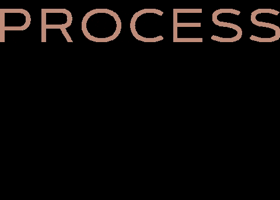

# 如何成为一名高效的数据科学经理

> 原文：<https://towardsdatascience.com/how-to-be-an-effective-data-science-manager-dbdea96b783c>

## 来自数据科学和分析领导者的经验和思考

照片由 [Unsplash](https://unsplash.com?utm_source=medium&utm_medium=referral) 上的[尼克·费因斯](https://unsplash.com/@jannerboy62?utm_source=medium&utm_medium=referral)拍摄

B 成为一名数据科学经理是许多数据科学家的梦想。我喜欢看奥运会。我们看到不同国家的体育英雄争夺金牌。不幸的是，参加奥运会比赛的机会是为少数有天赋的人准备的。对于我们其他人来说，我们的舞台就是工作场所。我们想获得金牌，这是数据科学经理的职位。

然而，数据科学正处于一个充满挑战的时代。数据科学的宣传已经过去了。我们正面临两大挑战:

*   “我们如何生产它？”:超过 90%的数据科学解决方案仍然难以生产。在生产模式之外，相对于所付出的努力，企业采用率仍然很低。
*   *“把钱给我看看！”资金稀缺，每个人都在争夺首席财务官。高管们已经看到了数据分析和报告在实现数据驱动型决策方面的优势。但是，许多人不相信数据科学项目的好处。*

等等，我不是自愿参加的。我认为成为一名数据科学经理就是要领导一个数据科学家团队。你知道，领导和激励团队去实现。这听起来太难了。

问题是数据科学仍然是一个成熟的职业。在我工作过的许多公司里，通常都是绿地或棕色地带。大家都知道完善的营销团队是做什么的。然而，并不是每个人都知道数据科学。在没有数据科学的情况下，公司已经运营了多年。

做一个“好”的数据科学管理者还不够；我们需要高效的数据科学经理。我已经有了多年练习这门黑暗艺术的经验。我已经得到了痛苦的教训，我希望它能让你少受一些。高效意味着实现我们的愿景，一名数据科学经理领导一个成功的数据团队，提供有价值的预测模型，并受到组织的喜爱。

关于我自己，我是一名合格的精算师(有时被称为原始数据科学家)，在数据科学和分析领域度过了漫长的职业生涯。近十年来，我在不同规模、地域和风格的团队中担任过许多数据领导角色。我正处于一个阶段，我可以将我的知识回馈给社区，并帮助未来的数据领导者。

我喜欢开发让人们容易记住这些内容的方法。因此，我们将使用 PPT 的缩写。不，这不是我们最喜欢的幻灯片。这是 **P** 人、 **P** 过程、 **T** 技术。

**人**

你不了解罗根·保罗 GIF 由 SHOWTIME 体育。2021.从 [Giphy](https://media.giphy.com/media/CCbudQwZBz2DtSuEvT/giphy.gif) 中检索

当我第一次成为数据科学经理时，我知道我必须与人合作，但我没有意识到这是如此复杂和具有挑战性。通过编码，我们得到错误反馈，然后重新运行。对于人来说，反馈很少，“重新运行”并不简单。

如果你和我一样，我们花了几十年来学习和提升我们的数据科学技能。这包括商业学位、精算资格和技术认证。

然而，数据科学经理的必备要求是人际技能。那么，我们在哪里学习人际交往技巧呢？MBA 学位就够了吗？这可能会有帮助，但是我们真的通过生活学校学习人际交往技能。我个人尝试过各种方式，有的成功，有的不成功。然而，所有这些都是宝贵的经历，让我在数据领导之旅中走到了今天。

我们是成功的数据科学家，因为我们提供了优秀的数据科学解决方案。你可能已经被奖励为高级数据科学家，或者已经被任命为数据科学经理。然而，让你来到这里的东西不会让你到达你想去的地方。

作为一名数据科学经理，你将与许多人一起工作。为简单起见，我们将他们分为内部人员和外部人员。

*内部人员*

内部人员包括你的团队中的所有人，直接的或邻近的部门。这包括您的直接下属、您的数据同事、更广泛的技术团队或其他部门团队成员(取决于数据科学团队的位置)。

要成功部署数据科学解决方案，您需要他们的全力支持。我们需要和数据工程师一起工作来获取和生产我们的数据。另一个技术团队需要了解您的部署计划。所有其他部门团队成员需要了解您团队的能力和交付。

内部人员期望协作。因此，我的建议是从了解他们现有的流程开始，并让他们与数据科学团队保持一致。这包括更广泛的战略、项目优先级和人员依赖性。没有必要创造自己的世界，因为它会导致进一步的筒仓。虽然数据科学团队的各个方面都处于初创阶段，但我们需要利用现有的文化来铺平道路。

另一个建议是定期与他们交流。有时候，我们都在谈生意，只有在有项目的时候才会去见人。然而，了解你周围发生的一切是值得的。有时你可能能够直接提供帮助，有时你可能是一个好的倾听者。

当我开始担任数据科学经理时，我花了太多时间与其他业务领导和利益相关者在一起。我认为我的高绩效团队是自我激励的个人贡献者。我没有错，但是他们需要更多的透明度和我的指导，特别是因为许多数据科学项目都有模糊的范围。当我通过员工调查收到这个反馈时，我重新安排了我的日程表，花了更多的时间与团队单独或集体相处。从那以后，团队不仅更加快乐，而且作为我的合作伙伴，他们在一起解决业务问题时更具创新性。

*外部人员*

外部人员包括团队以外的所有人员。这包括你的直接利益相关者和更广泛的组织。

对于直接利益相关者，你需要保持良好的关系。该团队以前很可能交付过成功的工作，并且有相当多的信任。因此，我的建议是培养这种关系，并在团队之间建立更紧密的关系。

对于更广泛的组织来说，这可能非常模糊——的确如此。作为一个新的(或“未知的”)团队，更广泛的组织不知道你这个闪亮的团队，也不知道它能为他们做什么。我们的目标是识别他们。我的建议是向你的直接利益相关者和同事寻求推荐。一旦确定了他们，不要只向他们推销数据科学。你需要了解他们做什么，他们的愿望，以及你如何(或不)能够帮助使用数据科学。

当我开始担任数据科学经理时，我花了太多时间与我已经认识的利益相关者在一起。这很好，直到我的主管问我如何在组织的所有团队中嵌入数据科学。从那以后，我有意识地努力去认识新的利益相关者。虽然一开始不舒服，但他们非常感谢“酷”技术团队伸出援手。如今，我发现我的职责还包括更广泛的数据科学和分析传播。

**流程**

郁郁葱葱的室内设计 GIF。2021.检索自 [Giphy](https://media.giphy.com/media/quuIo0rCMQK6KHMrJD/giphy.gif)

让我从我最近看到的 LinkedIn feed 说起:

> 初创公司可能需要十年的时间才能建立起来。
> 
> 第一年:留在游戏中
> 
> 第二年:找到适合市场的产品
> 
> 第三年:寻找付费客户
> 
> 第四年:建立团队和委派
> 
> 第 5 年:按比例构建流程
> 
> 第 6-10 年:继续游戏
> 
> 那就是 10 年一夜成名
> 
> 资料来源:Andrew Gazdecki

如前所述，数据科学仍然是一个新兴的职业。我们需要把它当成一个新公司。

当数据科学经理职位存在时，该公司通常需要三年以上的时间。如果他们已经超过 10 年，并且您想要进一步发展团队，那么构建一个可扩展的过程仍然是正确的行动。

那么，我们需要哪些流程呢？我将涉及三个主要重点领域:

*人员流程*

在澳大利亚，咖啡是我们的宗教之一。如果你想结识新朋友，请他们喝杯咖啡。如果你想和你的团队呆在一起，请他们喝杯咖啡。如果你想让顾客开心，请他们喝杯咖啡。

关键是人们不会神奇地一起工作。特别是，混合工作安排给团队协作带来了挑战。

有效的数据科学经理必须探索和实施健康的习惯，以实现团队的潜力。《孙子兵法》的作者老子雄辩地劝告我们:

> 注意你的想法；它们变成了习惯。注意你的习惯；他们变成了角色。注意你的性格；它成为你的命运。”——**老子**

例如，我是敏捷目标设定的 OKR(代表“目标和关键结果”)的忠实粉丝。它启动了一个季度对话，讨论我们努力实现的目标。然后，我们每周召开会议，讨论哪些可行，哪些不可行。在本季度末，我们将举办一次回顾展，为下一届 OKR 提供素材。此外，我还鼓励团队成员不断接受指导和反馈。

以上是交付的人员流程的示例，但是我们还需要社交的人员流程。是的，我们需要有意识地对待我们的社交生活。毕竟，我们花了很多时间在工作上。

当我开始担任数据科学经理时，创建人员流程感觉像是微观管理。作为一个“宏观”的人事经理，我让会议和“流程”自发地运行，这在团队或工作量小的时候工作得很好。随着我们越来越大，事情变得越来越混乱，团队很难跟上。这时，团队要求创建一个人员流程来更好地管理我们的时间和人员。在人们压力较小的地方，情况确实有很大的不同，因为他们知道实现结果所需的关键人物和步骤。

*部署流程*

在数据科学团队的早期，部署是非常临时的。平均而言，我看到数据科学团队在头三年里产生了 1 到 3 个生产模型。对于小型团队，通常只是简单的刷新、重新校准或故障排除。

想象一下，如果我们想要生产 20 或 50 个模型。我们要么需要一支庞大的数据科学家队伍，要么需要一个强大的流程。从我的经验来看，你的 CFO 会选择后者。开发时间也需要考虑在内，这将是非常耗时的。

数据科学团队的成功将取决于您的团队快速可靠地交付模型的能力。根据我的经验，MLOps 是一条可行之路，它是以可扩展和可靠的方式生产机器学习工件的实践。顾名思义，它涉及应用和适应软件工程和 DevOps 原则。

然而，即使是 MLOps 仍然是一个绿地区域。虽然有原则和例子，但你需要为团队设计一些有用的东西。作为提示，从简单开始，看看你是否能利用现有的市场工具。这不是一场关于构建宏伟(也称为复杂)解决方案的竞赛，而是关于实现商业价值——以及我们如何高效、一致和可靠地实现商业价值。

过去，我通过频繁的“作战室”来推动部署敏捷性。索伦·克尔凯郭尔曾说“进步可以倒着理解；但它必须向前发展”。当我们的团队落后于计划时，或者我们只是想超越预期时，这是真实的。快速和协作的沟通一次一个地解决了我们部署过程中的实际改进。例如，我们将数据部署流程从 4 周缩短到了 1 到 2 周，而且我们仍然对进一步改进持乐观态度！

*销售流程*

哇，我是数据科学家；我不是销售人员。是的，你不是销售人员。但是你要对团队的管道负责。如果你处于成熟期的早期，工作管道看起来相当空。我们可以从以此为生的销售朋友那里学到一些东西。

从上面的人员部分，我们应该已经确定了我们的直接利益相关者和几个潜在的利益相关者。对于你现有的客户，你需要采取主动的方法。一个常见的错误是等待业务请求。问题是请求可能很小，比如数据刷新或一些样本数据。我们希望数据科学能够带来巨大的商业价值，因此，您需要将数据科学团队视为业务合作伙伴，而不仅仅是服务提供商。

首先，你可以要求参与利益相关者的定期计划和战略会议。这会让你了解他们的背景、挑战和期望。从那时起，您将能够更好地确定数据科学可以在哪些方面发挥作用。然后，开始与他们建立定期的合作会议，以建立需求。

过去，我采用看板方法取得了很大的成功。该委员会分为几个关键的机会阶段，如潜在客户、联系、合格、提议、异议、成交和推荐。它创造了一个非常视觉化的表现，对我的注意力和展示给别人都很有效。

**科技**

黑豹魔法 GIF。2019.检索自 [Giphy](https://media.giphy.com/media/26SSWjcPAKCyXdCXgh/giphy.gif)

作为一名数据科学经理，您负责“为什么”、“做什么”和“怎么做”。对于“如何”这一部分，技术扮演了一个巨大的使能角色。

有两种主要的思想流派:建造或购买。构建意味着您的团队从头开始编写解决方案，包括通过容器化部署的各种脚本，如 Python 和 SQL。购买意味着您的团队获得了一个针对给定目的预先配置好并随时可用的解决方案。

两种方案的总成本比较是复杂的。从成本的角度来看，构建“更便宜”,因为有许多开源选项。然而，我们吸收了构建时间、维护操作和额外的人员。购买期权的认购费用更高。然而，它是现成的，并由供应商不断维护和改进。

在一个高效的数据科学团队中，技术问题是从能力而不是成本上显现出来的。您的高绩效团队渴望展示他们在构建定制和制作精良的数据产品方面的编码能力。

如上所述，数据科学是一种应用我们的定量、技术和商业技能的商业职业。因此，团队的成功基于其在正确的时间交付业务成果的能力。

有鉴于此，时间可能不是我们的朋友，选择买入往往是明智的。这些供应商的工具大多允许定制，所以你可以手动操作。它还使数据科学团队能够解决更多的业务问题，并创造更大的组织影响。

一旦团队交付了成果和规模，技术选项仍然存在。到那时，你会意识到创新的界限，需要定制和制作精良的数据解决方案。

当我开始担任数据科学经理时，我在最佳技术比较上花了太多时间。我想做出准确的“数据”驱动的决策。然而，这些比较花了几个月的时间，人们仍然不同意“最好”的技术。我意识到我们需要在特征分析的基础上考虑组织和团队文化。在那里，我们进行了价值验证，并收集了以前没有的真正的组织反馈。这创建了一个更强大的业务案例，并允许我们同时交付业务价值。

**一起前进**

B 成为一名高效的数据科学经理并不容易，但这是可以实现的。我们把大部分的知识都奉献给了最新的数学技巧和技术。现在，我们需要调整我们对人、流程和技术的软技能的学习。

当你处于早期阶段或学习成为一名数据科学经理时，诱惑是学习每一门管理课程并煮沸海洋。然而，他们通常涵盖一般的管理技能，如沟通和规划。在新兴的数据科学专业中，我们还需要更多具体的资源。

感谢您阅读本文！请在下面的评论区添加你最喜欢的建议。

**如果你喜欢这篇文章，并希望看到更多的内容，请考虑加入媒体会员，使用下面的链接来支持我和其他作者:**

  

另外，看看我下面的其他媒体文章:

      

**关于作者:** [*阿尔伯特·苏亚迪*](https://www.linkedin.com/in/albertsuryadi/) *是为前瞻性组织提供高级分析和数据科学能力的公认领导者。他被公认为分析团队(实践社区)的领导者，该团队授权并激励他人超越现状。*