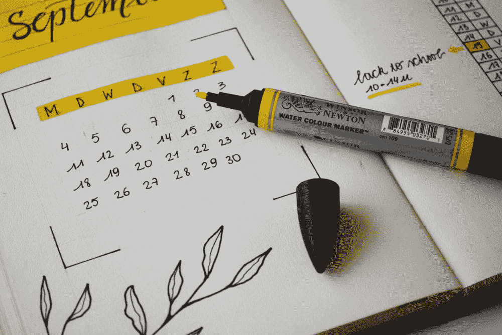

# 如何成为更好的数据科学团队

> 原文：<https://towardsdatascience.com/how-to-become-a-better-data-science-team-1dc21693d9f9>

## 意见

## 作为一名数据科学家，协作是关键


[拉拉·阿兹利](https://unsplash.com/@lazizli?utm_source=unsplash&utm_medium=referral&utm_content=creditCopyText)在 [Unsplash](https://unsplash.com/s/photos/teamwork?utm_source=unsplash&utm_medium=referral&utm_content=creditCopyText) 上的照片【1】。

# 目录

1.  介绍
2.  规划和修饰
3.  利益相关方更新
4.  回顾展
5.  摘要
6.  参考

# 介绍

我写的很多文章，以及一般的文章，都聚焦于一个单一的数据科学家，所以我想聚焦于一些不同的东西本身。那就是——数据科学团队。但是首先，让我们定义一下*通常是*由什么组成。虽然这不是一成不变的，但这里有一个数据科学团队的例子:一些数据科学家、一名数据工程师、一名业务/数据分析师、一名数据科学经理等。这里的要点不是谁组成团队，而是团队如何一起工作。话虽如此，让我们看看改善您的数据科学团队的工具和方法，无论您是数据科学家、经理还是技术招聘人员。

# 规划和修饰



由[埃斯特·扬森斯](https://unsplash.com/@esteejanssens?utm_source=unsplash&utm_medium=referral&utm_content=creditCopyText)在[Unsplash](https://unsplash.com/s/photos/plan?utm_source=unsplash&utm_medium=referral&utm_content=creditCopyText)【2】上拍摄的照片。

第一个工具是计划和训练的结合。这些术语可能有点混乱，所以让我们先定义一下。

整理属于组织的范畴，但这个过程与计划(在某些公司是*)的区别在于，它是对你积压工作的第一次审查，这些工作可能由几张吉拉入场券或你的团队加班加点完成的一般任务组成，但尚未被优先纳入活动流程。*

*你可以把计划想得更具体，在一个`sprint`的层面上，即使你不使用吉拉，你仍然可以每周、每两周或任何你认为合适的节奏来计划，并记录更多的检查。你通常会做的是讨论即将到来的项目，但更重要的是，特定项目在给定的一周或一段时间内的可消化的任务，等等。*

> *以下是在规划和修饰方面进行合作的几点收获和好处:*

*   *分配特定任务的努力程度*
*   *赋予重要性或者优先权*
*   *避免冗余*
*   *向自己强调本周你关注的是什么*
*   *如果有人做过类似的工作，可以帮助你/让任务更有效率*

*同样，根据你的公司或者你是否使用敏捷环境，这些术语可能会改变或者完全相同，但是重要的是你的团队的总体组织。*

# *利益相关方更新*

**

*照片由 [LinkedIn 销售解决方案](https://unsplash.com/@linkedinsalesnavigator?utm_source=unsplash&utm_medium=referral&utm_content=creditCopyText)在 [Unsplash](https://unsplash.com/s/photos/business?utm_source=unsplash&utm_medium=referral&utm_content=creditCopyText) 上拍摄*

*在成为一名数据科学家的过程中，利益相关者的更新不会被过多地讨论，因为这段时间通常更专注于学习算法、代码本身以及它们各自的底层概念。*

*利益相关者可以定义为最终分配您的任务或项目的人，或者将消化您的最终项目及其对业务的影响的人。也就是说，利益相关者的角色并不相同；他们可以是数据科学经理、产品经理、销售工程师等。*

*你当然可以通过吉拉门票、Slack messages、Google 幻灯片等等更新利益相关者。然而，关键不在于你使用的平台，而在于你分享信息和更新的方式。*

> *以下是您和您的团队可以有效更新利益相关者的一些方法:*

*   *如果您不是数据科学家，数据科学主题可能会令人困惑，所以请确保您放弃了只有数据科学家才知道的不必要的术语*
*   *用为什么/为什么/如何/结果的方法解释一个项目。这里有一个你可以提出的问题的例子:*

*—项目是什么？*

*—为什么这个项目会发生？*

*—它是如何解决的？*

*—其结果是什么？*

*   *使用前后比较，如下所示:*

*—以前的目标是什么，现在是什么？*

*此外，查看特定数据组的细分，例如，按地理位置、州、周末、类型等。*

*有许多方法可以解释和更新您的数据科学项目，最重要的是您如何阐明它们。*

# *回顾展*

**

*照片由 [LinkedIn 销售解决方案](https://unsplash.com/@linkedinsalesnavigator?utm_source=unsplash&utm_medium=referral&utm_content=creditCopyText)在[Unsplash](https://unsplash.com/s/photos/discussion?utm_source=unsplash&utm_medium=referral&utm_content=creditCopyText)【4】上拍摄。*

*最后，是您的特定数据科学团队的回顾。这通常是两周一次或每月一次的对之前发生的一些情况的彻底讨论。*

*虽然计划和准备是在项目或任务之前，涉众的更新是在项目或任务期间以及任务结束时，但是回顾包括了在相同的整个时间框架内发生的所有事情。*

> *在这次回顾性讨论中，您通常会看到一些东西:*

*   *什么进展顺利？*
*   *有哪些可以改进的地方？*
*   *向前发展的新机会是什么？*
*   *针对表现出色的员工的具体标注*
*   *在下一次回顾会之前，我们应该跟进哪些行动项目？*

*所有这些问题和领域通常会涵盖给定时间内发生的所有重要事情。你会更好地意识到什么对团队、公司和你自己是重要的。*

# *摘要*

*虽然提高自己将改善团队，但还有其他更以团队为中心的事情可以关注，最终使您的数据科学团队整体变得更好。*

> *总而言之，以下是您的数据科学团队作为一个整体可以改进的三种方式:*

```
** Planning and Grooming* Stakeholder Updates* Retrospectives*
```

*我希望你觉得我的文章既有趣又有用。如果您同意或不同意这些特定的工具和方法，请随时在下面发表评论。为什么或为什么不？关于数据科学团队的改进，您认为还有哪些工具和方法值得一提？这些当然可以进一步澄清，但我希望我能够为数据科学团队提供一些更独特的工具和方法。*

****我不属于这些公司中的任何一家。****

**请随时查看我的个人资料、* [Matt Przybyla](https://medium.com/u/abe5272eafd9?source=post_page-----1dc21693d9f9--------------------------------) 、*和其他文章，并通过以下链接订阅接收我的博客的电子邮件通知，或通过点击屏幕顶部的订阅图标* *的* ***，如果您有任何问题或意见，请在 LinkedIn 上联系我。****

***订阅链接:**[https://datascience2.medium.com/subscribe](https://datascience2.medium.com/subscribe)*

***引荐链接:【https://datascience2.medium.com/membership】T22***

*(*如果你在 Medium* 上注册会员，我会收到一笔佣金)*

# *参考*

*[1]Lala Azizli 在 [Unsplash](https://unsplash.com/s/photos/teamwork?utm_source=unsplash&utm_medium=referral&utm_content=creditCopyText) 上拍摄的照片，(2021)*

*[2]2017 年[埃斯特·扬森斯](https://unsplash.com/@esteejanssens?utm_source=unsplash&utm_medium=referral&utm_content=creditCopyText)在 [Unsplash](https://unsplash.com/s/photos/plan?utm_source=unsplash&utm_medium=referral&utm_content=creditCopyText) 上拍摄的照片*

*[3]照片由 [LinkedIn 销售解决方案](https://unsplash.com/@linkedinsalesnavigator?utm_source=unsplash&utm_medium=referral&utm_content=creditCopyText)在[Unsplash](https://unsplash.com/s/photos/business?utm_source=unsplash&utm_medium=referral&utm_content=creditCopyText)(2020)上拍摄*

*[4]照片由 [LinkedIn 销售解决方案](https://unsplash.com/@linkedinsalesnavigator?utm_source=unsplash&utm_medium=referral&utm_content=creditCopyText)在 [Unsplash](https://unsplash.com/s/photos/discussion?utm_source=unsplash&utm_medium=referral&utm_content=creditCopyText) 上拍摄，(2018)*