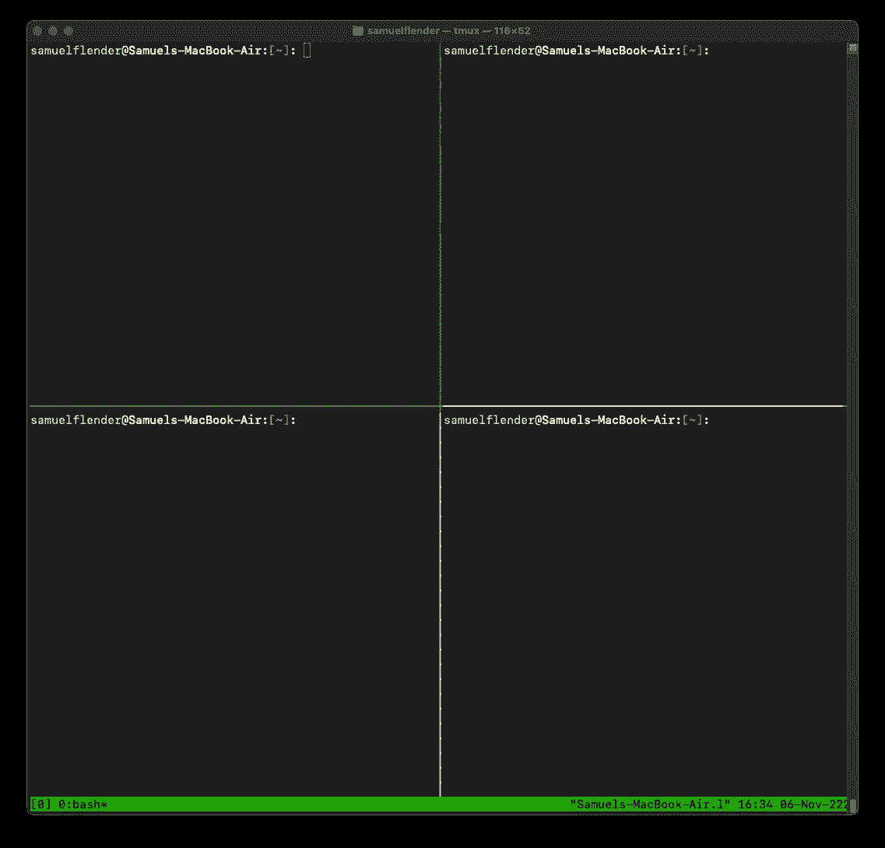

# 如何成为命令行向导

> 原文：<https://towardsdatascience.com/how-to-become-a-command-line-wizard-5d78d75fbf0c>

## 你可能从未上过的最有用的计算机科学课


使用[稳定扩散生成的图像](https://huggingface.co/spaces/stabilityai/stable-diffusion/discussions/5479)

在我的职业生涯中，我一直观察到的一件事是，最有生产力的数据科学家和工程师通常有一个共同点:他们是命令行奇才。他们可以在计算机的文件系统中导航，在日志文件中搜索模式，管理作业、源代码和版本控制，所有这些都可以从命令行进行，而不需要依赖鼠标和图形用户界面的缓慢导航。

然而，对于不熟悉 shell 工具的人来说，这种命令行“魔法”并不是标准计算机科学课程的典型组成部分。麻省理工学院的一门关于掌握命令行的课程[被恰当地命名为“*CS 教育的缺失学期*”。](https://missing.csail.mit.edu)

这篇文章是我个人的 10 节课的“命令行魔术 101”课，面向那些希望更多地使用命令行而不是图形用户界面的读者。我们将介绍 shell 和 path 变量、别名、文件权限、流和管道、高效的作业管理、tmux、ssh、git 和 vim 等基础知识。

让我们开始吧。欢迎来到 CLW 101 大楼。

## 1.贝壳

当你打开终端时，你会看到一个外壳，比如 bash (borne again shell)或者 ZSH (z-shell)。shell 实际上是一种完整的编程语言，可以访问某些标准程序，这些程序允许文件系统导航和数据操作。您可以通过键入以下命令找到您正在运行的 shell:

```
echo $SHELL
```

在 bash 中，每次您启动一个新的 shell 时，shell 都会加载一系列在`.bashrc`文件中指定的命令，该文件通常位于您的主目录中(如果您使用 Mac，通常会有一个`.bash_profile`文件代替)。在该文件中，您可以指定有用的东西，如路径变量或别名(下面将详细介绍)。

## 2.路径变量

当您在 shell 中键入某些程序的名称时，例如`python`、`cat`或`ls`，shell 如何知道从哪里获得该程序呢？这就是**路径变量**的用途。该变量存储 shell 查找程序的所有路径的列表，用冒号分隔。您可以通过键入以下命令来检查路径变量:

```
echo $PATH
```

您可以使用以下命令向 path 变量添加额外的目录:

```
export PATH="my_new_path:$PATH"
```

最好将这个命令添加到您的 bashrc 文件中，这样当您启动一个新的 shell 时，您的附加目录总是在您的路径中。

## 3.别名

**别名**是您可以定义的自定义命令，以避免反复输入冗长的命令，例如:

```
alias ll="ls -lah"
alias gs="git status"
alias gp="git push origin master"
```

别名也可以用来为您的开发工作流创建安全措施。例如，通过定义

```
alias mv="mv -i"
```

如果您要移动的文件已经存在于新目录下，您的终端将会警告您，这样您就不会意外地覆盖您不想覆盖的文件。

一旦您将这些别名添加到 bashrc 文件中，当您启动一个新的 shell 时，它们总是可用的。

## 4.文件权限和 sudo

当多个用户共享一台机器时，设置**文件权限**很重要，它决定了哪个用户可以对哪些数据执行哪些操作。当您键入`ls -l`时，您将看到当前目录中的文件及其权限，如下所示:

```
-rwxrwxrwx
```

这里，

*   `rwx`分别代表读取、写入和执行权限
*   3 个`rwx`块分别用于(1)用户，(2)用户组，和(3)其他所有人。在给定的示例中，所有这 3 个实体都具有读、写和执行权限。
*   破折号表示这是一个文件。除了破折号，你还可以看到一个代表目录的`d` 或者一个代表符号链接的`l`。

可以用`chmod`编辑文件权限。例如，如果您想为自己创建一个可执行文件，您可以键入

```
chmod u+x my_program.py
```

> 👉如果一个文件是可执行的，shell 如何知道如何执行它？这是在文件的第一行用‘hash bang’指定的，比如对于 bash 脚本用`#!/bin/bash`,对于 python 脚本用`#!/bin/python`。

最后，还有一个特殊的“超级用户”，他拥有所有文件的所有权限。您可以运行任何命令，就像超级用户在命令前面写下`sudo`一样。您还可以通过执行以下命令来启动独立的 sudo shell

```
sudo su
```

> ⚠️小心使用须藤。有了 sudo，你可以修改控制电脑硬件的代码，一个错误就可能让你的电脑无法使用。记住，权力越大，责任越大。

## 5.流动和管道

**流**操作符`>`将输出从程序重定向到文件。`>>`做同样的事情，但是它附加到一个现有的文件，而不是覆盖它，如果它已经存在的话。这对于记录您自己的程序很有用，如下所示:

```
python my_program.py > logfile
```

另一个有用的概念是**管道** : `x | y`执行程序 x，并将 x 的输出导入程序 y。例如:

*   `cat log.txt | tail -n5`:打印 log.txt 的最后 5 行
*   `cat log.txt | head -n5`:打印 log.txt 的前 5 行
*   `cat -b log.txt | grep error`:显示 log.txt 中包含字符串“error”的所有行，以及行号(-b)

## 6.管理作业

如果你从命令行运行一个程序(如`python run.py`，程序将默认在**前台**运行，并阻止你做任何其他事情，直到程序完成。当程序在前台运行时，您可以:

*   键入 control+C，它将向程序发送 SIGINT(信号中断)信号，指示机器立即中断程序(除非程序有办法在内部处理这些信号)。
*   键入 control+Z，这将暂停程序。暂停后，可将节目带到前台(`fg`)或发送到后台(`bg`)继续播放。

为了立即在后台启动您的命令，您可以使用`&`操作符:

```
python run.py &
```

> 👉如何知道哪些程序当前正在后台运行？使用命令`jobs`。这将显示正在运行的作业的名称及其进程 id(PID)。

最后，`kill`是一个向后台运行的程序发送信号的程序。举个例子，

*   `kill -STOP %1`发出停止信号，暂停程序 1。
*   `kill -KILL %1`发送终止信号，永久终止程序 1。



我个人 Macbook 的带有 tmux 的终端上的四个终端窗格(图片由作者提供)。

## 7.tmux

`tmux`(“终端多路复用器”)使您能够轻松创建新的终端并在它们之间导航。这非常有用，例如，您可以使用一个终端来导航您的文件系统，而使用另一个终端来执行作业。使用 tmux，您甚至可以同时拥有这两者。

> 👉学习 tmux 的另一个原因是远程开发:当您注销远程机器时(有意或无意)，所有在您的 shell 中运行的程序都会自动终止。另一方面，如果您在 tmux shell 中运行您的程序，您可以简单地脱离 tmux 窗口，注销，关闭您的计算机，稍后再回到那个 shell，就好像您从未注销过一样。

下面是一些帮助您开始使用 tmux 的基本命令:

*   `tmux new -s run`创建名为“运行”的新终端会话
*   control-BD:分离此窗口
*   `tmux a`:附加到最新窗口
*   `tmux a -t run`:附加到名为‘运行’的窗口
*   control-B ":在下面添加另一个终端面板
*   control-B%:在右侧添加另一个终端面板
*   control-B➡️:移动到右边的终端面板(类似于左、上、下)

## 8.SSH 和密钥对

`ssh`是登录远程机器的程序。为了登录远程机器，您需要提供用户名和密码，或者使用一个密钥对，由一个公钥(两台机器都可以访问)和一个私钥(只有您自己的机器可以访问)组成。

`ssh-keygen`是一个生成这种密钥对的程序。如果您运行`ssh-keygen`，默认情况下，它将创建一个名为`id_rsa.pub`的公钥和一个名为`id_rsa`的私钥，并将它们放入您的`~/.ssh`目录中。您需要将公钥添加到远程机器，现在您应该知道，您可以通过管道将`cat`、`ssh`和一个流操作符连接在一起:

```
cat .ssh/id_rsa.pub | ssh user@remote 'cat >> ~/.ssh/authorized_keys'
```

现在，您只需提供您的私钥，就可以使用 ssh 到 remote 了:

```
ssh remote -i ~/.ssh/id_rsa
```

更好的做法是创建一个包含所有 ssh 验证配置的文件`~/.ssh/config`。例如，如果您的`config`文件如下:

```
Host dev
  HostName remote
  IdentityFile ~/.ssh/id_rsa
```

然后只需输入`ssh dev`就可以登录 remote。

## 9.饭桶

`git`是一个版本控制系统，允许你从命令行有效地浏览你的代码的版本历史和分支。

> 👉注意`git`与 GitHub 不同:`git`是一个独立的程序，可以在本地笔记本电脑上管理代码的版本，而 GitHub 是一个远程托管代码的地方。

以下是一些基本的 git 命令:

*   `git add`:指定下次提交时要包含哪些文件
*   `git commit -m 'my commit message'`:提交代码变更
*   `git checkout -b dev`:创建一个名为‘dev’的新分支，并检查该分支
*   `git merge dev`:将 dev 合并到当前分支。如果这会产生合并冲突，你需要手动修复这些冲突，然后运行`git add file_that_changed; git merge --continue`
*   `git stash`:恢复所有更改，`git stash pop`将其恢复。如果您对主分支进行了更改，然后决定您实际上希望这些更改成为一个单独的分支，这将非常有用。
*   `git reset --hard`:永久恢复所有更改

下面是一些处理远程主机(例如 GitHub)的基本 git 命令:

*   `git clone`:将代码仓库的副本克隆到您的本地机器上
*   `git push origin master`:将更改推送到远程主机(如 GitHub)
*   `git pull`:从遥控器拉最新版本。(这个和跑`git fetch; git merge;`一样)。

> 👉在能够运行像`git push origin master`这样的命令之前，您需要使用 ssh 密钥对进行认证(参见第 8 课)。如果您使用 GitHub，您可以简单地将公钥粘贴到您的配置文件设置下。

## 10.精力

Vim 是一个强大的基于命令行的文本编辑器。至少学习 vim 中最基本的命令是一个好主意:

*   每隔一段时间，您可能必须登录到一台远程机器，并在那里更改代码。vim 是一个标准程序，因此通常可以在您使用的任何机器上使用。
*   运行`git commit`时，默认情况下 git 打开 vim 来写提交消息。所以至少你会想知道如何写、保存和关闭一个文件。

关于 vim，需要理解的最重要的一点是有不同的操作模式。一旦您启动 vim，您就进入了**导航模式**，您可以用它来浏览文件。键入`i`启动**编辑模式**，在该模式下可以对文件进行修改。键入`Esc`键退出编辑模式并返回导航模式。

导航模式的有用之处在于，您可以使用键盘快速导航和操作文件，例如:

*   `x`删除一个字符
*   `dd`删除整行
*   `b`(后退)转到上一个单词，`n`(下一个)转到下一个单词
*   `:wq`保存您的更改并关闭文件
*   `:q!`忽略您的更改并关闭文件

更多(更多！)vim 键盘快捷键，查看[这个 vim cheatsheet](https://devhints.io/vim) 。


[瓦西里·科洛达](https://unsplash.com/@napr0tiv?utm_source=medium&utm_medium=referral)在 [Unsplash](https://unsplash.com?utm_source=medium&utm_medium=referral) 拍摄的照片

## 最后的想法

祝贺您，您已经完成了“命令行向导 101”。然而，我们在这里仅仅触及了表面。为了获得灵感，请考虑以下问题:

> 给定一个文本文件和一个整数`k`，以递减的频率打印文件中最常用的`k`个单词(及其出现的次数)

作为一名数据科学家，我的第一个冲动可能是启动一个 jupyter 笔记本，将数据加载到 pandas 中，然后使用 pandas `agg`之类的功能。然而，对于一个经验丰富的命令行向导来说， [**这是一个命令行程序**](https://www.johndcook.com/blog/2019/02/18/command-line-wizard/) :

```
tr -cs A-Za-z '' | tr A-Z a-z | sort | uniq -c | sort -rn | sed ${1}q
```

这看起来和本文开头展示的稳定扩散的想象没有太大区别。的确是魔法。

## 在你走之前…

*喜欢这个故事？* [*订阅*](https://medium.com/subscribe/@samuel.flender) *，我的最新内容会直接进入你的收件箱。还不是中等会员？* [*加入我的推荐链接*](https://medium.com/membership/@samuel.flender) *并解锁无限制访问本平台发布的所有内容。想保持联系吗？关注我上* [*中*](https://medium.com/@samuel.flender)*[*LinkedIn*](https://www.linkedin.com/in/sflender/)*和*[*Twitter*](https://twitter.com/samflender)*。**

**寻找更多提高工作效率的技巧？查看下面链接的文章👇**

*</the-most-effective-creatives-maximize-leverage-not-hours-worked-20ed0070fdd7> *