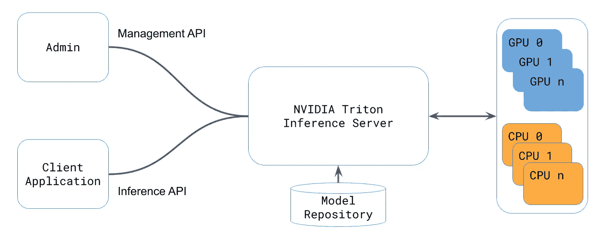

# 如何更好地部署您的机器学习模型

> 原文：<https://towardsdatascience.com/how-to-better-deploy-your-machine-learning-model-6f179483a289>

## 我反对自制解决方案和替代方案的理由

安德烈·德·森蒂斯峰在 [Unsplash](https://unsplash.com?utm_source=medium&utm_medium=referral) 上拍摄的照片

每周，我都要花相当多的时间从研究和工程两方面学习机器学习(ML ),因为我是一名博士生，因为我已经做了相当长一段时间的软件开发人员。在浏览时，我不断看到这些教程，介绍如何使用一些声称“最快”或最简单的 python 库来部署 ML 模型。然而，我认为使用 python web 框架来部署您的 ML 模型并不是最好的选择。

这篇文章将解释为什么我认为你不应该依赖 python web 框架来部署你的 ML 模型，并提出一个替代方案。然而，这不是一个使用建议选项的教程。尽管如此，这是我正在努力发布的东西，所以请继续关注。

# 为什么 Python 框架不是正确的选择

使用 python 框架部署模型的第一个缺点是您必须构建它。是的，你可以找到一些带有不错的模板的存储库，甚至是一个基于 web 框架的框架，但是你仍然需要做一些修改。问问任何一个经验丰富的软件开发人员，他们都会告诉你，任何一段新代码都有可能出现错误。所以对于每一个新的软件，你都需要处理测试和维护。知道维护占软件总成本的 70%左右，你应该在添加新东西之前三思。

我围绕这一点进行了多次讨论，我一直听说构建这些应用程序是机器学习工程师的工作，这是真的。尽管如此，您并没有让开发人员使现有的应用程序更加健壮，而是添加了一个新的应用程序。

其次，我遇到的所有实现都模糊了 ML 框架和应用程序代码之间的界限，违反了关注点分离原则。因此，您需要进行的任何更新都会更加复杂，因为应用程序代码是与 ML 框架耦合在一起的。随着复杂性的增加，引入新 bug 的可能性也会增加。在某些情况下，当从一个 ML 框架跳到另一个框架时，由于 CUDA 驱动程序不匹配，您甚至可能需要更新您的基础设施。所以想象一下，你有多个研究团队，每个团队都想出于合理的原因使用不同的框架。想想所有的“同步”会议和“设计”讨论，以及需要发生的“重构”工作。

最后，python web 框架不是为机器学习而设计的，因为有一个硬件组件不容易抽象。此外，您将需要处理只在 CPU 或 GPU 上运行的情况，我甚至没有谈论多 GPU 或多节点推理。

这是可以理解的，看到自制的框架建立了一段时间，因为这些推理框架大多是非常新的。然而，如果你正在开始新的东西，我不明白你为什么要走那条路。如果您仍然选择使用自制的实现，您必须明白，在修复错误或重构样板代码时，您并没有为您的工作增加价值。所以确保你有一个合理的理由。

此外，一个人应该明白简单和容易之间的区别。使用现有的遗留自制实现很容易，因为它已经存在，但是当进行更新非常复杂时，使用起来就不简单了。

# 一种可能的选择

我将这一部分命名为“可能的替代”，因为这不是部署您的 ML 模型的最终方法。然而，这是一个我知道并使用的方法，我认为这是一个比我所知道的任何自制实现更好的解决方案。

我建议的替代方案是 NVIDIA Triton 推理服务器。但是，我想澄清一下，我和英伟达没有任何隶属关系。此外，它是开源的，所以我不建议你买什么。

## 为什么选择 NVIDIA Triton 推理服务器？

首先，英伟达是创作者。我知道你不应该通过封面来判断一本书，但众所周知，他们为任何与 GPU 和 ML 相关的东西都提供了坚实的产品。最重要的是，你可以确定它将支持未来任何新的 GPU 架构或 ML 框架，并且你不必处理任何驱动程序问题。如果你以前和 CUDA 或者 NCCL 车手打过交道，你就会明白我在说什么。此外，它经过高度优化，可以在 NVIDIA GPUs 上运行，这是行业标准，并有 CPU 支持。

第二，好用。从高层次来说，要部署一个新的模型，首先要将模型二进制文件保存在模型库中，它可以是您的本地硬盘驱动器、网络卷或任何 blob 存储，如 S3。然后创建一个描述输入、输出、调度和硬件要求的文本配置文件。之后，使用管理 API 加载模型。最后，应用程序或用户可以通过推理 API 使用模型。

作者图片

因此，部署一个新模型减少到几个 API 调用，这有多种优势:

*   您的团队没有在样板代码上花费时间，而是通过将大部分时间花在模型上来更加关注增加价值。
*   您缩短了上市时间。一旦运行了推理服务器，就不需要为新模型做额外的工作了。
*   它赋予研究人员权力。由于部署模型很简单，研究人员或者没有软件工程背景的人可以将新模型部署到开发环境中进行测试，这减少了您的支持团队的负担。
*   删除瀑布任务。如果另一个应用程序使用推理结果，任何其他团队都可以部署模型来测试集成，而不是等到您构建自制的推理服务器。我知道你可以在团队之间签订合同，但是问问任何一个经验丰富的开发人员最近的集成进展如何。
*   帮助在开发过程的早期发现问题。由于部署模型很容易，研究团队可以使用与生产环境中相同的堆栈，这有助于在过程的早期发现问题，比如超过 SLA 的响应时间。相比之下，研究团队正在选择模型，而工程团队正在构建推理服务器。一旦完成，他们意识到模型响应时间超过了 SLA，需要从头开始。

最后，它功能丰富。Triton 附带了许多特性，从简单用例到更复杂的用例，我知道其中一些特性很难实现，比如调度器或用 C API 访问共享内存。此外，它几乎支持我们今天拥有的所有 ML 框架，因此 Triton 的单个实例可以部署任何格式的模型，并且所有这些都有多个优点:

*   维护成本降低，尤其是对于复杂的功能。你与 NVIDIA 和社区分摊维护成本(因为它是开源的)。此外，如果你也想减少社区中的浪费，你可以公开 bug 请求，甚至可以投稿。
*   给研究人员更多的灵活性和自主权。研究团队可以为每个模型选择合适的框架。当一个 ML 框架没有特定的模型架构可用，并且研究人员想要避免从头构建它时，就会发生这种情况。
*   您可以访问您的团队没有能力或知识来构建的功能。如果您查看文档，您会发现一些功能需要具有特殊和罕见才能的员工，通过使用 Triton 这样的工具，您可以免费获得它(嗯，有些免费，因为成本包含在 GPU 价格中)。

# 结论

我在 ML 模型部署方面没有几十年的经验，我在本文中提出的论点可能有漏洞。然而，根据我有限的经验，我发现使用这样的工具会使生活变得更容易，并且可以将注意力集中在最终产品上。

此外，除了检查 Triton 推理服务器之外，另一个信息是在编写自制实现之前，总是先寻找现有的东西，尤其是在当前的创新速度下。

## 在你走之前

在 [Twitter](https://twitter.com/amine_elhattami) 上关注我，在那里我会定期发关于软件开发和机器学习的微博，或者在 [Youtube](https://www.youtube.com/channel/UC5HESU2PZakGoNS2pYeO5Og) 上关注我，在那里我会分享实践视频教程。