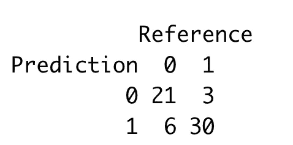
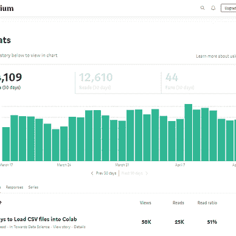

# 如何在 R 和 caret 中建立完整的分类模型

> 原文：<https://towardsdatascience.com/how-to-build-a-complete-classification-model-in-r-and-caret-73c68c3392e1>

## 机器学习

## 一个完整的例子，展示了如何使用 R 和脱字符包来运行分类任务


由[托马斯·帕克](https://unsplash.com/@thomascpark?utm_source=medium&utm_medium=referral)在 [Unsplash](https://unsplash.com?utm_source=medium&utm_medium=referral) 拍摄的照片

r 是一种主要用于统计的编程语言，但它也为机器学习提供了有效的库。在本教程中，我描述了如何使用 r。

该任务包括以下步骤:

*   问题定义
*   数据集预处理
*   模特培训
*   模型评估

# 1 问题定义

这个例子的目的是通过 K-Neighbors 分类器来预测心脏病发作。这个例子使用了 [hearts 数据集](https://www.kaggle.com/rashikrahmanpritom/heart-attack-analysis-prediction-dataset)，该数据集在 CC0 公共领域许可下可在 Kaggle 上获得。

在我之前的文章中，我已经使用 [scikit-learn](/a-complete-data-analysis-workflow-in-python-and-scikit-learn-9a77f7c283d3) 和 [pycaret](/a-complete-data-analysis-workflow-in-python-pycaret-9a13c0fa51d4) 用 Python 分析了这个数据集。在这篇文章中，我试图解决 r。

下图显示了数据集的摘录:


作者图片

作为输入特性，我考虑了所有的列，但是最后一列被命名为 output，我将其视为目标类。

为了解决这个问题，我使用了 caret 库，它可以按如下方式安装:

```
install.packages('caret')
```

[caret](https://topepo.github.io/caret/) 包(**C**class ification**A**nd**RE**gression**T**raining)对于分类和回归任务来说是一个非常有用的 R 包。它提供了预处理、模型训练、模型预测和模型评估的功能。

安装完成后，我如下导入插入符号包:

```
library(caret)
```

然后，我将 hearts 数据集作为数据帧加载:

```
df <- read.csv('heart.csv')
```

我还将种子设置为一个随机数，以使实验具有可重复性:

```
set.seed(12)
```

# 2 数据集预处理

现在，我转换数据集进行训练。我对数据集执行以下操作:

*   编码输出列
*   缩放和居中输入列
*   将数据集分成训练集和测试集
*   设置交叉验证方法

如前所述，我将输出列视为一个目标类，因此我将它编码如下:

```
df$output <- as.factor(df$output)
```

`factor()`函数将向量编码为类别或因子。

然后，我通过缩放和居中来规范化输入列，如下所示:

```
preProcess <- c("center","scale")
```

简单地说，我定义了一个预处理变量，它包括两个操作:居中和缩放。然后，我将把这个变量作为输入传递给训练函数。

现在，我准备通过使用 caret 库提供的`createDataPartition()`函数将数据集分成训练集和测试集:

```
i <- createDataPartition(y = df$output, times = 1, p = 0.8, list = FALSE)
```

该函数返回指定如何拆分数据的索引。我不得不 0.8 的百分比分裂。现在我分割数据集:

```
training_set <- df[i,]
test_set <- df[-i,]
```

最后，我通过定义以下变量来设置交叉验证，我将把这些变量作为训练函数的输入:

```
trControl <- trainControl(method = "repeatedcv",number = 10,repeats = 10)
```

我已经将方法设置为重复交叉验证，折叠次数设置为 10，重复次数设置为 10。

# 3 模型训练

我准备好训练模型了。我使用 caret 提供的`train()`函数如下:

```
model <- **train**(output ~ ., method='knn', data = training_set, metric='Accuracy',preProcess = preProcess, trControl=trControl)
```

我已经将模型设置为 knn (K-Nearest Neighbors)，将数据设置为`training_set`，将优化度量设置为`Accuracy`，将预处理技术设置为之前定义的`preProcess`，将训练控制设置为之前定义的`trControl`变量。

训练过程真的很简单😃

# 4 模型评估

一旦模型被训练，我就可以评估它的性能。我使用 predict()函数来预测测试集的输出:

```
test_set$pred <- predict(model, test_set)
```

为了计算指标，我必须将输出转换成一个因子，如下所示:

```
test_set$factor_pred <- as.factor(test_set$pred)
test_set$factor_truth <- as.factor(test_set$output)
```

现在，我计算精度:

```
precision <- **posPredValue**(test_set$factor_truth, test_set$factor_pred)
```

召回:

```
recall <- **sensitivity**(test_set$factor_truth, test_set$factor_pred)
```

混乱矩阵:

```
cm <- **confusionMatrix**(test_set$pred, test_set$output)
```

精确度可以从混淆矩阵中提取:

```
accuracy <- cm$overall[1]
```

我还计算了对应于混淆矩阵的表:

```
confusion_matrix <- cm$table
```



作者图片

为了绘制 ROC 曲线，我使用 pROC 库:

```
library(pROC)
test_set$pred <- predict(model, test_set,probability=TRUE)
roc_curve = **roc**(test_set$output, predictor=factor(test_set$pred,ordered = TRUE))
plot(roc_curve, col="red", lwd=3)
```

`roc()`函数接收概率形式的预测，所以我通过 predict()函数设置`probability=TRUE`再次计算预测。


作者图片

`roc()`函数并不绘制实际的 ROC 曲线，而是绘制灵敏度对特异性曲线。实际的 ROC 曲线绘制的是灵敏度对特异性。

# 摘要

恭喜你！您刚刚学习了如何在 R 中运行一个完整的分类任务！该示例使用了 caret 包，其中包括用于模型定型和评估的函数。

您可以在我的 [Github 资源库](https://github.com/alod83/data-science-r/blob/main/DataAnalysis/Classification.Rmd)中找到本文中描述的完整示例。

请继续关注，了解一些关于 R 的新知识！

如果你读到这里，对我来说，今天已经很多了。谢谢！你可以在[这篇文章](https://alod83.medium.com/which-topics-would-you-like-to-read-c68314dc6813)中读到更多关于我的信息。

# 相关文章

<https://medium.com/geekculture/moving-from-python-to-r-how-to-build-a-simple-regression-model-7d0f8ff79625>  </how-to-run-r-scripts-in-jupyter-15527148d2a>  </how-to-spend-your-time-when-you-are-waiting-for-a-data-analysis-output-e71b383f43cb>  

# 来自社区


[安吉莉卡·洛·杜卡](https://alod83.medium.com/?source=post_page-----73c68c3392e1--------------------------------)

## 机器学习

[View list](https://alod83.medium.com/list/machine-learning-a7f995167d76?source=post_page-----73c68c3392e1--------------------------------)6 stories

[当归罗杜卡](https://alod83.medium.com/?source=post_page-----73c68c3392e1--------------------------------)

## 评估指标

[View list](https://alod83.medium.com/list/evaluation-metrics-e157b6c7fea6?source=post_page-----73c68c3392e1--------------------------------)2 stories

[当归罗杜卡](https://alod83.medium.com/?source=post_page-----73c68c3392e1--------------------------------)

## 数据预处理

[View list](https://alod83.medium.com/list/data-preprocessing-c5d6af08104c?source=post_page-----73c68c3392e1--------------------------------)12 stories

# 参考

[ROC 曲线的一些 R 包](https://rviews.rstudio.com/2019/03/01/some-r-packages-for-roc-curves/)