# 如何从零开始构建数据湖—第 2 部分:连接组件

> 原文：<https://towardsdatascience.com/how-to-build-a-data-lake-from-scratch-part-2-connecting-the-components-1bc659cb3f4f>

## 如何利用流行技术构建数据工程沙盒的完整教程

在这一系列文章中，我将指导您建立自己的数据湖基础设施作为数据工程沙箱。在这一部分中，我将展示如何连接我们的数据湖基础设施的各种服务。在第一部分中，我已经展示了如何用 docker 托管必要的服务，并解释了各个配置选项。

一旦组件“相互对话”，您将能够实施自己的数据工作流，并将技术和大数据方法用于自我测试！您将能够利用该平台来了解设置、实施附带项目、概念验证、使用案例或使用这些技术来学习其他教程。大多数数据任务可以通过这种基础设施实现自动化。在“生产”环境中，服务也可以作为 docker 化的服务托管在 AWS EC2 实例上，但是对于我们的沙箱，使用 docker 在本地托管它们就足够了。

图片由 Unsplash.com 的加勒特·西尔斯拍摄

我们使用以下技术组合:

*   Apache NiFi 来处理和分发数据。
*   Apache NiFi Registry 用于存储、管理和版本控制 NiFi 资源。
*   Apache Airflow 以编程方式创作、安排和监控工作流。
*   Postgres 作为一个对象关系数据库。
*   pgAdmin 作为 postgres 数据库的管理和开发平台。
*   MinIO 作为本地托管的、S3 兼容的对象存储。
*   码头工人来主持我们的服务。

著名的`Hello world!`最早是在 Brian Kernigsham 的《语言 B 入门教程》一书中提到的，后来因《C 编程语言》一书而出名([来源](https://www.thesoftwareguild.com/blog/the-history-of-hello-world/))。如今，许多教程仍然使用将`Hello world!`写入终端的任务来检查用户是否已经完成了设置阶段，并准备好投入编码挑战。

在本文中，我们将实现服务间通信的`Hello world!`:通过设置服务交互的超级简单的例子。我将指导您为每一对需要相互通信的服务建立连接。之后，您将能够继续自己的工作，充分利用数据湖基础设施的全部功能。

如果您还没有设置 docker 容器，也还没有运行您的组件，那么请继续阅读本系列的[第 1 部分。我们将从停止的地方继续:我们将](/how-to-build-a-data-lake-from-scratch-part-1-the-setup-34ea1665a06e) [docker-compose.yml 文件从这里](https://gist.github.com/CribberSix/bfc8d6fdb30660467305f8e4288f213e)复制到我们的本地计算机，并使用`docker-compose up`启动服务。

到目前为止，我们的服务仍未连接，但是我们的目标基础设施将如下所示:

数据湖组件—由作者创建的图像。维基百科的图标。

在以下章节中，我们将连接:

1.  postgres 数据库的 pgAdmin
2.  Apache NiFi 到 NiFi 注册表(反之亦然)
3.  Apache NiFi 到 postgres 数据库
4.  阿帕奇 NiFi 到 MinIO
5.  到 postgres 数据库的 Apache 气流
6.  阿帕奇气流到阿帕奇尼菲
7.  阿帕奇气流到 MinIO

让我们直接进入 pgAdmin 的设置吧！

# pgAdmin

服务运行后，您可以在浏览器中访问 pg admin:[http://localhost:5050/](http://localhost:5050/)

如果您在启动 docker 容器后第一次访问该服务，它会要求您设置一个主密码。选择一个你能记住的密码。

我们想通过连接到 postgres 数据库并对该数据库运行一个简单的查询来从 pgAdmin 对其说`Hello world!`。

# pgAdmin:你好，postgres 数据库

单击页面中间“快速链接”下的“添加新服务器”，或者右键单击左上角的“服务器”，然后选择“创建”->“服务器…”。

我们需要配置连接细节以添加新的数据库服务器:

1.  在**常规选项卡**中:为您的数据库服务器选择一个名称，例如`postgres_db`
2.  在**连接选项卡**中:“主机名/地址”是**而不是**“本地主机”,而是*postgres 容器*的 IP 地址——因为容器需要通过 docker 网络相互通信。因为我们在一个用户定义的网络(`dataworld`)上，我们可以只使用主机名`mypostgres`而不是固定的 IP 地址，让 docker 在后台处理 DNS 解析。
3.  在**连接页签**中:端口是 postgres 数据库的标准应用端口— `5432`。
4.  在**连接选项卡**中:用户名和密码在`docker-compose.yml`中被指定为 postgres 服务的环境变量(如果还没有更改的话，则为`postgres`和`postgres`)。

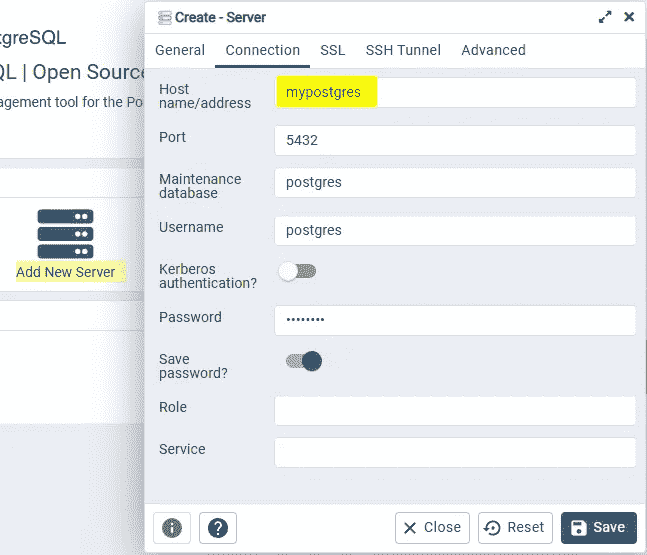

连接设置—由作者创建的图像。

除了使用主机名，我们还可以通过获取 postgres 容器的 ID 并检查它以检索其 IP 地址来标识我们的数据库:

获取容器 ID:

检查容器，将返回的行过滤为 IP 地址为:

这是相当麻烦的，特别是因为每当我们重启我们的容器时，我们将不得不重新开始，因为 docker 网络中容器的 IP 地址可能会改变。使用主机名并让 Docker 在我们在 [docker-compose.yml](https://gist.github.com/CribberSix/bfc8d6fdb30660467305f8e4288f213e) 中定义的用户定义的网络中解析它要容易得多。

连接到数据库后，我们现在可以运行查询了。右击数据库，选择**查询工具**。

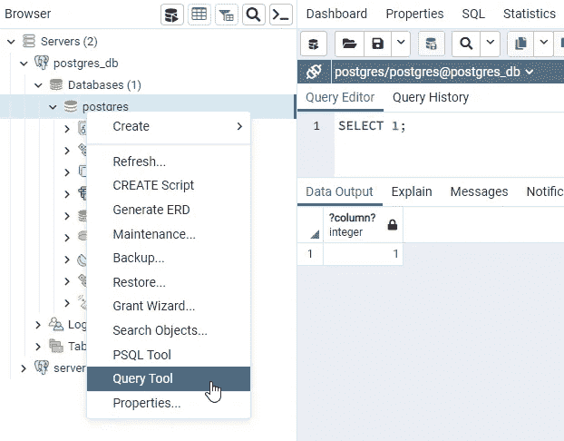

pgAdmin 中的查询工具—由作者创建的图像。

为了测试一切是否正常，让我们运行下面的查询来检查连接——我们自己的小版本**“hello world！”。sql** :

恭喜你！PgAdmin 现在连接到 postgres 数据库了！

# 阿帕奇尼菲

如果您的 docker 服务正在运行，您将能够通过[http://localhost:8091/NiFi/](http://localhost:8091/nifi/)联系到 NiFi。注意:您可能会看到消息`The Flow Controller is initializing the Data Flow`。NiFi 将需要一分钟(在您启动服务之后)才能到达应用程序，因为领导者选举周期需要首先完成。

我们希望连接到:

*   NiFi 注册表
*   postgres 数据库
*   米尼奥

# 你好，NiFi 注册中心

为了将 NiFi 连接到 registry，我们首先需要在 registry 中创建一个“bucket”来存储和组织我们的数据流。继续操作并打开位于[http://localhost:18080/nifi-registry/](http://localhost:18080/nifi-registry/)的注册表。

1.  单击窗口右上角的扳手符号。
2.  点击右侧的“新桶”。
3.  为您的存储桶输入一个名称，例如`myfirstbucket`。

NiFi 注册表—创建新的存储桶—图片由作者创建。

我们现在可以将 NiFi 的流程组和流程存储在新创建的 bucket 中。

请注意，默认情况下没有配置任何权限。在这个实例中，有权访问注册表的每个人都可以查看、创建和修改存储桶。有关保护系统的信息，请参见[系统管理员指南](https://nifi.apache.org/docs/nifi-registry-docs/html/administration-guide.html)。

前往[http://localhost:8091/nifi/](http://localhost:8091/nifi/)，点击右上角的`three bars`进入`controller setting`。然后点击选项卡`registry client`和右侧的`plus-symbol`。

选择任何你喜欢的名字，并添加以下网址:`http://myregistry:18080`。Docker 将再次在 docker 网络上将主机名解析为容器的 IP 地址。

Nifi —添加注册中心客户端—由作者创建的图像。

既然我们已经向 NiFi 添加了注册客户机，那么让我们测试它的功能:创建一个新的进程组，其中包含一个或两个虚拟处理器。

右键点击流程组，选择`Version`->-`Start version control`:

Nifi —启动过程组的版本控制—由作者创建的图像。

现在我们能够选择我们想要使用哪个注册中心和存储桶来进行版本控制(如果我们已经配置/创建了多个的话),以及在注册中心中应该以哪个名称对流程组进行版本控制。输入名称，还可以选择输入描述和版本注释。

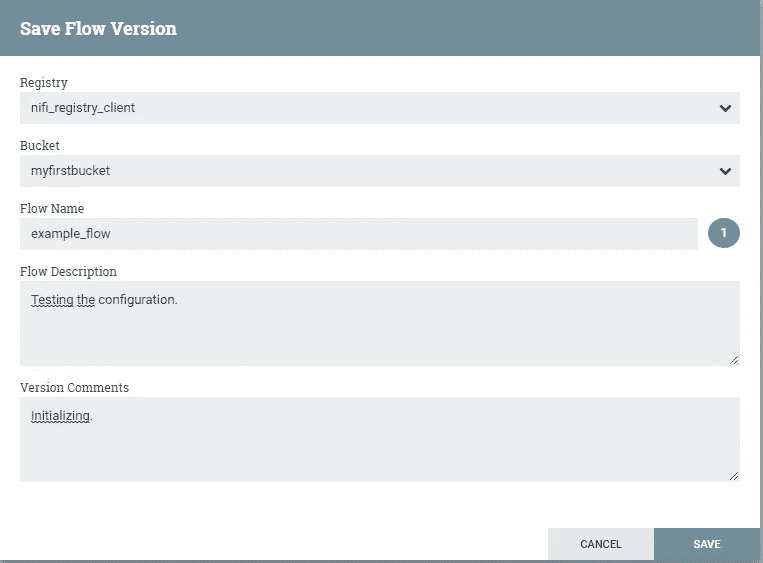

NiFi —将流文件版本保存到由作者创建的注册表图像中。

单击“保存”后，您会注意到流程组的左上角有一个绿色复选标记。这意味着组的当前状态被保存到桶中！如果我们更改了内部的某些内容，例如将处理器移动到另一个位置、更改某些配置或添加/删除处理器，复选标记将会被一个灰色的星号取代。这个星号象征着对底层流程的一些未提交的更改。

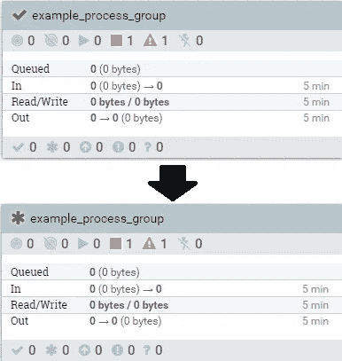

NiFi —过程组版本控制状态的变化—由作者创建的图像。

要在注册表的桶中存储最新的更改，右键单击处理器组，然后单击`Version` - > `Commit local changes`。绿色复选标记将再次出现。如果我们想要放弃更改，我们可以选择`Revert local changes`，过程组将被重置为保存到注册表的最新版本。Local(在注册表的上下文中)是指 Nifi 实例，而不是您的本地计算机。

NiFi —提交本地更改—图片由作者创建。

我们现在已经有了 Apache NiFi 数据流和 ETL 管道的完整版本控制系统！我们可以检查本地更改，将它们提交到注册表中，或者从注册表中取出最新版本的进程组。对我们的工作进行版本控制，并且能够跟踪变更，这极大地改善了我们的开发工作！

当我们创建一个新的进程组时，我们甚至可以从注册表中导入一个存储的进程组的特定版本(作为一个模板):

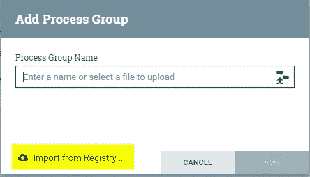

NiFi —从注册表导入模板—由作者创建的图像。

在接下来的几章中，当我们连接到其他服务时，请随意使用这个特性！

# Apache NiFi:你好 postgres 数据库

为了能够查询 postgres 数据库，我们需要配置:

*   一个`DBCPConnectionPool`，它包含数据库的连接细节
*   微型工作流程:

1.  第一个处理器创建一个空的流文件来触发后续的处理器
2.  第二处理器执行对数据库的查询
3.  第三个处理器用于在查询执行后查看队列中的数据。

## JDBC 控制器 postgres

当创建控制器服务时，总是在需要它们的最顶层进程组中创建它们——甚至可能是根进程组。控制器服务只能在创建它们的组以及所有后续子组中访问。

为了能够设置连接到 postgres 数据库的控制器服务，我们需要下载 postgres 的当前 JDBC 驱动程序，例如从[这里](https://jdbc.postgresql.org/download.html)。下载完成后，将`postgresql-42.3.1.jar`文件(或您使用的任何版本)复制到 docker 挂载的目录`/nifi/jdbc/`。这个过程对于任何其他数据库都是一样的，我们总是需要将 NiFi 指向 jdbc-driver jar-file。

通过左侧当前过程组的`gear-symbol`按钮进入 NiFi 中的控制器配置。在`Controller services`选项卡中，点击右侧的`plus-symbol`添加一个新控制器。从可用控制器的长列表中选择`DBCPConnectionPool`并点击`Add`。

编辑新创建的控制器的属性，如下所示:

*   数据库连接 URL: `jdbc:postgresql://mypostgres:5432/postgres`
*   数据库驱动类名:`org.postgresql.Driver`
*   数据库驱动位置:`/opt/nifi/nifi-current/jdbc/postgresql-42.3.1.jar`(注意，我们配置的是 docker 容器内部的路径，而不是本地机器上的路径！)
*   数据库用户:`postgres`(或您在设置过程中更改的任何名称)
*   密码:`postgres`(或您在设置过程中更改的任何密码)

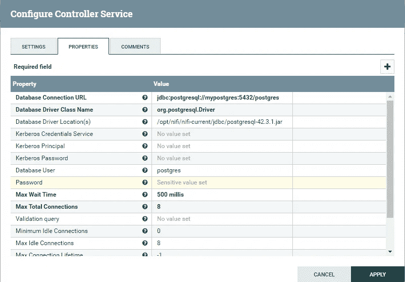

NiFi—JDBC 控制器的属性—微型工作流程:

点击`Apply`并通过选择描述新创建的控制器的线的`lightning-symbol`并在打开的窗口中选择`Enable`来启用服务。

## 处理器

为此版本的`Hello world!`创建三个处理器:

1.  处理器:GenerateFlowFile——作为我们数据流的起点。
2.  处理器:ExecuteSQL —在 postgres 数据库上执行查询。
3.  Processor: RouteOnAttribute —作为一个虚拟处理器，这样我们可以查看队列中的流文件。

用`success`流程按顺序连接处理器。

## 生成流文件

在`GenerateFlowFile`处理器中，将调度选项`Run Schedule`更改为`60 sec`，并将调度选项`Execution`更改为`Primary node`。这样，我们可以确保无论何时启动处理器**时，主节点都会创建一个流文件，从而触发我们的 ETL 管道。每隔 60 秒就会创建另一个流文件——除非我们事先停止了处理器。这是一个简单的技巧，可以精确地触发我们的流水线一次:在调度时间再次完成之前启动然后停止`GenerateFlowFile`处理器。**

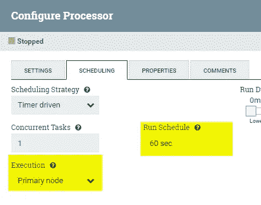

NiFi —调度处理器—图片由作者创建。

## 执行 SQL

在`ExecuteSQL`处理器中，选中主配置中`failure`旁边的复选框，以便在查询失败时自动终止进程。在`properties`选项卡中，将`Database Connection Pooling Service`属性更改为新创建的`postgresql_connectionpool`，并将字段`SQL select query`编辑为数据库连接的测试查询。一个例子可能是:

如果您的 DBCPConnectionPool 没有出现在可用的控制器服务列表中，请确保您已经在同一个处理器组或其上的任何处理器组中创建了 DBCPConnectionPool。不能选择当前组之外或之下的流程组的控制器服务！

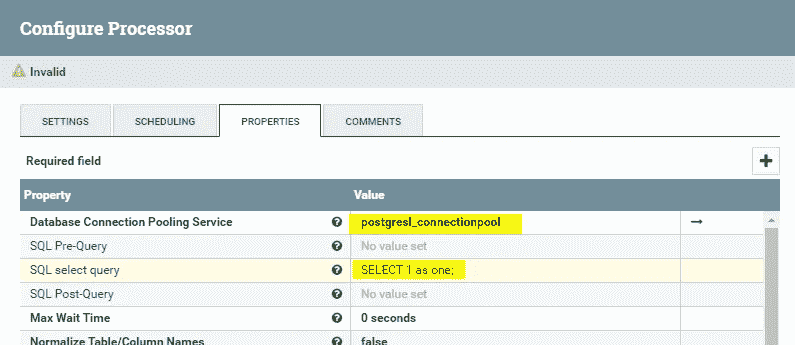

NiFi —配置 executeSQL 处理器—图片由作者创建。

我们不需要配置最后一个处理器，因为我们只是将它作为一个替身来使用，以便能够检查通向它的队列中创建的流文件。您的处理器流程应该如下所示:

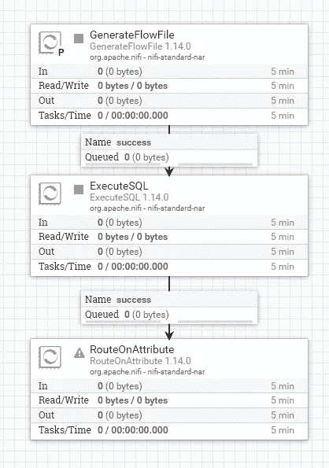

NiFi —处理器流程—图片由作者创建。

一旦启动了前两个处理器，就会创建一个流文件，并触发 ExecuteSQL 处理器。ExecuteSQL 处理器之后的流文件现在将包含我们从数据库中查询的数据。您可以通过右击队列并选择`List queue`来检查数据。您可以下载队列中的每个项目，或者通过单击右侧的符号在浏览器中查看其内容。

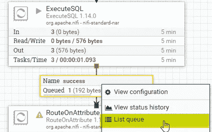

NiFi —检查队列的流文件—作者创建的图像。

浏览器检查(格式化视图)中的流文件内容如下所示:

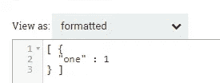

NiFi —队列中的文件内容—作者创建的图像。

这意味着我们已经成功地从 NiFi 查询了数据库！我们离全功能数据湖架构又近了一步！

# 阿帕奇·尼菲:你好，米尼奥

在我们连接 NiFi 之前，我们必须配置 MinIO。您可以在浏览器中的[http://localhost:9001/dashboard](http://localhost:9001/dashboard)下访问该服务。用户名和密码通过环境参数`MINIO_ACCESS_KEY`和`MINIO_SECRET_KEY`在 [docker-compose.yml 文件](https://gist.github.com/CribberSix/bfc8d6fdb30660467305f8e4288f213e)中配置。除非您在创建容器之前更改了它们，否则它们是`minio_admin`和`minio_password`。

## 配置 MinIO

点击左侧导航栏中的`Buckets`，点击右上角的`Create Bucket`。为您的存储桶选择一个名称，例如`miniobucket`，保留默认配置并点击`Save`。请注意如何命名您的存储桶，名称必须在 3 到 63 个字符之间，并且只能由小写字母、数字、点和连字符组成！

MinIO bucket —作者创建的图像。

创建 bucket 后，在本地创建一个名为`minio_testfile.txt`的新文件，内容为`This is the content of a testfile from MinIO.`。

选择您的桶并点击`Browse`。创建一个名为`test`的新目录，并在其中点击`Upload file`符号上传`minio_testfile.txt`。在下一步中，我们将配置 NiFi 从 MinIO 中检索这个文件！

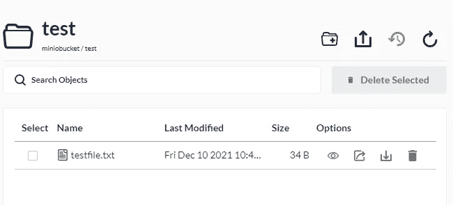

MinIO 桶内容—由作者创建的图像。

# 配置 NiFi

为了能够在 NiFi 中创建从 MinIO 检索文件的管道，我们还需要配置 NiFi。在本地绑定挂载的目录`/nifi/credentials/`中创建一个名为`credentials.properties`的文件。

该文件的内容是 MinIO 的环境变量的值——如果您没有在您的 [docker-compose.yml 文件](https://gist.github.com/CribberSix/bfc8d6fdb30660467305f8e4288f213e)中更改它们，`credentials.properties`文件的内容将是:

如有必要，更改键值。

转到[http://localhost:8091/nifi/](http://localhost:8091/nifi/)并创建一个新的进程组。在组内，为`GenerateFlowFile`、`FetchS3Object`和`RouteOnAttribute`类型各创建一个处理器。用`success`关系连接处理器。由于 MinIO 与 S3 兼容，我们可以将 NiFi 的所有 S3 处理器与 MinIO 端点一起使用！

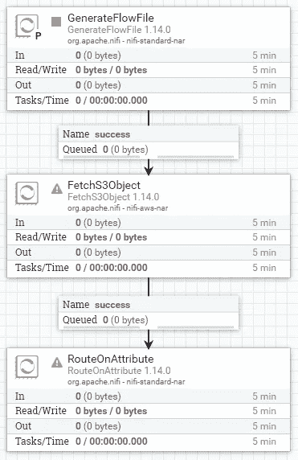

NiFi —处理器流程—图片由作者创建。

再次更改`GenerateFlowFile`处理器的调度选项`Run Schedule`到`60 sec`以及调度选项`Execution`到`Primary node`。这样，我们可以确保无论何时启动处理器，都会创建一个流文件，触发我们的 ETL 管道。

在`FetchS3Object`处理器中，勾选复选框以自动终止`failure`上的关系，并配置以下属性:

*   桶:`miniobucket`
*   对象键:`test/testfile.txt`(我们需要配置桶内的完整路径，包括目录)
*   端点覆盖 URL: `http://myminio:9000`(用我们的私有 MinIO 实例之一覆盖 AWS S3 的端点)
*   凭证文件:`/opt/nifi/nifi-current/credentials/credentials.properties`(容器内指定的路径)

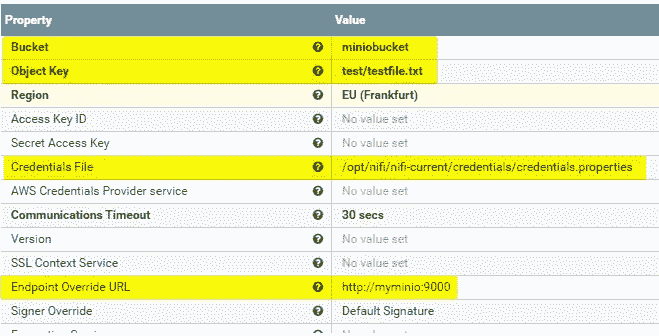

NiFi—fetchs 3 对象处理器配置—图片由作者创建。

如果您想为 NiFi 创建一个单独的技术 MinIO 用户，您只需更新本地目录中的`credentials.properties`文件。

运行您的管道——您可以通过启动和停止`GenerateFlowFile`处理器或右键单击它并选择“恰好运行一次”选项来完成此操作。通过右键单击通向`RouteOnAttribute`处理器的队列，我们可以检查流文件。

NiFi —检查队列的流文件—作者创建的图像。

我们现在可以验证我们的文件确实被 NiFi 检索和加载了:

NiFi —流文件内容—由作者创建的图像。

恭喜，我们又连接了两个服务！我们现在可以从 MinIO 和 postgres 数据库中检索和写入数据。如果我们以后从 MinIO 切换到实际的 S3 存储，我们只需删除被覆盖的端点 URL 并更新我们的凭证文件。

# 气流

为了让 Airflow 能够连接到 MinIO(以及 S3 或其他 S3 兼容的存储设备),我们需要在 Airflow 服务上安装一个 python 包。我们可以通过挂载一个`requirements.txt`文件来做到这一点。在本地挂载的目录(`./airflow/requirements/requirements.txt`)中创建以下文件，内容如下:

创建文件后，我们需要重启 docker 服务。启动时，Airflow 会自动安装文件中提到的所有软件包。当 docker 检查必要的包时，这可能会使启动延迟几秒钟，但不会太长。

一旦你完成了这个准备步骤，让我们到达气流中的`Hello world!`。

# 阿帕奇气流:你好 postgres 数据库

在我们创建任何代码之前，我们需要在 Airflow 中配置连接细节。在[http://localhost:8085/admin/](http://localhost:8085/admin/)的浏览器中打开服务，点击顶栏中的`Admin` - > `Connections`。默认情况下，Airflow 附带了许多连接，但是让我们为我们的目的创建一个新的连接。

点击`Create`，填写必要的详细信息:

*   `Conn Id` : `mypostgres_connection` -稍后我们可以用它来检索连接细节的 ID。
*   `Conn Type` : `Postgres` -从下拉菜单中选择。
*   `Host` : `mypostgres` - Docker 将解析主机名。
*   `Schema` : `postgres` -数据库名称(该标签具有误导性)
*   `Login` : `postgres` -或者您在 [docker-compose.yml 文件](https://gist.github.com/CribberSix/bfc8d6fdb30660467305f8e4288f213e)中设置的用户名。
*   `Password` : `postgres` -或者您在 [docker-compose.yml 文件](https://gist.github.com/CribberSix/bfc8d6fdb30660467305f8e4288f213e)中设置的任何密码。
*   `Port`:`5432`-docker 网络中数据库的标准端口。

点击保存:

气流连接-由 autor 创建的图像。

现在我们可以开始写 DAG 了。DAG(有向无环图)是气流的核心概念，它定义了任务、它们的依赖关系和时间表([在这里阅读更多内容](https://airflow.apache.org/docs/apache-airflow/stable/concepts/dags.html))。

DAG 指定任务，更重要的是，指定任务应该执行的顺序。我们甚至可以将任务配置为仅在一个(或多个)先前任务失败时执行。Airflow 附带了许多所谓的任务“操作符”——这意味着我们可以用 Python、Bash、Druid、Hive、MSSQL 甚至 PostgreSQL 等等编写任务！所有 Dag 都是 Python 文件，但是操作符中的代码取决于操作符的类型。

例如，我们可以使用 [postgres 操作符](https://airflow.apache.org/docs/apache-airflow-providers-postgres/stable/_api/airflow/providers/postgres/operators/postgres/index.html#module-airflow.providers.postgres.operators.postgres)来执行 postgres 数据库中的 SQL 代码。或者，我们可以使用 [python 操作符](https://airflow.apache.org/docs/apache-airflow/stable/_api/airflow/operators/python/index.html)编写一个小的 python 程序，该程序反过来在数据库上执行查询。我们选择哪种方案取决于我们的用例。为了这个`Hello postgres database!`，让我们创建一个简单的 postgres 操作符，它将在我们的数据库中创建一个空表。

注意:根据您的 Airflow 版本，您需要不同的导入路径。本文的 [docker-compose.yml 文件](https://gist.github.com/CribberSix/bfc8d6fdb30660467305f8e4288f213e)中使用的 docker 映像使用了旧版本`1.10.9`。我在代码摘录中包含了新的 Airflow 版本的导入路径。

在本地挂载的目录下创建一个文件:`airflow/dags/hello_postgres.py`，内容如下:

为了能够多次执行 DAG，我们在 DAG 中有两个任务:第一个任务删除已经存在的表，第二个任务创建表。如果我们不包括第一个任务，DAG 将在第二次和任何后续执行中失败，因为它无法成功执行创建查询。通过参数`postgres_conn_id`传递连接细节，我们不必担心代码中的主机名、用户名或密码。

保存文件，等待它出现在你的网页浏览器的`DAGS`视图中。根据您的 DAG，这可能需要一些时间。一旦它被列出，在左边激活它，并点击“触发 DAG”在右手边。

我们现在可以在 pgadmin 的界面中验证创建的表:

pgAdmin —表格的验证—由作者创建的图像。

恭喜你！我们现在能够从 Airflow 调度任务来执行数据库上的代码！

# 阿帕奇气流:你好阿帕奇尼菲

从 Airflow DAG 连接到 NiFi 使我们能够更新处理器属性、更改处理器的内容(如 sql 语句)、启动或停止处理器、列出/更改/启动控制器等等。Apache NiFi 为多种配置目的提供了一个深入的 REST-API。我们可以检索和配置对象，如控制器、流、处理器、处理器组、端口、标签、漏斗、策略，甚至将事务提交到特定的输入端口。对于我们的`Hello world!`目的，我们将创建一个简单的 GET 请求。您是使用 API 的包装库，如 [nipyapi](https://pypi.org/project/nipyapi/) 还是使用[官方 REST-API](https://nifi.apache.org/docs/nifi-docs/rest-api/index.html) 编写自己的逻辑和请求，取决于您的用例。我个人喜欢直接使用 REST API，因为它的文档非常详细。

首先，让我们为 NiFi 服务创建一个气流连接，如下所示:

*   `Conn ID` : `mynifi_connection`
*   `Conn Type` : `Postgres`由于没有`NiFi`连接类型，因此我们使用 postgres 作为替身。
*   `Host` : `http://mynifi`
*   `Port` : `8080`这是网络内部的*端口，不是我们对外映射的那个！*

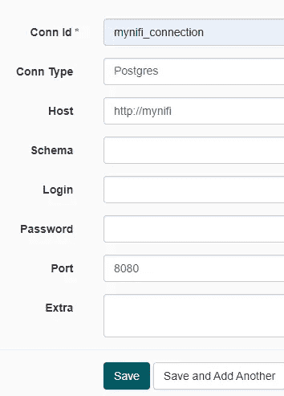

气流连接-由 autor 创建的图像。

接下来，我们需要创建一个 DAG。我利用[请求库](https://pypi.org/project/requests/)来创建对`GET /nifi-api/processors/{id}` REST-API 端点的请求。在[文档](https://nifi.apache.org/docs/nifi-docs/rest-api/index.html)中我们可以看到必要的 URI 和预期的回报——一个 ProcessorEntity JSON 对象:

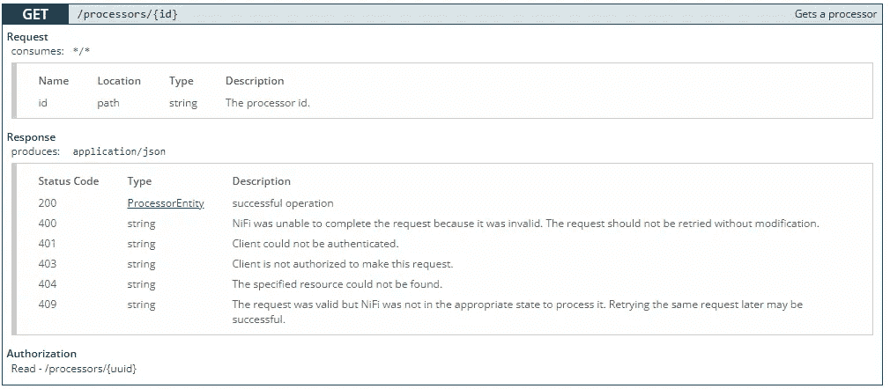

NiFi REST API 文档—由 autor 创建的图像。

为了检索连接细节并在脚本中构建我们的 URI，我们使用了 Airflow 的 BaseHook 模块，并将我们的连接 ID ( `mynifi_connection`)传递给它。如果您使用下面的脚本，不要忘记将 processor_id 字符串改为您自己的！

根据您在生产中的设置，您将首先需要通过端点`POST /nifi-api/access/token`检索带有用户名/密码组合的访问令牌。之后，您必须在下面的代码中添加不记名令牌。幸运的是，在我们简化的设置中，这是不必要的。我们可以对 REST API 进行未经验证的调用，如下所示:

如果您按照说明操作，您将能够在 DAG 的日志中看到以下信息行:

如果是，那么恭喜您，我们连接了服务！您现在可以基于这个`Hello world!`构建工具和 API 调用来配置处理器或启动/停止处理器。如果您有进一步的兴趣，[查看我的文章，了解如何通过执行以下模式将气流与成熟的 ETL 管道连接起来](/interconnecting-airflow-with-a-nifi-etl-pipeline-8abea0667b8a):

1.  预定气流 DAG 执行准备任务，
2.  气流触发了 Apache NiFi 中的处理器，
3.  NiFi 执行一个 ETL 过程，
4.  气流等待 NiFi 完成，
5.  气流继续执行其他任务。

但是够了，下一章在等着你！我们就要完成了，所以如果你已经走了这么远，**感谢你的关注！我不会耽搁你太久——让我们一起完成这个项目和我们的下一(也是最后一)章吧！**

# 阿帕奇气流:你好米尼奥/S3

Airflow 提供了一个 S3Hook，我们可以使用它无缝连接到 S3 或 S3 兼容的存储设备，如 MinIO！如前所述，为了使用钩子，我们需要在我们的 Airflow 服务上安装包`boto3`，方法是在我们的本地`airflow/requirements/requirements.txt`文件中添加一行`boto3`，并重启 Airflow docker 服务。虽然我们不会直接导入`boto3`，但如果没有它，我们将无法使用 Airflow 的`airflow.hooks.S3_hook`模块。

重启气流后，在`Admin`->-`Connections`GUI 下建立新的连接:

*   `Conn ID` : `myminio_connection`
*   `Conn Type` : `S3`由于没有`NiFi`连接类型，因此我们使用 postgres 作为替身。
*   `Extra`:由以下 JSON 组成:

不要忘记用您自己的密钥替换访问密钥，您可能已经在您的 [docker-compose.yml 文件](https://gist.github.com/CribberSix/bfc8d6fdb30660467305f8e4288f213e)中覆盖了这些密钥。

气流连接——图片由作者创作。

为了最初在 MinIO 中与文件交互，我们将实现两个简单的操作:将文件写入 MinIO 和从 MinIO 中的文件读取。为此，S3Hook 提供了两个简单易用的函数:`load_file`和`read_key`。

在您的本地`airflow/dags`存储库中创建一个新的 DAG(例如，名为`hello_minio.py`)并复制粘贴下面的代码。第一个任务将把一个名为`my-test-upload-file.txt`的文件上传到我们的 MinIO bucket 中的`test`目录。

执行 DAG，完成后，检查操作是否成功:

1.  在 MinIO 中，您应该在`test`目录的`miniobucket`桶中找到一个新文件。
2.  在任务的气流日志中，您应该能够看到下面的行`File contents: 'This is the content of a testfile from MinIO.'.`，描述了之前测试文件的文件内容。请注意，我们在这里使用的文件与我们在前面的 Hello-MinIO-from-NiFi 示例中为 NiFi 使用的文件相同。

连接设置完成后，我们现在可以开始使用连接的组件了！

# 回顾和总结想法

在这篇文章中，我们了解到

*   如何配置我们的服务，
*   如何把我们的服务互相连接起来，
*   如何利用整体基础设施和
*   服务之间如何交互和通信。

我邀请您在这个超级简单但广泛的基础设施上进行测试、试验和实现概念验证。大多数数据工程任务都可以使用现有的工具来实现！

作为一个快速提醒，我们可以使用

*   **Apache NiFi** 处理和分发数据。
*   **Apache NiFi Registry** 用于存储、管理和版本控制 NiFi 资源。
*   **Apache Airflow** 以编程方式创作、安排和监控工作流。
*   **PostgreSQL** 作为对象关系数据库。
*   作为 PostgreSQL 的管理和开发平台。
*   **MinIO** 作为对象存储——向来自 [minIO](https://min.io/) 的人们大声疾呼，因为他们的社区版拥有标准版和企业版的所有功能！
*   主持我们的服务。

一如既往，我们永远不会停止学习，所以如果您想了解更多，请随时查看以下链接

*   [这个系列的第一部分](/how-to-build-a-data-lake-from-scratch-part-1-the-setup-34ea1665a06e)
*   [Docker 的自定义桥](https://docs.docker.com/network/bridge/)
*   [码头工人的集装箱及其命名的重要性](https://docs.docker.com/network/links/#the-importance-of-naming)
*   [Docker 的重启策略](https://docs.docker.com/config/containers/start-containers-automatically/)
*   [Docker 的环境变量在 compose](https://docs.docker.com/compose/environment-variables/)
*   [资源、客户端和会话之间的 boto3 差异](https://stackoverflow.com/questions/42809096/difference-in-boto3-between-resource-client-and-session)。
*   [如何将气流与 NiFi ETL 管道连接](/interconnecting-airflow-with-a-nifi-etl-pipeline-8abea0667b8a)
*   [阿帕奇气流](https://airflow.apache.org/)
*   [阿帕奇尼菲](https://nifi.apache.org/)
*   [Apache NiFi 注册表](https://nifi.apache.org/registry.html)
*   [Nifi 注册管理机构的系统管理员指南](https://nifi.apache.org/docs/nifi-registry-docs/html/administration-guide.html)
*   [PostgreSQL](https://www.postgresql.org/)
*   [pgAdmin](https://www.pgadmin.org/)
*   [MinIO](https://min.io/)