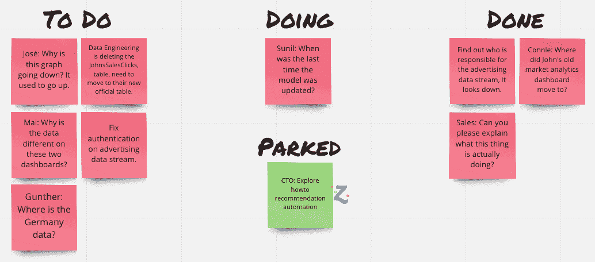

# 如何构建一个不会回来困扰你的数据产品

> 原文：<https://towardsdatascience.com/how-to-build-a-data-product-that-wont-come-back-to-haunt-you-1a220f4c75fb>

作者图片

## 当数据科学遇到生产工程

回想一下，您曾被要求将数据科学分析转变为可重复、受支持的报告或仪表板，以适应贵公司的生产数据管道和数据架构。也许你之前进行了原型分析，该解决方案信息丰富且运行良好，因此**你的老板要求你将其投入生产**。也许你发现自己不断地为相同类型的分析、培训和测试新模型重新提取数据，你想**自动化整个过程以节省宝贵的时间**。

或者，您的生产数据产品可能会遇到问题。也许你有数据科学支持的仪表板，你已经开发并投入生产，但**用户对它们越来越失望**，并失去信任。也许你会发现自己在浪费时间来支持现有的生产仪表盘和报告，这阻碍了你从事更新、更有趣的项目的能力。

**将数据产品投入生产本身就是一门艺术**。如果做得好，自动化可以提高数据科学团队工作的准确性、可信度和速度。如果做得不好，自动化会导致错误的增加，从而传播挫折感和不信任感。

许多最初的数据科学分析从零开始，并通过手工制作的管道处理所有数据。因为他们从定制的数据流程开始，数据科学家后来可能会陷入个人管理管道的责任中。他们花额外的时间检查他们的管道，以检测新出现的问题，及时修复它们，并在产品的消费者失去信任时，采取必要的措施来恢复失去的信任。

当将仪表板投入生产时，您不仅要考虑数据、报告和用户的情况，还要考虑数据和用户群在未来将如何变化。现在，一份报告对当前用户来说可能是清晰而准确的，尤其是因为你可以回答他们可能有的任何问题。但是，数据漂移可能会导致将来的报告不准确。一个你平时不怎么接触的经理可能会看到你的报告，但不能清楚地理解它，也不知道去哪里寻求帮助来理解它。因此，数据产品的质量以及对使用和解释数据产品的支持都会随着时间的推移而降低。

这些年来，我既是首席数据架构师，负责设计数据流程的管道，也是首席数据科学家，利用工程数据开发生产流程和可视化中使用的模型。

这篇文章整理了我一路走来学到的一些经验。我描述了生产数据管道的四个理想属性——不言自明、值得信赖、适应性强和有弹性。为了使数据管道正常运行，您需要在三个不同的数据处理阶段提供脚手架，包括您用作输入的数据(第一英里)、您向用户呈现结果的方式(最后一英里)以及数据处理和模型开发的运行和执行(中间的一切)。综合考虑，这两个轴提供了 12 个不同的接触点，每个接触点都有一个或多个重要的考虑事项需要解决。在我发布我的生产报告、仪表板和/或模型之前，这里是我在这些接触点上解决的一些考虑和重要问题。

# 三个管道阶段

我们说链条的强度取决于它最薄弱的一环。在数据管道中也是如此。数据产品的强度取决于构成产品的数据、管道和流程中最薄弱的部分。然而，在数据产品的情况下，许多这些“链接”不在你的控制之下。

你如何打造最强大的产品？你关注的是在你的特定管道部分的三个阶段——输入、输出和执行——中的每一个阶段需要加强的最重要的东西。

你的第一英里:你是从正确的东西开始的吗？此阶段的关注点集中在您放入管道或模型的输入数据上。您支持用户的能力取决于您开始时输入数据的质量。输入数据中的故障和降级通常不受您的控制，但会严重影响您的数据产品被接收和接受的程度。

**你的最后一英里:你的数据产品带来了理解、信任和信心吗？**您可能有一个很棒的数据产品，可能真的能满足需求，但所有这些都没有实际意义，除非用户理解报告，并对其底层数据的新鲜度和准确性有信心。“最后一英里”中的关注点集中在建立和维护这种信任上，这种信任不仅来自于您当前的报表查看者，也来自于将来可能查看该报表的任何人。

**在你、未来的你和你未来的替代者之间的旅程:你让事情变得简单了吗？**好的数据产品会存在很长一段时间。寿命和可维护性的考虑集中在您自己的特定提取、转换和加载过程上。数据管道出现故障，可能由于调度效率低下而降级，并可能产生规模问题。数据输入改变或消失。随着时间的推移，在使用您的数据生成的模型中，您可能会看到数据漂移或模型漂移。

支持一个生产过程可能很耗时，您希望为您自己、与您一起工作的其他人(他们可能会分担您的工作量)以及任何可能取代您的人简化维护过程。

# 四个重要标准

第二个轴包括不同的质量标准——让你的产品更强大的标准。我用四个标准来评估我的数据产品对未来数据问题和用户挑战的弹性。产品**是否自明**？T2 能激发信任和信心吗？随着数据输入的变化，**是否容易适应**？是否**可靠、准确、维护**？在开发生产管道时，仔细注意这些有助于减少未来维护任务所需的时间。

**不言而喻**:一旦你把你的数据产品投入生产，那些你不直接与之互动的人可能正在看着它。数据产品越简单明了，就越容易支持未来的用户。您希望尽可能地置身事外，同时仍能提供良好的支持。

随着时间的推移，您或其他人将需要进行一定量的监控和维护，以确保数据产品保持更新和准确。保持一个较低的心理负荷，以便拿起报告并学习，或者提醒自己报告是如何工作的，有助于这种维护。

**值得信任**:信任很难得到，也很容易失去。通常，当您第一次交付一个数据产品时，会有很多希望和一些信任。对于报表或仪表板，当用户获得报表或仪表板的长期感觉时，信任才会真正发展:

*   回答他们的问题
*   使用准确的数据
*   保持最新
*   提供一种可靠的方法来解决他们所看到的问题或潜在问题

如果用户开始怀疑这些事情中的任何一件，信任开始被侵蚀，报告不再像开始时那样有用。重复或重叠的关注点意味着产品最终会从他们的雷达上消失，用户会尝试用不同的方法来回答他们的问题。

**适应性**:数据输入和形状随时间变化。模式会改变。键值的分布发生变化。地方停止报告数据。数据集可以增长和扩展到超出您的数据处理和查询所能有效处理的范围。所有这些都会影响自动化流程交付准确及时的产品的能力。

作为一名数据科学家，您不希望花费时间频繁而详细地查看您的每一个产品，以确保您注意到数据中的所有小故障以及所有可能看起来不正确的地方。相反，最好是将监控任务委托给自动化系统，并以较慢的节奏对每个报告进行详细的深入研究。您可以自动监控的内容包括:

*   对一个或多个输入数据流的架构的相关更改
*   您正在使用的关键字段中数据形状的相关更改
*   数据量的显著增加或减少
*   最近使用的记录和当前时间之间有明显的滞后
*   关于数据量或滞后的趋势

除了监控相关问题之外，当有人注意到问题时，您需要做好准备，做出反应并制定解决方案，避免过度复杂化。确切地知道在哪里寻找是第一步，但是以一种易于适应和维护的方式设置您的数据过程也是成功的关键。

当你在设计和建立你的管道时，要考虑到你未来的自己(或者可能是你的替代者)。将定期重新训练模型的过程自动化，以考虑数据的变化。有一个检查您的数据和模型的节奏，以确保它们仍然符合您在设置初始流程时所做的假设。

**可靠**:可靠性是关于你的管道和模型的执行效果。在这种情况下，管道可靠性与管道中的流程执行和计时相关。这与适应性(如上)形成对比，适应性与正在处理的实际数据有关。

为了确保可靠性，您需要确保组成管道的不同部分是可靠的，并且编排这些部分的流程是健壮的。

当数据和模型构建管道自动化时，您没有关于正在执行什么、是否遇到任何问题或者甚至结果数据产品看起来像什么的即时和集中的反馈。为此，为了了解不同部分或阶段的可靠性，有一个监控系统会有所帮助，该系统会集中这些信息并提醒您需要注意的事情。

要监控整个流程的每个处理阶段，就要监控每个阶段的可靠性。监控阶段包括检查以下内容:

*   其输入数据得到了及时更新
*   该阶段在预期的时间开始执行
*   该阶段已成功完成
*   在任何下游阶段需要读取其结果之前完成的阶段

# 把东西放在一起

当形成我的初始生产质量系统时，我在流水线的每个阶段都提出具体的问题，集中在前面提到的问题上。通过系统地研究这些问题，我能够解决所有 12 个接触点的质量问题。

**不言自明/第一英里:**

1.  我使用的数据是否有据可查？
2.  我使用的数据是否符合其预期用途？
3.  我是否尽可能多地重用现有的工程管道，以降低整体维护工作量，并确保我的使用与相同数据项的其他使用一致？

**不言自明/最后一英里:**

1.  报告或仪表板的呈现方式是否易于访问和理解，甚至对于将要查看它的人也是如此，并且不需要我的解释？
2.  我是否使用了最终用户理解的词汇和可视化，并且他们理解的方式和我完全一样？
3.  我是否以一种直观且易于从数据产品本身获取的方式提供了良好的支持文档和信息？

**自明/介于:**

1.  数据流程的要求、约束和实现是否记录得足够好，以便可能接替我进行维护的其他人能够理解？

**值得信赖/第一英里:**

1.  我连接到输入数据的方式在生产管道中得到很好的支持吗？
2.  维护我正在使用的数据集的人是否明确支持我？
3.  这些输入数据在未来很长一段时间内可能会被保留吗？
4.  什么时候我可能需要检查以确保数据仍然被维护？
5.  我如何报告我在输入数据中看到的任何问题？
6.  谁负责通知我数据有问题？
7.  谁负责解决这些问题？

**值得信赖/最后一英里:**

1.  用户如何知道他们何时可以相信报告是准确的和最新的？
2.  是否有一种有效的和/或自动化的方式将可能的问题传达给最终用户？
3.  是否有一个清晰且可访问的流程，供用户报告与数据或报告有关的问题，以及通知用户是否有任何补救流程？

**值得信赖/介于两者之间:**

1.  我是否制定了定期的计划来审查数据和报告，以确保数据管道仍然运行良好，并且报告符合要求？
2.  在什么情况下应将此报告标记为已弃用？
3.  如果报告被否决，我如何确保用户得到通知？

**适应性强/第一英里:**

1.  我的分析依赖于输入数据中的哪些要素？
2.  我如何知道这些特性是否不再受支持，是否受到模式更改的影响，或者是否以可能影响我的分析的方式改变了形状？
3.  我如何知道数据的规模是否增长到了需要重构过程的程度，以便跟上产品对新鲜度的要求？

**适应性强/最后一英里:**

1.  产品或报告的设置方式是否便于申请变更和/或新功能？

**适应性强/介于两者之间:**

1.  我是否为重新检查需求建立了一个定期的时间表，以确保我仍然在生产用户需要和期望的东西？
2.  用户指出需求变化的过程是什么，这些变化是如何解决的？
3.  当输入以某种相关方式改变时，重构和重新测试数据管道的过程是什么？

**可靠/第一英里:**

1.  我的流程是否很好地融入了组织中的数据实践和工程生产系统？
2.  我是否有自动通知系统来监控输入数据的可用性、新鲜度和可靠性？

可靠/最后一英里:

1.  谁负责仪表板本身的持续监控、审查、故障排除和维护？
2.  内部报告和解决问题的职责和程序是否明确到位？

**可靠/介于:**

1.  我的管道中的每个阶段都及时执行和完成了吗？
2.  在任何阶段，处理时间和/或正在处理的数据量是否存在漂移，这可能表明管道功能下降？

# 结论

将一个数据产品投入生产所面临的挑战，不仅仅是一次性地或作为一个原型让某样东西表现良好。从一开始就适当关注与生产相关的问题，可以最大限度地减少您在生产中产品的日常维护任务上花费的时间，从而提高您的整体生产效率。

当您第一次构建一个数据产品时，您会考虑可以使用哪些数据，以及如何在您的产品中最好地使用这些数据来满足目标用户的需求。对于分析师或数据科学家来说，这通常有点像是单独的工作。

将产品投入生产更多的是团队的努力。通常还有其他人——可能是数据工程团队——负责确保您所依赖的数据源保持准确和最新。您希望以最适合他们的方式连接他们的数据。你也有你的用户——现在是一群更加开放的人——他们会使用你的产品。你希望他们信任你的产品。你希望尽可能简单地使用和理解你的产品。最后，你有自己的数据管道。当发生影响其功能的事情时，您希望尽快知道。

本文中的 12 个接触点以及与每个接触点相关的问题为您的产品化过程提供了一个结构。关注这些问题将有助于防止你陷入支持困境，并给你更多的时间来发挥创造力和创造新事物。

[玛丽安·诺丁](https://www.linkedin.com/in/mistynodine)是 Mighty Canary 的首席数据科学家。

[Mighty Canary](http://www.mightycanary.com) 是一家专注于构建工具的公司，旨在帮助数据和分析专业人员增加对其报告的信任，并减少他们支持旧报告所花费的时间。