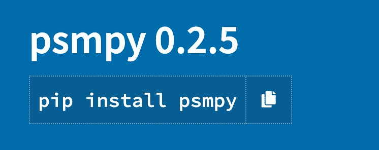

# 使用 venv 和 PyPI 构建和分发 Python 包

> 原文：<https://towardsdatascience.com/how-to-build-and-distribute-a-python-package-using-venv-and-pypi-d17dade7f8c2>


[莱昂·温特](https://unsplash.com/@fempreneurstyledstock?utm_source=medium&utm_medium=referral)在 [Unsplash](https://unsplash.com?utm_source=medium&utm_medium=referral) 上的照片

Python 是一个开源平台，建立在无数付费和自由开发者的基础上。当以面向对象编程(OOP)风格编码时，它的灵活性和可重用代码得到了最好的利用。当我们创建可以重复使用的类和函数时，我们展示了 OOP。这些类最好的例子可能是在 Python 包中实现的。

当开发一个 python 包时，问自己一个问题总是好的，“谁将会或可能会从这些代码变得用户友好和易于访问中受益？”答案通常是很多，特别是如果它是在广泛的应用程序中实现的一个普通的重复任务，并且代表了其他程序员或不太喜欢数学的外行用户所面临的问题。

# 第一步:注册 pypi.org 账户

报名账号:[](https://pypi.org/)****。**Python 包索引(PyPI)是 Python 编程语言的软件仓库**

# **步骤 2:升级 pip 版本**

```
python3 -m pip install --upgrade pip
```

# **步骤 3:配置您的环境**

**理想情况下，您在特定于包的环境中开发您的包。因此，一旦您导航到一个文件夹目标 **package_name/** ，您将运行下面的命令。我们这样做，所以我们有一个空白的石板来在一个干净的工作环境中安装所需的依赖项。导航到最终创建包的文件夹后。我们可以使用命令:**

```
python3 -m venv env
```

**这将在您现有的工作目录中创建一个名为“env”的文件夹，它代表您的环境的名称。**

**如果你正在使用 VS 代码(强烈推荐)，那么你可以通过点击 **Ctrl+ shift+ P** (PC)或 **Cmd+ shift+ P** (Mac)并选择“选择解释器”来选择这个环境，并从下拉列表中选择你的虚拟环境。**

**如果您喜欢在 VSCode 中从命令行控制，您可以使用:**

**`source env/bin/activate`**

# **步骤 4:文件结构**

**您的包的生成文件结构应该类似于以下内容:**

```
package_name/
├── LICENSE
├── setup.cfg
├── setup.py
├── README.md
├── MANIFEST.in
├── env/
├── package_name/
│    ├── __init__.py
│    └── example.py
└── tests/
│    ├── __init__.py
└──  └── tests.py/
```

**因此，让我们看一下上面列出的接下来几个文件的创建过程。**

# **__init__。巴拉圭**

**您的 **__init__。py** 文件应该是空的，用来让 python 知道你正在使用一个类，因为它有助于初始化它。你可以选择在这里放一些包依赖项，但是大多数应该在 **example.py** 文件中运行。你将需要一个 **__init__。包中每个子文件夹的 py** 。所以如果你有更多的子包，你会有更多的 **__init__。每个对应文件夹中的 py** 文件。**

# **README.md**

**这应该是一个信息性的降价文件。它为用户提供了如何使用软件包的信息。这将最终出现在你的 pypi.org 主页上。这里可以看到我的例子:[https://pypi.org/project/psmpy/](https://pypi.org/project/psmpy/)。最好保持这种信息丰富，并尽可能面向用例。**

# **Setup.py 文件**

**不需要静态 setup.cfg 和 setup.py 都可以。所以选一个吧。一个 **setup.cfg** 在技术上是首选。**

*   **setup.cfg =静态安装文件**
*   **setup.py =动态设置文件**

**下面是一个 setup.py(动态文件)的示例:**

```
from pathlib import Path
from setuptools import find_packages, setupdependencies = ['matplotlib', 'numpy', 'pandas',
                'seaborn', 'sklearn', 'scipy', 'sklearn']# read the contents of README file
this_directory = Path(__file__).parent
long_description = (this_directory / "README.md").read_text()setup(
    name='example-package',
    packages=find_packages(),
    version='0.0.1',
    description='Propensity score matching for python and graphical plots',
    author='Author name here',
[author_email='](mailto:author_email='askline1@gmail.com)author**@example**.com',
    long_description=long_description,
    long_description_content_type='text/markdown',
    license='MIT',
    project_urls={
        "Bug Tracker": "[https://github.com/](https://github.com/adriennekline/psmpy)",
    },
    classifiers=[
        "Programming Language :: Python :: 3.6",
        "License :: OSI Approved :: MIT License",
        "Operating System :: OS Independent",
    ],
    install_requires=dependencies,
    setup_requires=['pytest-runner'],
    tests_require=['pytest==4.4.1'],
    test_suite='tests',
)
```

**以及 setup.cfg(静态)文件的示例:**

```
[metadata]
name = example-package
version = 0.0.1
author = Example Author
author_email = author**@example**.com
description = A small example package
long_description = file: README.md
long_description_content_type = text/markdown
url = https://github.com/pypa/sampleproject
project_urls =
    Bug Tracker = https://github.com/pypa/sampleproject/issues
classifiers =
    Programming Language :: Python :: 3
    License :: OSI Approved :: MIT License
    Operating System :: OS Independent

[options]
package_dir =
    = src
packages = find:
python_requires = >=3.6

[options.packages.find]
where = package_name
```

# **批准**

**这里有一个麻省理工学院许可证的例子(这很可能是你需要的)。还有其他选择——https://choosealicense.com/【2】。下面是我自己工作中使用的麻省理工学院许可证的一个例子:**

```
Copyright (c) 2022 Author namePermission is hereby granted, free of charge, to any person obtaining a copy of this software and associated documentation files (the "Software"), to deal in the Software without restriction, including without limitation the rights to use, copy, modify, merge, publish, distribute, sublicense, and/or sell copies of the Software, and to permit persons to whom the Software is furnished to do so, subject to the following conditions:The above copyright notice and this permission notice shall be included in all copies or substantial portions of the Software.THE SOFTWARE IS PROVIDED "AS IS", WITHOUT WARRANTY OF ANY KIND, EXPRESS OR IMPLIED, INCLUDING BUT NOT LIMITED TO THE WARRANTIES OF MERCHANTABILITY, FITNESS FOR A PARTICULAR PURPOSE AND NONINFRINGEMENT. IN NO EVENT SHALL THE AUTHORS OR COPYRIGHT HOLDERS BE LIABLE FOR ANY CLAIM, DAMAGES OR OTHER LIABILITY, WHETHER IN AN ACTION OF CONTRACT, TORT OR OTHERWISE, ARISING FROM, OUT OF OR IN CONNECTION WITH THE SOFTWARE OR THE USE OR OTHER DEALINGS IN THE SOFTWARE.
```

# **清单. in**

**您可以在这里列出所有要包含在软件包发行版中的额外文件。这将确保您的 **license.txt** 和 **README.md** 将由最终用户下载并随您的软件包一起安装。**

```
include LICENSE
include README.md
```

# **示例. py**

**这里是您构建类的地方。您可以在这里引入其他函数、子包和库。**

```
from .functions import cohenD
import numpy as np
from scipy.special import logit, expit
from sklearn.neighbors import NearestNeighbors
import matplotlib.pyplot as plt
import pandas as pd
from sklearn.linear_model import LogisticRegression
import math
import pandas.api.types as ptypes
import seaborn as sns
sns.set(rc={'figure.figsize': (10, 8)}, font_scale=1.3)class PsmPy:
    """
    Matcher Class -- Match data for an observational study.
    Parameters
    ----------
    data : pd.DataFrame
        Data representing the treated group
    treatment : str
        Column representing the control group
    indx : str
        Name of index column
    exclude : list (optional)
        List of variables to ignore in regression/matching.
    target : str (optional)
        Outcome variable of interest, will ignore in regression/matching
    ----------    
    """def __init__(self, data, treatment, indx, exclude=[], target='outcome'):
        # variables generated during matching
        # assign unique indices to test and control
        self.data = data.dropna(axis=0, how="all")  # drop NAN rows.
.
.
```

# **第五步。构建您的包**

**在构建你的轮子和发行版之前，你需要将你的虚拟环境 **venv** 改回你的**基础**环境。你需要安装麻绳。Twine 是一个将 Python 包发布到 PyPI 的工具。它为源代码和二进制发行版提供构建[3]。**

```
$ conda activate base(base) $ pip install twine
(base) $ pip install build
```

**创建源和轮分布:**

****source——一个主要是源代码
wheel 的分发包——一个经过处理的分发包，可以更快地安装****

**sdist =源分布
bdist_wheel =轮分布**

```
(base) $ python setup.py sdist bdist_wheel
```

**这将在您的目录中添加一个 **dist** 文件夹:**

```
package_name/
├── LICENSE
├── setup.cfg
├── setup.py
├── README.md
├── venv/
├── **dist/** │    ├── **package_name-0.1.0-py3-none-any.whl**
│    ├── **package_name-0.1.0.tar.gz** ├── **build**
├── **package_name.egg-info**
├── package_name/
│    ├── __init__.py
│    └── example.py
└── tests/
```

# **步骤 6:上传/分发您的包**

**使用命令将您的包上传到 PyPI:**twine upload dist/***。系统将提示您输入之前创建的用户名和密码！**

```
(base) $ twine upload dist/*Uploading distributions to [https://upload.pypi.org/legacy/](https://upload.pypi.org/legacy/)
Enter your username: **YOUR_USER_NAME**
Enter your password: **YOUR_PASSWORD**
Uploading package_name-0.1.0.tar.gz
100%|██████████████████████████████████████████████████████████████| 2.5k/2.5k [00:01<00:00, 2.1kB/s]
```

**您还可以将您的发行版上传到 TestPyPI 进行测试(可选):**

```
(base) $ twine upload -r testpypi dist/*
```

**你现在可以通过 **pip** 命令从 pypi.org 安装你自己的软件包。请注意，当您更新您的软件包时，您需要更改版本号，否则将无法上传到 pypi.org。**

****

**作者图片**

**快乐创作！**

# **参考**

**[1]打包 Python 项目，[https://Packaging . Python . org/en/latest/tutorials/Packaging-Projects/](https://packaging.python.org/en/latest/tutorials/packaging-projects/)，访问时间:2022 年 4 月 11 日
【2】选择开源许可，[https://choosealicense.com/](https://choosealicense.com/)访问时间:2022 年 4 月 13 日
【3】Twine，[https://pypi.org/project/twine/](https://twine.readthedocs.io/en/stable/)访问时间:2022 年 4 月 13 日**