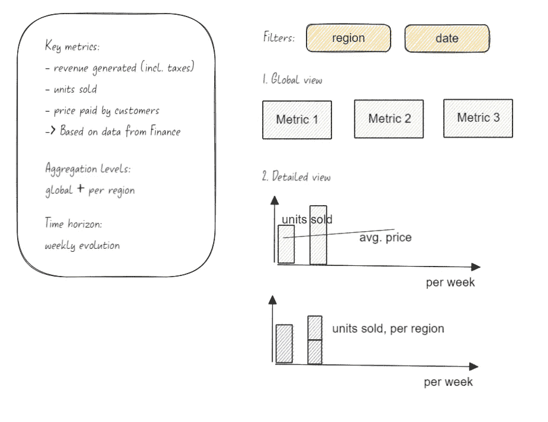

# 如何构建有效(且有用)的仪表板

> 原文：<https://towardsdatascience.com/how-to-build-effective-and-useful-dashboards-711759534639>

## 基于真实例子的四步法

[Firmbee.com](https://unsplash.com/@firmbee?utm_source=unsplash&utm_medium=referral&utm_content=creditCopyText)在 [Unsplash](https://unsplash.com/?utm_source=unsplash&utm_medium=referral&utm_content=creditCopyText) 上拍照

我全职做数据分析师已经快两年了。我还记得我第一次被要求做一个仪表板:老实说，我不知道从哪里开始。所以我的直觉告诉我直接跳到数据中，开始到处写 SQL 查询(见下面的步骤 3)…结果我得到了一堆没有明确答案的问题和没有实际用途的代码。

通过实践，我一直在开发一种四步法(我仍在微调)来避免这种情况，并确保我构建的仪表板首先是**有效的**，而且是**有用的**。

**成功构建仪表板最困难的部分是什么？**不是*而是*创建构成仪表板本身的数据可视化，其余的都是:理解仪表板的目的，描绘它应该是什么样子，并最终反映所做的工作。

在这篇文章中，我想带你经历这四个步骤。无论您是一名整天构建数据可视化的经验丰富的分析师，还是一名不时使用仪表板的业务用户，我希望您会发现这些指南非常有用。

# 第一步:问正确的问题

首先，问问自己是在什么背景下产生了对新仪表板的需求。为此，您可以从提出仪表板请求的**“5ws”**开始:谁？什么？什么时候？在哪里？为什么？如果您正在为其他人或与其他人一起构建这个仪表板，请一起进行这一阶段的反思。

正如我经常强调的，为什么最重要。无论是关于建立一个仪表板，还是在早上醒来，这个问题的明确答案将指导你的工作，并在你建立仪表板的整个过程中激励你:**这个仪表板为什么要存在？**

要考虑的另一个重要方面是您将构建的仪表板的未来用途。**为什么要花费数小时构建一个未被充分利用的仪表板？确保你对以下问题有一些明确的答案:**

*   这个仪表板满足了其他工具、图表或仪表板无法满足的什么需求？
*   这个仪表板有什么用途？
*   谁将使用该仪表板？
*   该仪表板的使用频率如何？

为了说明我的观点，让我们举一个例子:你公司的 CEO 来找你要一个仪表板。在她离开房间之前，确保你得到了关于**背景**(让我们假设这个仪表板是为了在某些地区推出新产品)、为什么必须建立仪表板的**原因(她目前没有关于这个特定项目的指标，她需要一些来监控项目的成功)、**最终用户**(在这种情况下，是首席执行官和项目团队成员)和仪表板的使用频率**(每周一次项目周回顾)。****

# **第二步:画出目标**

**现在，您对这个未来仪表板的详细情况有了更清楚的了解，您可以继续前进并**绘制您的仪表板**的目标图。这一步的目标不是设计一个非常详细的仪表板视图，而是画出 2 或 3 个主图，并显示一些关键信息。**

**出于这个目的，我个人更喜欢与每个利益相关者单独进行公开讨论，然后花一些时间将我所有的想法收集到一个大纲中。但一些同事习惯于在与利益相关者讨论主题的同时绘制大纲。选择最适合你的方法(或两者的组合)。**

**在你的大纲中，你至少应该已经确立了:**

*   ****您想要跟踪的指标及其确切定义**(例如，在这个特定用例中,“收入”的确切含义是什么？利益相关者如何定义“成本”？)**
*   ****汇总级别**(例如，数据是每天还是每月都需要？应该比较两个个人客户还是两个客户群？)**
*   ****时间范围**(例如，数据应该与去年的数字相比还是与上周的数字相比？是一年预测还是一秒预测？)**

**在我之前的例子中，在采访了 CEO 和项目团队成员后，大纲可能是这样的:**

****

**Marie Lefevre，使用 [Excalidraw](https://draw.moyu.io/) 构建**

# **第三步:提取数据并整理成形**

**正如我前面提到的，我曾经在出现对仪表板的需求后立即进入第三步。查询数据和创建图表是数据分析师的典型任务，不是吗？**

**有趣的是，我注意到，如果我事先遵循步骤 1 和 2，这些任务会进行得更顺利、更快。**考虑到业务用户的需求和手中的仪表板概要**，现在您“只”需要获取数据并相应地格式化数据，以创建相关的数据可视化。随着最终结果的不确定性减少，您将减少与利益相关者之间的交流，在您从零到一个惊人的仪表板的过程中，节省您的一些时间和压力。**

**在当前的例子中，我从财务部门的数据库中查询数据，这是项目团队同意的。对于输出表，我每周显示一行，计算字段(产生的收入、售出的单位、平均价格)显示为列。最终，我在公司的 BI 工具中构建了仪表板。这里我用谷歌数据工作室:**

****

**玛丽·勒费夫尔，使用[数据工作室](https://datastudio.google.com/)建造**

# **第四步:反思已经完成的工作**

**尽管您实际上构建了这个仪表板，但是您的工作还没有完成。记住:**一个成功的仪表板是一个有用的仪表板。****

**为了让它变得有用，第一步是让用户知道你的仪表板存在并准备好使用。根据上下文和最终用户，您甚至可以共享一个仍在开发中的版本。在前面的例子中，您可能与一个或两个项目团队成员共享仪表板的草稿版本，而不是与 CEO 共享。**

**在所有情况下，**计划一次演示会议**，在会上您将引导仪表板用户了解其主要功能。向他们展示该仪表板如何满足他们表达的需求:**

*   **他们在哪里可以找到他们需要的指标？**
*   **他们应该如何使用过滤器来查看与他们个人相关的指标？**
*   **他们应该如何解读每张图表？**

**最后但同样重要的是:**对反馈**持开放态度。仪表板用户可能不会马上向您提问，但是随着时间的推移，可能会出现一些问题。为了确保仪表板用户不会因为某种原因处理某个块并放弃使用它，**在仪表板发布后几天或几周再回到他们那里**。反馈会议可以通过非正式讨论或后续会议进行。**

**您可以向仪表板用户提出的典型问题包括:您上次使用仪表板是什么时候？出于什么目的？它符合你的期望吗？你对此有疑问吗？您在使用它或解释某些指标时是否面临任何困难？这将允许您事后再次检查您是否正确地构建了用户需求，以及构建仪表板时的执行是否顺利。**

**还可能发生的是，用户根本不会使用你的仪表板。我知道，这听起来违背直觉，令人沮丧。在这种情况下，你最好的办法还是回去找他们，调查为什么会这样。仪表盘太复杂，不好用吗？是不是它加载太慢了？需求是否发生了变化，以至于显示的指标不再相关？根据他们的回答，你将能够**调整仪表板，使其更加相关。****

# **…然后重复！**

**我不是一夜之间想出这个办法的。我过去常常直接跳到数据中。然后我注意到一些背景和对用户需求的更好的定义会帮助我在仪表板方面变得更好。最后，在真正的“数据查询”部分之前，我理解了绘制轮廓的附加价值。根据经验，我知道反馈和自我反省有助于你随着时间的推移提高技能。**

**你呢，随着时间的推移，你是如何提高你的仪表板技能的？你成功构建仪表盘的秘诀是什么？不要犹豫，在评论区分享你的观点吧！**

***你喜欢读这篇文章吗？* [*成为*](https://marie-lefevre.medium.com/membership) *的一员，加入一个不断成长的充满好奇心的社区吧！***

**<https://marie-lefevre.medium.com/membership> **