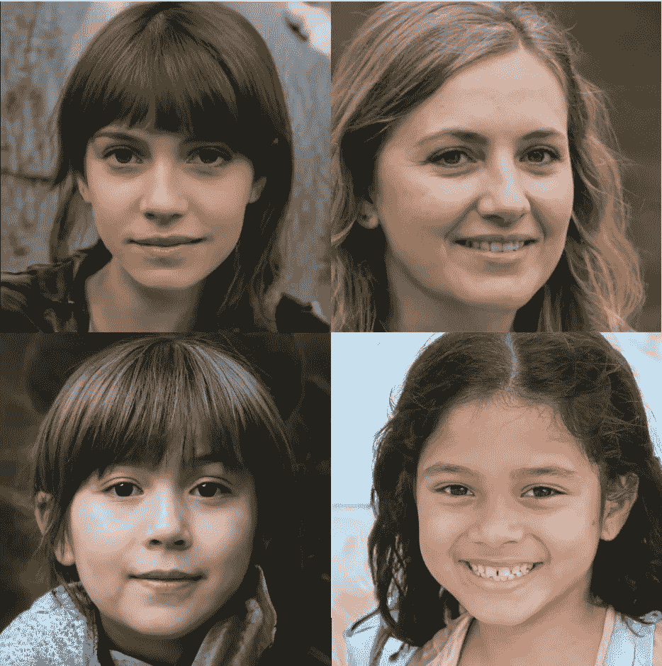
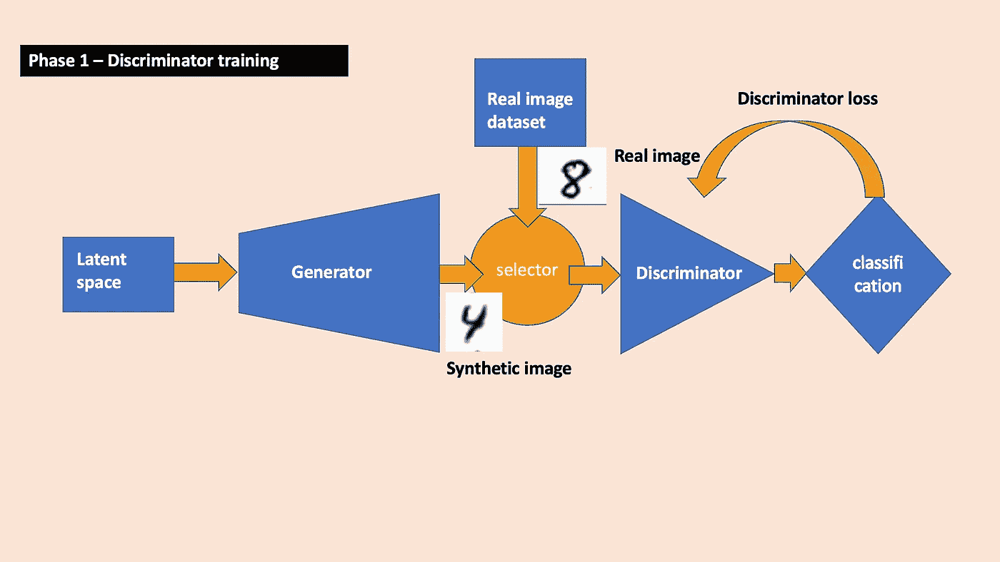
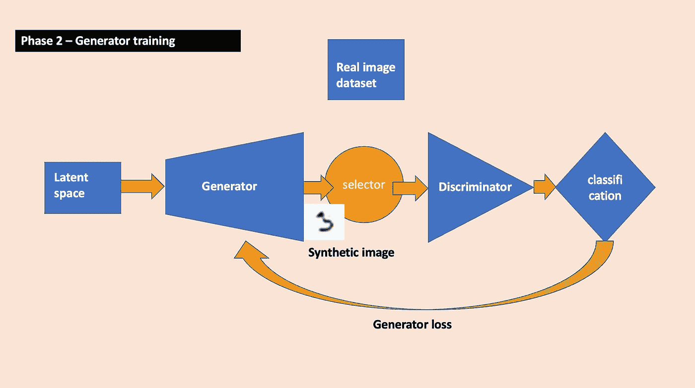
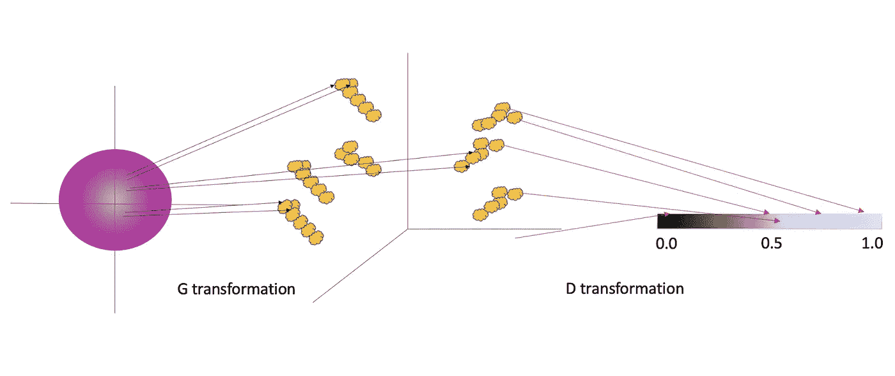
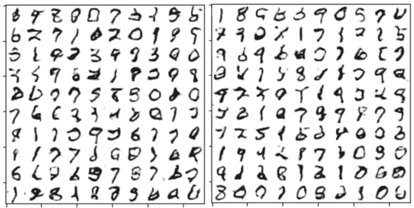
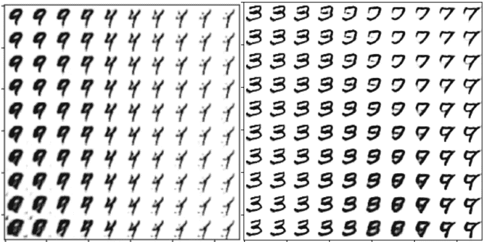
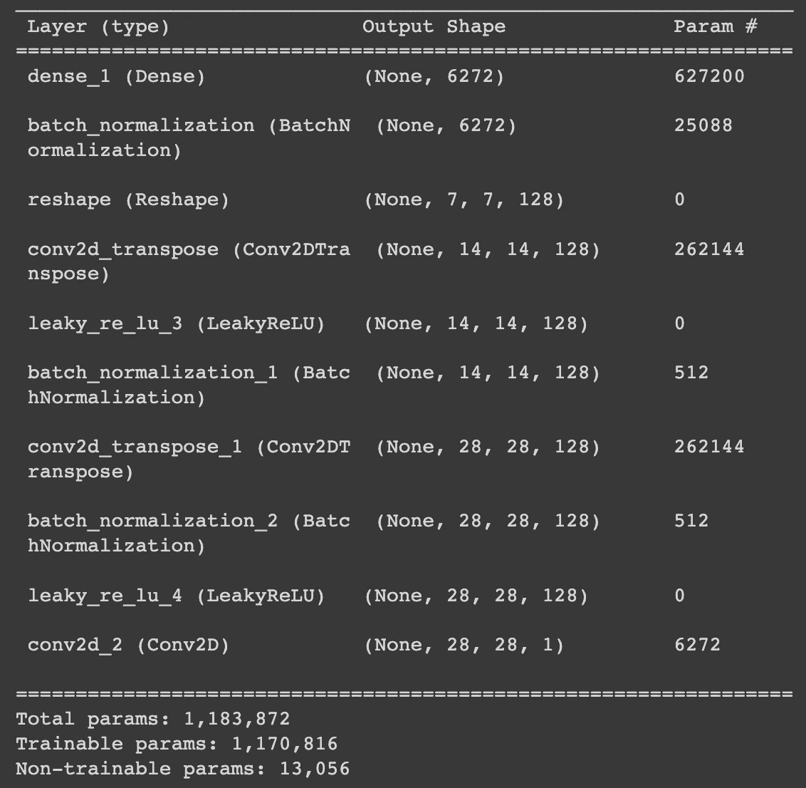

# 生成性对抗网络(GANs)，解释和演示

> 原文：<https://towardsdatascience.com/how-to-build-gans-to-synthesize-data-64334b877f70>

## gan 如何工作以及如何使用它们来合成数据

图 1 —一个人的合成图像，完全由 GAN 生成。图片来源:[https://thispersondoesnotexist.com/](https://thispersondoesnotexist.com/)。许可证:[https://github . com/luci drains/style gan 2-py torch/blob/master/LICENSE](https://github.com/lucidrains/stylegan2-pytorch/blob/master/LICENSE)(麻省理工学院)

如果你在深度学习领域工作，你可能听说过 GANs，或者*(good fellow 等人，2014)。在本帖中，我们将解释什么是 gan，并通过真实的例子讨论一些用例。我在这个帖子里加了一个我的 [***甘操场***](https://github.com/tsubu01/MP-GAN) 的链接，叫 ***MP-GAN*** (多用途甘)。我在 github 准备了这个操场作为研究框架，欢迎大家用它来自己训练探索 GANs。在附录中，我介绍并讨论了我在 GAN 训练中使用这个操场所做的一些实验。*

*  

# 高级解释

**生成模型**

gan 是 ***生成*** 深度学习架构家族的一部分，其目标是 ***生成*** 合成数据，而不是预测现有数据点的特征，就像分类器和回归器的情况一样(两者都属于称为 ***判别*** 模型的模型家族。在我以前的一些帖子中讨论的对象检测神经网络，像 [***对象检测器 YOLOv3***](https://medium.com/towards-data-science/yolo-v3-explained-ff5b850390f) 和[***CenterNet***](https://medium.com/towards-data-science/centernet-explained-a7386f368962)，是分类器和回归器的组合，因此也是判别模型)。在我们现在不讨论的其他生成机器学习模型中，有 ***变分自动编码器***(VAEs)***扩散模型*** ， ***受限玻尔兹曼机器*** (RBMs)。

**为什么要生成数据？**

1.  **为了改进鉴别模型的训练-** 一些应用，例如自动驾驶，需要非常大的里程数据。此外，为了安全起见，模型需要在边缘情况下进行广泛的训练，如事故、未遂事故和其他车辆的异常行为，而实际收集的数据中没有足够的例子。其他例子:基于图像的火灾探测系统；集成电路生产线中的自动缺陷检测:欺诈检测算法和多传感器机器故障检测系统的合成场景(表格数据合成)。
2.  **商业**——许多吸引人的图像在现实中很难或不可能创作出来，或者手工绘画既昂贵又耗时(即使使用专用软件)。在这种情况下，人工生成的图像可以是一个公平的替代品。例如:亚麻广告中的合成卧室图像，或者牙膏广告中的合成人脸(如图 1 所示)。
3.  **艺术**——如果你在媒介方面经验丰富，那么生成模型就是一种工具——就像画笔一样。一些艺术家是产生视觉上吸引人的人造图像的专家。

**氮化镓结构和流程**

顾名思义，GANs 由两个对立的神经网络组成——一个是 ***生成器*** (或 G)，试图生成数据的合成样本，另一个是 ***鉴别器*** (或 D)，试图区分合成样本和真实样本。d 实际上是一个 ***分类模型*** 。让我们假设我们想要自动化我们的邮件系统。我们训练一个连接到相机的机器人手臂读取信封上的邮政编码，但我们担心我们没有足够的样本，机器人会被硬例子弄糊涂。因此，我们希望生成许多合成的手写数字图像来增强训练集。初始化 D 和 G 后的基本训练流程如下:

1.  冻结 G，只在几个真实的和几个合成的图像(由 G 生成)上训练 D。
2.  冻结 D，仅训练 G，损失对应于 D 正确分类为“合成样品”的样品比率。
3.  评估结果，并重复直到达到满意的性能(如果在阶段 2 呈现给 D 的真实与合成图像的比率是 50/50，那么理想的结果是在阶段 3，D 在 50%的时间内对合成和真实示例都进行了错误分类)。

GAN 的高级结构在图 2 中的以下两个图示中给出:

图 2 — Gan 训练阶段。上图:第一阶段——鉴别器训练区分真实图像和合成图像。真实图像和合成图像被交替地馈送到 d。训练损失是鉴别器分类误差的二进制交叉熵损失。下图:第二阶段——发电机训练以合成看起来真实的图像。只有合成图像与标签“0”一起被传递到鉴别器，表示它们是合成的。训练损失是鉴别器分类误差(小误差→大 G 损失)的补码上的二元交叉熵损失。图片来源:作者。

正如可以预料的那样，起初，G 和 D 都不擅长他们所做的事情。在最初的训练步骤中，:D 不知道有效的数字图像应该是什么样子，G 也不知道。但是，通过提供给 D 训练阶段的标签(“真实的”、“合成的”)，D 获得了真实数据样本应该是什么样子的一些知识。几个例子之后，D 在将样本分类为真实样本和合成样本方面略有提高(记住——在这一点上，合成样本很糟糕，因此不难理解其中的区别)。然后我们冻结它的参数，并训练 G。当 D 抓住欺诈行为，推动 G 生成看起来像 D 感知为真实的样本时，发生的损失，等等。图 3 展示了训练 GAN 以生成手写数字“8”的样本的过程。

图 3 —使用 [MP-GAN](https://github.com/tsubu01/MP-GAN) 生成手写数字图像样本。左上:训练期间生成的数字“8”的样本。左栏是训练时期的数量。右上:训练过程中鉴别器对真实图像和合成图像进行分类的准确度。左下和右下:学习潜在空间的两个网格探索。训练集是来自 MNIST 的手写数字“8”的 1024 幅图像。图片来源:作者。

# 生成模型背后的一些图解数学

对高分辨率彩色图像(如人脸)使用 GANs 进行实验是非常计算繁重的，因此为了简单起见，让我们将讨论限制在 MNIST 数据，例如手写数字的 28x28 像素灰度图像。(MNIST 是对 [NIST](https://www.nist.gov/srd/nist-special-database-19) 数据、**科恩(Cohen，g .)、阿夫沙尔(Afshar，s .)、塔普森(Tapson，j .)、&范沙克(van Schaik，a .)(2017)。em NIST:MNIST 对手写信件的扩展。检索自**[***http://arxiv.org/abs/1702.05373***](http://arxiv.org/abs/1702.05373)。是由 [***勒村、科尔特斯和伯格斯***](http://yann.lecun.com/exdb/mnist/) 创造的。MNIST 数据集是在知识共享协议的[条款下提供的，共享 Alik3 3.0 许可](https://keras.io/api/datasets/mnist/)，参见许可细节[此处](https://creativecommons.org/licenses/by-sa/3.0/)。

我们将论证每个数字图像是一个 28×28 = 784 维的向量，每个坐标的值等于相应像素的灰度级。这个图像空间的体积是有限的，但却是巨大的:它是一个由 256⁷⁸⁴不同坐标组合或图像组成的超立方体。

自然，这个空间的大部分体积对应的是完全没有意义的图像。一小部分空间对应有意义的图像，一个更小的静止部分对应数字图像。

让我们用研究人员使用的术语来表述我们的步骤和目标:

1.  生成合成的数字图像相当于在 784 维空间中召唤出一个向量，在真实数字图像的密集分布的斑点内的某处，其中数字图像的概率分布很高。
2.  虽然我们可以相对容易地将给定的向量分类为有效或无效的数字图像(通过训练分类器)，但是在数字图像斑点内变出向量的相反过程是困难的。这主要是因为有效的数字图像不是简单地集中在一个或几个漂亮的球形斑点中。相反，它们分散在这个 784 维空间的无数细丝中；作为一个快速演示，考虑一组有效数字图像，然后将所有图像向右移动一个像素——这将形成另一组有效数字图像，但与 784 维空间中的第一组非常远。
3.  因此，我们正在**修改**我们的任务——学习从 ***另一个*** (潜在)空间中的美好、舒适和已知的分布(例如高斯)到 784 维图像空间中的有效数字图像的细丝的变换。
4.  完成这些后，我们可以从潜在空间的密集区域中提取点，以生成更多真实图像的样本。G 和 D 学习的变换如图 4 所示。

图 4 —图像空间的图示。中心:MNIST 图像是 784 维空间(这里简化为 3 维空间)中的向量。有效的数字图像在这个空间中显示为点的斑点(黄色的云)。斑点的数量是天文数字，并且它们的边界没有很好地定义(取一个表示‘8’的向量，并且将一个随机像素值增加 1——它仍然有效吗？重复)。斑点之间的无效图像空间的体积要大得多(例如，每个可能的 28x28 噪波都是该空间中的一个点)。生成器学习从潜在空间(左侧，简化为二维)到有效数据斑点的变换(黑色箭头)。鉴别器学习从图像空间到一维概率轴的变换，指示其输入是真实的(1)还是合成的(0)。图片来源:作者。

关于这个修改后的任务有几点:

1.  每当这个学习函数将一个潜在点转换成一个无效图像时(由鉴别器判断)，所产生的损失将它稍微推向一个有效图像斑点。
2.  根据定义，与来自稀疏部分的点相比，该模型将对来自潜在空间中分布的密集部分的更多示例进行训练，并且因此将更有动力将它们转换成有效图像(即，有效图像斑点的中心附近)。假设上述学习过程是有效的，这将最终导致潜在空间分布的密集部分中的点转换为有效图像斑点的密集区域中的图像。这实际上意味着，如果您通过输入来自正态分布噪声的样本来训练 GAN，那么您可以期望来自靠近原点的区域的样本产生有效的数据样本，而来自远离原点的噪声样本产生不太真实的数据样本。查看附录中的**实验部分，看看当我们遍历潜在空间时，生成的样本如何变化。**

如果我们从头开始训练鉴别器(GANs 通常就是这种情况)，那么生成器试图学习的轮廓在开始时是非常不准确的(因为鉴别器不知道任何更好的东西)，但是它们随着每个鉴别器学习阶段而改善。然而，如果我们有某种程度上训练过的分类器，我们可以用它作为我们的鉴别器，并为生成器的训练有一个良好的开端。

# 训练 GANs 的一些挑战

GAN 训练的细节因用户而异。有的练 D 走几步，再练 G，等等。有些人每走一步就在它们之间切换。在我的 [MP-GAN](https://github.com/tsubu01/MP-GAN) 框架中，每个 G 训练步骤(批次)之前都有一个 D 训练步骤，分为两部分:前半部分显示真实数据，后半部分显示合成数据。

使用 ***亚当*** 优化器通常被认为是一种好的做法，可能是因为动量有助于稳定非常嘈杂的训练过程。正如我在实验一节中所展示的，这种做法似乎是有实证依据的。

注意，训练 GANs 比训练判别模型更棘手。特别是，原始论文的作者 Goodfellow 等人提到了 ***、*、**、后来被称为**、*、*、**，其中 G 将潜在空间中的多个点映射到相同的输出，或者输出空间中的一个狭窄区域。如果训练过程不平衡，并且 G 与 D 相比训练过多，就会发生这种情况。例如，如果在训练中的某一点，D 碰巧比其他数字更擅长对数字“0”的真实和合成图像进行分类，并且它停止训练，那么 G 会被鼓励将所有潜在点转换为“0”，等到 D 再次开始训练时，G 可能已经很高兴地陷入局部最小值，没有离开的动机(除非它因没有生成其他数字而受到某种惩罚)。

另一个使 GAN 训练困难的问题是过程的内在不稳定性，因为训练试图同时最小化两个损失函数，但它交替地这样做，每次采样一个损失图并更新参数，然后是另一个，但随着一个模型的参数改变，这也会影响另一个模型的损失。

# 结论

GANs，即生成对抗网络，是一种深度学习机制，通过两个模型之间的训练竞争来学习生成新的数据样本——生成器和鉴别器。

由于问题的内在不稳定性和模式崩溃的风险，训练 gan 比训练判别模型更棘手。

使用我在附录中提出的框架，有可能建立和训练 GANs 的各种架构，并研究其训练的动态。

**看看我的 GAN 实验，往下几行！**

访问我以前的帖子:

## [决策树，解释](https://medium.com/towards-data-science/decision-trees-explained-d7678c43a59e)

## [CenterNet，已解释](https://medium.com/towards-data-science/centernet-explained-a7386f368962)

## [YOLOv3，解释](https://medium.com/towards-data-science/yolo-v3-explained-ff5b850390f)

# 附录 1 —代码示例

在这一节中，我将介绍我使用 github 中准备的 GAN playground (MP-GAN)做的几个 GAN 实验。

欢迎您从我的 MP-GAN(多用途 GAN)存储库中进行分叉，并尝试不同的 GAN 架构、数据集和训练场景。这个项目支持图像(目前只有单通道)和表格数据。

  

**实验 1 —优化器对训练收敛的影响**

我使用我的 [MP-GAN github 框架](https://github.com/tsubu01/MP-GAN)来训练两个相同的架构，一个使用 ***SGD*** 优化器，另一个使用 ***Adam*** 优化器。对发生器的输出进行采样揭示了第一个时期的差异。我的发现支持了多个来源的说法——Adam optimizer 确实更适合这项任务。图 5 给出了一个例子。

图 5 —左图:(上图)经过 10 个时期的训练后，SGD 优化器的合成图像。右图:(上)使用 Adam 优化器。在这两种情况下，学习率衰减为 0.9。底部一行是来自 MNIST 数据集的真实图像的随机样本。图片来源:作者。

**实验 2——比较从零开始的收敛和使用预训练鉴别器的收敛**

我假设，虽然根据定义，生成器 D 是从零开始训练的，但是不应该有数学上的基本原因来解释为什么鉴别器需要从零开始训练。常见的原因是实际的——通常我们只是没有一个训练有素的模型来分类真实和合成的图像。但是，如果我们确实有一个经过训练的鉴别器(例如，来自以前的训练)，使用它应该不会损害生成器的收敛性。在图 6 中，我比较了来自从零开始用鉴别器训练的生成器的样本，与当鉴别器取自先前训练会话时的生成器训练的样本。可以看出，在 10 个时期之后，使用预训练鉴别器的 GAN 产生比从零开始训练的 GAN 更高级和更真实的样本。然而，在 50 个时期之后，从零开始训练的 GAN 似乎已经赶上来了(图 7)。如上所述，两次运行中合成样本中某些数字的缺乏可能表明模式崩溃。

图 6-左:从零开始经过 10 个时期的训练后的合成数字图像(顶行)。右图:使用预训练的鉴别器，在 10 个时期的训练后合成的数字图像(顶行)。下面几行是来自 MNIST 的真实图像。图片来源:作者。

图 7——从零开始 50 个训练时期后的随机合成数字图像(左),对比使用预训练的 D(右)。图片来源:作者。

按照这个思路，我添加了一个选项来冻结鉴别器参数并节省训练时间。我发现，正如预期的那样，总的训练时间缩短了，但并不显著，因为在这种架构中，鉴别器比生成器小得多(40k 参数对 1M 参数)。

另一个可能具有有趣含义的实验(我还没有做过)是采用在数据集上训练的常规分类器(可能——使用您希望通过合成更多数据来改进的同一分类器！)并将其用作预训练的鉴别器并加速生成器训练收敛，冻结或不冻结大多数鉴别器参数以节省时间。

**实验 3——探索潜在空间的轨迹**

一个很好的实验是观察潜在空间中的相邻点是否转换成相似的图像。在图 8 中，我创建了一个 2D 坐标网格，并将其嵌入到潜在的 100 维空间中，其中其他 98 个坐标保持固定在 0(左右窗格来自潜在空间中的两个不同平面)。在左边，我们可以看到合成“9”到“4”再到“1”之间的平滑过渡。在右边，合成图像平滑地从“3”变换到“9”、“8”和“7”。有趣的是，我发现在所有的实验中，接近 0 的区域并没有转换成有意义的数字。我相信其原因是发生器中的非线性(泄漏 ReLU 激活)使得 0 成为潜在空间中的数字斑点之间的自然边界，这使得点接近多个数字祖先区域之间的 0 边界点。

图 8 —通过在潜在空间转换 10x10 网格合成的图像。左窗格和右窗格在嵌入网格的子空间上有所不同。图片来源:作者。

# 附录 2 —技术细节

我为在 MP-GAN 基础设施中试验 MNIST 图像数据集而创建的 GAN 具有以下结构:鉴别器(图 9)是 CNN(卷积神经网络),其具有由漏失层分隔的两个卷积，以具有 ***sigmoid*** 激活的密集层结束。生成器(图 10)从密集层开始，然后是整形，将潜在维度输入向量转换为图像形状。然后去卷积层增加空间维度，直到达到期望的形状，然后最终卷积使用特征维度中的信息来生成最终的 1 通道图像。我尝试在鉴别器中用批次名替换掉的人——但这并没有改善结果。

图 9 —鉴别器。卷积具有泄漏的 ReLU 激活，致密层具有 s 形激活。图片来源:作者。

图 10 —发电机。图片来源:作者。

不要因为鉴别器参数显示为不可训练而惊慌。这是由于该流水线中训练流的具体实现:在阶段 2——训练发生器中，我们实际上训练了整个 GAN 模型，但是鉴别器参数被冻结。*