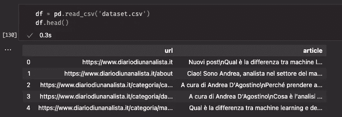
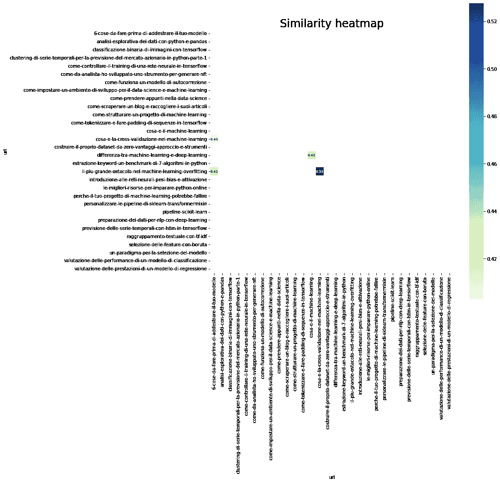

# 如何用 Python 中的 TF-IDF 计算网站上的文本相似度

> 原文：<https://towardsdatascience.com/how-to-compute-text-similarity-on-a-website-with-tf-idf-in-python-680b3be06091>

## *一种简单有效的 TF-IDF 和 Pandas 文本相似度方法*

作者图片

在数据挖掘和自然语言处理领域，计算两个文本之间的相似度是一项非常有用的活动。这既允许**隔离异常，又允许对特定问题**进行诊断，例如博客上非常相似或非常不同的文本，或者将相似的实体归入有用的类别。

在本文中，我们将使用发布的脚本[来抓取博客并创建一个小型语料库，在此基础上应用基于 Python 中 TF-IDF 的相似性计算算法。](https://medium.com/mlearning-ai/how-to-scrape-a-blog-and-collect-its-articles-in-python-80895d8def66)

具体来说，我们将使用一个名为 [Trafilatura](https://trafilatura.readthedocs.io/en/latest/) 的库，通过网站地图从目标网站检索所有文章，并将它们放在 Pandas 数据框架中进行处理。

我邀请读者阅读我在上面链接的文章，以更详细地了解提取算法是如何工作的。

为了简单起见，在这个例子中，我们将分析 diariodiunanalista.it，这是我自己用意大利语写的关于数据科学的博客，以便了解是否有彼此过于相似的文章。在这个过程中，我会诊断我自己的工作，也许会提出一些很酷的见解！

这在搜索引擎优化上有很大的反响——事实上，类似的文章会引发*内容蚕食*的现象:当属于同一网站的两篇文章在谷歌上争夺相同的位置。**我们希望避免这种情况，识别这些情况是避免这种情况的第一步。**

# 要求

我们需要的库是 Pandas，Numpy，NLTK，Sklearn，TQDM，Matplotlib 和 Seaborn。

让我们将它们导入到 Python 脚本中。

此外，我们需要运行`nltk.download('stopwords')`命令来安装 NLTK 停用词。停用词是对句子的意义没有重要贡献的词，我们需要它们来预处理我们的文本。

# 创建数据集

让我们运行上面提到的文章中的软件。

数据收集过程。图片作者。

让我们来看看我们的数据集。

我们数据集的预览。图片作者。

从 URL 的分类中，我们注意到所有的帖子是如何被收集在 */posts/* 下的——这允许我们只隔离实际的文章，而忽略页面、类别、标签等等。

我们使用下面的代码来应用这个选择

我们数据集的预览。图片作者。

这是我们的语料库。在写这篇文章的时候，大约有 30 篇文章——因此它是一个非常小的语料库。对于我们的例子来说，它仍然是好的。

# 文本预处理

我们将应用一些简单的文本预处理来复制一个真实的应用程序管道。这可以扩展到补充读者的要求。

## 预处理步骤

我们将应用这些预处理步骤:

*   删除标点符号
*   小写应用程序

这将在一个非常简单的函数中完成，该函数使用标准的*字符串*和 NLTK 库。

TF-IDF 矢量器(我们将很快定义)将使用这个函数来规范化文本。

# 相似度计算算法

首先，让我们通过将停用词保存在一个变量中来定义它们

`ita_stopwords = stopwords.words('italian')`

现在我们从 Sklearn 导入 TfIdfVectorizer，向它传递预处理函数和停用词。

TF-IDF 矢量器会将每个文本转换成它的矢量表示。这将允许我们将每个文本视为多维空间中的一系列点。

我们计算相似度的方法是通过对构成我们正在比较的文本的向量之间的余弦值进行**计算。相似度值介于-1 和+1 之间。**值+1 表示两个基本相等的文本，而-1 表示完全分离。****

我邀请感兴趣的读者在专门的维基百科页面上阅读更多关于这个主题的内容。

现在我们将定义一个名为`compute_similarity` 的函数，它将使用矢量器将文本转换为数字，并应用该函数计算 TF-IDF 向量的相似性余弦。

# 让我们测试代码

我们以意大利语维基百科的两段文字为例。

> Figlio 第二次将 giudice sardo Ugone II 引入 Arborea 和 Benedetta，推动了 padre 的文化和政治发展，并加强了 Arborea 和所有其他独立地区的自治。考虑到 300 年的一个重要数字，促进了农业组织的发展，颁布了《农村法典》,成功地完成了包括埃莉诺拉在内的立法工作
> 
> 《绿巨人》是 2008 年路易斯·莱特里尔导演的一部电影。爱德华·诺顿的男主角，同样为车安和扎克·佩恩的风景作出了贡献；超级英雄的首要任务是完成所有提议中的最终版本，而不是在漫威传统大学里完成所有的投资。他的个人风格是古典风格的“巨人之歌”,在世界范围内独树一帜，不是最好的暗杀。

让我们应用`cosine_similarity` 函数来测试这两个文本有多相似。我期待一个相当低的值，因为它们处理不同的主题，并且不使用相同的术语。

该算法在两段文本上的应用。图片作者。

这两个文本显示出非常低的相似性，接近于 0。现在让我们用两个相似的文本来测试一下。我将把第二个文本的一部分复制到第一个文本中，保持相似的长度。

该算法在两段文本上的应用。图片作者。

相似度现在是 0.33。它似乎工作得很好。
现在，我们以成对的方式将该方法应用于所有语料库。

让我们详细了解这段代码是做什么的。

*   我们创建一个名为`M`的 30x30 矩阵
*   我们在数据帧上逐行迭代以访问`article_i`
*   我们再次在相同的数据帧上逐行迭代，以访问`article_j`
*   我们在`article_i`和`article_j`上运行 compute_similarity 来获得相似性
*   我们将这个值保存在 M 中的位置`i`、`j`

m 可以很容易地转换成熊猫的数据帧，这使我们能够用 Seaborn 建立一个热图。

相似性热图。图片作者。

热图根据获得的相似性值，使用更亮或更暗的颜色突出显示异常。

让我们对代码做一个小小的修改，只选择相似度大于 0.40 的元素。

通过高于 0.4 的值过滤的相似性热图。图片作者。

我们看到相似性指数大于 0.4 的 4 个页面。

我们特别看到这些组合:

*   训练模型前要做的 6 件事->机器学习的最大障碍——过度拟合
*   训练模型前要做的 6 件事->什么是机器学习中的交叉验证
*   什么是机器学习中的交叉验证->机器学习中最大的障碍——过拟合
*   什么是机器学习->机器学习和深度学习有什么区别

这些对中的一些对之间的相似性也存在于显示高相似性的其他对中。

这些文章分享了这个主题，即机器学习和一些最佳实践。

# 结论

在这篇文章中，我们看到了一个简单而有效的算法来识别一个网站的相似页面或文章，用同样有效的方法刮。

接下来的步骤将包括更深入的分析，以理解*为什么*这些文章有很高的相似性。数据挖掘和 NLP 工具，如 Spacy，非常方便，允许进行词性(词性)和 NER(命名实体识别)分析。

研究最常用的关键词也会同样有效！

**如果你想支持我的内容创作活动，欢迎点击我下面的推荐链接，加入 Medium 的会员计划**。我将收到你投资的一部分，你将能够以无缝的方式访问 Medium 的大量数据科学文章。

  

你的数据挖掘方法是什么？一般怎么发现内容相似等异常？用评论分享你的想法👇

感谢您的关注，很快再见！👋